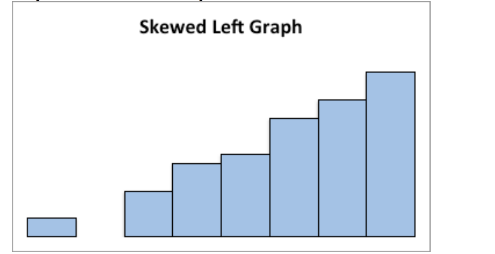

# Graphical Descriptions of Data

In chapter 1, you were introduced to the concepts of population, which again is a collection of all the measurements from the individuals of interest. Remember, in most cases you can't collect the entire
population, so you have to take a sample. Thus, you collect data either through a sample or a census. Now you have a large number of data values. What can you do with them? No one likes to look at just a set of numbers. One thing is to organize the data into a table or graph. Ultimately though, you want to be able to use that graph to interpret the data, to describe the distribution of the data set, and to explore different characteristics of the data. The characteristics that will be discussed in this chapter and the next chapter are:

1.  Center: middle of the data set, also known as the average.
2.  Variation: how much the data varies.
3.  Distribution: shape of the data (symmetric, uniform, or skewed).
4.  Qualitative data: analysis of the data
5.  Outliers: data values that are far from the majority of the data.
6.  Time: changing characteristics of the data over time.

This chapter will focus mostly on using the graphs to understand aspects of the data, and not as much on how to create the graphs. There is technology that will create most of the graphs, though it is important for you to understand the basics of how to create them.

This textbook uses RStudio to perform all graphical and descriptive statistics, and all statistical inference. When using RStudio, every command is performed the same way. You start off with a 
goal(explanatory variable ~ response variable, data=data frame_name,...)

RStudio uses packages to make calculations easier. For this textbook, you will mostly need the package mosaic. There will be others that you will need on occasion, but you will be told that at the time. Most likely, mosaic is already installed in your RStudio. If you wish to install other packages you use the command 

```r
install.packages("name of package")
```

where you replace the name of package with the package you wish to install.

Once the package is installed, then you will need to tell RStudio you want to use it every time you start RStudio. The command to tell RStudio you want to use a package is 

```r
library("name of package")
```

You will need to turn on the package mosaic. The NHANES package contains a data frame that is useful. Both are accessed by doing.

```{r setup2, include=FALSE}
library("mosaicCore")
library("mosaic")
library("NHANES")
library("dplyr")
```

```{r setup2a}
library("mosaicCore")
library("mosaic")
library("NHANES")
```

Back to the basic command 

goal(explanatory variable ~ response variable, data=data frame_name,...) 

The goal depends on what you want to do. If you want to create a graph then you would need

```r
gf_graphtype(explanatory variable ~ 
response variable, data=dataframe_name, ...)
```

As an example if you want to create a density plot of cholesterol levels on day 2 from a dataframe called Cholesterol, then your command would be

```r
gf_density(~day2, data=Cholesterol)
```

You will see more on what the different commands are that you would use. A word about the ... at the end of the command. That means there are other things you can do, but that is up to you if you want to actually do them. They do not need to be used if you don't want to. The following sections will show you how to create the different graphs that are usually completed in an introductory statistics course.

*\
*

## Qualitative Data

Remember, qualitative data are words describing a characteristic of the individual. There are several different graphs that are used for qualitative data. These graphs include bar graphs, Pareto charts, and pie charts. Bar graphs can be created using a statistical program like RStudio. 


**Bar graphs or charts** consist of the frequencies on one axis and the categories on the other axis. Drawing the bar graph using R is performed using the following command. 

```r
gf_bar(~explanatory variable, data=Dataframe)
```

### Example: Drawing a Bar Chart**

Data was collected for two semesters in a statistics class. The data frame in is the table #2.1.1. The command 

```r
head(data frame) 
```

shows the variables and the first few lines of the data set.

**Table \#2.1.1: Statistics class survey**

```{r class-data1-table}
Class<-read.csv(
  "https://krkozak.github.io/MAT160/class_survey.csv")
head(Class)
```

Every data frame has a code book that describes the data set, the source of the data set, and a listing and description of the variables in the data frame. 

**Code book for Data Frame Class**

**Description**
Survey results from two semesters of statistics classes at Coconino Community College in the years 2018-2019.

**Format**

This data frame contains the following columns:

vehicle: Type of car a student drives

gender: Self declared gender of a student

distance_campus: how far a student lives from the Lone Tree Campus of Coconino Community College (miles)

ice_cream: favorite ice cream flavor

rent: How much a student pays in rent

major: Students declared major

height: height of the student (inches)

winter: Student's opinion of winter (Love it, Like it, Don't like, No opinion)
 
**Source**

Kozak K (2019). Survey results form surveys collected in statistics class at Coconino Community College.

**References**

Kozak, 2019

Create a bar graph of vehicle type. To do this in RStudio, use the command 

```r
gf_bar(~variable, data=DataFrame, ...)
```

where gf_bar is the goal, vehicle is the name of the response variable (there is no explanatory variable), the dataframe is Class, and a title was added to the graph.

(ref:class-data-bar-cap) Bar Graph for Type of Car Data

```{r class-data-bar, fig.cap="(ref:class-data-bar-cap)", fig.alt="Bar graph with bars for Audi, Buick, Honda, Hyundai, Mercury, Missan with height of 1, Dodge and None with height of 2, Jeep, Subaru, Toyota with heights of 3, and Chervrolet and Ford at height of 4.", warning=FALSE}
gf_bar(~vehicle, data=Class, title="Cars driving by students in 
       statistics class")
```

Notice from the graph (Figure \@ref(fig:class-data-bar)), you can see that Chevrolet and Ford are the more popular car, with Jeep, Subaru, and Toyota not far behind. Many types seems to be the lesser used, and tied for last place. However, more data would help to figure this out.

* All graphs should have labels on each axis and a title for the graph.*

The beauty of data frames with multiple variables is that you can answer many questions from the data. Suppose you want to see if gender makes a difference for the type of car a person drives. If you are a car manufacturer, if you knew that certain genders like certain cars, then you would advertise to the different genders. To create a bar graph that separates based on gender, perform the following command in RStudio.

(ref:class-data-bar-gender-cap) Bar Graph for Type of Car Data

```{r class-data-bar-gender, fig.cap="(ref:class-data-bar-gender-cap)", fig.alt="Bar graph of number of vehicles separated by female and male.",  warning=FALSE }
gf_bar(~vehicle|gender, data=Class, title="Cars driving by students 
       in statistics class")
```

Notice a Ford is driven by females more than any other car, while Chevrolet, Mercury, and Subaru cars are equally driven by males. Obviously a larger sample would be needed to make any conclusions from this data.

There are other types of graphs that can be created for quantitative variables. Another type is known as a dot plot. The command for this graph (Figure \@ref(fig:class-data-dot-gender)) is as follows.

(ref:class-data-dot-gender-cap) Dot Plot for Type of Car Data

```{r class-data-dot-gender,fig.cap="(ref:class-data-dot-gender-cap)", fig.alt="Dot plot of number of vehicles. Very similar to bar graph.", warning=FALSE }
gf_dotplot(~vehicle, data=Class, title="Cars driving by students 
           in statistics class")
```


Notice a dot plot is like a bar chart. Both give you the same information. You can also divide a dot plot by gender. Another type of graph that is also useful and similar to the dot plot is a point plot (scatter plot). In this plot (Figure \@ref(fig:car-data-gender)) you can graph the explanatory variable versus the response variable. The command for this in RStudio is as follows.

(ref:car-data-gender-cap) Point plot for Type of Car Data versus gender

```{r car-data-gender, fig.cap="(ref:car-data-gender-cap)", fig.alt="Dot plot of number of vehicles separated by female and male. Very similar to bar graph."}
gf_point(vehicle~gender, data=Class, 
         title="Cars driving by students in statistics class")
```

The problem with this graph (Figure \@ref(fig:car-data-gender)) is that if there are multiple females who drive a Ford, only one dot is shown. So it is best to spread the dots out using a plot known as a jitter plot. In a jitter plot the dots are randomly moved off the center line. The command for a jitter plot is as follows:

(ref:car-data-gender-jitter-cap) Jitter plot for Type of Car Data versus gender

```{r car-data-gender-jitter, fig.cap="(ref:car-data-gender-jitter-cap)", fig.alt="Jitter plot of number of vehicles separated by female and male."}
gf_jitter(vehicle~gender, data=Class, title="Cars driving by students 
          in statistics class")
```

Now you can see (Figure \@ref(fig:car-data-gender-jitter)) that there are 4 females who drive a Ford. There is one female who drives a Honda. Other information about other cars and genders can be seen better than in the point plot and the bar graph. Jitter plots are useful to see how many data values are for each qualitative data values.

There are many other types of graphs that can be used on qualitative data. There are spreadsheet software packages that will create most of them, and it is better to look at them to see how to create then. It depends on your data as to which may be useful, but the bar, dot, and jitter plots are really the most useful. 


### Homework

1.  Eyeglassomatic manufactures eyeglasses for different retailers. The number of lenses for different activities is in table \#2.1.2.

 **Table \#2.1.2: Data for Eyeglassomatic**

```{r eyeglass-tab}
Eyeglasses<-read.csv(
  "https://krkozak.github.io/MAT160/eyglasses.csv")
head(Eyeglasses)
```

**Code book for Data Frame Eyeglasses**

**Description**
Activities that an Eyeglass company performs when making eyeglasses, Grind means ground the lenses and put them in frames, multicoat means put tinting or coatings on lenses and then put them in frames, assemble means received frames and lenses from other sources and put them together, make frames means made the frames and put lenses in from other sources, receive finished means received glasses from other source unknown means do not know where the lenses came from.

**Format**

This data frame contains the following columns:

activity: The activity that is completed to make the eyeglasses by Eyeglassomatic
  
**Source**
John Matic provided the data from a company he worked with. The company's name is fictitious, but the data is from an actual company.

**References**
John Matic (2013)

Make a bar chart of this data. State any findings you can see from the graph.

2.  Data was collected for two semesters in a statistics class drive. The data frame in is the table \#2.1.3. 

**Table \#2.1.3 Data Frame of Statistics Class Survey**

```{r class-table2}
Class<-read.csv(
  "https://krkozak.github.io/MAT160/class_survey.csv")
head(Class)
```

**Code book for Data Frame Class** see Example \#2.1.1

Create a bar graph and dot plot of the variable ice cream. State any findings you can see from the graphs.

3.  The number of deaths in the US due to carbon monoxide (CO) poisoning from generators from the years 1999 to 2011 are in table \#2.1.4 (Hinatov, 2012). Create a bar chart of this data. State any findings you see from the graph.

**Table \#2.1.4: Data of Number of Deaths Due to CO Poisoning**

```{r area-table}
Area<-read.csv(
  "https://krkozak.github.io/MAT160/area.csv")
head(Area)
```

4.  Data was collected for two semesters in a statistics class drive. The data frame in is the table \#2.1.5. Create a bar graph and dot plot of the variable major. Create a jitter plot of major and gender. State any findings you can see from the graphs.

**Table \#2.1.5 Data Frame of Class Survey

```{r class-data2-table}
Class<-read.csv(
  "https://krkozak.github.io/MAT160/class_survey.csv")
head(Class)
```

**Code book for Data Frame Class** see Example \#2.1.1

5.  Eyeglassomatic manufactures eyeglasses for different retailers. They test to see how many defective lenses they made during the time period of January 1 to March 31. Table \#2.1.6 gives the defect and the number of defects. Create a bar chart of the data and then describe what this tells you about what causes the most defects.
  
**Table \#2.1.6: Data of Defect Type**

```{r defects-table2a}
Defects<- read.csv(
  "https://krkozak.github.io/MAT160/defects.csv") 
head(Defects)
```

**Code book for Data Frame Defects**

**Description**
 Types of defects that an Eyeglass company sees in the lenses they make into eyeglasses.

**Format**

This data frame contains the following columns:

type: The type of defect that is Seen when making eyeglasses by Eyeglassomatic

**Source**
John Matic provided the data from a company he worked with. The company's name is fictitious, but the data is from an actual company.

**References**
John Matic (2013)

6.  American National Health and Nutrition Examination (NHANES) surveys is collected every year by the US National Center for Health Statistics (NCHS). The data frame is in table \#2.1.7. Create a bar chart of MartialStatus. Create a jitter plot of MaritalStatus versus Education. Describe any findings from the graphs.

**Table \#2.1.7: Data Frame NHANES**

```{r nhanes-data-table}
head(NHANES)
```

To view the code book for NHANES, type help("NHANES") in RStudio after you load the NHANES packages using library("NHANES")

*\
*

## Quantitative Data

There are several different graphs for quantitative data. With quantitative data, you can talk about how the data is distributed, called a distribution. The shape of the distribution can be described from the graphs. 

**Histogram**: a graph of frequencies (counts) on the vertical axis and classes on the horizontal axis. The height of the rectangles is the frequency and the width is the class width. The width depends on how many classes (bins) are in the histogram. The shape of a histogram is dependent on the number of bins. In RStudio the command to create a histogram is 

```r
gf_histogram(~response variable, data=Data Frame, title="title 
of the graph")
```

The last part of the command puts a title on the graph. You type in what ever you want for the title in the quotes.

**Density Plot**: Similar to a histogram, except smoothing is created to smooth out the graph. The shape is not dependent on the number of bins so the distribution is easier to determine from the density plot. In RStudio the command to create a density plot is 

```r
gf_density(~response variable, data=Data Frame, title="title of the graph")
```

The last part of the command puts a title on the graph. You type in what every you want for the title in the quotes.

**Dot Plot**: Dot plots can be created for both quantitative and qualitative variables. For smaller data frames, a dot plot can be useful to determine the shape of the distribution. The command in RStudio is

```r
gf_dotplot(~response variable, data=Data Frame, title="title 
of the graph")
```

The last part of the command puts a title on the graph. You type in what ever you want for the title in the quotes.

### Example: Drawing a Histogram and Density plot

Data was collected for two semesters in a statistics class drive.

**Table \#2.2.1: Statistis class survey**

```{r class-data3-table}
Class<-read.csv(
  "https://krkozak.github.io/MAT160/class_survey.csv")
head(Class)
```

**Code book for Data Frame Class** See Example \#2.1.1.

Draw a histogram, density plot, and a dot plot for the variable the distance a student lives from the Lone Tree Campus of Coconino Community College. Describe the story the graphs tell.

 **Solution:**

(ref:distance-campus-hist-cap) Histogram of Distance a Student Lives from the Lone Tree Campus

```{r distance-campus-hist-cap, fig.cap="(ref:distance-campus-hist-cap)", fig.alt="Histogram with high part on left and low part on right with several gaps." }
gf_histogram(~distance_campus, data=Class, title="Distance in miles from the Lone Tree Campus")
```


(ref:distance-campus-density-cap) Density plot of Distance a Student Lives from the Lone Tree Campus

```{r distance-campus-density, fig.cap="(ref:distance-campus-density-cap)", fig.alt="Density graph with high part on left and low part on right with several gaps"}
gf_density(~distance_campus, data=Class, title="Distance in miles from the Lone Tree Campus")
```


(ref:distance-campus-dot-cap) Dot Plot of Distance a Student Lives from the Lone Tree Campus

```{r distance-campus-dot, warning=FALSE, fig.cap="(ref:distance-campus-dot-cap)", fig.alt="Dot plot with high part on left and low part on right with several gaps"}
gf_dotplot(~distance_campus, data=Class, title="Distance in miles from the Lone Tree Campus")
```

Notice the histogram, density plot, and dot plot are all very similar, but the density plot is smother. They all tell you similar ideas of the shape of the distribution. Reviewing the graphs you can see that most of the students live within 10 miles of the Lone Tree Campus, in fact most live within 5 miles from the campus. However, there is a student who lives around 50 miles from the Lone Tree Campus. This is a great deal farther from the rest of the data. This value could be considered an outlier. An **outlier** is a data value that is far from the rest of the values. It may be an unusual value or a mistake. It is a data value that should be investigated. In this case, the student lived really far from campus, thus the value is not a mistake, and is just very unusual. The density plot is probably the best plot for most data frames. 

There are other aspects that can be discussed, but first some other concepts need to be introduced.

** Shapes of the distribution:**

When you look at a distribution, look at the basic shape. There are some basic shapes that are seen in histograms. Realize though that some distributions have no shape. The common shapes are symmetric, skewed,
and uniform. Another interest is how many peaks a graph may have. This is known as modal.

Symmetric means that you can fold the graph in half down the middle and the two sides will line up. You can think of the two sides as being mirror images of each other. Skewed means one "tail" of the graph is
longer than the other. The graph is skewed in the direction of the longer tail (backwards from what you would expect). A uniform graph has all the bars the same height.

Modal refers to the number of peaks. Unimodal has one peak and bimodal has two peaks. Usually if a graph has more than two peaks, the modal information is not longer of interest.

Other important features to consider are gaps between bars, a repetitive pattern, how spread out is the data, and where the center of the graph is.

**Examples of graphs:**

This graph is roughly symmetric and unimodal:

**Graph \#.2.1: Symmetric Distribution**


This graph is symmetric and bimodal:

**Graph \#2.2.2: Symmetric and Bimodal Distribution**


This graph is skewed to the right:

**Graph \#2.2.3: Skewed Right Distribution**


 This graph is skewed to the left and has a gap:

**Graph \#2.2.4: Skewed Left Distribution**



This graph is uniform since all the bars are the same height:

**Graph \#2.2.5: Uniform Distribution**


### Example: Drawing a Histogram and Density plot

Data was collected from the Chronicle of Higher Education for tuition from public four year colleges, private four year colleges, and for profit four year colleges. The data frame is in table \#2.2.2. Draw a density plot of instate tuition levels for all four year institutions, and then separate the density plot for instate tuition based on type of institution. Describe any findings from the graph.

table \#2.2.2: Tuition of Four Year Colleges

```{r tuition-table}
Tuition<-read.csv(
  "https://krkozak.github.io/MAT160/Tuition_4_year.csv")
head(Tuition)
```

**Code book for Data Frame Tuition**

**Description**
Cost of four year institutions.

**Format**

This data frame contains the following columns:

INSTITUTION: Name of four year institution

TYPE: Type of four year institution, Public_4_year, Private_4_year, For_profit_4_year. 

STATE:  What state the institution resides

ROOM_BOARD: The cost of room and board at the institution (\$)

INSTATE_TUTION: The cost of instate tuition (\$)

INSTATE_TOTAL: The cost of room and board and instate tuition (\$ per year)

OUTOFSTATE_TUTION: The cost of out of state tuition (\$ per year)

OUTOFSTATE_TOTAL: The cost of room and board and out of state tuition (\$ per year)
  
**Source**
Tuition and Fees, 1998-99 Through 2018-19. (2018, December 31). Retrieved from https://www.chronicle.com/interactives/tuition-and-fees

**References**
Chronicle of Higher Education *, December 31, 2018.

** Soultion **


(ref:tuition-instate-cap) Density Plot for Instate Tuition Levels at all Four-Year Colleges**

```{r tuition-instate, fig.cap="(ref:tuition-instate-cap)", fig.alt="Density with high part on left a lower peak and then a lower peak in the middle and then the lowest peak on the right."}
gf_density(~INSTATE_TUITION, data=Tuition, 
           title="Instate Tuition at all Four Year instittions")
```


(ref:tuition-instate-type-cap) Density Plot for Instate Tuition Levels at all Four-Year Colleges**

```{r tuition-instate-type, fig.cap="(ref:tuition-instate-type-cap)", fig.alt="Desnity plots separated by for profit 4 year with peak on left, private 4 year with peak in the middle, and public 4 year colleges with peak on the left."}
gf_density(~INSTATE_TUITION|TYPE, data=Tuition, 
           title="Instate Tuition at all Four Year instittions")
```

The distribution is skewed right, with no gaps. Most institutions in state is less than \$ 20,000 per year though some go as high as \$ 60,00 per year. When separated by public versus private and for profit, most public are much less than \$ 20,000 per year while private four year cost around \$ 30,000  per year, and for profit are around \$ 20,000 per year. 

There are other types of graphs for quantitative data. They will be explored in the next section.

### Homework

1.  The weekly median incomes of males and females for specific occupations, are given in table \#2.2.3 (CPS News Releases. (n.d.). Retrieved July 8, 2019, from https://www.bls.gov/cps/). Create a density plot for males and females. Discuss any findings from the graph. Note: to put two graphs on the same axis, type %>% at the end of the first command and then type the command for the second graph on the next line. Also, use fill="pick a color" in the command to plot the graphs with different colors so the two graphs can be easier to distinguish.

table \#2.2.3: Weekly median wages for certain occupations

```{r wages-table}
Wages<- read.csv(
  "https://krkozak.github.io/MAT160/wages.csv")
head(Wages)
```

**Code book for Data Frame Wages**

**Description**
Median weekly earnings of full-time wage and salary workers by detailed occupation and sex. The Current Population Survey (CPS) is a monthly survey of households conducted by the Bureau of Census for the Bureau of Labor Statistics. It provides a comprehensive body of data on the labor force, employment, unemployment, persons not in the labor force, hours of work, earnings, and other demographic and labor force characteristics.

**Format**

This data frame contains the following columns:

Occupation: Occupations of workers. 

Numworkers: The number of workers in each occupation (in thousands of workers)

median_wage: Median weekly wage (\$)

male_worker: number of male workers (in thousands of workers)

male_wage: Median weekly wage of male workers (\$)

female_worker: number of female workers (in thousands of workers)

female_wage: Median weekly wage of female workers (\$)
  
**Source**
CPS News Releases. (n.d.). Retrieved July 8, 2019, from https://www.bls.gov/cps/

**References**
Current Population Survey (CPS) retrieved July 8, 2019.

2.  The density of people per square kilometer for certain countries is in table \#2.2.4 (World Bank, 2019). Create density plot of density in 2018 for just Sub-Saharan Africa. Describe what story the graph tells.

 **Table \#2.2.4: Data of Density of People per Square Kilometer**

```{r density-tabl}
Density<- read.csv(
  "https://krkozak.github.io/MAT160/density.csv") 
head(Density)
```

**Code book for Data Frame Density**

**Description**
 Population density of all countries in the world

**Format**

 This data frame contains the following columns:

 Country_Name: The name of countries or regions around the world 

 Country_Code: The 3 letter code for a country or region

 Region: World Banks classification of where the country is in the world

 Incomegroup: World Banks classification of what income level the country is considered to be 

y1961-y2018: population density for the years 1961 through 2018, people per sq. km of land area, population density is midyear population divided by land area in square kilometers. Population is based on the de facto definition of population, which counts all residents regardless of legal status or citizenship--except for refugees not permanently settled in the country of asylum, who are generally considered part of the population of their country of origin. Land area is a country's total area, excluding area under inland water bodies, national claims to continental shelf, and exclusive economic zones. In most cases the definition of inland water bodies includes major rivers and lakes. 

**Source**
Population density (people per sq. km of land area). (n.d.). Retrieved July 9, 2019, from https://data.worldbank.org/indicator/EN.POP.DNST

**References**
Food and Agriculture Organization and World Bank population estimates.

Since the Density data frame is for all countries, a new data frame must be created with just Su-Saharan Africa. This is created by using the following command

```{r africa-filtering, warning=FALSE}
Africa <-
  Density %>%
  dplyr::filter(Region == "Sub-Saharan Africa")
head(Africa)
```

3.  The Affordable Care Act created a market place for individuals to purchase health care plans. In 2014, the premiums for a 27 year old for the different levels health insurance are given in table \#2.2.5 (\"Health insurance marketplace,\" 2013). Create a density plot of bronze_lowest, then silver_lowest, and gold_lowest all on the same aces. Use %>% at the end of each command. Describe the story the graphs tells.

 **Table \#2.2.5: Data of Health Insurance Premiums**

```{r insurace-table}
Insurance<- read.csv(
  "https://krkozak.github.io/MAT160/insurance.csv")
head(Insurance)
```

**Code book for Data Frame Insurance**

**Description**
The Affordable Care Act created a market place for individuals to purchase health care plans.The data is from 2014.

**Format**

This data frame contains the following columns:

state: state of insured. 

average_QHP: The number of qualified health plans

bronze_lowest: premium for the lowest bronze level of insurance for a single person (\$)

silver_lowest: premium for the lowest silver level of insurance for a single person (\$)

gold_lowest: premium for the lowest gold level of insurance for a single person (\$)

catastrophic: premium for the catastrophic level of insurance for a single person (\$)
  
second_silver_pretax: premium for the second silver level of insurance for a single person pretax (\$)

second_silver_posttax: premium for the second silver level of insurance for a single person posttax (\$)

second_bronze_posttax: premium for the lowest bronze level of insurance for a single person posttax (\$)

silver_family_pretax: premium for the silver level of insurance for a family pretax (\$)

silver_family_posttax: premium for the silver level of insurance for a family posttax (\$)

bronze_family_posttax: premium for the bronze level of insurance for a family posttax (\$)

**Source**
Health Insurance Market Place Retrieved from website:
http://aspe.hhs.gov/health/reports/2013/marketplacepremiums/ib_premiumslandscape.pdf
premiums for 2014. 

**References**
Department of Health and Human Services, ASPE. (2013). Health insurance marketplace

4. Students in a statistics class took their first test. The following are the scores they earned. Create a density plot for grades. Describe the shape of the distribution.

**Table \#2.2.6: Data of Test 1 Grades**

```{r test1-data}
Firsttest_1<- read.csv(
  "https://krkozak.github.io/MAT160/firsttest_1.csv")
head(Firsttest_1)
```

5. Students in a statistics class took their first test. The following are the scores they earned. Create a density plot for grades. Describe the shape of the distribution. Compare to the graph in question 4.

**Table \#2.2.7: Data of Test 1 Grades**

```{r test1-grades-table}
Firsttest_2<- read.csv(
  "https://krkozak.github.io/MAT160/firsttest_2.csv")
head(Firsttest_2)
```

*\
*

## Other Graphical Representations of Data

There are many other types of graphs. Some of the more common ones are the point plot (scatter plot), and a time-series plot. There are also many different graphs that have emerged lately for qualitative data. Many are found in publications and websites. The following is a description of the point plot (scatter plot), and the time-series plot.

**Point Plots or Scatter Plot**

Sometimes you have two different variables and you want to see if they are related in any way. A scatter plot helps you to see what the relationship would look like. A scatter plot is just a plotting of the
ordered pairs.

### Example: **Scatter Plot**

Is there a relationship between systolic blood pressure and weight? To answer this question some data is needed. The data frame NHANES contains this data, but given the size of the data frame, it may be not be very useful to look at the graph of all the data. It makes sense to take a sample from the data frame. A random sample is the better type of sample to take. Once the sample is taken, then a scatter plot can be created. The RStudio command for a scatter plot is 

```r
gf_point(response variable ~ explanatory variable, data= Data Frame)
```


**Solution:**

**Table \#2.3.1: Random sample of size 100 from the data frame NHANES**

```{r nhanes-data-table-1}
sample_NHANES <-
  NHANES%>%
  sample_n(size = 100)
head(sample_NHANES)
```

Preliminary: State the explanatory variable and the response variable
Let x=explanatory variable = Weight
y=response variable = BPSys1

(ref:weight-bp-sys-data-cap) Scatter Plot of Blood Pressure versus Weight

```{r weight-bp-sys-data, fig.cap="(ref:weight-bp-sys-data-cap)", warning=FALSE, fig.alt="Scatter plot with dots all over the plot."}
gf_point(BPSys1~Weight, data=sample_NHANES)
```


Looking at the graph, it appears that there is a linear relationship between weight and systolic blood pressure though it looks somewhat weak. It also appears to be a positive relationship, thus as weight increases, the systolic blood pressure increases.

**Time-Series **

A time-series plot is a graph showing the data measurements in chronological order, the data being quantitative data. For example, a time-series plot is used to show profits over the last 5 years. To
create a time-series plot on RStudio, use the command 

```r
gf_line(response variable ~ explanatory variable, data=Data Frame)
```

The purpose of a time-series graph is to look for trends over time. Caution, you must realize that the trend may not continue. Just because you see an increase, doesn't mean the increase will continue forever. As an example, prior to 2007, many people noticed that housing prices were increasing. The belief at the time was that housing prices would continue to increase. However, the housing bubble burst in 2007, and many houses lost value, and haven't recovered.

### Example: Time-Series Plot**

The bank assets (in billions of Australia dollars (AUD)) of the Reserve Bank of Australia (RBA) and other financial organizations for the time period of September 1 1969, through March 1 2019, are contained in table \#2.3.2 (Reserve Bank of Australia, 2019). Create a time-series plot of the total assets of Authorized Deposit-taking Institutions (ADIs) and interpret any findings.

**Table \#2.3.2: Data of Date versus RBA Assets**

```{r australian-table}
Australian<- read.csv(
  "https://krkozak.github.io/MAT160/Australian_financial.csv")
head(Australian)
```

**Code book for Data frame Australian**

**Description**
The data is a range of economic and financial data produced by the Reserve Bank of Australia and other organizations.

**Format**

This data frame contains the following columns:

Date: quarters from September 1 1969 to March 1, 2019
  
Day: The number of days since September 1, 1969 using 90 days between starts of a quarter. This column is to make it easier to graph in RStudio, and has no other purpose. 

Assets_RBA: The assets for the Royal Bank of Australia

Assets_ADIs_Banks: The assets for Authorized Deposit-taking Institutions (ADIs), Banks
  
Assets_ADIs_Building: The assets for Authorized Deposit-taking Institutions (ADIs), Building societies

Assets_ADIs_CU: The assets for Authorized Deposit-taking Institutions (ADIs), Credit Unions

Assets_ADIs_Total: The assets for Authorized Deposit-taking Institutions (ADIs), total

Assets_RFCs_MM: The assets for Registered Financial Corporations (RFCs), Money Market Corporations

Assets_RFCs_Finance: The assets for Registered Financial Corporations (RFCs), Finance companies and general financiers

Assets_RFCs_Total: The assets for Registered Financial Corporations (RFCs) total

Assets_Life offices: The Assets of Life offices and superannuation funds; Life insurance offices

Assets_Life_funds: The Assets of Life offices and superannuation funds; Superannuation funds

Assets_Life_Total: The Assets of Life offices and superannuation; Total

Assets_Other_Public_trusts: The Assets of Other managed funds; Public unit trusts

Assets_Other_Cash_trusts: The Assets of Other managed funds; Cash management trusts

Assets_Other_Common_funds: The Assets of Other managed funds; Common funds

Assets_Others_Friendly: The Assets of Other managed funds; Friendly societies  

Assets_Other_General_insurance: The Assets of Other financial institutions; General insurance offices

Assets_Other_vehicles: The Assets Other financial institutions; Securitisation vehicles
  
Assets_Unconsolidated: The Assets of Unconsolidated; Statutory funds of life insurance offices; Superannuation

**Source**
Reserve Bank of Australia. (2019, May 13). Statistical Tables. Retrieved July 10, 2019, from https://www.rba.gov.au/statistics/tables/

**References**
Reserve Bank of Australia and other organizations

 **Solution:**
variable, x=total assets of Authorized Deposit-taking Institutions (ADIs) 

Looking at the code book, one can see that the variable Assets_ADIs_Total is the variable in the data frame that is of interest here. With a time series plot, the other variable is time. In this case the variable in the data frame that represents time is Date. The problem with Date is that the units are every quarter. This is not easily interpreted by RStudio, so a column was created called Day. From the code book, this is  the number of days since September 1, 1969 using 90 days between starts of a quarter. Even though this isn't perfect, it will work for determining trends. So create a time series plot of Assets_ADIs_Total versus Day. The command is:

(ref:Assets-cap) Time-Series Graph of Total Assets of ADIs versus Time

```{r Assets, fig.cap="(ref:Assets-cap)",fig.cap="Time Series Graph", warning=FALSE, fig.alt="Increasing time series Graph of Total Assets of Authorized Deposit-taking Institutions from day 7500 to 17500. The first number starts at 0 and goes up to about 4500."}
gf_line(Assets_ADIs_Total~Day, data=Australian, title="Total Assets of Authorized Deposit-taking Institutions (ADIs)")
```

From the graph, total assets of Authorized Deposit-taking Institutions (ADIs) appear to be increasing with a slight dip around 14000 days since September 1, 1969. That would be around the year 2008 (14000 days /360 days per year + 1969).

Be careful when making a graph. If the vertical axis doesn't start at 0, then the change can look much more dramatic than it really is. For a graph to be useful to the reader, it needs to have a title that explains what the graph contains, the axes should be labeled so the reader knows what each axes represents, each axes should have a scale marked, and it is best if the vertical axis contains 0 to show the relationship.

### Homework

1.  When an anthropologist finds skeletal remains, they need to figure out the height of the person. The height of a person (in cm) and the length of one of their metacarpal bone (in cm) were collected and are in table \#2.3.3 (Prediction of height, 2013). Create a scatter plot of length and height and state if there is a relationship between the height of a person and the length of their metacarpal.

**Table \#2.3.3: Data of Metacarpal versus Height**

```{r metacarpal-table}
Metacarpal<- read.csv(
  "https://krkozak.github.io/MAT160/metacarpal.csv") 
head(Metacarpal)
```
**Code book for Data frame Metacarpal**

**Description**
When anthropologists analyze human skeletal remains, an important piece of information is living stature. Since skeletons are commonly based on statistical methods that utilize measurements on small bones. The following data was presented in a paper in the American Journal of Physical Anthropology to validate one such method.

**Format**

This data frame contains the following columns:

length: length of Metacarpal I bone in cm

height: stature of skeleton in cm

**Source**
Prediction of Height from Metacarpal Bone Length. (n.d.). Retrieved July 9, 2019, from http://www.statsci.org/data/general/stature.html

**References**
Musgrave, J., and Harneja, N. (1978). The estimation of adult stature from metacarpal bone length. Amer. J. Phys. Anthropology 48, 113-120.

Devore, J., and Peck, R. (1986). Statistics. The Exploration and Analysis of Data. West Publishing, St Paul, Minnesota.

2.  Table \#2.3.4 contains the value of the house and the amount of rental income in a year that the house brings in (Capital and rental 2013). Create a scatter plot and state if there is a relationship between the value of the house and the annual rental income.

**Table \#2.3.4: Data of House Value versus Rental**

```{r house-table}
House<- read.csv(
  "https://krkozak.github.io/MAT160/house.csv")
head(House)
```

**Code book for Data frame House**

**Description**
The data show the capital value and annual rental value of domestic properties in Auckland in 1991.

**Format**

This data frame contains the following columns:

Capital: Selling price of house in Australian dollar (AUD)

rental: rental price of a house in Australian dollar (AUD)

**Source**
Capital and rental values of Auckland properties. (2013, September 26). Retrieved from
http://www.statsci.org/data/oz/rentcap.html

**References**
Lee, A. (1994) Data Analysis: An introduction based on R. Auckland: Department of Statistics, University of Auckland. Data courtesy of Sage Consultants Ltd.

3.  The World Bank collects information on the life expectancy of a person in each country (\"Life expectancy at,\" 2013) and the fertility rate per woman in the country (\"Fertility rate,\" 2013). The data for countries for the year 2011 are in table \#2.3.5. Create a scatter plot of the data and state if there appears to be a relationship between life expectancy and the number of births per woman in 2011.

**Table \#2.3.5: Data of Life Expectancy versus Fertility Rate**

```{r fertility-table}
Fertility<- read.csv(
  "https://krkozak.github.io/MAT160/fertility.csv")
head(Fertility)
```

**Code book for Data frame Fertility**

**Description**
Data is from the World Bank on the life expectancy of countries and the fertility rates in those countries.

**Format**

This data frame contains the following columns:

Country: Countries in the World

lifexp_2011: Life expectancy of a person born in 2011

fertilrate_2011: Fertility rate in the country in 2011

lifexp_2000: Life expectancy of a person born in 2000

fertilrate_2000: Fertility rate in the country in 2000

lifexp_1990: Life expectancy of a person born in 1990

fertilrate_1990: Fertility rate in the country in 1990
  
**Source**
Life expectancy at birth. (2013, October 14). Retrieved from
http://data.worldbank.org/indicator/SP.DYN.LE00.IN

**References**
Data from World Bank, Life expectancy at birth, total (years)

4.  The World Bank collected data on the percentage of gross domestic product (GDP) that a country spends on health expenditures (Current health expenditure (% of GDP), 2019), the fertility rate of the country (Fertility rate, total (births per woman), 2019), and the percentage of woman receiving prenatal care (Pregnant women receiving prenatal care (%), 2019). The data for the countries where this information is available in table \#2.3.6. Create a scatter plot of the health expenditure and percentage of woman receiving prenatal care in the year 2014, and state if there appears to be a relationship between percentage spent on health expenditure and the percentage of woman receiving prenatal care.

**Table \#2.3.6: Data of Prenatal Care versus Health Expenditure**

```{r prenatal-table}
Fert_prenatal<-read.csv(
  "https://krkozak.github.io/MAT160/fertility_prenatal.csv")
head(Fert_prenatal)
```

**Code book for Data frame Fert_prenatal**

**Description**
Data is from the World Bank on money spent on expenditure of countries and the percentage of woman receiving prenatal care in those countries.

**Format**

This data frame contains the following columns:

Country.Name: Countries around the world

Country.Code: Three letter country code for countries around the world

Region: Location of a country around the world as classified by the World Bank
  
IncomeGroup: The income level of a country as classified by the World Bank

f1960-f2017: Fertility rate of a country from 1960-2017

p1986-p2018: Percentage of woman receiving prenatal care in the country in 1986-2018

e200-2016: Expenditure amounts of the countries for medical care in 2000-2016 (% of GDP)

**Source**
Fertility rate, total (births per woman). (n.d.). Retrieved July 8, 2019, from https://data.worldbank.org/indicator/SP.DYN.TFRT.IN
Pregnant women receiving prenatal care (%). (n.d.). Retrieved July 9, 2019, from https://data.worldbank.org/indicator/SH.STA.ANVC.ZS
Current health expenditure (% of GDP). (n.d.). Retrieved July 9, 2019, from https://data.worldbank.org/indicator/SH.XPD.CHEX.GD.ZS

**References**
Data from World Bank, fertility rate, expenditure on health, and pregnant woman rate of prenatal care.

5.  The Australian Institute of Criminology gathered data on the number of deaths (per 100,000 people) due to firearms during the period 1983 to 1997 (\"Deaths from firearms,\" 2013). The data is in table \#2.3.7. Create a time-series plot of the data and state any findings you can from the graph.

**Table \#2.3.7: Data of Year versus Number of Deaths due to Firearms**

```{r firearm-table}
Firearm<- read.csv(
  "https://krkozak.github.io/MAT160/rate.csv")
head(Firearm)
```

**Code book for Data Frame Firearm**

**Description**
The data give the number of deaths caused by firearms in Australia from 1983 to 1997, expressed as a rate per 100,000 of population.

**Format**

This data frame contains the following columns:

Year: Years from 1983 to 1997
  
Rate: Rate of deaths caused by firearms in Australia per 100,000 population

**Source**
Deaths from firearms. (2013, September 26). Retrieved from
http://www.statsci.org/data/oz/firearms.html

**References**
Australian Institute of Criminology, 1999.The data was contributed by Rex Boggs, Glenmore State High School, Rockhampton, Queensland, Australia.

6.  The economic crisis of 2008 affected many countries, though some more than others. Some people in Australia have claimed that Australia wasn't hurt that badly from the crisis. The bank assets (in billions of Australia dollars (AUD)) of the Reserve Bank of Australia (RBA) for the time period of September 1 1969 through March 1 2019 are contained in table \#2.3.8 (Reserve Bank of Australia, 2019). Create a time-series plot of the assets of the RBA and interpret any findings.

**Table \#2.3.8: Data of Date versus RBA Assets**

```{r austrlaia-data-table}
Australian<- read.csv(
  "https://krkozak.github.io/MAT160/Australian_financial.csv")
head(Australian)
```

**Code book for Data Frame Australian** See Example \#2.3.2

7.  The consumer price index (CPI) is a measure used by the U.S. government to describe the cost of living. Table \#2.3.9 gives the cost of living for the U.S. from the years 1913 through 2019, with the year 1982 being used as the year that all others are compared (Consumer Price Index Data from 1913 to 2019, 2019). Create a time-series plot of the Average Annual CPI and interpret.

**Table \#2.3.9: Data of Time versus CPI**

```{r cpi-table}
CPI<- read.csv(
  "https://krkozak.github.io/MAT160/CPI_US.csv")
head(CPI)
```

**Code book for Data frame CPI**

**Description**
This table of Consumer Price Index (CPI) data is based upon a 1982 base of 100.

**Format**

This data frame contains the following columns:

Year: Year from 1913 to 2019
  
Jan, Feb, Mar, Apr, May, Jun, Jul, Aug, Sep, Oct, Nov, Dec: CPI for a particular month

Average_Avg: The average CPI for a particular year

PerDec_Dec: Percent change from December to December

Per_Avg_Avg: Percent change from Annual Average to Annual Average

**Source**
Consumer Price Index Data from 1913 to 2019. (2019, June 12). Retrieved July 10, 2019, from https://www.usinflationcalculator.com/inflation/consumer-price-index-and-annual-percent-changes-from-1913-to-2008/

**References**
US Inflation Calculator website, 2019.

8. The mean and median incomes income in current dollars is given in Table \#2.3.10. Create a time-series plot and interpret.

**Table \#2.3.10: Data of US Mean and Median Income**

```{r income-table}
US_income<- read.csv(
  "https://krkozak.github.io/MAT160/US_income.csv")
head(US_income)
```

**Code book for Data Frame US_income**

**Description**
This table is of US mean and median incomes in both current dollars and in 2017 dollars.

**Format**

This data frame contains the following columns:

Year: Year from 1975 to 2017

number: Households as of March of the following year. (in thousands) 

med_income_current: median income of a US household in current dollars

med_income_2017: median income of a US household in 2017 CPI-U-RS adjusted dollars

mean_income_current: mean income of a US household in current dollars

mean_income_2017: mean income of a US household in 2017 CPI-U-RS adjusted dollars

**Source**
US Census Bureau. (2018, March 06). Data. Retrieved July 21, 2019, from https://www.census.gov/programs-surveys/cps/data-detail.html

**References**
U.S. Census Bureau, Current Population Survey, Annual Social and Economic Supplements.  

**\
**
Data Sources:

Capital and rental values of Auckland properties. (2013, September 26). Retrieved from
http://www.statsci.org/data/oz/rentcap.html

Consumer Price Index Data from 1913 to 2019. (2019, June 12). Retrieved July 10, 2019, from https://www.usinflationcalculator.com/inflation/consumer-price-index-and-annual-percent-changes-from-1913-to-2008/

CPS News Releases. (n.d.). Retrieved July 8, 2019, from https://www.bls.gov/cps/

Current health expenditure (% of GDP). (n.d.). Retrieved July 9, 2019, from https://data.worldbank.org/indicator/SH.XPD.CHEX.GD.ZS

Deaths from firearms. (2013, September 26). Retrieved from
http://www.statsci.org/data/oz/firearms.html

Fertility rate, total (births per woman). (n.d.). Retrieved July 8, 2019, from https://data.worldbank.org/indicator/SP.DYN.TFRT.IN

Health Insurance Market Place Retrieved from website:
http://aspe.hhs.gov/health/reports/2013/marketplacepremiums/ib_premiumslandscape.pdf

John Matic provided the data from a company he worked with. The company's name is fictitious, but the data is from an actual company.

Kozak K (2019). Survey results form surveys collected in statistics class at Coconino Community College.

Life expectancy at birth. (2013, October 14). Retrieved from
http://data.worldbank.org/indicator/SP.DYN.LE00.IN

Population density (people per sq. km of land area). (n.d.). Retrieved July 9, 2019, from https://data.worldbank.org/indicator/EN.POP.DNST

Prediction of Height from Metacarpal Bone Length. (n.d.). Retrieved July 9, 2019, from http://www.statsci.org/data/general/stature.html

Pregnant women receiving prenatal care (%). (n.d.). Retrieved July 9, 2019, from https://data.worldbank.org/indicator/SH.STA.ANVC.ZS

Reserve Bank of Australia. (2019, May 13). Statistical Tables. Retrieved July 10, 2019, from https://www.rba.gov.au/statistics/tables/

Tuition and Fees, 1998-99 Through 2018-19. (2018, December 31). Retrieved from https://www.chronicle.com/interactives/tuition-and-fees

U.S. Census Bureau, Current Population Survey, Annual Social and Economic Supplements.  

