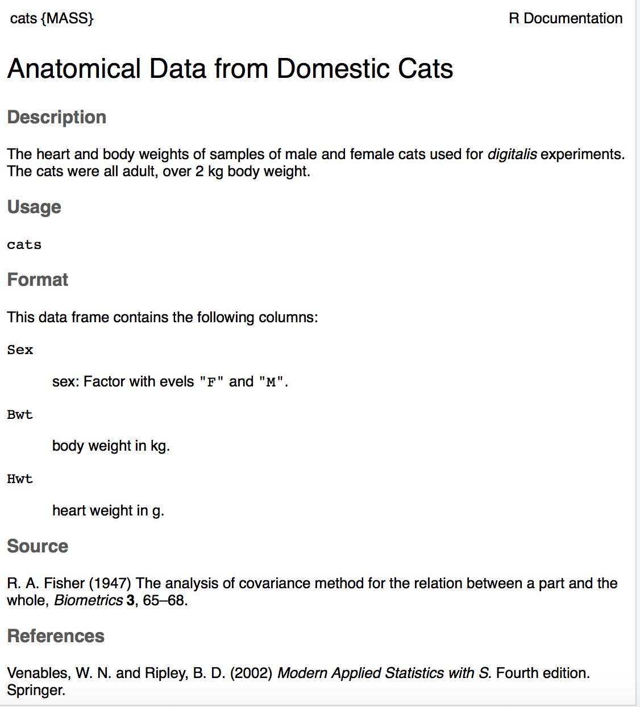
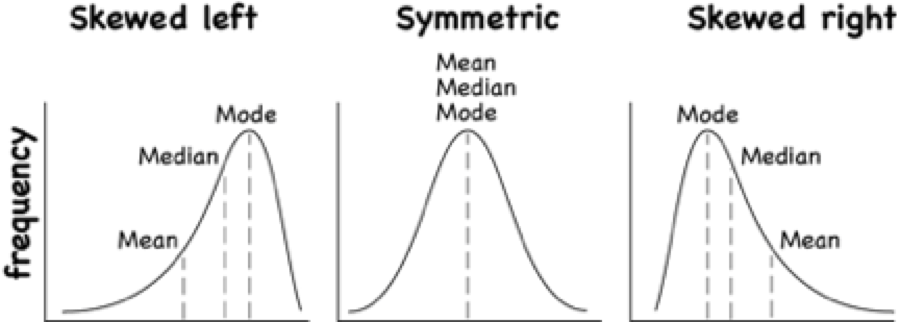
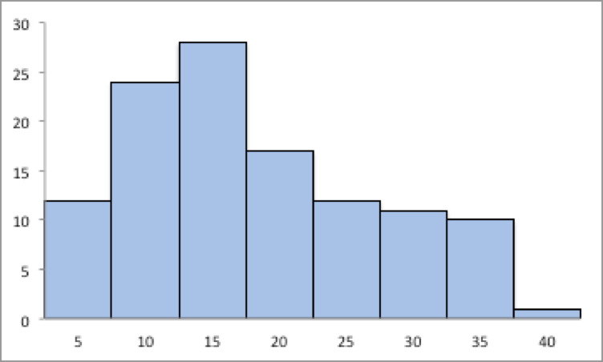

---
output:
  html_document: default
  pdf_document: default
---

```{r setup3, include=FALSE}
library("mosaic")
library("MASS")
```

# Numerical Descriptions of Data

Chapter 1 discussed what a population, sample, parameter, and statistic are, and how to take different types of samples. Chapter 2 discussed ways to graphically display data. There was also a discussion of important characteristics: center, variations, distribution, outliers, and changing characteristics of the data over time. Distributions and outliers can be answered using graphical means. Finding the center and variation can be done using numerical methods that will be discussed in this chapter. Both graphical and numerical methods are part of a branch of statistics known as **descriptive statistics**. Later descriptive statistics will be used to make decisions and/or estimate population parameters using methods that are part of the branch called **inferential statistics**.

## Measures of Center

This section focuses on measures of central tendency. Many times you are asking what to expect on average. Such as when you pick a major, you would probably ask how much you expect to earn in that field. If you are thinking of relocating to a new town, you might ask how much you can expect to pay for housing. If you are planting vegetables in the spring, you might want to know how long it will be until you can harvest. These questions, and many more, can be answered by knowing the center of the data set. There are three measures of the "center" of the data. They are the mode, median, and mean. Any of the values can be referred to as the "average."

The **mode** is the data value that occurs the most frequently in the data. To find it, you count how often each data value occurs, and then determine which data value occurs most often. The mode is not the most useful measure of center. This is because, a data set can have more than one mode. If there is a tie between two values for the most number of times then both values are the mode and the data is called bimodal (two modes). If every data point occurs the same number of times, there is no mode. If there are more than two numbers that appear the most times, then usually there is no mode.

The **median** is the data value in the middle of a sorted list of data. To find it, you put the data in order, and then determine which data value is in the middle of the data set.

The **mean** is the arithmetic average of the numbers. This is the center that most people call the average, though all three -- mean, median, and mode -- really are averages.

There are no symbols for the mode and the median, but the mean is used a great deal, and statisticians gave it a symbol. There are actually two symbols, one for the population parameter and one for the sample statistic. In most cases you cannot find the population parameter, so you use the sample statistic to estimate the population parameter.

**Population Mean:**

$\mu=\frac{\sum{x}}{N}$, pronounced mu

*N* is the size of the population.

*x* represents a data value.

$\sum{x}$ means to add up all of the data values.

**Sample Mean**:

$\bar{x}=\frac{\sum{x}}{n}$, pronounced x bar.

*n* is the size of the sample.

*x* represents a data value.

$\sum{x}$ means to add up all of the data values.

The value for $\bar{x}$ is used to estimate $\mu$ since $\mu$ can't be calculated in most situations.

### Example: Finding the Mean and Median using R

Suppose a vet wants to find the average weight of cats. The weights (in kg) of cats are in table \#3.1.1.

Table \#3.1.1: Cats' Weights

```{r cats5-data}
head(cats) 
```

The head command shows the variable names and the first few unit of observation rows

Find the mean and median of the weight of a cat.

**Solution:**

Before starting any mathematics problem, it is always a good idea to define the unknown in the problem. In statistics, you want to define the variable. The symbol for the variable is *x*.

The variable is *x* = weight of a cat

Mean:
To find with RStudio, perform the command:

```{r statistics-cats2}
df_stats(~Bwt, cats, mean)
```

The mean weight is 2.72 kg

Median:
To find with RStudio, perform the command:

```{r statistics-cats3}
df_stats(~Bwt, cats, median)
```

The median weight is 2.7 kg also. It appears the average weight is 2.7 kg of all cats.

### Example: Finding Mean and Median with filtering

Looking at the data frame for cats weights table(\#3.1.1), you see that there are several variables You may want to know what the other variables are. A * Code Book * describes the data set, explains what the variables are including the units, and the source of the data frame. To review the code book for a data frame, complete the following command.

```{r cats1-data}
??cats
```

Then click on MASS::cats. 

The output looks like:

**Image \#3.1.1: Code book for cats data frame**



Suppose you want to know if male cats weight more than female cats. Looking at the variables, you notice that there is a variable for the sex of the cat. You can look at the weights of males and females separately. This looks like:  

**Solution:**
To find the mean and median, separated by sex, use this command in RStudio:

```{r statistics-cats-sex2}
df_stats(Bwt~Sex, data=cats, mean, median)
```

Notice that the female cats' mean weigh 2.4 kg and the male cats' mean weigh 2.9 kg The median weight of female cats is 2.3 kg and for males is is 2.9 kg So it does appear that males cats weight a bit more than the female cats. 

There are many different summary statistics that can be found. An example is the minimum and maximum value. In this example, you will see how to find the min and max values and then filter them out of a data set to see what effect they have on the mean and median.

### Example: Affect of Extreme Values on Mean and Median**

Find the minimum and maximum values of cats weights. 

**Solution**
The command in RStudio for finding the minimum and maximum is very similar to how to find the mean and median, In fact all summary statistics start with 

```r
df_stats(~variable, data=Data Frame, desired statistics)
```

Here is the command in RStudio for the minimum and maximum of cat's body weight.

```{r statisticis-cats4}
df_stats(~Bwt, data=cats, min, max)
```

The minimum weight of a cat in this data frame is 2 kg and the maximum weight of a cat is 3.9 kg.

Now create two new data sets. One data set will exclude the maximum value. You can call it anything you want, but it would make sense to call it something like nomax. The command to create the new data set is:

```{r filter-cats-data,warning=FALSE}
nomax <- filter(cats, Bwt<3.9)
```

Then create a data set that excludes the minimum value; call it nomin:

```{r filter-cats1-data}
nomin<-filter(cats, Bwt>2)
```

The <- is the way to indicate to R what the data set nomin is equivalent to what follows the symbol. Notice that it doesn't look like anything happened, but new data sets were created in the background. Now you can find the mean and median of each new data set:

```{r statistics-nomax}
df_stats(~Bwt, data=nomax, mean, median)
```

The mean without the maximum value is 2.70 kg, and the median is 2.7 kg.

```{r statistics-nomin}
df_stats(~Bwt, data=nomin, mean, median)
```

The mean without the minimum value is 2.75 kg, and the median is 2.7 kg.

From Example 3.1.1, the mean of the data set with all the values is 2.72 kg where the median is 2.7 kg. Notice that when the maximum value was excluded from the data set, the mean decreased a little but the median didn't change, and when the minimum value was excluded from the data set, the mean increased a little but the median didn't change. The mean is much higher than the median. Why is this? This is because the mean is affected by extreme values, while the median is not. We say the median is a much more resistant measure of center because it isn't affected by extreme values as much.

An outlier is a data value that is very different from the rest of the data. It can be really high or really low. Extreme values may be an outlier if the extreme value is far enough from the center. If there are extreme values in the data, the median is a better measure of the center than the mean. If there are no extreme values, the mean and the median will be similar so most people use the mean. The mean is not a resistant measure because it is affected by extreme values. The median is a resistant measure because it not affected by extreme values.

As a consumer you need to be aware that people choose the measure of center that best supports their claim. When you read an article in the newspaper and it talks about the "average" it usually means the mean but sometimes it refers to the median. Some articles will use the word "median" instead of "average" to be more specific. If you need to make an important decision and the information says "average", it would be wise to ask if the "average" is the mean or the median before you decide.

As an example, suppose that a company wants to use the mean salary as the average salary for the company. This is because the high salaries of the administrators will pull the mean higher. The company can say that the employees are paid well because the average is high. However, the employees want to use the median since it discounts the extreme values of the administration and will give a lower value of the average. This will make the salaries seem lower and that a raise is in order.

Why use the mean instead of the median? The reason is because when multiple samples are taken from the same population, the sample means tend to be more consistent than other measures of the center. 

To understand how the different measures of center related to skewed or symmetric distributions, see Graph \#3.1.2. As you can see sometimes the mean is smaller than the median, sometimes the mean is larger than the median, and sometimes they are the same values.

**Graph \#3.1.2: Mean, Median, Mode as Related to a Distribution**

```{r, include=FALSE, fig.alt="skewed left graph with mean, median,mode lines, then symmetric graph with all three the same line, then skewed right graph with mode, median, mean lines"}

```


One last type of average is a weighted average. **Weighted averages** are used quite often in different situations. Some teachers use them in calculating a student's grade in the course, or a grade on a project. Some employers use them in employee evaluations. The idea is that some activities are more
important than others. As an example, a full time teacher at a community college may be evaluated on their service to the college, their service to the community, whether their paperwork is turned in on time, and their teaching. However, teaching is much more important than whether their paperwork is turned in on time. When the evaluation is completed, more weight needs to be given to the teaching and less to the paperwork. This is a weighted average.

**Weighted Average**
$\text{weighted average}=\frac{\sum{x*w}}{\sum{w}}$

where *w* is the weight of the data value, *x*.

### Example: Weighted Average

In your biology class, your final grade is based on several things: a lab score, scores on two major tests, and your score on the final exam. There are 100 points available for each score. The lab score is worth 15% of the course, the two exams are worth 25% of the course each, and the final exam is worth 35% of the course. Suppose you earned scores of 95 on the labs, 83 and 76 on the two exams, and 84 on the final exam. Compute your weighted average for the course.

 **Solution:**

 Variable: *x* = score

 A weighted average can be found using technology. The commands for finding the weighted mean using RStudio is as follows:

```r
 x<-c(type in the scores with commas in between)

 w<-c(type in the weights as decimals with commas in between

 weighted.mean(x,w)

```

The *x* and *w* represent the variables, <- means make the variables equivalent to what follows, the c( means combine all the values in the () as one combined variable.

For this example, the commands would be

```{r weighted-mean}
x<-c(95, 83, 76, 84)
w<-c(.15, .25, .25, .35)
weighted.mean(x,w)
```
Your weighted mean in the biology class is 83.4%. Using the traditional grading scale, you have a B in the class.

### Example: Weighted Average

The faculty evaluation process at John Jingle University rates a faculty member on the following activities: teaching, publishing, committee service, community service, and submitting paperwork in a timely manner. The process involves reviewing student evaluations, peer evaluations, and supervisor evaluation for each teacher and awarding him/her a score on a scale from 1 to 10 (with 10 being the best). The weights for each activity are 20 for teaching, 18 for publishing, 6 for committee service, 4 for community service, and 2 for paperwork.

a)  One faculty member had the following ratings: 8 for teaching, 9 for publishing, 2 for committee work, 1 for community service, and 8 for paperwork. Compute the weighted average of the evaluation.

 **Solution:**

 Variable: *x* = rating, *w* = weight

```{r weighted-mean1}
x<-c(8, 9, 2, 1, 8)
w<-c(20, 18, 6, 4, 2)
weighted.mean(x,w)
```

The weighted average is 7.08.

b)  Another faculty member had ratings of 6 for teaching, 8 for publishing, 9 for committee work, 10 for community service, and 10 for paperwork. Compute the weighted average of the evaluation.

 **Solution:**

```{r weighted-mean2}
x<-c(6, 8, 9, 10, 10)
w<-c(20, 18, 6, 4, 2)
weighted.mean(x,w)
```

The weighted average for this employee is 7.56.

c)  Which faculty member had the higher average evaluation?

 **Solution:**

The second faculty member has a higher average evaluation.

The last thing to mention is which average is used on which type of data.

Mode can be found on nominal, ordinal, interval, and ratio data, since the mode is just the data value that occurs most often. You are just counting the data values.

Median can be found on ordinal, interval, and ratio data, since you need to put the data in order. As long as there is order to the data you can find the median.

Mean can be found on interval and ratio data, since you must have numbers to add together.

### Homework
** Use Technology on all problems. State the variable on all problems.**

1.  Cholesterol levels were collected from patients certain days after they had a heart attack  and are in table \#3.1.2. Find the mean and median for cholesterol levels 2 days after the heart attack.

table \#3.1.2

```{r cholesterol2-data}
Cholesterol<-read.csv(
  "https://krkozak.github.io/MAT160/cholesterol.csv")
head(Cholesterol)
```

**Code book for Data Frame Cholesterol**

**Description**
Cholesterol levels were collected from patients certain days after they had a heart attack 

This data frame contains the following columns:

Patient: Patient number

day2: Cholesterol level of patient 2 days after heart attack. (mg/dL)

day4: Cholesterol level of patient 4 days after heart attack. (mg/dL)

day14: Cholesterol level of patient 14 days after heart attack. (mg/dL)

**Source**
Ryan, B. F., Joiner, B. L., & Ryan, Jr, T. A. (1985). Cholesterol levels after heart attack.Retrieved from http://www.statsci.org/data/general/cholest.html

**References**
Ryan, Joiner & Ryan, Jr, 1985

2.  The lengths (in kilometers) of rivers on the South Island of New Zealand and what body of water they flow into are listed in table \#3.1.2 (Lee, 1994). Find the mean and median length of rivers that flow into the Pacific Ocean and the mean and median length of rivers that flow into the Tasman Sea.

 ** Table \#3.1.2: Lengths of Rivers (km) in New Zealand**

```{r length2-data}
Length<-read.csv(
  "https://krkozak.github.io/MAT160/length.csv")
head(Length)
```

**Code book for data frame Length**

**Description**

Rivers in New Zealand, the lengths of river and what body of water the river flows into  

This data frame contains the following columns:

River: Name of the river

length: how long the river is in kilometers

flowsto: what body of water the river flows into Pacific Ocean is Pacific and the Tasman Sea is Tasman

**Source**
Lee, A. (1994). Data analysis: An introduction based on r. Auckland. Retrieved from
http://www.statsci.org/data/oz/nzrivers.html

**References**
Lee, A. (1994). Data analysis: An introduction based on r. Auckland.

3.  Print-O-Matic printing company's employees have salaries that are contained in table \#3.1.3.

**Table \#3.1.3: Salaries of Print-O-Matic Printing Company Employees**

```{r pay2-data}
Pay<-read.csv(
  "https://krkozak.github.io/MAT160/pay.csv")
head(Pay)
```

**Code book for data frame Pay**

**Description**

Salaries of Print-O-Matic printing company's employees

This data frame contains the following columns:

employee:employees position in the company

salary: salary of that employee (Australian dollars (AUD))

**Source**
John Matic provided the data from a company he worked with. The company's name is fictitious, but the data is from an actual company.

**References**
John Matic (2013)

a.  Find the mean and median.

b.  Find the mean and median with the CEO's salary removed.

c.  What happened to the mean and median when the CEO's salary was removed? Why?

d.  If you were the CEO, who is answering concerns from the union that employees are underpaid, which average (mean or median) using the complete data set of the complete data set would you prefer? Why?

e.  If you were a platen worker, who believes that the employees need a raise, which average (mean or median) using the complete data set would you prefer? Why?


4.  Print-O-Matic printing company spends specific amounts on fixed costs every month. The costs of those fixed costs are in table \#3.1.4.

 **Table \#3.1.4: Fixed Costs for Print-O-Matic Printing Company**

```{r cost-data}
Cost<-read.csv(
  "https://krkozak.github.io/MAT160/cost.csv")
head(Cost)
```
**Code book for data frame Cost**

**Description**
   fixed monthly charges for Print-0-Matic printing company

 This data frame contains the following columns:

 charges: Categories of monthly fixed charges

 cost: fixed month costs (AUD)

**Source**
John Matic provided the data from a company he worked with. The company's name is fictitious, but the data is from an actual company.

**References**
John Matic (2013)

a.  Find the mean and median.

b.  Find the mean and median with the bank charges removed.

c.  What happened to the mean and median when the bank charges was removed? Why?

d.  If it is your job to oversee the fixed costs, which average (mean or median) using the complete data set would you prefer to use when submitting a report to administration to show that costs are low? Why?

e.  If it is your job to find places in the budget to reduce costs, which average (mean or median) using the complete data set would you prefer to use when submitting a report to administration to show that fixed costs need to be reduced? Why?

5.  Looking at graph \#3.1.1, state if the graph is skewed left, skewed right, or symmetric and then state which is larger, the mean or the median?

 **Graph \#3.1.1: Skewed or Symmetric Graph**

```{r, include=FALSE,fig.alt="histogram with bars on left tallest and then gradually getting shorter as you go to the right"}

```


6. Looking at graph \#3.1.2, state if the graph is skewed left, skewed right, or symmetric and then state which is larger, the mean or the median?

 **Graph \#3.1.2: Skewed or Symmetric Graph**
 
```{r, include=FALSE, fig.alt="histogram with bars on left shortest and then gradually getting taller as you go to the right"}

```

7. An employee at Coconino Community College (CCC) is evaluated based on goal setting and accomplishments toward the goals, job effectiveness, competencies, and CCC core values. Suppose for a specific employee, goal 1 has a weight of 30%, goal 2 has a weight of 20%, job effectiveness has a weight of 25%, competency 1 has a weight of 4%, competency 2 has a weight of 3%, competency 3 has a weight of 3%, competency 4 has a weight of 3%, competency 5 has a weight of 2%, and core values has a weight of 10%. Suppose the employee has scores of 3.0 for goal 1, 3.0 for goal 2, 2.0 for job effectiveness, 3.0 for competency 1, 2.0 for competency 2, 2.0 for competency 3, 3.0 for competency 4, 4.0 for competency 5, and 3.0 for core values. Find the weighted average score for this employee. If an employee has a score less than 2.5, they must have a Performance Enhancement Plan written. Does this employee need a plan?

8. An employee at Coconino Community College (CCC) is evaluated based on goal setting and accomplishments toward goals, job effectiveness, competencies, CCC core values. Suppose for a specific employee, goal 1 has a weight of 20%, goal 2 has a weight of 20%, goal 3 has a weight of 10%, job effectiveness has a weight of 25%, competency 1 has a weight of 4%, competency 2 has a weight of 3%, competency 3 has a weight of 3%, competency 4 has a weight of 5%, and core values has a weight of 10%. Suppose the employee has scores of 2.0 for goal 1, 2.0 for goal 2, 4.0 for goal 3, 3.0 for job effectiveness, 2.0 for competency 1, 3.0 for competency 2, 2.0 for competency 3, 3.0 for competency 4, and 4.0 for core values. Find the weighted average score for this employee. If an employee that has a score less than 2.5, they must have a Performance Enhancement Plan written. Does this employee need a plan?

9. A statistics class has the following activities and weights for determining a grade in the course: test 1 worth 15% of the grade, test 2 worth 15% of the grade, test 3 worth 15% of the grade, homework worth 10% of the grade, semester project worth 20% of the grade, and the final exam worth 25% of the grade. If a student receives an 85 on test 1, a 76 on test 2, an 83 on test 3, a 74 on the homework, a 65 on the project, and a 79 on the final, what grade did the student earn in the course?

10. A statistics class has the following activities and weights for determining a grade in the course: test 1 worth 15% of the grade, test 2 worth 15% of the grade, test 3 worth 15% of the grade, homework worth 10% of the grade, semester project worth 20% of the grade, and the final exam worth 25% of the grade. If a student receives a 92 on test 1, an 85 on test 2, a 95 on test 3, a 92 on the homework, a 55 on the project, and an 83 on the final, what grade did the student earn in the course?

**\
**

## Measures of Spread

Variability is an important idea in statistics. If you were to measure the height of everyone in your classroom, every observation gives you a different value. That means not every student has the same height. Thus there is variability in people's heights. If you were to take a sample of the income level of people in a town, every sample gives you different information. There is variability between samples too. Variability describes how the data are spread out. If the data are very close to each other, then there is low variability. If the data are very spread out, then there is high variability. How do you measure variability? It would be good to have a number that measures it. This section will describe some of the different measures of variability, also known as variation.

In example \#3.1.1, the average weight of a cat was calculated to be 2.72 kg. How much does this tell you about the weight of all cats? Can you tell if most of the weights were close to 2.72 kg or were the weights really spread out? The highest weight and the lowest weight are known, but is there more that you can tell? All you know is that the center of the weights is 2.72 kg.

You need more information.

The **range** of a set of data is the difference between the highest and the lowest data values (or maximum and minimum values). The **interval** is the lowest and highest values. The range is one value while the interval is two.

### Example: Range

From example \#3.1.2, the maximum is 3.9 kg and the minimum is 2 kg. So the range is $3.9-2=1.9 kg$. But what does that tell you? You don't know if the weights are really spread out, or if they are close together. 

Unfortunately, range doesn't really provide a very accurate picture of the variability. A better way to describe how the data is spread out is needed. Instead of looking at the distance the highest value is from the lowest how about looking at the distance each value is from the mean. This distance is called the **deviation**. You might want to find the average of the deviation. Though the calculation for finding the average deviation is not very straight forward, you end up with a value called the **variance**. The symbol for the population variance is $\sigma^2$, and it is the average squared distance from the mean. Statisticians like the variance, but many other people who work with statistics use a descriptive statistics which is the square root of the variance. This gives you the average distance from the mean. This is called the standard deviation, and is denoted with the letter $\sigma$.

The standard deviation is the average (mean) distance from a data point to the mean. It can be thought of as how much a typical data point differs from the mean.

The **sample variance** formula:
$s^2=\frac{\sum\left(x-\bar{x}\right)^2}{n-1}$, where $\bar{x}$ is the sample mean, *n* is the sample size, and $\sum{}$ means to find the sum of the values.The $n-1$ on the bottom has to do with a concept called degrees of freedom. Basically, it makes the sample variance a better approximation of the population variance.

The **sample standard deviation** formula:
$s=\sqrt{ \frac{\sum\left(x-\bar{x}\right)^2}{n-1}}$.

The **population variance** formula:
$\sigma^2 = \frac{\sum\left(x-\mu \right)^2}{N}$, where $\sigma$ is the Greek letter sigma and $\sigma^2$ represents the population variance, $\mu$ is the population mean, and *N* is the size of the population.

The **population standard deviation** formula:
$\sigma =\sqrt{ \frac{\sum\left(x-\mu \right)^2}{N}}$

Both the sample variance and sample standard deviation can be found using technology. If using RStudio, you would use 

```r
df_stats(~variable, data=data frame, var, sd)
```

The next example will demonstrate this command.

### Example: Finding the Standard Deviation

For the data frame *Cats* from example \#3.2.1, find the variance and standard derivation for weight of cats. Then find the variance and standard deviation separated by sex of the cat.

**Solution:**
The variance and standard deviation for all cats is found by performing the command:

```{r statsics-cats}
df_stats(~Bwt, data=cats, var, sd)
```

The variance for all cats is 0.24 $kg^2$ and the standard deviation is 0.49 kg.

To find out the mean, variance, and standard deviation for each sex of the cats, use the command:

```{r statistics-cats-sex}
df_stats(Bwt~Sex, data=cats, mean, var, sd)
```
You can see that the mean weight of females cats is 2.36 kg, the variance is 0.075 $kg^2$, and the standard deviation is 0.27 kg. For males cats, the mean is 2.9 kg, the variance is 0.22 $kg^2$, and the standard deviation is 0.47 kg. This means that female cats weigh less than males and since the variance and standard deviations are much less for female cats than males cats, female cats' weights are more consistent than male cats. 

In general a "small" variance and standard deviation means the data is close together (more consistent) and a "large" variance and standard deviation means the data is spread out (less consistent). Sometimes you want consistent data and sometimes you don't. As an example if you are making bolts, you want the
lengths to be very consistent so you want a small standard deviation. If you are administering a test to see who can be a pilot, you want a large standard deviation so you can tell who are the good pilots and who are the not so good pilots.

What do "small" and "large" standard deviation mean? To a bicyclist whose average speed is 20 mph, *s* = 20 mph is huge. To an airplane whose average speed is 500 mph, *s* = 20 mph is nothing. The "size" of the variation depends on the size of the numbers in the problem and the mean. Another situation where you can determine whether a standard deviation is small or large is when you are comparing two different samples such as in example \#3.2.2. A sample with a smaller standard deviation is more consistent than a sample with a larger standard deviation.

Many other books and authors stress that there is a computational formula for calculating the standard deviation. However, this formula doesn't give you an idea of what standard deviation is and what you are doing. It is only good for doing the calculations quickly. It goes back to the days when standard deviations were calculated by hand, and the person needed a quick way to calculate the standard deviation. It is an archaic formula that this author is trying to eradicate. It is not necessary anymore, computers will do the calculations for you with as much meaning as this formula gives. It is suggested that you never use it. If you want to understand what the standard deviation is doing, then you should use the definition formula. If you want an answer quickly, use a computer.

**Use of Standard Deviation**

One of the uses of the standard deviation is to describe how a population is distributed. This describes where much of the data is for most distributions. A general rule is that about 95% of the data is within 2 standard deviations of the mean. This is not perfect, but is works for many distributions. There are rules like the empirical rule and Chebyshev's theorem that give you more detailed percentages, but 95% in 2 standard deviations is a very good approximation.

### Example: the gneral rule

The U.S. Weather Service has provided the information in table \#3.2.1 about the total monthly/annual number of reported tornadoes in Oklahoma for the years 1950 to 2018. (US Department of Commerce & Noaa, 2016)

**Table \#3.2.1: Monthyl/Annual Number of tornadoes in Oklahoma**

```{r tornado-data}
Tornado<-read.csv(
  "https://krkozak.github.io/MAT160/Tornado_OK.csv")
head(Tornado)
```

**Code book for data frame Pulse**

**Description**
The U.S. Weather Service has collected data on the monthly and annual number of tornadoes in Oklahoma.

This data frame contains the following columns:

Year: Year from 1950-2018

Jan, Feb, Mar, Apr, May, Jun, Jul, Aug, Sep, Oct, Nov, Dec: Tornado numbers in each moth of the year

Annual: Total number of tornadoes for each year

**Source**
US Department of Commerce, & Noaa. (2016, November 15). 1950 Oklahoma Tornadoes. Retrieved from https://www.weather.gov/oun/tornadodata-ok-1950

**References**
The data was supplied by The U.S. Weather Service

Find the general interval that contains about 95% of the data.

**Solution:**

Variable: *x* = number of annual tornadoes in Oklahoma

Find the mean and standard deviation:

```{r statistics-tornado}
df_stats(~Annual, data=Tornado, mean, sd)
```

The mean is $\mu=56$ tornadoes and the standard deviation is $\sigma=27.6$ tornadoes. The interval will be $\mu\pm2*\sigma=56\pm2*27.6=(0.8,111.2)$

About 95% of the years have between 0.8 or 1 and 111 tornadoes in Oklahoma.

The general rule says that about 95% of the data is within two standard deviations of the mean. That percentage is fairly high. There isn't much data outside two standard deviations. A rule that can be
followed is that if a data value is within two standard deviations, then that value is a common data value. If the data value is outside two standard deviations of the mean, either above or below, then the number is uncommon. It could even be called unusual. An easy calculation that you can do to figure it out is to find the difference between the data point and the mean, and then divide that answer by the standard
deviation. As a formula this would be

$z=\frac{x-\mu}{\sigma}$

If you don't know the population mean, $\mu$, and the population standard deviation, $\sigma$, then use the sample mean, $\bar{x}$, and the sample standard deviation, *s*, to estimate the population parameter values. Realize that using the sample standard deviation may not actually be very accurate.

### Example: Determining If a Value Is Unusual

a. In 1974, there were 45 tornadoes in Oklahoma. Is this value unusual? Why or why not?

 **Solution:**

 Variable: *x* = number of tornadoes in Oklahoma

To answer this question, first find how many standard deviations 45 is from the mean. From example \#3.2.3, we know $\mu=56$ and $\sigma=27.6$. For *x*=45, $z=\frac{45-56}{27.6}=-0.399$

Since this value is between -2 and 2, then it is not unusual to have 45 tornadoes in a year in Oklahoma. The z value is negative, so that means that 45 is less than the mean number of tornadoes.

b.  In 1999, there were 145 tornadoes in the Oklahoma. Is this value unusual? Why or why not?

 **Solution:**

Variable: *x* = number of tornadoes in Oklahoma

For this question the *x* = 145, $z=\frac{145-56}{27.6}=3.22$

Since this value is more than 2, then it is unusual to have only 145 tornadoes in a year in Oklahoma.

### Homework
**Use Technology on all problems. State the variable on all problems.**

1. Cholesterol levels were collected from patients certain days after they had a heart attack and are in table \#3.2.2. Find the mean, median, range, variance, and standard deviation for cholesterol levels 2 days after the heart attack.

 **table \#3.3.2: Cholesterol Levels of Patients After Heart Attack**

```{r cholesterol1-data}
Cholesterol<-read.csv(
  "https://krkozak.github.io/MAT160/cholesterol.csv")
head(Cholesterol)
```

**Code book for Data Frame Cholesterol** See problem 3.1.1 in Section 3.1 homework.

2.  The lengths (in kilometers) of rivers on the South Island of New Zealand and what body of water they flow into are listed in table \#3.1.2 (Lee, 1994). Find the mean, median, range, variance, and standard deviation of the length of rivers that flow into the Pacific Ocean and the mean, median, range, variance, and standard deviation of the length of rivers that flow into the Tasman Sea. Compare and contrast the length of rivers that flow to the Pacific Ocean versus the ones that flow into the Tasman Sea using both measures of spread and measures of variability.

 **Table \#3.3.3: Lengths of Rivers (km) Flowing to Pacific Ocean**

```{r length-data}
Length<-read.csv(
  "https://krkozak.github.io/MAT160/length.csv")
head(Length)
```

**Code book for data frame Length** See problem 3.1.2 in Section 3.1 homework.

3.  Print-O-Matic printing company's employees have salaries that are contained in table \#3.2.4. Find the mean, median, range, variance, and standard deviation for the salaries of all employees.

 **Table \#3.2.4: Salaries of Print-O-Matic Printing Company Employees**

```{r pay-data}
Pay<-read.csv(
  "https://krkozak.github.io/MAT160/pay.csv")
head(Pay)
```

**Code book for data frame Pay** See problem 3.1.3 in Section 3.1 homework.

4.  Print-O-Matic printing company spends specific amounts on fixed costs every month. The costs of those fixed costs are in table \#3.2.5. Find the mean, median, range, variance, and standard deviation for the fixed costs.
    
 **Table \#3.2.5: Fixed Costs for the Print-O-Matic Printing Company**

```{r cost1-data}
Cost<-read.csv(
  "https://krkozak.github.io/MAT160/cost.csv")
head(Cost)
```

**Code book for Data frame Cost** See problem 3.1.4 in Section 3.1 homework.

5.  The data frame Pulse (Table 3.2.6) contains various variables about a person including their pulse rates before the subject exercised and after the subject ran in place for one minute.

**Table \#3.2.6: Pulse Rates of people Before and After Exercise**

```{r pulse-data}
Pulse<-read.csv(
  "https://krkozak.github.io/MAT160/pulse.csv")
options(width = 60)
head(Pulse)
```

**Code book for data frame Pulse**

**Description**
Students in an introductory statistics class (MS212 taught by Professor John Eccleston and Dr Richard Wilson at The University of Queensland) participated in a simple experiment. The students took their own pulse rate. They were then asked to flip a coin. If the coin came up heads, they were to run in place for one minute. Otherwise they sat for one minute. Then everyone took their pulse again. The pulse rates and other physiological and lifestyle data are given in the data.

Five class groups between 1993 and 1998 participated in the experiment. The lecturer, Richard Wilson, was concerned that some students would choose the less strenuous option of sitting rather than running even if their coin came up heads, In the years 1995-1998 a different method of random assignment was used. In these years, data forms were handed out to the class before the experiment. The forms were pre-assigned to either running or non-running and there were an equal number of each. In 1995 and 1998 not all of the forms were returned so the numbers running and sitting was still not entirely controlled.

This data frame contains the following columns:

height: height of subject in cm

weight: weight of subject in kg

age: age of subject in years

gender: sex of subject, male, female

Smokes: whether a subject regularly smokes, yes means does smoke, no means does not smoke

alcohol: whether a subject regularly drinks alcohol, yes means the person does, no means the person does not 

exercise: whether a subject exercises, low, moderate, high

ran: whether a subject ran one minute between pulse measurements (ran) or sat between pulse measurement (sat)

pulse_before: the pulse rate before a subject either ran or sat (bpm)

pulse_after: the pulse rate after a subject either ran or sat (bpm)

year: what year the data was collected (93-98)

**Source**
Pulse rates before and after exercise. (2013, September 25). Retrieved from
http://www.statsci.org/data/oz/ms212.html

**References**
The data was supplied by Dr Richard J. Wilson, Department of Mathematics, University of Queensland.

Create a data frame that contains only males, who drink alcohol, but do not smoke. Then compare the pulse before and the pulse after using the mean and standard deviation. Discuss whether pulse before or pulse after has a higher mean and larger spread.  To create a new data frame with just males, who drink alcohol, but do not smoke, use the following command, where the new name is Males:

```{r males-filter-data}
Males<-
Pulse%>%
  filter(gender=="male", smokes == "no", alcohol == "yes")
```

6.  The data frame Pulse (Table 3.2.6) contains various variables about a person including their pulse rates before the subject exercised and after after the subject ran in place for one minute. Create a data frame that contains females, who do not smoke but do drink alcohol. Compare the pulse rate before and after exercise using the mean and standard deviation. Discuss whether pulse before or pulse after has a higher mean and larger spread.

7. To determine if Reiki is an effective method for treating pain, a pilot study was carried out where a certified second-degree Reiki therapist provided treatment on volunteers. Pain was measured using a visual analogue scale (VAS) and a likert scale immediately before and after the Reiki treatment (Olson & Hanson, 1997) and the data is in table \#3.2.7.

**Table \#3.2.7: Pain Measurements Before and After Reiki Treatment**

```{r reiki-data}
Reiki<- read.csv(
  "https://krkozak.github.io/MAT160/reki.csv")
head(Reiki)
```

**Code book for data frame Reiki**

**Description**
The purpose of this study was to explore the usefulness of Reiki as an adjuvant to opioid therapy in the management of pain. Since no studies in this area could be found, a pilot study was carried out involving 20 volunteers experiencing pain at 55 sites for a variety of reasons, including cancer. All Reiki treatments were provided by a certified second-degree Reiki therapist. Pain was measured using both a visual analogue scale (VAS) and a Likert scale immediately before and after the Reiki treatment. Both instruments showed a highly significant (p < 0.0001) reduction in pain following the Reiki treatment.

This data frame contains the following columns:

vas.before: pain measured using a visual analogue scale (VAS) before Reiki treatment

vas.after: pain measured using a visual analogue scale (VAS) after Reiki treatment

likert_before: pain measured using a likert before Reiki treatment

likert_after: pain measured using a likert after Reiki treatment

**Source**
Olson, K., & Hanson, J. (1997). Using reiki to manage pain: a preliminary report. Cancer Prev Control, 1(2), 108-13. Retrieved from http://www.ncbi.nlm.nih.gov/pubmed/9765732

**References**
Using Reiki to manage pain: a preliminary report. Olson K1, Hanson J., Cancer Prev Control 1997, Jun; 1(2): 108-13.

Since the data was collected both before and after the treatment for all of the units of observations, you want to look at the effect size of the treatment. You want to find the difference between before and after for the pain scale. First you must create a new data frame that adds a column for the difference in before and after. This data is known as paired data. To create the new column in a new data frame called Newreiki use the following commands

```{r newreiki-data}
Newreiki<-Reiki%>%
  mutate(vas.diff=vas.before-vas.after)
head(Newreiki)
```

Now find the mean and standard deviation of the vas.diff variable in Newreiki. Perform similar commands to create the likert.diff variable. Then find the mean and standard deviation for likert.diff, and compare and contrast the vas and likert methods for describing pain. 

8.Yearly rainfall amounts (in millimeters) in Sydney, Australia, are in table \#3.2.8
(Annual maximums of, 2013). 
a. Calculate the mean and standard deviation.
b. Suppose Sydney, Australia received 300 mm of rainfall in a year. Would this be unusual? 
    
** Table \#3.2.8: Yewarly rainfall amounts in Sydney, Australia**
    
```{r rainfall-data}
Rainfall<-read.csv(
  "https://krkozak.github.io/MAT160/rainfall.csv")
head(Rainfall)
```

**Code book for data frame Rainfall**

**Description**
Daily rainfall (in millimeters) was recorded over a 47-year period in Turramurra, Sydney, Australia. For each year, the wettest day was identified (that having the greatest rainfall). The data show the rainfall recorded for the 47 annual maxima.

 This data frame contains the following columns:

 amount: daily rainfall (mm)

**Source**
Annual maximums of daily rainfall in Sydney. (2013, September 25). Retrieved from
http://www.statsci.org/data/oz/sydrain.html

**References**
Rayner J.C.W. and Best D.J. (1989) Smooth tests of goodness of fit. Oxford: Oxford University Press.
Hand D.J., Daly F., Lunn A.D., McConway K.J., Ostrowski E. (1994). A Handbook of Small Data Sets. London: Chapman & Hall. Data set 157.
Thanks to Jim Irish of the University of Technology, Sydney, for assistance in identifying the correct units for this data.

**\
**

## Ranking

Along with the center and the variability, another useful numerical measure is the ranking of a number. A **percentile** is a measure of ranking. It represents a location measurement of a data value to the
rest of the values. Many standardized tests give the results as a percentile. Doctors also use percentiles to track a child's growth.

The **kth percentile** is the data value that has k% of the data at or below that value.

### Example: Interpreting Percentile

a.  What does a score of the 90^th^ percentile mean?

**Solution:**

This means that 90% of the scores were at or below this score. (A person did the same as or better than 90% of the test takers.)

b.  What does a score of the 70^th^ percentile mean?

**Solution:**

This means that 70% of the scores were at or below this score.

### Example: Percentile Versus Score

If the test was out of 100 points and you scored at the 80^th^ percentile, what was your score on the test?

**Solution:**

You don't know! All you know is that you scored the same as or better than 80% of the people who took the test. If all the scores were really low, you could have still failed the test. On the other hand, if many of the scores were high you could have gotten a 95% or more.

There are special percentiles called **quartiles**. Quartiles are numbers that divide the data into fourths. One fourth (or a quarter) of the data falls between consecutive quartiles.

**To find the quartiles:**

The command in RStudio is 

```r
df_stats(~variable, data=data frame, summary)
```

If you record the quartiles together with the maximum and minimum you have five numbers. This is known as the five-number summary. The five-number summary consists of the minimum, the first quartile (*Q1*),
the median, the third quartile (*Q3*), and the maximum (in that order).

The interquartile range, *IQR*, is the difference between the first and third quartiles, *Q1* and *Q3*. Half of the data (50%) falls in the interquartile range. If the *IQR* is "large" the data is spread out and if the *IQR* is "small" the data is closer together.

Interquartile Range (*IQR*)

Determining probable outliers from IQR: **fences**

A value that is less than $Q1-1.5*IQR$ (this value is often referred to as a **low** **fence**) is considered an outlier.

Similarly, a value that is more than $Q3+1.5*IQR$ (the **high** **fence**) is considered an outlier.

A boxplot (or box-and-whisker plot) is a graphical display of the five-number summary. It can be drawn vertically or horizontally. The basic format is a box from *Q1* to *Q3*, a vertical line across the box for the median and horizontal lines as whiskers extending out each end to the minimum and maximum. The minimum and maximum can be represented with dots. Don't forget to label the tick marks on the number line and give the graph a title.

An alternate form of a Boxplot, known as a modified box plot, only extends the left line to the smallest value greater than the *low fence*, and extends the left line to the largest value less than
the *high fence*, and displays markers (dots, circles or asterisks) for each outlier.

If the data are *symmetrical*, then the box plot will be visibly symmetrical. If the data distribution has a left skew or a right skew, the line on that side of the box plot will be visibly long. If the plot is symmetrical, and the four quartiles are all about the same length, then the data are likely a near *uniform* distribution. If a box plot is symmetrical, and both outside lines are noticeably longer than the Q1 to median and median to Q3 distance, the distribution is then probably *bell-shaped.*

### Example: Five-number Summary and Boxplot

Find the five-number summary, the interquartile range (*IQR*), and draw a box-and-whiskers plot for the weight of cats.

```{r cats-data}
head(cats)
```

 **Solution:**

Variable: *x* = weight of cats
To compute the five-number summary on RStudio, use the command:

```{r statistics-cats1}
df_stats(~Bwt, data=cats, summary)
```

Not R Studo also calculates the mea as part of the summary command, but the five-number summary is jus the five numbers:

 Minimum: 2 kg
 *Q1*: 2.3 kg
 Median: 2.7 kg
 *Q3*: 3.025 kg
 Maximum: 3.9 kg

To find the interquartile range, *IQR*, find $Q3-Q1$, so $IQR=3.025-2.3=0.725 kg$

To create a boxplot use the command 

```r
gf_boxplot(~variable, data=data frame)
```

 This is a modified boxplot which shows the outliers in the data.

(ref:cats1-data-box-cap) Box Plot of Weights of Cats

```{r cats1-data-box, fig.cap="(ref:cats1-data-box-cap)", fig.alt="box plot of weight of Cats with median near 2.7, Q1 at about 2.3, lower fence at 2.0, Q3 at 3.0, and upper fence at about 3.8."}
gf_boxplot(~Bwt, data=cats, title="Weight of Cats")
```
 
 
There are no outliers since there are no dots outside of the fences.

### Example: Separating based on a factor

Find the five-number summary of the weights of cats separated by the sex of the cat. Then create a box plot of the weights of cats for each sex of the cat.

 **Solution:**

 Variable: *x_1* = weight of female cat

 Variable: *x_2* = weight of male cat

 To find the five-number summary separated based on gender use the following command:

```{r statistics-cats2-sex}
df_stats(~Bwt|Sex, data=cats, summary)
```

 The five-number summary for female cats is (in kg)

 Minimum: 2
 Q1: 2.15
 Median: 2.3
 Q3: 2.5
 Maximum: 3.0

 The five-number summary for male cats is (in kg)

 Minimum: 2
 Q1: 2.50
 Median: 2.9
 Q3: 3.2
 Maximum: 3.9


(ref:cats2-data-box-cap) Box Plot of Cats Weights Separated by Sex

```{r cats2-data-box, fig.cap="(ref:cats2-data-box-cap)", fig.alt="Weights of cats separated by female with lower fence at 2, Q1 at 2.2, median at 2.3, Q3 at 2.5 and upper fence at 3.0, and male with lower fence at 2.0, Q1 at 2.5, median 2.9, Q3 at 3.2, and upper fence at 3.8."}
gf_boxplot(~Bwt|Sex, data=cats, title="Weights of Cats")
```


Notice that the weights of female cats has a median less than male cats, and in fact it can be seen that the Q1 to Q3 of the female cats is less than the Q1 to Q3 of the male cats. 

### Example: Putting it all together

The time (in 1/50 seconds) between successive pulses along a nerve fiber ("Time between nerve," 2013) are given in table \#3.3.1.

**Table \#3.3.1: Successive pulses along a nerve fiber**

```{r nerve-data}
Nerve<-read.csv(
  "https://krkozak.github.io/MAT160/Nerve_pulse.csv")
head(Nerve)
```

**Code book for data frame Nerve**

**Description**
The data gives the time between 800 successive pulses along a nerve fiber. There are 799 observations rounded to the nearest half in units of 1/50 second.

This data frame contains the following columns:

time: time between successive Pulses along a nerve fiber, 1/50 second.

**Source**
*Time between nerve pulses*. (2019, July 3). Retrieved from
<http://www.statsci.org/data/general/nerve.html

**References**
Fatt, P., and Katz, B. (1952). Spontaneous subthreshold activity at motor nerve endings. Journal of Physiology 117, 109-128.

Cox, D. R., and Lewis, P. A. W. (1966). The Statistical Analysis of Series of Events. Methuen, London.

Jorgensen, B. (1982). The Generalized Inverse-Gaussian Distribution. Springer-Verlag.

**Solution:**

First, it might be useful to look at a visualization of the data, so create a density plot

(ref:density-data-density-cap) Density Plot of Nerve Pulses

```{r density-data-density, fig.cap="(ref:density-data-density-cap)", fig.alt="Density plot with peak on left and lower on the right."}
gf_density(~time, data=Nerve, title="Time between Successive Nerve Pulses")
```

From the graph (Figure \@ref(fig:density-data-density)), the data appears to be skewed right. Most of the time between successive nerve pulses appear to be around 5 or 10 1/50 second, but there are some times that are 60 1/50 second.

```{r statistics-nerve}
df_stats(~time, data=Nerve, mean, median, sd, summary)
```

Numerical descriptions might also be useful. Using technology, the mean is 11 1/50 second,the median is 7.5 1/50 second, the standard deviation is 10.5 1/50 second, and the five-number summary is minimum = 3.5, Q1 = 3.5, median = 7.5, Q3 = 15, and maximum = 69 1/50 second. 

To visualize the five-number summary, create a box plot.

(ref:nerve-data-box-cap) Box Plot of Health Expenditure

```{r nerve-data-box, fig.cap="(ref:nerve-data-box-cap)", fig.alt="box plot with lower fence at 0, Q1 at 5, median at 8, Q3 at 17, upper fence at 31, and many outliers above the upper fence."}
gf_boxplot(~time, data=Nerve, title="Nerve Pulses")
```

Since there are many dots outside the upper fence the data has many outliers. From all of this information, one could say that nerve pulses between successive pulses is around 11 1/50 second, with a spread of 19.5 1/50 second. Most of the values are round 11 1/50 second, but they are not very consistent. The density plot and boxplot show that there is a great deal of spread of the data and it is skewed to the right. This means mostly the speed is around 11 1/50 second, but there is a great deal of variability in the values.

### Homework
**Use Technology on all problems. State the variable on all problems.**

1.  Suppose you take a standardized test and you are in the 10^th^ percentile. What does this percentile mean? Can you say that you failed the test? Explain.

2.  Suppose your child takes a standardized test in mathematics and scores in the 96^th^ percentile. What does this percentile mean? Can you say your child passed the test? Explain.

3.  Suppose your child is in the 83^rd^ percentile in height and 24^th^ percentile in weight. Describe what this tells you about your child's stature. 

4.  Suppose your work evaluates the employees and places them on a percentile ranking. If your evaluation is in the 65^th^ percentile, do you think you are working hard enough? Explain.

5.  Cholesterol levels were collected from patients certain days after they had a heart attack and are in table \#3.3.2.

 **table \#3.3.2: Cholesterol Levels of Patients After Heart Attack**

```{r cholesterol-data}
Cholesterol<-read.csv(
  "https://krkozak.github.io/MAT160/cholesterol.csv")
head(Cholesterol)
```

**Code book for Data Frame Cholesterol** See problem 3.1.1 in Section 3.1 homework.

Find the five-number summary and interquartile range (IQR) for the cholesterol level on day 2, and draw a boxplot

6.  The lengths (in kilometers) of rivers on the South Island of New Zealand and what body of water they flow into are listed in table \#3.3.3 (Lee, 1994). 

 **Table \#3.3.3: Lengths of Rivers (km) Flowing to Pacific Ocean**

```{r length1-data}
Length<-read.csv(
  "https://krkozak.github.io/MAT160/length.csv")
head(Length)
```

**Code book for data frame Length** See problem 3.1.2 in Section 3.1 homework.

Find the five-number summary and interquartile range (IQR) for the lengths of rivers that go to the Pacific Ocean and ones that go to the Tasman Sea, and draw a boxplot of both.

7.  Print-O-Matic printing company's employees have salaries that are contained in table \#3.3.4. Find the five number summary and draw a boxplot for the salaries of all employees.

 **Table \#3.3.4: Salaries of Print-O-Matic Printing Company Employees**

```{r pay1-data}
Pay<-read.csv(
  "https://krkozak.github.io/MAT160/pay.csv")
head(Pay)
```

**Code book for data frame Pay** See problem 3.1.3 in Section 3.1 homework.

8.  The data frame Pulse (Table 3.3.5) contains various variables about a person including their pulse rates before the subject exercised and after after the subject ran in place for one minute.

**Table \#3.3.5: Pulse Rates of Males Before and After Exercise**

```{r pulse1-data}
Pulse<-read.csv(
  "https://krkozak.github.io/MAT160/pulse.csv")
head(Pulse)
```

**Code book for data frame Pulse** See Problem 3.2.5 in Section 3.2 Homework

Create a data frame that contains only people who drink alcohol, but do not smoke. Then find the five number summary and draw a boxplot for both males and females separately.

9. To determine if Reiki is an effective method for treating pain, a pilot study was carried out where a certified second-degree Reiki therapist provided treatment on volunteers. Pain was measured using a visual analogue scale (VAS) and a likert scale immediately before and after the Reiki treatment (Olson & Hanson, 1997) and the data is in table \#3.3.6.

**Table \#3.2.7: Pain Measurements Before and After Reiki Treatment**

```{r reiki1-data}
Reiki<- read.csv(
  "https://krkozak.github.io/MAT160/reki.csv")
head(Reiki)
```

**Code book for data frame Reiki** see problem 3.2.7 in Section 3.2 Homework

Find the five number summary for both the before and after VAS scores and draw boxplots of before and after VAS scores. To draw two boxplots at the same time, after the command to create the first box plot type %>% before pressing enter. Then type the command for the second boxplot after the + symbol. Then press enter. You may want to graph each boxplot as a different color. To do this, the command would be 

```r
gf_boxplot(~variable, data=data frame, color="red")
```

You can pick any color you want. Just replace the word red with the color you want to use. 
Now compare and contrast the before and after VAS scores.

**\
**

Data Sources:

*Annual maximums of daily rainfall in Sydney*. (2013, September 25).
Retrieved from <http://www.statsci.org/data/oz/sydrain.html>

Lee, A. (1994). *Data analysis: An introduction based on r. Auckland*.
Retrieved from <http://www.statsci.org/data/oz/nzrivers.html>

*Life expectancy in southeast Asia*. (2013, September 23). Retrieved
from <http://apps.who.int/gho/data/node.main.688>

Olson, K., & Hanson, J. (1997). Using reiki to manage pain: a
preliminary report. *Cancer Prev Control*, *1*(2), 108-13. Retrieved
from <http://www.ncbi.nlm.nih.gov/pubmed/9765732>

*Pulse rates before and after exercise*. (2013, September 25). Retrieved
from <http://www.statsci.org/data/oz/ms212.html>

Ryan, B. F., Joiner, B. L., & Ryan, Jr, T. A. (1985). *Cholesterol
levels after heart attack*. Retrieved from
<http://www.statsci.org/data/general/cholest.html>

*Time between nerve pulses*. (2019, July 3). Retrieved from
<http://www.statsci.org/data/general/nerve.html>

*Time of passages of play in rugby*. (2013, September 25). Retrieved
from <http://www.statsci.org/data/oz/rugby.html>

US Department of Commerce, & Noaa. (2016, November 15). 1950 Oklahoma Tornadoes. Retrieved from https://www.weather.gov/oun/tornadodata-ok-1950

*UV radiation: Burden of disease by country*. (2013, September 4).
Retrieved from <http://apps.who.int/gho/data/node.main.165?lang=en>
