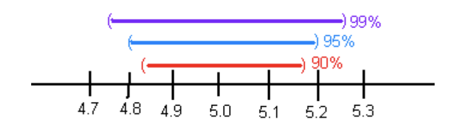

---
output:
  word_document: default
  pdf_document: default
  html_document: default
---
```{r setup8, include=FALSE, warning=FALSE}
library("mosaic")
library("NHANES")
```

# Estimation

In hypothesis tests, the purpose was to make a decision about a parameter, in terms of it being greater than, less than, or not equal to a value. But what if you want to actually know what the parameter is. You need to do estimation. There are two types of estimation -- point estimator and confidence interval. The American Statistical Association (ASA) is recommending that confidence intervals are the process that should be followed when analyzing data.

## Basics of Confidence Intervals

A point estimator is just the statistic that you have calculated previously. As an example, when you wanted to estimate the population mean, $\mu$, the point estimator is the sample mean, $\bar{x}$. To estimate the population proportion, *p*, you use the sample proportion, $\hat{p}$. In general, if you want to estimate any population parameter, we will call it $\theta$, you use the sample statistic, $\hat{\theta}$.

Point estimators are really easy to find, but they have some drawbacks. First, if you have a large sample size, then the estimate is better. But with a point estimator, you don't know what the sample size is. Also, you don't know how accurate the estimate is. Both of these problems are solved with a confidence interval.

**Confidence interval:** This is where you have an interval surrounding your parameter, and the interval has a chance of being a true statement. In general, a confidence interval looks like: $\hat{\theta}\pm E$, where $\hat{\theta}$ is the point estimator and *E* is the margin of error term that is added and subtracted from the point estimator. Thus making an interval.

**Interpreting a confidence interval: **

The statistical interpretation is that the confidence interval has a probability $C=(1-\alpha)$ (where $\alpha$ is the complement of the confidence level) of containing the population parameter. As an example, if you have a 95% confidence interval of $0.65 < p < 0.73$, then you would say, "you are 95% confident that the interval 0.65 to 0.73 contains the true population proportion." This means that if you have 100 intervals, 95 of them will contain the true proportion, and 5 will not. The wrong interpretation is that there is a 95% confidence that the true value of *p* will fall between 0.65 and 0.73. The reason that this interpretation is wrong is that the true value is fixed out there somewhere. You are trying to capture it with this interval. So this is the chance that your interval captures it, and not that the true value falls in the interval.

There is also a real world interpretation that depends on the situation. It is where you are telling people what numbers you found the parameter to lie between. So your real world is where you tell what values your parameter is between. There is no probability attached to this statement. That probability is in the statistical interpretation.

The common probabilities used for confidence intervals are 90%, 95%, and 99%. These are known as the confidence level. The confidence level and the alpha level are related. If you are conducting a hypothesis test with $H_a:\mu\ne \mu_o$, then the confidence level is $C=1-\alpha$. This is because the $\alpha$ is both tails and the confidence level is area between the two tails. As an example, for a hypothesis test $H_a:\mu\ne \mu_o$ with $\alpha$ equal to 0.10, the confidence level would be 0.90 or 90%. If you have a hypothesis test with $H_a:\mu<\mu_o$, then your $\alpha$ is only one tail of the curve. Because of symmetry the other tail is also $\alpha$. You have $2\alpha$ with both tails. So the confidence level, which is the area between the two tails, is $C-2\alpha$.

### Example: Stating the Statistical and Real World Interpretations for a Confidence Interval

a. Suppose you have a 95% confidence interval for the mean age a woman gets married in 2013 is $26<\mu<28$. State the statistical and real world interpretations of this statement.

**Solution:**

 Statistical Interpretation: You are 95% confident that the interval contains the mean age in 2013 that a woman gets married.

 Real World Interpretation: The mean age that a woman married in 2013 is between 26 and 28 years of age.

b. Suppose a 99% confidence interval for the proportion of Americans who have tried marijuana as of 2013 is $0.35<p<0.41$. State the statistical and real world interpretations of this statement.

**Solution:**

 Statistical Interpretation: You are 99% confident that the interval contains the proportion of Americans who have tried marijuana as of 2013.

 Real World Interpretation: The proportion of Americans who have tried marijuana as of 2013 is between 0.35 and 0.41.

One last thing to know about confidence is how the sample size and confidence level affect how wide the interval is. The following discussion demonstrates what happens to the width of the interval as you get more confident.

Think about shooting an arrow into the target. Suppose you are really good at that and that you have a 90% chance of hitting the bull's eye. Now the bull's eye is very small. Since you hit the bull's eye
approximately 90% of the time, then you probably hit inside the next ring out 95% of the time. You have a better chance of doing this, but the circle is bigger. You probably have a 99% chance of hitting the target, but that is a much bigger circle to hit. You can see, as your confidence in hitting the target increases, the circle you hit gets bigger. The same is true for confidence intervals. This is demonstrated in figure \#8.1.1.

```{r, include=FALSE, fig.alt="Graph showing that 90% confident interval is narrower than a 95% confident interval, which is narrower than a 99% confidence interval"}

```


The higher level of confidence makes a wider interval. There's a trade off between width and confidence level. You can be really confident about your answer but your answer will not be very precise. Or you can have a precise answer (small margin of error) but not be very confident about your answer.

Now look at how the sample size affects the size of the interval. Suppose figure \#8.1.2 represents confidence intervals calculated on a 95% interval. A larger sample size from a representative sample makes the width of the interval narrower. This makes sense. Large samples are closer to the true population so the point estimate is pretty close to the true value.

```{r, include=FALSE, fig.alt="Graph showing that a confident interval created with a sample size of 30 is wider than a confident interval created with a sample size of 100, which is wider than a confidence interval created with a sample size of 1000."}

```


Now you know everything you need to know about confidence intervals except for the actual formula. The formula depends on which parameter you are trying to estimate. With different situations you will be given the confidence interval for that parameter.

### Homework

 1.  Suppose you compute a confidence interval with a sample size of 25. What will happen to the confidence interval if the sample size increases to 50?

 2.  Suppose you compute a 95% confidence interval. What will happen to the confidence interval if you increase the confidence level to 99%?

 3.  Suppose you compute a 95% confidence interval. What will happen to the confidence interval if you decrease the confidence level to 90%?

4.  Suppose you compute a confidence interval with a sample size of 100. What will happen to the confidence interval if the sample size decreases to 80?

5.  A 95% confidence interval is $6353km< \mu<6384km$, where $\mu$ is the mean diameter of the Earth. State the statistical interpretation.

6.  A 95% confidence interval is $6353 km < \mu < 6384 km$, where $\mu$ is the mean diameter of the Earth. State the real world interpretation.

7.  In 2013, Gallup conducted a poll and found a 95% confidence interval of $0.52 < p < 0.60$, where *p* is the proportion of Americans who believe it is the government's responsibility for health care. Give the real world interpretation.

8.  In 2013, Gallup conducted a poll and found a 95% confidence interval of $0.52 < p < 0.60$, where *p* is the proportion of Americans who believe it is the government's responsibility for health care. Give the statistical interpretation.

**\ 
**

## One-Sample Interval for the Proportion

Suppose you want to estimate the population proportion, *p*. As an example you may be curious what proportion of students at your school smoke. Or you could wonder what is the proportion of accidents caused by teenage drivers who do not have a drivers' education class. 

**Confidence Interval for One Population Proportion (1-Prop Interval)**

1.  State the random variable and the parameter in words.

 *x* = number of successes

 *p* = proportion of successes

2.  State and check the assumptions for the confidence interval

a.  A simple random sample of size *n* is taken.

b.  The condition for the binomial distribution are satisfied

  c.  The sampling distribution of $\hat{p}$ can be approximated by a normal distributed. To determine the sampling distribution of $\hat{p}$ is normally distributed, you need to show that $n*\hat{p}\ge5$ and , $n*\hat{q}\ge5$ where $\hat{q}=1-\hat{p}$. If this requirement is true, then the sampling distribution of $\hat{p}$ is well approximated by a normal curve. (In reality this is not really true, since the correct assumption deals with *p*. However, in a confidence interval you do not know *p*, so you must use $\hat{p}$.)

3.  Find the sample statistic and the confidence interval

This will be conducted using R Studio. The command is 

```r
prop.test(r, n, conf.Level=C as a decimal)
```


4.  Statistical Interpretation: In general this looks like, "you are C% confident that $\hat{p}\pm E$ contains the true proportion."

5.  Real World Interpretation: This is where you state what interval contains the true proportion.

### Example: Confidence Interval for the Population Proportion

A concern was raised in Australia that the percentage of deaths of Aboriginal prisoners was higher than the percent of deaths of non-Aboriginal prisoners, which is 0.27%. A sample of six years (1990-1995) of data was collected, and it was found that out of 14,495 Aboriginal prisoners, 51 died (\"Indigenous deaths in,\" 1996). Find a 95% confidence interval for the proportion of Aboriginal prisoners who died.

 **Solution:**

1.  State the random variable and the parameter in words.

 *x* = number of Aboriginal prisoners who die

 *p* = proportion of Aboriginal prisoners who die

2.  State and check the assumptions for the confidence interval

a.  A simple random sample of 14,495 Aboriginal prisoners was taken. Check: The sample was not a random sample, since it was data from six years. It is the numbers for all prisoners in these six years, but the six years were not picked at random. Unless there was something special about the six years that were chosen, the sample is probably a representative sample. This assumption is probably met.

b.  The properties of the binomial experiment have been met. Check: There are 14,495 prisoners in this case. The prisoners are all Aboriginals, so you are not mixing Aboriginal with non-Aboriginal prisoners. There are only two outcomes, either the prisoner dies or doesn't. The chance that one prisoner dies over another may not be constant, but if you consider all prisoners the same, then it may be close to the same probability. Thus the properties of the binomial experiment are satisfied

c.  The sampling distribution of $\hat{p}$ can be approximated with a normal distribution. Check: $\hat{p}*n=\frac{51}{14495}*14495=51\ge5$ and $\hat{q}*n=\frac{14495-51}{14495}*14495=14444\ge5$. The sampling distribution of $\hat{p}$ can be approximated with a normal distribution.

3.  Find the sample statistic and the confidence interval

The command in R Studio for a confidence interval for a proportion is 

```{r prop-test8}
prop.test(51,14495, conf.level = 0.95)
```

 the 95% confidence level is $0.002647440<p<0.004661881$.

4.  Statistical Interpretation: You are 95% confident that the interval $0.0026<p<0.0047$ contains the proportion of Aboriginal prisoners who have died in prison.

5.  Real World Interpretation: The proportion of Aboriginal prisoners who died in prison is between 0.26% and 0.47%.

### Example: Confidence Interval for the Population Proportion

A researcher who is studying the effects of income levels on breastfeeding of infants hypothesizes that countries with a low income level have a different rate of infant breastfeeding than higher income countries. It is known that in Germany, considered a high-income country by the World Bank, 22% of all babies are breastfeed. In Tajikistan, considered a low-income country by the World Bank, researchers found that in a random sample of 500 new mothers that 125 were breastfeeding their infant. Find a 90% confidence interval of the proportion of mothers in low-income countries who breastfeed their infants?

 **Solution:**

1.  State you random variable and the parameter in words.

 *x* = number of woman who breastfeed in a low-income country

 *p* = proportion of woman who breastfeed in a low-income country

2.  State and check the assumptions for the confidence interval

a.  A simple random sample of 500 breastfeeding habits of woman in a low-income country was taken. Check: This was stated in the problem.

b.  The properties of a Binomial Experiment have been met. check: There were 500 women in the study. The women are considered identical, though they probably have some differences. There are only two outcomes, either the woman breastfeeds or she doesn't. The probability of a woman breastfeeding is probably not the same for each woman, but it is probably not very different for each woman. The conditions for the binomial distribution are satisfied

c.  The sampling distribution of $\hat{p}$ can be approximated with a normal distributed. Check:$n*\hat{p}= 500*\frac{125}{500}=125\ge5$ and $n*\hat{q}=500*\frac{500-125}{500}=375\ge5$, so the sampling distribution of $\hat{p}$ is well approximated by a normal distribution.

4.  Find the sample statistic and confidence interval

On R studio, use the following command

```{r prop-test8a}
prop.test(125, 500, conf.level = .90)
```
 90% confidence interval for p is $0.2185980<p<0.2841772$.

4.  Statistical Interpretation: You are 90% confident that $0.2185980<p<0.2841772$ contains the     proportion of women in low-income countries who breastfeed their infants.

5.  Real World Interpretation: The proportion of women in low-income countries who breastfeed their infants is between 0.219 and 0.284.

### Homework

**In each problem show all steps of the confidence interval. If some of the assumptions are not met, note that the results of the interval may not be correct and then continue the process of the confidence interval.**

1.  The Arizona Republic/Morrison/Cronkite News poll published on Monday, October 20, 2016, found 390 of the registered voters surveyed favor Proposition 205, which would legalize marijuana for adults. The statewide telephone poll surveyed 779 registered voters between Oct. 10 and Oct. 15. (Sanchez, 2016) Find a 99% confidence interval for the proportion of Arizona's who supported legalizing marijuana for adults.

2.  In November of 1997, Australians were asked if they thought unemployment would increase. At that time 284 out of 631 said that they thought unemployment would increase (\"Morgan gallup poll,\"     2013). Estimate the proportion of Australians in November 1997 who believed unemployment would increase using a 95% confidence interval?

3.  According to the February 2008 Federal Trade Commission report on consumer fraud and identity theft, Arkansas had 1,601 complaints of identity theft out of 3,482 consumer complaints (\"Consumer fraud and,\" 2008). Calculate a 90% confidence interval for the proportion of identity theft in Arkansas.

4.  According to the February 2008 Federal Trade Commission report on consumer fraud and identity theft, Alaska had 321 complaints of identity theft out of 1,432 consumer complaints (\"Consumer fraud and,\" 2008). Calculate a 90% confidence interval for the proportion of identity theft in Alaska.

5.  In 2013, the Gallup poll asked 1,039 American adults if they believe there was a conspiracy in the assassination of President Kennedy, and found that 634 believe there was a conspiracy (\"Gallup news service,\" 2013). Estimate the proportion of American's who believe in this conspiracy using a 98% confidence interval.

6.  In 2008, there were 507 children in Arizona out of 32,601 who were diagnosed with Autism Spectrum Disorder (ASD) (\"Autism and developmental,\" 2008). Find the proportion of ASD in Arizona with a     confidence level of 99%.

**\
**

## One-Sample Interval for the Mean

Suppose you want to estimate the mean height of Americans, or you want to estimate the mean salary of college graduates. A confidence interval for the mean would be the way to estimate these means.

**Confidence Interval for One Population Mean (t-Interval)**

1.  State the random variable and the parameter in words.

 x = random variable

 $\mu$ = mean of random variable

2.  State and check the assumptions for the confidence interval

a.  A random sample of size *n* is taken.

b.  The population of the random variable is normally distributed, though the t-test is fairly robust to the assumption if the sample size is large. This means that if this assumption isn't met, but your sample size is quite large, then the results of the t-test are valid.

3.  Find the sample statistic and confidence interval

Use R Studio to find the confidence interval. The command is 

```r
t.test(~variable, data= Data Frame, conf.level=C as a decimal)
```


 4.  Statistical Interpretation: In general this looks like, "You are C% confident that the interval contains the true mean."

5.  Real World Interpretation: This is where you state what interval contains the true mean. 

**How to check the assumptions of confidence interval:**

In order for the confidence interval to be valid, the assumptions of the test must be true. Whenever you run a confidence interval, you must make sure the assumptions are true. You need to check them. Here is how you do this:

1.  For the assumption that the sample is a random sample, describe how you took the sample. Make sure your sampling technique is random.

2.  For the assumption that population is normal, remember the process of assessing normality from chapter 6.

### Example: Confidence Interval for the Population Mean

A random sample of 50 body mass index (BMI) were taken from the NHANES Data frame. Estimate the mean BMI of Americans at the 95% level.

**Table \#8.3.1: BMI of Americans**

```{r HHANES-50-sample8}
sample_NHANES_50<-
  sample_n(NHANES, size=50)
head(sample_NHANES_50)
```
 **Solution:**

1.  State the random variable and the parameter in words.

 *x* = BMI of an American

 $\mu$ = mean BMI of Americans

2.  State and check the assumptions for the confidence interval

a.  A random sample of 50 BMI levels was taken. Check: A random sample was taken from the NHANES data frame using R Studio

b.  The population of BMI levels is normally distributed. Check:

(ref:sample-NHANES8-density-cap) Density Plot of BMI from NHANES sample

```{r sample-NHANES8-density, warning=FALSE, fig.cap="(ref:sample-NHANES8-density-cap)", fig.alt="Density plot of BMI. Looks somewhat skewed right"}
gf_density(~BMI, data=sample_NHANES_50, title="BMI of an American")
```

(ref:sample-NHANES8-qq-cap) Normal Quantile Plot of BMI from NHANES sample

```{r sample-NHANES8-qq, warning=FALSE, fig.cap="(ref:sample-NHANES8-qq-cap)", fig.alt="Normal quantile plot of BMI. Looks somewhat linear"}
gf_qq(~BMI, data=sample_NHANES_50, title="BMI of an American")
```


The density plot looks somewhat skewed right and the normal quantile plot looks somewhat linear. However, there doesn't seem to be strong evidence that the sample comes from a population that is normally distributed. However, since the sample is moderate to large, the t-test is robust to this assumption not being met. So the results of the test are probably valid.

4.  Find the sample statistic and confidence interval
 
 On R Studio, the command would be

```{r t-test8}
t.test(~BMI, data= sample_NHANES_50, conf.level=0.95)
```
 The sample statistic is the mean of x in the output, and confidence interval is under the words 95 percent confidence interval.

4.  Statistical Interpretation: You are 95% confident that $24.87190<\mu<28.71422$ contains the mean BMI of Americans.

5.  Real World Interpretation: The mean BMI of Americans is between 24.87 and 28.71 $kg/m^2$.

Notice that in example \#7.3.2, you were asked if the mean BMI of Americans was different from Australians' mean BMI of 27.2 $kg/m^2$. The interval that example \#8.3.1 calculated does contain the value of 27.2. So you can't say that Americans' mean BMI and Australians' mean BMI are different.This means that you can just use confidence intervals and not conduct hypothesis tests at all if you prefer. 

### Example: Confidence Interval for the Population Mean

The data in table \#8.3.2 are the life expectancies for all people in European countries (\"WHO life expectancy,\" 2013). Table \#8.3.3 filtered the data frame for just males and just year 2000. The year 2000 was randomly chosen as the year to use. Estimate the mean life expectancy for a man in Europe at the 99% level.

**Table \#8.3.2: Life Expectancies for European Countries**

```{r expactancy8-data}
Expectancy<-read.csv(
  "https://krkozak.github.io/MAT160/Life_expectancy_Europe.csv")
head(Expectancy)
```

**Table \#8.3.3: Life Expectancies of males in European Countries in 2000**

```{r expecantacy8-male-data}
Expectancy_male<-
  Expectancy%>%
  filter(sex=="Male", year=="2000")
head(Expectancy_male)
```
**Code book for data frame Expectancy** See example 7.3.3 in Section 7.3

**Solution:**

1.  State the random variable and the parameter in words.

 *x* = life expectancy for a European man

 $\mu$ = mean life expectancy for European men

2.  State and check the assumptions for the confidence interval

a.  A random sample of 53 life expectancies of European men in 2000 was taken. Check: The data is actually all of the life expectancies for every country that is considered part of Europe by the World Health Organization in the year 2000. Since the year 2000 was picked at random, then the sample is a random sample.

b.  The distribution of life expectancies of European men in 2000 is normally distributed. Check:

(ref:expectancy-male8-density-cap) Density Plot of Life Expectancies of Males in Europe in 2000

```{r expectancy-male8-density, fig.cap="(ref:expactancy-male8-density-cap)", fig.alt="Density plot of life expectancy of a male. Looks skewed left"}
gf_density(~expect, data=Expectancy_male, title="Life Expectancy of a male")
```

(ref:expectancy-male8-qq-cap) Normal Quntile Plot of Life Expectancies of Males in Europe in 2000

```{r expectancy-male8-qq, fig.cap="(ref:expectancy-male8-qq-cap)", fig.alt="Normal quantile plot of life expectancy of a male. Does not looks linear."}
gf_qq(~expect, data=Expectancy_male, title="Male Life Expectancy")
```

 This sample does not appear to come from a population that is normally distributed. This sample is moderate to large, so it is good that the t-test is robust.

3.  Find the sample statistic and confidence interval
 
 On R Studio, the command would be


```{r t-test8b}
t.test(~expect, data=Expectancy_male, conf.level=0.99)
```

 Sample statistic is 70.68 years, and the confidence interval is $68.60071<\mu<72.75778$. 

4.  Statistical Interpretation: You are 99% confident that $68.60071<\mu<72.75778$ contains the mean life expectancy of European men.

5.  Real World Interpretation: The mean life expectancy of European men is between 68.60 and 72.76 years.

### Homework

** In each problem show all steps of the confidence interval. If some of the assumptions are not met, note that the results of the interval may not be correct and then continue the process of the confidence interval.**

 1.  The Kyoto Protocol was signed in 1997, and required countries to start reducing their carbon emissions. The protocol became enforceable in February 2005. Table 8.3.4 contains a random sample of CO2 emissions in 2010 (CO2 emissions (metric tons per capita), 2018). Find a 99% confidence interval for the mean CO-2 emissions in 2010.

**Table \#8.3.4: CO2 Emissions (in metric tons per capita) in 2010**

```{r emission8-data}
Emission <- read.csv(
  "https://krkozak.github.io/MAT160/CO2_emission.csv")
head(Emission)
```
**Code book for data frame Emission** See Homework problem 7.3.1 in section 7.3

2.  The amount of sugar in a Krispy Kream glazed donut is 10 g. Many people feel that cereal is a healthier alternative for children over glazed donuts. Table \#8.3.5 contains the amount of sugar in a sample of cereal that is geared towards children (breakfast cereal, 2019). Estimate the mean amount of sugar in children's cereal at the 95% confidence level.

 **Table \#8.3.5: Nutrition Amounts in Cereal**

```{r sugar8-data}
Sugar <- read.csv(
  "https://krkozak.github.io/MAT160/cereal.csv")
head(Sugar)
```
**Code book for data frame Sugar** See Homework problem 7.3.2 in section 7.3

A new data frame will need to be created of just cereal for children. To create that use the following command in R Studio

**Table \#8.3.6: Nutrition Amounts in Children's Cereal**

```{r sugar8-children-data}
Sugar_chidren<-
Sugar%>%
  filter(age=="child")
head(Sugar_chidren)
```

3.  The FDA regulates that fish that is consumed is allowed to contain 1.0 mg/kg of mercury. In Florida, bass fish were collected in 53 different lakes to measure the health of the lakes. The data frame of measurements from Florida lakes is in table \#8.3.7 (NISER 081107 ID Data, 2019). Calculate with 90% confidence the mean amount of mercury in fish in Florida lakes. Is there too much mercury in the fish in Florida?

 **Table \#8.3.7: Health of Florida lake Fish**

```{r mercury8-data}
Mercury<- read.csv(
  "https://krkozak.github.io/MAT160/mercury.csv")
head(Mercury)
```
**Code book for data frame Mercury** See Homework problem 7.3.3 in section 7.3

 4.  The data frame Pulse (Table 8.3.8) contains various variables about a person including their pulse rates before the subject exercised and after the subject ran in place for one minute. Estimate the mean pulse rate of females who do drink alcohol with a 95% level of confidence? 

 **Table \#8.3.8: Pulse Rates Pulse Rates of people Before and After Exercise**

```{r pulse8-data}
Pulse<-read.csv(
  "https://krkozak.github.io/MAT160/pulse.csv")
head(Pulse)
```

**Code book for data frame Pulse**, see homework problem 3.2.5 in section 3.2

To create a new data frame with just females who drink alcohol use the following command, where the new name is Females:
 **Table \#8.3.9: Pulse Rates Pulse Rates of people Before and After Exercise**

```{r female-pulse8-data}
Females<-
Pulse%>%
  filter(gender=="female", alcohol=="yes")
head(Females)
```

5.  The economic dynamism is an index of productive growth in dollars. Economic data for many countries are in table \#8.3.10 (SOCR Data 2008 World CountriesRankings, 2019).  

 **Table \#8.3.10: Economic Data for Countries**

```{r economic8-data}
Economics <- read.csv(
  "https://krkozak.github.io/MAT160/Economics_country.csv")
head(Economics)
```
**Code book for data frame Economics** See Homework problem 7.3.5 in section 7.3

Create a data frame that contains only middle income countries. Find a 95% confidence interval for the mean econimic dynamism for middle income countries. To create a new data frame with just middle income countries use the following command, where the new name is Middle_economics:
 **Table \#8.3.11: Economic Data for Middle income Countries**

```{r middle-economic8-data}
Middle_economics<-
Economics%>%
  filter(incGroup=="Middle")
head(Middle_economics)
```

6.  Table \#8.3.12 contains the percentage of woman receiving prenatal care in a sample of countries over several years. (births per woman), 2019). Estimate the average percentage of women receiving prenatal care in 2009 (p2009) with a 95% confidence interval? 

 **Table \#8.3.12: Data of Prenatal Care versus Health Expenditure**

```{r fert-prenatal8-data}
Fert_prenatal<- read.csv(
  "https://krkozak.github.io/MAT160/fertility_prenatal.csv")
head(Fert_prenatal)
```
**Code book for Data frame Fert_prenatal** See Problem 2.3.4 in Section 2.3 homework

7.  Maintaining your balance may get harder as you grow older. A study was conducted to see how steady the elderly is on their feet. They had the subjects stand on a force platform and have them react to a noise. The force platform then measured how much they swayed forward and backward, and the data is in table \#8.3.13 (Maintaining Balance while Concentrating, 2019). Find the mean forward/backward sway of elderly person? Use a 95% confidence level. Follow the filtering methods in other homework problems to create a data frame for only Elderly.

 **Table \#8.3.13: Sway (in mm) of Elderly Subjects**

```{r sway8-data}
Sway <- read.csv(
  "https://krkozak.github.io/MAT160/sway.csv")
head(Sway)
```
**Code book for data frame Sway** See Homework problem 7.3.7 in section 7.3

**\
**

Data Sources:

Australian Human Rights Commission, (1996). *Indigenous deaths in
custody 1989 - 1996*. Retrieved from website:
<http://www.humanrights.gov.au/publications/indigenous-deaths-custody>

*CDC features - new data on autism spectrum disorders*. (2013, November
26). Retrieved from <http://www.cdc.gov/features/countingautism/>

Center for Disease Control and Prevention, Prevalence of Autism Spectrum
Disorders - Autism and Developmental Disabilities Monitoring Network.
(2008). *Autism and developmental disabilities monitoring network-2012*.
Retrieved from website:
<http://www.cdc.gov/ncbddd/autism/documents/ADDM-2012-Community-Report.pdf>

Federal Trade Commission, (2008). *Consumer fraud and identity theft
complaint data: January-December 2007*. Retrieved from website:
<http://www.ftc.gov/opa/2008/02/fraud.pdf>

Sanchez, Y. W. (2016, October 20). Poll: Arizona voters still favor legalizing marijuana. Retrieved from https://www.azcentral.com/story/news/politics/elections/2016/10/20/poll-arizona-marijuana-legalization-proposition-205/92417690/

http://apps.who.int/gho/athena/data/download.xsl?format=xml&target=GHO/WHOSIS_000001&profile=excel&filter=COUNTRY:*;SEX:*;REGION:EUR

CO2 emissions (metric tons per capita). (n.d.). Retrieved July 18, 2019, from https://data.worldbank.org/indicator/EN.ATM.CO2E.PC

(n.d.). Retrieved July 18, 2019, from https://www.idvbook.com/teaching-aid/data-sets/the-breakfast-cereal-data-set/
The Best Kids' Cereal. (n.d.). Retrieved July 18, 2019, from https://www.ranker.com/list/best-kids-cereal/ranker-food

Lange TL, Royals HE, Connor LL (1993) Influence of water chemistry on mercury concentration in largemouth bass from Florida lakes. Trans Am Fish Soc 122:74-84.
Michael K. Saiki, Darell G. Slotton, Thomas W. May, Shaun M. Ayers, and Charles N. Alpers (2000) Summary of Total Mercury Concentrations in Fillets of Selected Sport Fishes Collected during 2000–2003 from Lake Natoma, Sacramento County, California (Raw data is included in appendix), U.S. Geological Survey Data Series 103, 1-21.
NISER 081107 ID Data. (n.d.). Retrieved July 18, 2019, from http://wiki.stat.ucla.edu/socr/index.php/NISER_081107_ID_Data

SOCR Data 2008 World CountriesRankings. (n.d.). Retrieved July 19, 2019, from http://wiki.stat.ucla.edu/socr/index.php/SOCR_Data_2008_World_CountriesRankings#SOCR_Data_-_Ranking_of_the_top_100_Countries_based_on_Political.2C_Economic.2C_Health.2C_and_Quality-of-Life_Factors

Maintaining Balance while Concentrating. (n.d.). Retrieved July 19, 2019, from http://www.statsci.org/data/general/balaconc.html
