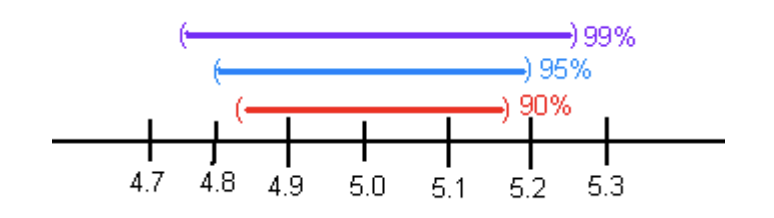
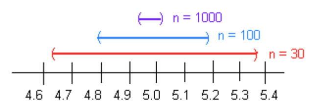

--- 
title: "Statistics Using Technology"
author: "Kathryn Kozak"
date: "`r Sys.Date()`"
output:
  word_document: default
  pdf_document: default
description: An introductory statistics textbook.
documentclass: book
link-citations: yes
bibliography: book.bib
site: bookdown::bookdown_site
subtitle: Third Edition
biblio-style: apalike
---
```{r include=FALSE, cache=FALSE}
library("dplyr")
filter <- dplyr::filter #because stats masks dplyr
```

# Preface {-}

I hope you find this book useful in teaching statistics.  When writing this book, I tried to follow the GAISE Standards (GAISE recommendations. (2014, January 05). Retrieved from http://www.amstat.org/education/gaise/GAISECollege_Recommendations.pdf

* Teach statistical thinking.
* Focus on conceptual understanding.
* Integrate real data with a context and a purpose.
* Foster active learning.
* Use technology to explore concepts and analyze data.
* Use assessments to improve and evaluate student learning

To this end, I ask students to interpret the results of their calculations.  I incorporated the use of technology (RStudio) for most calculations.  Because of that you will not find me using any of the computational formulas for standard deviations or correlation and regression since I prefer students understand the concept of these quantities.  Also, because I utilize technology you will not find the standard normal table, Student’s t-table, binomial table, chi-square distribution table, and F-distribution table in the book. Another difference between this book and other statistics books is the order of hypothesis testing and confidence intervals.  Most books present confidence intervals first and then hypothesis tests.  I find that presenting hypothesis testing first and then confidence intervals is more understandable for students.  Lastly, I have de-emphasized the use of the z-test.  In fact, I only use it to introduce hypothesis testing, and never utilize it again. Two samples should be emphasized over one sample test. Lastly, to aid student understanding and interest, most of the homework and examples utilize real data with multiple variables. The beauty of multiple variables, is that you can ask the students to investigate different analysis with different variables. This way students can work with data and come up with connections of asking questions and using data to answer the questions.  Again, I hope you find this book useful for your introductory statistics class.

I want to make a comment about the mathematical knowledge that I assumed the students possess.  The course for which I wrote this book has a higher prerequisite than most introductory statistics books.  However, I do feel that students can read and understand this book as long as they can read critically.  I do not show how to create most of the graphs, but all graphs are created with RStudio.  So I hope the mathematical level is appropriate for your course.

The technology that I utilized for creating the graphs and statistical analysis is RStudio. This is a statistical software that are used by statisticians and so using it gives students skills they may need in the future.  Please feel free to use any other technology that is more appropriate for your students.  Do make sure that you use some technology.

## Acknowledgments:

I would like to thank the following people for taking their valuable time to review the book.  Their comments and insights improved this book immensely.

- Daniel Kaplan, Macalester College
- Jane Tanner, Onondaga Community College
- Rob Farinelli, College of Southern Maryland
- Carrie Kinnison, retired engineer
- Sean Simpson, Westchester Community College
- Kim Sonier, Coconino Community College
- Jim Ham, Delta College 
- David Straayer, Tacoma Community College
- Kendra Feinstein, Tacoma Community College
- Students of Coconino Community College
- Students of Tacoma Community College

I also want to thank Coconino Community College for granting me a sabbatical so that I would have the time to write the book. Thank you to the StatPREP grant for providing me with the knowledge of new advancements in statisical thinking.

On a personal note, I wanted to thank my brother, John Matic, his wife Jenelle, and their children Hannah and Eli for their hospitality when writing the first edition. In addition to allowing my family access to their home, John provided numerous examples and data sets for business applications in this book. I inadvertently left this thank you out of the first edition of the book, and for that I apologize. His help and his family’s hospitality were invaluable to me.

Lastly, I want to thank my husband Rich and my son Dylan for supporting me in this project.  Without their love and support, I would not have been able to complete the book.


## New to the Third Edition:

The additions to this edition mostly involve adding the commands to create graphs, compute descriptive statistics, finding probabilities, and computing inferential analysis using the open source software RStudio, and the removal of all other technologies. Data Frames with multiple variables and multiple units of measurements were expanded to most of the data. This is to make the course more data-centric. Lastly, minor explanations were made and corrections were made where necessary.

## Packages needed for RStudio:

You will need the following packages installed and loaded in RStudio: arm, mosaic, MASS, Weighted.Desc.Stat.

## Creative commons license:

Creative Commons Attribution Sharealike. 

2020 Kathryn Kozak

ISBN:  978-0-359-84204-9


<!--chapter:end:index.Rmd-->

```{r include=FALSE, cache=FALSE}
library("dplyr")
filter <- dplyr::filter #because stats masks dplyr
```
# Statistical Basics


```{r setup, include=FALSE}
knitr::opts_chunk$set(echo = TRUE)
library("mosaic")
library("latexpdf")
library("MASS")
```

You are exposed to statistics regularly. If you are a sports fan, then you have the statistics for your favorite player. If you are interested in politics, then you look at the polls to see how people feel about certain issues or candidates. If you are an environmentalist, then you research arsenic levels in the water of a town or analyze the global temperatures. If you are in the business profession, then you may track the monthly sales of a store or use quality control processes to monitor the number of defective parts manufactured. If you are in the health profession, then you may look at how successful a procedure is or the percentage of people infected with a disease. There are many other examples from other areas. To understand how to collect data and analyze it, you need to understand what the field of statistics is and the basic definitions.

## What is Statistics?

**Statistics** is the study of how to collect, organize, analyze, and interpret data collected from a group.

There are two branches of statistics. One is called descriptive statistics, which is where you collect and organize data. The other is called inferential statistics, which is where you analyze and interpret data. First you need to look at descriptive statistics since you will use the descriptive statistics when making inferences.

To understand how to create descriptive statistics and then conduct inferences, there are a few definitions that you need to look at. Note, many of the words that are defined have common definitions that are used in non-statistical terminology. In statistics, some have slightly different definitions. It is important that you notice the difference and utilize the statistical definitions.

The first thing to decide in a statistical study is whom you want to measure and what you want to measure. You always want to make sure that you can answer the question of whom you measured and what you measured. The who is known as the unit of observation and the what is the variable(s).

**Unit of observation** -- a person or object that you are interested in finding out information about.

**Variable** -- the measurement or observation of the unit of observation

Having the unit of observation and the variables is part of picture of a **data set** or **data frame**. To make a data set or data frame into what is called tidy data, it should be organized in a way that each row of the data frame is a unit of observation, and the variables should be well defined and are easily identified.  An example of a data frame that is tidy data is:

```{r dataframe-example}
Sugar <- read.csv(
        "https://krkozak.github.io/MAT160/sugar.csv")
options(width = 60)
head(Sugar) 
```

The head command displays the variables and the first few lines of units of observations.

Collecting multiple variables from one unit of observation makes sense. If you wanted to figure out the diameter of breast height of Ponderosa Pine trees in the Coconino National Forest, you need to physically measure a bunch of trees. While you are measuring the diameter, you might also want to measure the height of the tree, if the tree has a bark beetle infestation, the estimated age of the tree, the color of the bark, and how many branches it has. You may only want to estimate the average diameter at breast height, but now you have the ability to estimate other quantities too. No sense walking all over the forest and only measure one thing. 

A large data frame is one that has at least 5 variables and at least 1000 units of observations. If a data frame only has 3 variables and 500 rows, that doesn't make it not usable. The 1000 units of observation and 5 variables is just a guideline to work with. 

If you put the unit of observation and the variable into one statement, then you obtain a population.

**Population** -- set of all values of the variable for the entire group of units of observations

Notice, the population answers who you want to measure and what you want to measure. Make sure that your population always answers both of these questions. If it doesn't, then you haven't given someone who is reading your study the entire picture. As an example, if you just say that you are going to collect data from the senators in the U.S. Congress, you haven't told your reader want you are going to collect. Do you want to know their income, their highest degree earned, their voting record, their age, their political party, their gender, their marital status, or how they feel about a particular issue? Without telling what you want to measure, your reader has no idea what your study is actually about.

Sometimes the population is very easy to collect. Such as if you are interested in finding the average age of all of the current senators in the U.S. Congress, there are only 100 senators. This wouldn't be hard to find. However, if instead you were interested in knowing the average age that a senator in the U.S. Congress first took office for all senators that ever served in the U.S. Congress, then this would be a bit more work. It is still doable, but it would take a bit of time to collect. But what if you are interested in finding the average diameter of breast height of all of the Ponderosa Pine trees in the Coconino National Forest? This would be impossible to actually collect. What do you do in these cases? Instead of collecting the entire population, you take a smaller group of the population, kind of a snap shot of the population. This smaller group is called a sample.

**Sample** -- a subset from the population. It looks just like the population, but contains less data.

In today of big data, there is some confusion between really large data frames and populations. The population is a theoretical concept and even if you have a very large data frame, that doesn't mean you have the population. Most populations are not actually able to be collected. They are considered an ideal that you are trying to make decisions about.

How you collect your sample can determine how accurate the results of your study are. There are many ways to collect samples. Some of them create better samples than others. No sampling method is perfect, but some are better than others. Sampling techniques will be discussed later. For now, realize that every time you take a sample you will find different data values. The sample is a snapshot of the population, and there is more information than is in the picture. The idea is to try to collect a sample that gives you an accurate picture, but you will never know for sure if your picture is the correct picture. Unlike previous mathematics classes where there was always one right answer, in statistics there can be many answers, and you don't know which are right.

Once you have your data frame, either from a population or a sample, you need to know how you want to summarize the data. As an example, suppose you are interested in finding the proportion of people who like a candidate, the average height a plant grows to using a new fertilizer, or the variability of the test scores. Understanding how you want to summarize the data helps to determine the type of data you want to collect. Since the population is what we are interested in, then you want to calculate a number from the population. This is known as a parameter. As mentioned already, you can't really collect the entire population. Even though this is the number you are interested in, you can't really calculate it. Instead you use a number calculated from the sample, called a statistic, to estimate the parameter. Since no sample is exactly the same, the statistic values are going to be different from sample to sample. They estimate the value of the parameter, but again, you do not know for sure if your answer is correct.

**Parameter** -- a number calculated from the population. Usually denoted with a Greek letter. This number is a fixed, unknown number that you want to find.

**Statistic** -- a number calculated from the sample. Usually denoted with letters from the Latin alphabet, though sometimes there is a Greek letter with a \^ (called a hat) above it. Since you can find samples, it is readily known, though it changes depending on the sample taken. It is used to estimate the parameter value.

One last concept to mention is that there are two different types of variables -- qualitative (categorical) and quantitative (numerical). Each type of variable has different parameters and statistics that you find. It is important to know the difference between them.

**Qualitative** **or categorical variable** -- answer is a word or name that describes a quality of the unit of observation

**Quantitative or** **numerical variable** -- answer is a number, something that can be counted or measured from the unit of observation

### Example: Stating Definitions for Qualitative Variable**

In 2010, the Pew Research Center questioned 1500 adults in the U.S. to estimate the proportion of the population favoring marijuana use for medical purposes. It was found that 73% are in favor of using  marijuana for medical purposes. State the unit of observation, variable, population, and sample.

**Solution:**

Unit of observation -- a U.S. adult

Variable -- the response to the question "should marijuana be used for medical purposes?" This is qualitative data since you are recording a person's response -- yes or no.

Population -- set of responses of all adults in the U.S.

Sample -- set of responses of 1500 adults in the U.S.

Parameter -- proportion of all U.S. Adults who favor marijuana for medical purposes 

Statistic-- proportion of 1500 U.S. Adults who favor marijuana for medical  purposes

### Example: Stating Definitions for Qualitative Variable

A parking control officer records the manufacturer of every $5^{th}$ car in the college parking lot in order to determine the most common manufacturer. State the unit of observation, variable, population, and sample.

**Solution:**

Unit of observation -- a car in the college parking lot

Variable -- the name of the manufacturer. This is qualitative data since you are recording a car type.

Population -- set of names of the manufacturer of all cars in the college parking lot.

Sample -- set of names of the manufacturer of the a particular number of cars in college parking lot

Parameter -- proportion of each car type of all cars in the college parking lot

Statistic -- proportion of each car type a particular number of cars in the college parking lot

### Example: Stating Definitions for Quantitative Variable

A biologist wants to estimate the average height of a plant that is given a new plant food. She gives 10 plants the new plant food and measures the plant height on day 50. State the unit of observation, variable, population, and sample.

**Solution:**

Unit of observation -- a plant given the new plant food

Variable -- the height of the plant on day 50 (Note: it is not the average  height since you cannot measure an average -- it is calculated from data.) This is quantitative data since you will have a number.

Population -- set of heights on day 50 of all plants when the new plant food is used

Sample -- set of heights on day 50 of 10 plants when the new plant food is used

Parameter -- average height on day 50 of all plants when the new plant food is used

Statistic -- average height on day 50 of 10 plants when the new plant food is used

Note: in example #1.1.3, you most likely will be comparing the new plant food to an old plant food. So you would have more units of observations, but for plants given the old plant food are what you are interested in in this case. You may also want to have measurements on other days after you give the plant food. In your data frame you would need to have many variables besides just the height of the plant on day 50. Examples of variables would be plant_number, fertilizer (yes or no), height on day 20, height on day 30, height on day 50, and so forth. One other comment, you variable names should make sense to your reader, and be one word for ease in analyzing by a computer program.

### Example: Stating Definitions for Quantitative Variable

A doctor wants to see if a new treatment for cancer extends the life expectancy of a patient versus the old treatment. She gives one group of 25 cancer patients the new treatment and another group of 25 the old treatment. She then measures the life expectancy of each of the patients. State the units of observations, variables, populations, and samples.

**Solution:**

In this example there are two unit of observations, two variables, two populations, and two samples.

Unit of observation 1: cancer patient given new treatment

Unit of observation 2: cancer patient given old treatment

Variable 1: life expectancy when given new treatment. This is quantitative data since you will have a number. 

Variable 2: life expectancy when given old treatment. This is quantitative data since you will have a number.

Population 1: set of life expectancies of all cancer patients given new treatment

Population 2: set of life expectancies of all cancer patients given old treatment

Sample 1: set of life expectancies of 25 cancer patients given new treatment

Sample 2: set of life expectancies of 25 cancer patients given old treatment

Parameter 1 -- average life expectancy of all cancer patients given new treatment

Parameter 2 -- average life expectancy of all cancer patients given old treatment

Statistic 1 -- average life expectancy of 25 cancer patients given new treatment

Statistic 2 -- average life expectancy of 25 cancer patients given old treatment

There are different types of quantitative variables, called discrete or continuous. The difference is in how many values can the data have. If you can actually count the number of data values (even if you are counting to infinity), then the variable is called discrete. If it is not possible to count the number of data values, then the variable is called continuous.

**Discrete** data can only take on particular values like integers. Discrete data are usually things you count.

**Continuous** data can take on any value. Continuous data are usually things you measure.

### Example: Discrete or Continuous

Classify the quantitative variable as discrete or continuous.

a.) The weight of a cat.

**Solution:**

This is continuous since it is something you measure.

b.) The number of fleas on a cat.

**Solution:**

This is discrete since it is something you count.

c.) The size of a shoe.

**Solution:**

This is discrete since you can only be certain values, such as 7, 7.5, 8, 8.5, 9. You can't buy a 9.73 shoe.

There are also are four measurement scales for different types of data with each building on the ones below it. They are: 

 Measurement Scales:

**Nominal** -- data is just a name or category. There is no order to any data and since there are no numbers, you cannot do any arithmetic on this level of data. Examples of this are gender, car name, ethnicity, and race.

**Ordinal** -- data that is nominal, but you can now put the data in order, since one value is more or less than another value. You cannot do arithmetic on this data, but you can now put data values in order. Examples of this are grades (A, B, C, D, F), place value in a race (1st, 2nd, 3rd), and size of a drink (small, medium, large).

**Interval** -- data that is ordinal, but you can now subtract one value from another and that subtraction makes sense. You can do arithmetic on this data, but only addition and subtraction. Examples of this are temperature and time on a clock.

**Ratio** -- data that is interval, but you can now divide one value by another and that ratio makes sense. You can now do all arithmetic on this data. Examples of this are height, weight, distance, and length of time.

Nominal and ordinal data come from qualitative variables. Interval and ratio data come from quantitative variables.

Most people have a hard time deciding if the data are nominal, ordinal, interval, or ratio. First, if the variable is qualitative (words instead of numbers) then it is either nominal or ordinal. Now ask yourself if you can put the data in a particular order. If you can it is ordinal. Otherwise, it is nominal. If the variable is quantitative (numbers), then it is either interval or ratio. For ratio data, a value of 0 means there is no measurement. This is known as the absolute zero. If there is an absolute zero in the data, then it means it is ratio. If there is no absolute zero, then the data are interval. An example of an absolute zero is if you have \$0 in your bank account, then you are without money. The amount of money in your bank account is ratio data. *Word of caution*: sometimes ordinal data is displayed using numbers, such as 5 being strongly agree, and 1 being strongly disagree. These numbers are not really numbers. Instead they are used to assign numerical values to ordinal data. In reality you should not perform any computations on this data, though many people do. If there are numbers, make sure the numbers are inherent numbers, and not numbers that were assigned.

### Example: Measurement Scale

State which measurement scale each is. 

a.) Time of first class

**Solution:**

 This is interval since it is a number, but 0 o'clock means midnight and not the absence of time.

b.) Hair color

**Solution:**

 This is nominal since it is not a number, and there is no specific order for hair color.

c.) Length of time to take a test

**Solution:**

 This is ratio since it is a number, and if you take 0 minutes to take a test, it means you didn't take any time to complete it.

d.) Age groupings (baby, toddler, adolescent, teenager, adult, elderly)

**Solution:**

 This is ordinal since it is not a number, but you could put the data in order from youngest to oldest or the other way around.

### Homework Section 1.1

1.  Suppose you want to know how Arizona workers age 16 or older travel to work. To estimate the percentage of people who use the different modes of travel, you take a sample containing 500 Arizona workers age 16 or older. State the unit of observation, variable, population, sample, parameter, and statistic.

2.  You wish to estimate the mean cholesterol levels of patients two days after they had a heart attack. To estimate the mean you collect data from 28 heart patients. State the unit of observation, variable, population, sample, parameter, and statistic.

3.  Print-O-Matic would like to estimate their mean salary of all employees. To accomplish this they collect the salary of 19 employees. State the unit of observation, variable, population, sample, parameter, and statistic.

4.  To estimate the percentage of households in Connecticut which use fuel oil as a heating source, a researcher collects information from 1000 Connecticut households about what fuel is their heating source. State the unit of observation, variable, population, sample, parameter, and statistic.

5.  The U.S. Census Bureau needs to estimate the median income of males in the U.S., they collect incomes from 2500 males. State the unit of observation, variable, population, sample, parameter, and statistic.

6.  The U.S. Census Bureau needs to estimate the median income of females in the U.S., they collect incomes from 3500 females. State the unit of observation, variable, population, sample, parameter, and statistic.

7.  Eyeglassmatic manufactures eyeglasses and they would like to know the percentage of each defect type made. They review 25,891 defects and classify each defect that is made. State the unit of observation, variable, population, sample, parameter, and statistic.

8.  The World Health Organization wishes to estimate the mean density of people per square kilometer, they collect data on 56 countries. State the unit of observation, variable, population, sample, parameter, and statistic 

9.  State the measurement scale for each.

a.  Cholesterol level
b.  Defect type
c.  Time of first class
d.  Opinion on a 5 point scale, with 5 being strongly agree and 1 being strongly disagree

10. State the measurement scale for each.

a.  Temperature in degrees Celsius
b.  Ice cream flavors available
c.  Pain levels on a scale from 1 to 10, 10 being the worst pain ever
d.  Salary of employees

**\
**

## Sampling Methods

As stated before, if you want to know something about a population, it is often impossible or impractical to examine the whole population. It might be too expensive in terms of time or money. It might be impractical -- you can't test all batteries for their length of lifetime because there wouldn't be any batteries left to sell. You need to look at a sample. Hopefully the sample behaves the same as the population.

When you choose a sample you want it to be as similar to the population as possible. If you want to test a new painkiller for adults you would want the sample to include people who are fat, skinny, old, young, healthy, not healthy, male, female, etc.

There are many ways to collect a sample. None are perfect, and you are not guaranteed to collect a representative sample. That is unfortunately the limitations of sampling. However, there are several techniques that can result in samples that give you a semi-accurate picture of the population. Just remember to be aware that the sample may not be representative. As an example, you can take a random sample of a group of people that are equally males and females, yet by chance everyone you choose is female. If this happens, it may be a good idea to collect a new sample if you have the time and money. 
There are many sampling techniques, though only four will be presented here. 

The simplest, and the type that is desired for is a **simple random sample**. This is where you pick the sample such that every sample has the same chance of being chosen. This type of sample is actually hard to collect, since it is sometimes difficult to obtain a complete list of all unit of observations. There are many cases where you cannot conduct a truly random sample. However, you can get as close as you can. 

Now suppose you are interested in what type of music people like. It might not make sense to try to find an the most popular tpye of music prefered by everyone in the U.S. You probably don't like the same music as your parents. The answers vary so much you probably couldn't find an answer for everyone all at once. It might make sense to look at people in different age groups, or people of different ethnicities. This is called a **stratified sample**. The issue with this sample type is that sometimes people subdivide the population too much. It is best to just have one stratification. Also, a stratified sample has similar problems that a simple random sample has. 

If your population has some order in it, then you could do a **systematic sample**. This is popular in manufacturing. The problem is that it is possible to miss a manufacturing mistake because of how this sample is taken. 

If you are collecting polling data based on location, then a **cluster sample** that divides the population based on geographical means would be the easiest sample to conduct. The problem is that if you are looking for opinions of people, and people who live in the same region may have similar opinions. As you can see each of the sampling techniques have pluses and minuses. 

One last type of sample that is sometimes conducted is called a **convenience sample**. This sample is not one that should be conducted since the idea of a convenience sample is that the sample is collected using the most convenient process for the researcher. The researcher may ask people who they know or who are easy to get a old of, and it is in no way representative of the population. 

A **simple random sample (SRS)** of size *n* is a sample that is selected from a population in a way that ensures that every different possible sample of size *n* has the same chance of being selected. Also, every unit of observation associated with the population has the same chance of being selected. 

Ways to select a simple random sample:

-- Put all names in a hat and draw a certain number of names out.

-- Assign each unit of observation a number and use a random number table or a calculator or computer to randomly select the unit of observations that will be measured.

### Example: Choosing a Simple Random Sample

Describe how to take a simple random sample from a classroom.

**Solution:**

Give each student in the class a number. Using a random number generator you could then pick the number of students you want to pick.

### Example: How Not to Choose a Simple Random Sample

You want to choose 5 students out of a class of 20. Give some examples of samples that are *not* simple random samples.

**Solution:**

Choose 5 students from the front row. The people in the last row have no chance of being selected.
Choose the 5 shortest students. The tallest students have no chance of being selected.
Ask your friend to pick numbers that have been assigned to each student. Your friend may prefer certain numbers and picks those. This is not known by your friend, but this happens.

### Example: How to Choose a Simple Random Sample using R

You want to take a simple random sample of size 1000 from a data frame known as NHANES. 

**Solution:**

```{r random sample}
library("NHANES") # turns on the package NHANES in R
sample_NHANES<-sample(NHANES, 1000) 
#creates a random sample and saves it as Sample_NHANES
options(width = 60)
sample_NHANES #displays the sample just created
```

**Stratified sampling** is where you break the population into groups called strata, then take a simple random sample from each strata.

For example:

--If you want to look at musical preference, you could divide the unit of observations into age groups and then conduct simple random samples inside each group.

--If you want to calculate the average price of textbooks, you could divide the unit of observations into groups by major and then conduct simple random samples inside each group.

**Systematic sampling** is where you randomly choose a starting place then select every *k*th unit of observation to measure.

For example:

--You select every 5^th^ item on an assembly line
--You select every 10^th^ name on the list
--You select every 3^rd^ customer that comes into the store.

Make sure you randomly select the starting point. Also, if you want a sample with 100 units of observations, and you have a population that has 10,000 units of observation, then you would want to select every 10,000/100=100 units of ovservations.

**Cluster sampling** is where you break the population into groups called clusters. Randomly pick some clusters then poll all unit of observations in those clusters.

For example:

--A large city wants to poll all businesses in the city. They divide the city into sections (clusters), maybe a square block for each section, and use a random number generator to pick some of the clusters. Then they poll all businesses in each chosen cluster.

--You want to measure whether a tree in the forest is infected with bark beetles. Instead of having to walk all over the forest, you divide the forest up into sectors (clusters), and then randomly pick the sectors (clusters) that you will travel to. Then record whether a tree is infected or not for every tree in that sector (cluster).

Many people confuse stratified sampling and cluster sampling. In stratified sampling you use [all]{.underline} the groups and [some]{.underline} of the members in each group. Cluster sampling is the other way around. It uses [some]{.underline} of the groups and [all]{.underline} the members in each group.

The four sampling techniques that were presented all have advantages and disadvantages. There is another sampling technique that is sometimes utilized because either the researcher doesn't know better, or it is easier to do. This sampling technique is known as a convenience sample. This sample will not result in a representative sample, and should be avoided.

**Convenience sample** is one where the researcher picks unit of observations to be included that are easy for the researcher to collect.

An example of a convenience sample is if you want to know the opinion of people about the criminal justice system, and you stand on a street corner near the county court house, and questioning the first 10 people who walk by. The people who walk by the county court house are most likely involved in some fashion with the criminal justice system, and their opinion would not represent the opinions of all unit of observations.

On a rare occasion, you do want to collect the entire population. In which case you conduct a census.

A **census** is when every unit of observation is measured.

### Example: Sampling type

Banner Health is a several state nonprofit chain of hospitals. Management wants to assess the incident of complications after surgery. They wish to use a sample of surgery patients. Several sampling techniques are described below. Categorize each technique as simple random sample, stratified sample, systematic sample, cluster sample, or convenience sampling.

a.  Obtain a list of patients who had surgery at all Banner Health
facilities. Divide the patients according to type of surgery. Draw
simple random samples from each group.

**Solution**

This is a stratified sample since the patients where separated into
different stratum and then random samples were taken from each
strata. The problem with this is that some types of surgeries may
have more chances for complications than others. Of course, the
stratified sample would show you this.

b.  Obtain a list of patients who had surgery at all Banner Health
facilities. Number these patients, and then use a random number
table to obtain the sample.

**Solution**

This is a random sample since each patient has the same chance of being chosen. The problem with this one is that it will take a while to collect the data.

c.  Randomly select some Banner Health facilities from each of the seven states, and then include all the patients on the surgery lists of the states.

**Solution**

This is a cluster sample since all patients are questioned in each of the selected hospitals. The problem with this is that you could have by chance selected hospitals that have no complications.

d.  At the beginning of the year, instruct each Banner Health facility to record any complications from every 100^th^ surgery.

**Solution**

This is a systematic sample since they selected every 100^th^ surgery. The problem with this is that if every 90^th^ surgery has complications, you wouldn't see this come up in the data.

e.  Instruct each Banner Health facilities to record any complications from 20 surgeries this week and send in the results.

**Solution**

This is a convenience sample since they left it up to the facility how to do it. The problem with convenience samples is that the person collecting the data will probably collect data from surgeries that had no complications.


### Homework Section 1.2

1.  Researchers want to collect cholesterol levels of U.S. patients who had a heart attack two days prior. The following are different sampling techniques that the researcher could use. Classify each as simple random sample, stratified sample, systematic sample, cluster sample, or convenience sample.

a.  The researchers randomly select 5 hospitals in the U.S. then measure the cholesterol levels of all the heart attack patients in each of those hospitals.
b.  The researchers list all of the heart attack patients and measure the cholesterol level of every 25^th^ person on the list.
c.  The researchers go to one hospital on a given day and measure the cholesterol level of the heart attack patients at that time.
d.  The researchers list all of the heart attack patients. They then measure the cholesterol levels of randomly selected patients.
e.  The researchers divide the heart attack patients based on race, and then measure the cholesterol levels of randomly selected patients in each race grouping.

2.  The quality control officer at a manufacturing plant needs to
determine what percentage of items in a batch are defective. The
following are different sampling techniques that could be used by
the officer. Classify each as simple random sample, stratified
sample, systematic sample, cluster sample, or convenience sample.

a.  The officer lists all of the batches in a given month. The number of defective items is counted in randomly selected batches.
b.  The officer takes the first 10 batches and counts the number of defective items.
c.  The officer groups the batches made in a month into which shift they are made. The number of defective items is counted in randomly selected batches in each shift.
d.  The officer chooses every 15^th^ batch off the line and counts the number of defective items in each chosen batch.
e.  The officer divides the batches made in a month into which day they were made. Then certain days are picked and every batch made that day is counted to determine the number of defective items.

3.  You wish to determine the GPA of students at your school. Describe what process you would go through to collect a sample if you use a simple random sample.

4.  You wish to determine the GPA of students at your school. Describe what process you would go through to collect a sample if you use a stratified sample.

5.  You wish to determine the GPA of students at your school. Describe what process you would go through to collect a sample if you use a systematic sample.

6.  You wish to determine the GPA of students at your school. Describe what process you would go through to collect a sample if you use a cluster sample.

7.  You wish to determine the GPA of students at your school. Describe what process you would go through to collect a sample if you use a convenience sample.

**\
**

## Experimental Design

The section is an introduction to experimental design. This is how to actually design an experiment or a survey so that they are statistical sound. Experimental design is a very involved process, so this is just a small introduction.

**Guidelines for planning a statistical study**

1.  Identify the unit of observations that you are interested in. Realize that you can only make conclusions for these unit of observations. As an example, if you use a fertilizer on a certain genus of plant, you can't say how the fertilizer will work on any other types of plants. However, if you diversify too much, then you may not be able to tell if there really is an improvement since you have too many factors to consider.

2.  Specify the variable. You want to make sure this is something that you can measure, and make sure that you control for all other factors too. As an example, if you are trying to determine if a
fertilizer works by measuring the height of the plants on a particular day, you need to make sure you can control how much fertilizer you put on the plants (which would be your treatment), and make sure that all the plants receive the same amount of sunlight, water, and temperature.

3.  Specify the population. This is important in order for you know what conclusions you can make and what unit of observations you are making the conclusions about.

4.  Specify the method for taking measurements or making observations.

5.  Determine if you are taking a census or sample. If taking a sample, decide on the sampling method.

6.  Collect the data.

7.  Use appropriate descriptive statistics methods and make decisions using appropriate inferential statistics methods.

8.  Note any concerns you might have about your data collection methods and list any recommendations for future.

There are two types of studies:

An **observational study** is when the investigator collects data merely by watching or asking questions. Nothing is change or controlled

An **experiment** is when the investigator changes a variable or imposes a treatment to determine its effect.

### Example: Observational Study or Experiment

 State if the following is an observational study or an experiment.

a.) Poll students to see if they favor increasing tuition.

 **Solution:**

This is an observational study. You are only asking a question.

b.) Give some students a tutor to see if grades improve.

 **Solution:**

This is an experiment. The tutor is the treatment.

Many observational studies involve surveys. A **survey** uses questions to collect the data and needs to be written so that there is no bias.

In an experiment, there are different options.

**Randomized two-treatment experiment:** in this experiment, there are two treatments, and unit of observations are randomly placed into the two groups. Either both groups get a treatment, or one group gets a treatment and the other gets either nothing or a placebo. The group getting either an old treatment, no treatment or a placebo is called the control group. The group getting the treatment is called the treatment group. The idea of the placebo is that a person thinks they are receiving a treatment, but in reality they are receiving a sugar pill or fake treatment. Doing this helps to account for the placebo effect, which is where a person's mind makes their body respond to a treatment because they think they are taking the
treatment when they are not really taking the treatment. Note, not every experiment needs a placebo, such when using animals or plants. Also, you can't always use a placebo or no treatment. As an example, if you are testing a new blood pressure medication you can't give a person with high blood pressure a placebo or no treatment because of moral reasons.

**Randomized Block Design:** a block is a group of subjects that are similar, but the blocks differ from each other. Then randomly assign treatments to subjects inside each block. An example would be separating students into full-time versus part-time, and then randomly picking a certain number full-time students to get the treatment and a certain number part-time students to get the treatment. This way some of each type of student gets the treatment and some do not.

**Rigorously Controlled Design:** carefully assign subjects to different treatment groups, so that those given each treatment are similar in ways that are important to the experiment. An example would be if you want to have a full-time student who is male, takes only night classes, has a full-time job, and has children in one treatment group, then you need to have the same type of student getting the other treatment. This type of design is hard to implement since you don't know how many differentiations you would use, and should be avoided.

**Matched Pairs Design:** the treatments are given to two groups that can be matched up with each other in some ways. One example would be to measure the effectiveness of a muscle relaxer cream on the right arm and the left arm of unit of observations, and then for each unit of observation you can match up their right arm measurement with their left arm. Another example of this would be before and after experiments, such as weight before and weight after a diet.

No matter which experiment type you conduct, you should also consider the following:

**Replication**: repetition of an experiment on more than one unit of observation so you can make sure that the sample is large enough to distinguish true effects from random effects. It is also the ability for someone else to duplicate the results of the experiment.

**Blind study** is where the subject used in the study does not know which treatment they are getting or if they are getting the treatment or a placebo.

**Double-blind study** is where neither the subject used in the study nor the researcher knows who is getting which treatment or who is getting the treatment and who is getting the placebo. This is important so that there can be no bias created by either the subject or the researcher.

One last consideration is the time period that you are collecting the data over. There are three types of time periods that you can consider.

**Cross-sectional study**: data observed, measured, or collected at one point in time.

**Retrospective** (or **case-control**) **study**: data collected from the past using records, interviews, and other similar artifacts.

**Prospective** (or **longitudinal** or **cohort**) **study**: data collected in the future from groups sharing common factors.

### Homework Section 1.3

1.  You want to determine if cinnamon reduces a person's insulin sensitivity. You give patients who are insulin sensitive a certain amount of cinnamon and then measure their glucose levels. Is this an observation or an experiment? Why?

2.  You want to determine if eating more fruits reduces a person's chance of developing cancer. You watch people over the years and ask them to tell you how many servings of fruit they eat each day. You then record who develops cancer. Is this an observation or an experiment? Why?

3.  A researcher wants to evaluate whether countries with lower fertility rates have a higher life expectancy. They collect the fertility rates and the life expectancies of countries around the world. Is this an observation or an experiment? Why?

4.  To evaluate whether a new fertilizer improves plant growth more than the old fertilizer, the fertilizer developer gives some plants the new fertilizer and others the old fertilizer. Is this an observation or an experiment? Why?

5.  A researcher designs an experiment to determine if a new drug lowers the blood pressure of patients with high blood pressure. The patients are randomly selected to be in the study and they randomly pick which group to be in. Is this a randomized experiment? Why or why not?

6.  Doctors trying to see if a new stent works longer for kidney patients, asks patients if they are willing to have one of two different stents put in. During the procedure the doctor decides which stent to put in based on which one is on hand at the time. Is this a randomized experiment? Why or why not?

7.  A researcher wants to determine if diet and exercise together helps people lose weight over just exercising. The researcher solicits volunteers to be part of the study, randomly picks which volunteers are in the study, and then lets each volunteer decide if they want to be in the diet and exercise group or the exercise only group. Is this a randomized experiment? Why or why not?

8.  To determine if lack of exercise reduces flexibility in the knee joint, physical therapists ask for volunteers to join their trials. They then randomly select the volunteers to be in the group that exercises and to be in the group that doesn't exercise. Is this a randomized experiment? Why or why not?

9.  You collect the weights of tagged fish in a tank. You then put an extra protein fish food in water for the fish and then measure their weight a month later. Are the two samples matched pairs or not? Why or why not?

10. A mathematics instructor wants to see if a computer homework system improves the scores of the students in the class. The instructor teaches two different sections of the same course. One section utilizes the computer homework system and the other section completes homework with paper and pencil. Are the two samples matched pairs or not? Why or why not?

11. A business manager wants to see if a new procedure improves the processing time for a task. The manager measures the processing time of the employees then trains the employees using the new procedure. Then each employee performs the task again and the processing time is measured again. Are the two samples matched pairs or not? Why or why not?

12. The prices of generic items are compared to the prices of the equivalent named brand items. Are the two samples matched pairs or not? Why or why not?

13. A doctor gives some of the patients a new drug for treating acne and the rest of the patients receive the old drug. Neither the patient nor the doctor knows who is getting which drug. Is this a blind experiment, double blind experiment, or neither? Why?

14. One group is told to exercise and one group is told to not exercise. Is this a blind experiment, double blind experiment, or neither? Why?

15. The researchers at a hospital want to see if a new surgery procedure has a better recovery time than the old procedure. The patients are not told which procedure that was used on them, but the surgeons obviously did know. Is this a blind experiment, double blind experiment, or neither? Why?

16. To determine if a new medication reduces headache pain, some patients are given the new medication and others are given a placebo. Neither the researchers nor the patients know who is taking the real medication and who is taking the placebo. Is this a blind experiment, double blind experiment, or neither? Why?

17. A new study is underway to track the eating and exercise patterns of people at different time periods in the future, and see who is afflicted with cancer later in life. Is this a cross-sectional study, a retrospective study, or a prospective study? Why?

18. To determine if a new medication reduces headache pain, some patients are given the new medication and others are given a placebo. The pain levels of a patient are then recorded. Is this a cross-sectional study, a retrospective study, or a prospective study? Why?

19. To see if there is a link between smoking and bladder cancer, patients with bladder cancer are asked if they currently smoke or if they smoked in the past. Is this a cross-sectional study, a retrospective study, or a prospective study? Why?

20. The Nurses Health Survey was a survey where nurses were asked to record their eating habits over a period of time, and their general health was recorded. Is this a cross-sectional study, a retrospective study, or a prospective study? Why?

21. Consider a question that you would like to answer. Describe how you would design your own experiment. Make sure you state the question you would like to answer, then determine if an experiment or an observation is to be done, decide if the question needs one or two samples, if two samples are the samples matched, if this is a randomized experiment, if there is any blinding, and if this is a cross-sectional, retrospective, or prospective study. 

**\
**

## How Not to Do Statistics

Many studies are conducted and conclusions are made. However, there are occasions where the study is not conducted in the correct manner or the conclusion is not correctly made based on the data. There are many things that you should question when you read a study. There are many reasons for the study to have bias in it. Bias is where a study may have a certain slant or preference for a certain result. The following are a list of some of the questions or issues you should consider to help decide if there is bias in a study.

One of the first issues you should ask is who funded the study. If the entity that sponsored the study stands to gain either profits or notoriety from the results, then you should question the results. It doesn't mean that the results are wrong, but you should scrutinize them on your own to make sure they are sound. As an example if a study says that genetically modified foods are safe, and the study was funded by a company that sells genetically modified food, then one may question the validity of the study. Since the company funds the study and their profits rely on people buying their food, there may be bias.

An experiment could have **lurking or confounding variables** when you cannot rule out the possibility that the observed effect is due to some other variable rather than the factor being studied. An example of this is when you give fertilizer to some plants and no fertilizer to others, but the no fertilizer plants also are placed in a location that doesn't receive direct sunlight. You won't know if the plants that received the fertilizer grew taller because of the fertilizer or the sunlight. Make sure you design experiments to eliminate the effects of confounding variables by controlling all the factors that you can.

**Overgeneralization** is where you do a study on one group and then try to say that it will happen on all groups. An example is doing cancer treatments on rats. Just because the treatment works on rats does not mean it will work on humans. Another example is that until recently most FDA medication testing had been done on white males of a particular age. There is no way to know how the medication affects other genders, ethnic groups, age groups, and races. The new FDA guidelines stresses using subjects from different groups.

**Cause and effect** is where people decide that one variable causes the other just because the variables are related. Unless the study was done as an experiment where a variable was controlled, you cannot say that one variable caused the other. There is the posibility that another variable caused both to change. As an example, there is a relationship between number of drownings at the beach and ice cream sales. This does not mean that ice cream sales increasing causes people to drown. Most likely the cause for both increasing is the heat.

**Sampling error**: This is the difference between the sample results and the true population results. This is unavoidable, and results in the fact that samples are different from each other. As an example, if you take a sample of 5 people's height in your class, you will get 5 numbers. If you take another sample of 5 people's heights in your class, you will likely get 5 different numbers.

**Nonsampling error**: This is where the sample is collected poorly either through a biased sample or through error in measurements. Care should be taken to avoid this error.

Lastly, there should be care taken in considering the difference between **statistical significance versus practical significance**. This is a major issue in statistics. Something could be statistically significance, which means that a statistical test shows there is evidence to show what you are trying to prove. However, in practice it doesn't mean much or there are other issues to consider. As an example, suppose you find that a new drug for high blood pressure does reduce the blood pressure of patients. When you look at the improvement it actually doesn't amount to a large difference. Even though statistically there is a change, it may not be worth marketing the product because it really isn't that big of a change. Another consideration is that you find the blood pressure medication does improve a person's blood pressure, but it has serious side effects or it costs a great deal for a prescription. In this case, it wouldn't be practical to use it. In both cases, the study is shown to be statistically significant, but practically you don't want to use the medication. The main thing to remember in a statistical study is that the statistics is only part of the process. You also want to make sure that there is practical significance. One more comment on statistical significance, the American Statistical Association (ASA) recently came out with a statement, "Based on our review of the articles in this special issue and the broader literature, we conclude that it is time to stop using the term ‘statistically significant’ entirely." (Advanced Solutions International, Inc, 2019) Though the ASA suggests not using this term anymore, there are many studies that have been done in the past that uses this term, so it is presented here. However, it is not a term that should be use and will be down played in the rest of this book.

**Surveys** have their own areas of bias that can occur. A few of the issues with surveys are in the wording of the questions, the ordering of the questions, the manner the survey is conducted, and the response rate of the survey.

The wording of the questions can cause **hidden bias**, which is where the questions are asked in a way that makes a person respond a certain way. An example is that a poll was done where people were asked if they believe that there should be an amendment to the constitution protecting a woman's right to choose. About 60% of all people questioned said yes. Another poll was done where people were asked if they believe that there should be an amendment to the constitution protecting the life of an unborn child. About 60% of all people questioned said yes. These two questions deal with the same issue, though giving different results, but how the question was asked affected the outcome.

The ordering of the question can also cause **hidden bias**. An example of this is if you were asked if there should be a fine for texting while driving, but proceeding that question is the question asking if you text while drive. By asking a person if they actually partake in the activity, that person now personalizes the question and that might affect how they answer the next question of creating the fine.

**Non-response** is where you send out a survey but not everyone returns the survey. You can calculate the response rate by dividing the number of returns by the number of surveys sent. Most response rates are around 30-50%. A response rate less than 30% is very poor and the results of the survey are not valid. To reduce non-response, it is better to conduct the surveys in person, though these are very expensive. Phones are the next best way to conduct surveys, emails can be effective, and physical mailings are the least desirable way to conduct surveys.

**Voluntary response** is where people are asked to respond via phone, email or online. The problem with these is that only people who really care about the topic are likely to call or email. These surveys are not scientific and the results from these surveys are not valid. Note: all studies involve volunteers. The difference between a voluntary response survey and a scientific study is that in a scientific study the researchers ask the subjects to be involved, while in a voluntary response survey the subjects become involved on their own choosing.

### Example: Bias in a Study**

Suppose a mathematics department at a community college would like to assess whether computer-based homework improves students' test scores. They use computer-based homework in one classroom with one teacher and use traditional paper and pencil homework in a different classroom with a different teacher. The students using the computer-based homework had higher test scores. What is wrong with this experiment?

**Solution**

 Since there were different teachers, you do not know if the better test scores are because of the teacher or the computer-based homework. A better design would be have the same teacher teach both classes. The control group would utilize traditional paper and pencil homework and the treatment group would utilize the computer-based homework. Both classes would have the same teacher, and the students would be split between the two classes randomly. The only difference between the two groups should be the homework method. Of course, there is still variability between the students, but utilizing the same teacher will reduce any other confounding variables.

### Example: Cause and Effect

Determine if the one variable did cause the change in the other variable.

a.  Cinnamon was giving to a group of people who have diabetes, and then their blood glucose levels were measured a time period later. All other factors for each person were kept the same. Their glucose levels went down. Did the cinnamon cause the reduction?

 **Solution:**

 Since this was a study where the use of cinnamon was controlled, and all other factors were kept constant from person to person, then any changes in glucose levels can be attributed to the use of cinnamon.

b.  There is a link between spray on tanning products and lung cancer. Does that mean that spray on tanning products cause lung cancer?

 **Solution:**

 Since there is only a link, and not a study controlling the use of the tanning spray, then you cannot say that increased use causes lung cancer. You can say that there is a link, and that there could be a cause, but you cannot say for sure that the spray causes the cancer.

### Example: Generalizations

a.  A researcher conducts a study on the use of ibuprofen on humans and finds that it is safe. Does that mean that all species can use ibuprofen?

 **Solution:**

No. Just because a drug is safe to use on one species doesn't mean it is safe to use for all species. In fact, ibuprofen is toxic to cats.

b.  Aspirin has been used for years to bring down fevers in humans. Originally it was tested on white males between the ages of 25 and 40 and found to be safe. Is it safe to give to everyone?

 **Solution:**

No. Just because one age group can use it doesn't mean it is safe to use for all age groups. In fact, there has been a link between giving a child under the age of 19 aspirin when they have a fever and Reye's syndrome.

###  Homework Section 1.4

1.  Suppose there is a study where a researcher conducts an experiment to show that deep breathing exercises helps to lower blood pressure. The researcher takes two groups of people and has one group to perform deep breathing exercises and a series of aerobic exercises every day and the other group was asked to refrain from any exercises. The researcher found that the group performing the deep breathing exercises and the aerobic exercises had lower blood pressure. Discuss any issue with this study.

2.  Suppose a car dealership offers a low interest rate and a longer payoff period to customers or a high interest rate and a shorter payoff period to customers, and most customers choose the low interest rate and longer payoff period, does that mean that most customers want a lower interest rate? Explain.

3.  Over the years it has been said that coffee is bad for you. When looking at the studies that have shown that coffee is linked to poor health, you will see that people who tend to drink coffee don't sleep much, tend to smoke, don't eat healthy, and tend to not exercise. Can you say that the coffee is the reason for the poor health or is there a lurking variable that is the actual cause? Explain.

4.  When researchers were trying to figure out what caused polio, they saw a connection between ice cream sales and polio. As ice cream sales increased so did the incident of polio. Does that mean that eating ice cream causes polio? Explain your answer.

5.  There is a positive correlation between having a discussion of gun control, which usually occur after a mass shooting, and the sale of guns. Does that mean that the discussion of gun control increases the likelihood that people will buy more guns? Explain.

6.  There is a study that shows that people who are obese have a vitamin D deficiency. Does that mean that obesity causes a deficiency in vitamin D? Explain.

7.  A study was conducted that shows that polytetrafluoroethylene (PFOA) (Teflon is made from this chemical) has an increase risk of tumors in lab mice. Does that mean that PFOA's have an increased risk of tumors in humans? Explain.

8.  Suppose a telephone poll is conducted by contacting U.S. citizens via landlines about their view of gay marriage. Suppose over 50% of those called do not support gay marriage. Does that mean that you can say over 50% of all people in the U.S. do not support gay marriage? Explain.

9.  Suppose that it can be shown to be statistically significant that a smaller percentage of the people are satisfied with your business. The percentage before was 87% and is now 85%. Do you change how you conduct business? Explain?

10. You are testing a new drug for weight loss. You find that the drug does in fact statistically show a weight loss. Do you market the new drug? Why or why not?

11. There was an online poll conducted about whether the mayor of Auckland, New Zealand, should resign due to an affair. The majority of people participating said he should. Should the mayor resign due to the results of this poll? Explain.

12. An online poll showed that the majority of Americans believe that the government covered up events of 9/11. Does that really mean that most Americans believe this? Explain.

13. A survey was conducted at a college asking all employees if they were satisfied with the level of security provided by the security department. Discuss how the results of this question could be biased.

14. An employee survey says, "Employees at this institution are very satisfied with working here. Please rate your satisfaction with the institution." Discuss how this question could create bias.

15. A survey has a question that says, "Most people are afraid that they will lose their house due to economic collapse. Choose what you think is the biggest issue facing the nation today. a) Economic collapse, b) Foreign policy issues, c) Environmental concerns." Discuss how this question could create bias.

16. A survey says, "Please rate the career of Roberto Clemente, one of the best right field baseball players in the world." Discuss how this question could create bias.

*\
*

References:
Advanced Solutions International, Inc. (n.d.). Retrieved July 16, 2019, from https://www.amstat.org/asa/News/ASA-Calls-Time-on-Statistically-Significant-in-Science-Research.aspx

<!--chapter:end:010-basics.Rmd-->

```{r include=FALSE, cache=FALSE}
library("dplyr")
filter <- dplyr::filter #because stats masks dplyr
```
# Graphical Descriptions of Data

In chapter 1, you were introduced to the concepts of population, which again is a collection of all the measurements from the individuals of interest. Remember, in most cases you can't collect the entire
population, so you have to take a sample. Thus, you collect data either through a sample or a census. Now you have a large number of data values. What can you do with them? No one likes to look at just a set of numbers. One thing is to organize the data into a table or graph. Ultimately though, you want to be able to use that graph to interpret the data, to describe the distribution of the data set, and to explore different characteristics of the data. The characteristics that will be discussed in this chapter and the next chapter are:

1.  Center: middle of the data set, also known as the average.
2.  Variation: how much the data varies.
3.  Distribution: shape of the data (symmetric, uniform, or skewed).
4.  Qualitative data: analysis of the data
5.  Outliers: data values that are far from the majority of the data.
6.  Time: changing characteristics of the data over time.

This chapter will focus mostly on using the graphs to understand aspects of the data, and not as much on how to create the graphs. There is technology that will create most of the graphs, though it is important for you to understand the basics of how to create them.

This textbook uses RStudio to perform all graphical and descriptive statistics, and all statistical inference. When using RStudio, every command is performed the same way. You start off with a 
goal(explanatory variable ~ response variable, data=data frame_name,...)

RStudio uses packages to make calculations easier. For this textbook, you will mostly need the package mosaic. There will be others that you will need on occasion, but you will be told that at the time. Most likely, mosaic is already installed in your RStudio. If you wish to install other packages you use the command 

```r
install.packages("name of package")
```

where you replace the name of package with the package you wish to install.

Once the package is installed, then you will need to tell RStudio you want to use it every time you start RStudio. The command to tell RStudio you want to use a package is 

```r
library("name of package")
```

You will need to turn on the package mosaic. The NHANES package contains a data frame that is useful. Both are accessed by doing.

```{r setup2, include=FALSE}
library("mosaicCore")
library("mosaic")
library("NHANES")
```

```{r setup2a}
library("mosaicCore")
library("mosaic")
library("NHANES")
```

Back to the basic command 

goal(explanatory variable ~ response variable, data=data frame_name,...) 

The goal depends on what you want to do. If you want to create a graph then you would need

```r
gf_graphtype(explanatory variable ~ 
response variable, data=dataframe_name, ...)
```

As an example if you want to create a density plot of cholesterol levels on day 2 from a dataframe called Cholesterol, then your command would be

```r
gf_density(~day2, data=Cholesterol)
```

You will see more on what the different commands are that you would use. A word about the ... at the end of the command. That means there are other things you can do, but that is up to you if you want to actually do them. They do not need to be used if you don't want to. The following sections will show you how to create the different graphs that are usually completed in an introductory statistics course.

*\
*

## Qualitative Data

Remember, qualitative data are words describing a characteristic of the individual. There are several different graphs that are used for qualitative data. These graphs include bar graphs, Pareto charts, and pie charts. Bar graphs can be created using a statistical program like RStudio. 


**Bar graphs or charts** consist of the frequencies on one axis and the categories on the other axis. Drawing the bar graph using R is performed using the following command. 

```r
gf_bar(~explanatory variable, data=Dataframe)
```

### Example: Drawing a Bar Chart**

Data was collected for two semesters in a statistics class. The data frame in is the table #2.1.1. The command 

```r
head(data frame) 
```

shows the variables and the first few lines of the data set.

**Table \#2.1.1: Statistics class survey**

```{r class-data1-table}
Class<-read.csv(
  "https://krkozak.github.io/MAT160/class_survey.csv")
head(Class)
```

Every data frame has a code book that describes the data set, the source of the data set, and a listing and description of the variables in the data frame. 

**Code book for Data Frame Class**

**Description**
Survey results from two semesters of statistics classes at Coconino Community College in the years 2018-2019.

**Format**

This data frame contains the following columns:

vehicle: Type of car a student drives

gender: Self declared gender of a student

distance_campus: how far a student lives from the Lone Tree Campus of Coconino Community College (miles)

ice_cream: favorite ice cream flavor

rent: How much a student pays in rent

major: Students declared major

height: height of the student (inches)

winter: Student's opinion of winter (Love it, Like it, Don't like, No opinion)
 
**Source**

Kozak K (2019). Survey results form surveys collected in statistics class at Coconino Community College.

**References**

Kozak, 2019

Create a bar graph of vehicle type. To do this in RStudio, use the command 

```r
gf_bar(~variable, data=DataFrame, ...)
```

where gf_bar is the goal, vehicle is the name of the response variable (there is no explanatory variable), the dataframe is Class, and a title was added to the graph.

(ref:class-data-bar-cap) Bar Graph for Type of Car Data

```{r class-data-bar, fig.cap="(ref:class-data-bar-cap)", fig.alt="Bar graph with bars for Audi, Buick, Honda, Hyundai, Mercury, Missan with height of 1, Dodge and None with height of 2, Jeep, Subaru, Toyota with heights of 3, and Chervrolet and Ford at height of 4.", warning=FALSE}
gf_bar(~vehicle, data=Class, title="Cars driving by students in 
       statistics class")
```

Notice from the graph (Figure \@ref(fig:class-data-bar)), you can see that Chevrolet and Ford are the more popular car, with Jeep, Subaru, and Toyota not far behind. Many types seems to be the lesser used, and tied for last place. However, more data would help to figure this out.

* All graphs should have labels on each axis and a title for the graph.*

The beauty of data frames with multiple variables is that you can answer many questions from the data. Suppose you want to see if gender makes a difference for the type of car a person drives. If you are a car manufacturer, if you knew that certain genders like certain cars, then you would advertise to the different genders. To create a bar graph that separates based on gender, perform the following command in RStudio.

(ref:class-data-bar-gender-cap) Bar Graph for Type of Car Data

```{r class-data-bar-gender, fig.cap="(ref:class-data-bar-gender-cap)", fig.alt="Bar graph of number of vehicles separated by female and male.",  warning=FALSE }
gf_bar(~vehicle|gender, data=Class, title="Cars driving by students 
       in statistics class")
```

Notice a Ford is driven by females more than any other car, while Chevrolet, Mercury, and Subaru cars are equally driven by males. Obviously a larger sample would be needed to make any conclusions from this data.

There are other types of graphs that can be created for quantitative variables. Another type is known as a dot plot. The command for this graph (Figure \@ref(fig:class-data-dot-gender)) is as follows.

(ref:class-data-dot-gender-cap) Dot Plot for Type of Car Data

```{r class-data-dot-gender,fig.cap="(ref:class-data-dot-gender-cap)", fig.alt="Dot plot of number of vehicles. Very similar to bar graph.", warning=FALSE }
gf_dotplot(~vehicle, data=Class, title="Cars driving by students 
           in statistics class")
```


Notice a dot plot is like a bar chart. Both give you the same information. You can also divide a dot plot by gender. Another type of graph that is also useful and similar to the dot plot is a point plot (scatter plot). In this plot (Figure \@ref(fig:car-data-gender)) you can graph the explanatory variable versus the response variable. The command for this in RStudio is as follows.

(ref:car-data-gender-cap) Point plot for Type of Car Data versus gender

```{r car-data-gender, fig.cap="(ref:car-data-gender-cap)", fig.alt="Dot plot of number of vehicles separated by female and male. Very similar to bar graph."}
gf_point(vehicle~gender, data=Class, 
         title="Cars driving by students in statistics class")
```

The problem with this graph (Figure \@ref(fig:car-data-gender)) is that if there are multiple females who drive a Ford, only one dot is shown. So it is best to spread the dots out using a plot known as a jitter plot. In a jitter plot the dots are randomly moved off the center line. The command for a jitter plot is as follows:

(ref:car-data-gender-jitter-cap) Jitter plot for Type of Car Data versus gender

```{r car-data-gender-jitter, fig.cap="(ref:car-data-gender-jitter-cap)", fig.alt="Jitter plot of number of vehicles separated by female and male."}
gf_jitter(vehicle~gender, data=Class, title="Cars driving by students 
          in statistics class")
```

Now you can see (Figure \@ref(fig:car-data-gender-jitter)) that there are 4 females who drive a Ford. There is one female who drives a Honda. Other information about other cars and genders can be seen better than in the point plot and the bar graph. Jitter plots are useful to see how many data values are for each qualitative data values.

There are many other types of graphs that can be used on qualitative data. There are spreadsheet software packages that will create most of them, and it is better to look at them to see how to create then. It depends on your data as to which may be useful, but the bar, dot, and jitter plots are really the most useful. 


### Homework

1.  Eyeglassomatic manufactures eyeglasses for different retailers. The number of lenses for different activities is in table \#2.1.2.

 **Table \#2.1.2: Data for Eyeglassomatic**

```{r eyeglass-tab}
Eyeglasses<-read.csv(
  "https://krkozak.github.io/MAT160/eyglasses.csv")
head(Eyeglasses)
```

**Code book for Data Frame Eyeglasses**

**Description**
Activities that an Eyeglass company performs when making eyeglasses, Grind means ground the lenses and put them in frames, multicoat means put tinting or coatings on lenses and then put them in frames, assemble means received frames and lenses from other sources and put them together, make frames means made the frames and put lenses in from other sources, receive finished means received glasses from other source unknown means do not know where the lenses came from.

**Format**

This data frame contains the following columns:

activity: The activity that is completed to make the eyeglasses by Eyeglassomatic
  
**Source**
John Matic provided the data from a company he worked with. The company's name is fictitious, but the data is from an actual company.

**References**
John Matic (2013)

Make a bar chart of this data. State any findings you can see from the graph.

2.  Data was collected for two semesters in a statistics class drive. The data frame in is the table \#2.1.3. 

**Table \#2.1.3 Data Frame of Statistics Class Survey**

```{r class-table2}
Class<-read.csv(
  "https://krkozak.github.io/MAT160/class_survey.csv")
head(Class)
```

**Code book for Data Frame Class** see Example \#2.1.1

Create a bar graph and dot plot of the variable ice cream. State any findings you can see from the graphs.

3.  The number of deaths in the US due to carbon monoxide (CO) poisoning from generators from the years 1999 to 2011 are in table \#2.1.4 (Hinatov, 2012). Create a bar chart of this data. State any findings you see from the graph.

**Table \#2.1.4: Data of Number of Deaths Due to CO Poisoning**

```{r area-table}
Area<-read.csv(
  "https://krkozak.github.io/MAT160/area.csv")
head(Area)
```

4.  Data was collected for two semesters in a statistics class drive. The data frame in is the table \#2.1.5. Create a bar graph and dot plot of the variable major. Create a jitter plot of major and gender. State any findings you can see from the graphs.

**Table \#2.1.5 Data Frame of Class Survey

```{r class-data2-table}
Class<-read.csv(
  "https://krkozak.github.io/MAT160/class_survey.csv")
head(Class)
```

**Code book for Data Frame Class** see Example \#2.1.1

5.  Eyeglassomatic manufactures eyeglasses for different retailers. They test to see how many defective lenses they made during the time period of January 1 to March 31. Table \#2.1.6 gives the defect and the number of defects. Create a bar chart of the data and then describe what this tells you about what causes the most defects.
  
**Table \#2.1.6: Data of Defect Type**

```{r defects-table2a}
Defects<- read.csv(
  "https://krkozak.github.io/MAT160/defects.csv") 
head(Defects)
```

**Code book for Data Frame Defects**

**Description**
 Types of defects that an Eyeglass company sees in the lenses they make into eyeglasses.

**Format**

This data frame contains the following columns:

type: The type of defect that is Seen when making eyeglasses by Eyeglassomatic

**Source**
John Matic provided the data from a company he worked with. The company's name is fictitious, but the data is from an actual company.

**References**
John Matic (2013)

6.  American National Health and Nutrition Examination (NHANES) surveys is collected every year by the US National Center for Health Statistics (NCHS). The data frame is in table \#2.1.7. Create a bar chart of MartialStatus. Create a jitter plot of MaritalStatus versus Education. Describe any findings from the graphs.

**Table \#2.1.7: Data Frame NHANES**

```{r nhanes-data-table}
head(NHANES)
```

To view the code book for NHANES, type help("NHANES") in RStudio after you load the NHANES packages using library("NHANES")

*\
*

## Quantitative Data

There are several different graphs for quantitative data. With quantitative data, you can talk about how the data is distributed, called a distribution. The shape of the distribution can be described from the graphs. 

**Histogram**: a graph of frequencies (counts) on the vertical axis and classes on the horizontal axis. The height of the rectangles is the frequency and the width is the class width. The width depends on how many classes (bins) are in the histogram. The shape of a histogram is dependent on the number of bins. In RStudio the command to create a histogram is 

```r
gf_histogram(~response variable, data=Data Frame, title="title 
of the graph")
```

The last part of the command puts a title on the graph. You type in what ever you want for the title in the quotes.

**Density Plot**: Similar to a histogram, except smoothing is created to smooth out the graph. The shape is not dependent on the number of bins so the distribution is easier to determine from the density plot. In RStudio the command to create a density plot is 

```r
gf_density(~response variable, data=Data Frame, title="title of the graph")
```

The last part of the command puts a title on the graph. You type in what every you want for the title in the quotes.

**Dot Plot**: Dot plots can be created for both quantitative and qualitative variables. For smaller data frames, a dot plot can be useful to determine the shape of the distribution. The command in RStudio is

```r
gf_dotplot(~response variable, data=Data Frame, title="title 
of the graph")
```

The last part of the command puts a title on the graph. You type in what ever you want for the title in the quotes.

### Example: Drawing a Histogram and Density plot

Data was collected for two semesters in a statistics class drive.

**Table \#2.2.1: Statistis class survey**

```{r class-data3-table}
Class<-read.csv(
  "https://krkozak.github.io/MAT160/class_survey.csv")
head(Class)
```

**Code book for Data Frame Class** See Example \#2.1.1.

Draw a histogram, density plot, and a dot plot for the variable the distance a student lives from the Lone Tree Campus of Coconino Community College. Describe the story the graphs tell.

 **Solution:**

(ref:distance-campus-hist-cap) Histogram of Distance a Student Lives from the Lone Tree Campus

```{r distance-campus-hist-cap, fig.cap="(ref:distance-campus-hist-cap)", fig.alt="Histogram with high part on left and low part on right with several gaps." }
gf_histogram(~distance_campus, data=Class, title="Distance in miles from the Lone Tree Campus")
```


(ref:distance-campus-density-cap) Density plot of Distance a Student Lives from the Lone Tree Campus

```{r distance-campus-density, fig.cap="(ref:distance-campus-density-cap)", fig.alt="Density graph with high part on left and low part on right with several gaps"}
gf_density(~distance_campus, data=Class, title="Distance in miles from the Lone Tree Campus")
```


(ref:distance-campus-dot-cap) Dot Plot of Distance a Student Lives from the Lone Tree Campus

```{r distance-campus-dot, warning=FALSE, fig.cap="(ref:distance-campus-dot-cap)", fig.alt="Dot plot with high part on left and low part on right with several gaps"}
gf_dotplot(~distance_campus, data=Class, title="Distance in miles from the Lone Tree Campus")
```

Notice the histogram, density plot, and dot plot are all very similar, but the density plot is smother. They all tell you similar ideas of the shape of the distribution. Reviewing the graphs you can see that most of the students live within 10 miles of the Lone Tree Campus, in fact most live within 5 miles from the campus. However, there is a student who lives around 50 miles from the Lone Tree Campus. This is a great deal farther from the rest of the data. This value could be considered an outlier. An **outlier** is a data value that is far from the rest of the values. It may be an unusual value or a mistake. It is a data value that should be investigated. In this case, the student lived really far from campus, thus the value is not a mistake, and is just very unusual. The density plot is probably the best plot for most data frames. 

There are other aspects that can be discussed, but first some other concepts need to be introduced.

** Shapes of the distribution:**

When you look at a distribution, look at the basic shape. There are some basic shapes that are seen in histograms. Realize though that some distributions have no shape. The common shapes are symmetric, skewed,
and uniform. Another interest is how many peaks a graph may have. This is known as modal.

Symmetric means that you can fold the graph in half down the middle and the two sides will line up. You can think of the two sides as being mirror images of each other. Skewed means one "tail" of the graph is
longer than the other. The graph is skewed in the direction of the longer tail (backwards from what you would expect). A uniform graph has all the bars the same height.

Modal refers to the number of peaks. Unimodal has one peak and bimodal has two peaks. Usually if a graph has more than two peaks, the modal information is not longer of interest.

Other important features to consider are gaps between bars, a repetitive pattern, how spread out is the data, and where the center of the graph is.

**Examples of graphs:**

This graph is roughly symmetric and unimodal:

**Graph \#.2.1: Symmetric Distribution**


This graph is symmetric and bimodal:

**Graph \#2.2.2: Symmetric and Bimodal Distribution**


This graph is skewed to the right:

**Graph \#2.2.3: Skewed Right Distribution**


 This graph is skewed to the left and has a gap:

**Graph \#2.2.4: Skewed Left Distribution**


This graph is uniform since all the bars are the same height:

**Graph \#2.2.5: Uniform Distribution**


### Example: Drawing a Histogram and Density plot

Data was collected from the Chronicle of Higher Education for tuition from public four year colleges, private four year colleges, and for profit four year colleges. The data frame is in table \#2.2.2. Draw a density plot of instate tuition levels for all four year institutions, and then separate the density plot for instate tuition based on type of institution. Describe any findings from the graph.

table \#2.2.2: Tuition of Four Year Colleges

```{r tuition-table}
Tuition<-read.csv(
  "https://krkozak.github.io/MAT160/Tuition_4_year.csv")
head(Tuition)
```

**Code book for Data Frame Tuition**

**Description**
Cost of four year institutions.

**Format**

This data frame contains the following columns:

INSTITUTION: Name of four year institution

TYPE: Type of four year institution, Public_4_year, Private_4_year, For_profit_4_year. 

STATE:  What state the institution resides

ROOM_BOARD: The cost of room and board at the institution (\$)

INSTATE_TUTION: The cost of instate tuition (\$)

INSTATE_TOTAL: The cost of room and board and instate tuition (\$ per year)

OUTOFSTATE_TUTION: The cost of out of state tuition (\$ per year)

OUTOFSTATE_TOTAL: The cost of room and board and out of state tuition (\$ per year)
  
**Source**
Tuition and Fees, 1998-99 Through 2018-19. (2018, December 31). Retrieved from https://www.chronicle.com/interactives/tuition-and-fees

**References**
Chronicle of Higher Education *, December 31, 2018.

** Soultion **


(ref:tuition-instate-cap) Density Plot for Instate Tuition Levels at all Four-Year Colleges**

```{r tuition-instate, fig.cap="(ref:tuition-instate-cap)", fig.alt="Density with high part on left a lower peak and then a lower peak in the middle and then the lowest peak on the right."}
gf_density(~INSTATE_TUITION, data=Tuition, 
           title="Instate Tuition at all Four Year instittions")
```


(ref:tuition-instate-type-cap) Density Plot for Instate Tuition Levels at all Four-Year Colleges**

```{r tuition-instate-type, fig.cap="(ref:tuition-instate-type-cap)", fig.alt="Desnity plots separated by for profit 4 year with peak on left, private 4 year with peak in the middle, and public 4 year colleges with peak on the left."}
gf_density(~INSTATE_TUITION|TYPE, data=Tuition, 
           title="Instate Tuition at all Four Year instittions")
```

The distribution is skewed right, with no gaps. Most institutions in state is less than \$ 20,000 per year though some go as high as \$ 60,00 per year. When separated by public versus private and for profit, most public are much less than \$ 20,000 per year while private four year cost around \$ 30,000  per year, and for profit are around \$ 20,000 per year. 

There are other types of graphs for quantitative data. They will be explored in the next section.

### Homework

1.  The weekly median incomes of males and females for specific occupations, are given in table \#2.2.3 (CPS News Releases. (n.d.). Retrieved July 8, 2019, from https://www.bls.gov/cps/). Create a density plot for males and females. Discuss any findings from the graph. Note: to put two graphs on the same axis, type %>% at the end of the first command and then type the command for the second graph on the next line. Also, use fill="pick a color" in the command to plot the graphs with different colors so the two graphs can be easier to distinguish.

table \#2.2.3: Weekly median wages for certain occupations

```{r wages-table}
Wages<- read.csv(
  "https://krkozak.github.io/MAT160/wages.csv")
head(Wages)
```

**Code book for Data Frame Wages**

**Description**
Median weekly earnings of full-time wage and salary workers by detailed occupation and sex. The Current Population Survey (CPS) is a monthly survey of households conducted by the Bureau of Census for the Bureau of Labor Statistics. It provides a comprehensive body of data on the labor force, employment, unemployment, persons not in the labor force, hours of work, earnings, and other demographic and labor force characteristics.

**Format**

This data frame contains the following columns:

Occupation: Occupations of workers. 

Numworkers: The number of workers in each occupation (in thousands of workers)

median_wage: Median weekly wage (\$)

male_worker: number of male workers (in thousands of workers)

male_wage: Median weekly wage of male workers (\$)

female_worker: number of female workers (in thousands of workers)

female_wage: Median weekly wage of female workers (\$)
  
**Source**
CPS News Releases. (n.d.). Retrieved July 8, 2019, from https://www.bls.gov/cps/

**References**
Current Population Survey (CPS) retrieved July 8, 2019.

2.  The density of people per square kilometer for certain countries is in table \#2.2.4 (World Bank, 2019). Create density plot of density in 2018 for just Sub-Saharan Africa. Describe what story the graph tells.

 **Table \#2.2.4: Data of Density of People per Square Kilometer**

```{r density-tabl}
Density<- read.csv(
  "https://krkozak.github.io/MAT160/density.csv") 
head(Density)
```

**Code book for Data Frame Density**

**Description**
 Population density of all countries in the world

**Format**

 This data frame contains the following columns:

 Country_Name: The name of countries or regions around the world 

 Country_Code: The 3 letter code for a country or region

 Region: World Banks classification of where the country is in the world

 Incomegroup: World Banks classification of what income level the country is considered to be 

y1961-y2018: population density for the years 1961 through 2018, people per sq. km of land area, population density is midyear population divided by land area in square kilometers. Population is based on the de facto definition of population, which counts all residents regardless of legal status or citizenship--except for refugees not permanently settled in the country of asylum, who are generally considered part of the population of their country of origin. Land area is a country's total area, excluding area under inland water bodies, national claims to continental shelf, and exclusive economic zones. In most cases the definition of inland water bodies includes major rivers and lakes. 

**Source**
Population density (people per sq. km of land area). (n.d.). Retrieved July 9, 2019, from https://data.worldbank.org/indicator/EN.POP.DNST

**References**
Food and Agriculture Organization and World Bank population estimates.

Since the Density data frame is for all countries, a new data frame must be created with just Su-Saharan Africa. This is created by using the following command

```{r africa-filtering, warning=FALSE}
Africa <-
  Density %>%
  filter(Region == "Sub-Saharan Africa")
head(Africa)
```

3.  The Affordable Care Act created a market place for individuals to purchase health care plans. In 2014, the premiums for a 27 year old for the different levels health insurance are given in table \#2.2.5 (\"Health insurance marketplace,\" 2013). Create a density plot of bronze_lowest, then silver_lowest, and gold_lowest all on the same aces. Use %>% at the end of each command. Describe the story the graphs tells.

 **Table \#2.2.5: Data of Health Insurance Premiums**

```{r insurace-table}
Insurance<- read.csv(
  "https://krkozak.github.io/MAT160/insurance.csv")
head(Insurance)
```

**Code book for Data Frame Insurance**

**Description**
The Affordable Care Act created a market place for individuals to purchase health care plans.The data is from 2014.

**Format**

This data frame contains the following columns:

state: state of insured. 

average_QHP: The number of qualified health plans

bronze_lowest: premium for the lowest bronze level of insurance for a single person (\$)

silver_lowest: premium for the lowest silver level of insurance for a single person (\$)

gold_lowest: premium for the lowest gold level of insurance for a single person (\$)

catastrophic: premium for the catastrophic level of insurance for a single person (\$)
  
second_silver_pretax: premium for the second silver level of insurance for a single person pretax (\$)

second_silver_posttax: premium for the second silver level of insurance for a single person posttax (\$)

second_bronze_posttax: premium for the lowest bronze level of insurance for a single person posttax (\$)

silver_family_pretax: premium for the silver level of insurance for a family pretax (\$)

silver_family_posttax: premium for the silver level of insurance for a family posttax (\$)

bronze_family_posttax: premium for the bronze level of insurance for a family posttax (\$)

**Source**
Health Insurance Market Place Retrieved from website:
http://aspe.hhs.gov/health/reports/2013/marketplacepremiums/ib_premiumslandscape.pdf
premiums for 2014. 

**References**
Department of Health and Human Services, ASPE. (2013). Health insurance marketplace

4. Students in a statistics class took their first test. The following are the scores they earned. Create a density plot for grades. Describe the shape of the distribution.

**Table \#2.2.6: Data of Test 1 Grades**

```{r test1-data}
Firsttest_1<- read.csv(
  "https://krkozak.github.io/MAT160/firsttest_1.csv")
head(Firsttest_1)
```

5. Students in a statistics class took their first test. The following are the scores they earned. Create a density plot for grades. Describe the shape of the distribution. Compare to the graph in question 4.

**Table \#2.2.7: Data of Test 1 Grades**

```{r test1-grades-table}
Firsttest_2<- read.csv(
  "https://krkozak.github.io/MAT160/firsttest_2.csv")
head(Firsttest_2)
```

*\
*

## Other Graphical Representations of Data

There are many other types of graphs. Some of the more common ones are the point plot (scatter plot), and a time-series plot. There are also many different graphs that have emerged lately for qualitative data. Many are found in publications and websites. The following is a description of the point plot (scatter plot), and the time-series plot.

**Point Plots or Scatter Plot**

Sometimes you have two different variables and you want to see if they are related in any way. A scatter plot helps you to see what the relationship would look like. A scatter plot is just a plotting of the
ordered pairs.

### Example: **Scatter Plot**

Is there a relationship between systolic blood pressure and weight? To answer this question some data is needed. The data frame NHANES contains this data, but given the size of the data frame, it may be not be very useful to look at the graph of all the data. It makes sense to take a sample from the data frame. A random sample is the better type of sample to take. Once the sample is taken, then a scatter plot can be created. The RStudio command for a scatter plot is 

```r
gf_point(response variable ~ explanatory variable, data= Data Frame)
```


**Solution:**

**Table \#2.3.1: Random sample of size 100 from the data frame NHANES**

```{r nhanes-data-table-1}
sample_NHANES <-
  NHANES%>%
  sample_n(size = 100)
head(sample_NHANES)
```

Preliminary: State the explanatory variable and the response variable
Let x=explanatory variable = Weight
y=response variable = BPSys1

(ref:weight-bp-sys-data-cap) Scatter Plot of Blood Pressure versus Weight

```{r weight-bp-sys-data, fig.cap="(ref:weight-bp-sys-data-cap)", warning=FALSE, fig.alt="Scatter plot with dots all over the plot."}
gf_point(BPSys1~Weight, data=sample_NHANES)
```


Looking at the graph, it appears that there is a linear relationship between weight and systolic blood pressure though it looks somewhat weak. It also appears to be a positive relationship, thus as weight increases, the systolic blood pressure increases.

**Time-Series **

A time-series plot is a graph showing the data measurements in chronological order, the data being quantitative data. For example, a time-series plot is used to show profits over the last 5 years. To
create a time-series plot on RStudio, use the command 

```r
gf_line(response variable ~ explanatory variable, data=Data Frame)
```

The purpose of a time-series graph is to look for trends over time. Caution, you must realize that the trend may not continue. Just because you see an increase, doesn't mean the increase will continue forever. As an example, prior to 2007, many people noticed that housing prices were increasing. The belief at the time was that housing prices would continue to increase. However, the housing bubble burst in 2007, and many houses lost value, and haven't recovered.

### Example: Time-Series Plot**

The bank assets (in billions of Australia dollars (AUD)) of the Reserve Bank of Australia (RBA) and other financial organizations for the time period of September 1 1969, through March 1 2019, are contained in table \#2.3.2 (Reserve Bank of Australia, 2019). Create a time-series plot of the total assets of Authorized Deposit-taking Institutions (ADIs) and interpret any findings.

**Table \#2.3.2: Data of Date versus RBA Assets**

```{r australian-table}
Australian<- read.csv(
  "https://krkozak.github.io/MAT160/Australian_financial.csv")
head(Australian)
```

**Code book for Data frame Australian**

**Description**
The data is a range of economic and financial data produced by the Reserve Bank of Australia and other organizations.

**Format**

This data frame contains the following columns:

Date: quarters from September 1 1969 to March 1, 2019
  
Day: The number of days since September 1, 1969 using 90 days between starts of a quarter. This column is to make it easier to graph in RStudio, and has no other purpose. 

Assets_RBA: The assets for the Royal Bank of Australia

Assets_ADIs_Banks: The assets for Authorized Deposit-taking Institutions (ADIs), Banks
  
Assets_ADIs_Building: The assets for Authorized Deposit-taking Institutions (ADIs), Building societies

Assets_ADIs_CU: The assets for Authorized Deposit-taking Institutions (ADIs), Credit Unions

Assets_ADIs_Total: The assets for Authorized Deposit-taking Institutions (ADIs), total

Assets_RFCs_MM: The assets for Registered Financial Corporations (RFCs), Money Market Corporations

Assets_RFCs_Finance: The assets for Registered Financial Corporations (RFCs), Finance companies and general financiers

Assets_RFCs_Total: The assets for Registered Financial Corporations (RFCs) total

Assets_Life offices: The Assets of Life offices and superannuation funds; Life insurance offices

Assets_Life_funds: The Assets of Life offices and superannuation funds; Superannuation funds

Assets_Life_Total: The Assets of Life offices and superannuation; Total

Assets_Other_Public_trusts: The Assets of Other managed funds; Public unit trusts

Assets_Other_Cash_trusts: The Assets of Other managed funds; Cash management trusts

Assets_Other_Common_funds: The Assets of Other managed funds; Common funds

Assets_Others_Friendly: The Assets of Other managed funds; Friendly societies  

Assets_Other_General_insurance: The Assets of Other financial institutions; General insurance offices

Assets_Other_vehicles: The Assets Other financial institutions; Securitisation vehicles
  
Assets_Unconsolidated: The Assets of Unconsolidated; Statutory funds of life insurance offices; Superannuation

**Source**
Reserve Bank of Australia. (2019, May 13). Statistical Tables. Retrieved July 10, 2019, from https://www.rba.gov.au/statistics/tables/

**References**
Reserve Bank of Australia and other organizations

 **Solution:**
variable, x=total assets of Authorized Deposit-taking Institutions (ADIs) 

Looking at the code book, one can see that the variable Assets_ADIs_Total is the variable in the data frame that is of interest here. With a time series plot, the other variable is time. In this case the variable in the data frame that represents time is Date. The problem with Date is that the units are every quarter. This is not easily interpreted by RStudio, so a column was created called Day. From the code book, this is  the number of days since September 1, 1969 using 90 days between starts of a quarter. Even though this isn't perfect, it will work for determining trends. So create a time series plot of Assets_ADIs_Total versus Day. The command is:

(ref:Assets-cap) Time-Series Graph of Total Assets of ADIs versus Time

```{r Assets, fig.cap="(ref:Assets-cap)",fig.cap="Time Series Graph", warning=FALSE, fig.alt="Increasing time series Graph of Total Assets of Authorized Deposit-taking Institutions from day 7500 to 17500. The first number starts at 0 and goes up to about 4500."}
gf_line(Assets_ADIs_Total~Day, data=Australian, title="Total Assets of Authorized Deposit-taking Institutions (ADIs)")
```

From the graph, total assets of Authorized Deposit-taking Institutions (ADIs) appear to be increasing with a slight dip around 14000 days since September 1, 1969. That would be around the year 2008 (14000 days /360 days per year + 1969).

Be careful when making a graph. If the vertical axis doesn't start at 0, then the change can look much more dramatic than it really is. For a graph to be useful to the reader, it needs to have a title that explains what the graph contains, the axes should be labeled so the reader knows what each axes represents, each axes should have a scale marked, and it is best if the vertical axis contains 0 to show the relationship.

### Homework

1.  When an anthropologist finds skeletal remains, they need to figure out the height of the person. The height of a person (in cm) and the length of one of their metacarpal bone (in cm) were collected and are in table \#2.3.3 (Prediction of height, 2013). Create a scatter plot of length and height and state if there is a relationship between the height of a person and the length of their metacarpal.

**Table \#2.3.3: Data of Metacarpal versus Height**

```{r metacarpal-table}
Metacarpal<- read.csv(
  "https://krkozak.github.io/MAT160/metacarpal.csv") 
head(Metacarpal)
```
**Code book for Data frame Metacarpal**

**Description**
When anthropologists analyze human skeletal remains, an important piece of information is living stature. Since skeletons are commonly based on statistical methods that utilize measurements on small bones. The following data was presented in a paper in the American Journal of Physical Anthropology to validate one such method.

**Format**

This data frame contains the following columns:

length: length of Metacarpal I bone in cm

height: stature of skeleton in cm

**Source**
Prediction of Height from Metacarpal Bone Length. (n.d.). Retrieved July 9, 2019, from http://www.statsci.org/data/general/stature.html

**References**
Musgrave, J., and Harneja, N. (1978). The estimation of adult stature from metacarpal bone length. Amer. J. Phys. Anthropology 48, 113-120.

Devore, J., and Peck, R. (1986). Statistics. The Exploration and Analysis of Data. West Publishing, St Paul, Minnesota.

2.  Table \#2.3.4 contains the value of the house and the amount of rental income in a year that the house brings in (Capital and rental 2013). Create a scatter plot and state if there is a relationship between the value of the house and the annual rental income.

**Table \#2.3.4: Data of House Value versus Rental**

```{r house-table}
House<- read.csv(
  "https://krkozak.github.io/MAT160/house.csv")
head(House)
```

**Code book for Data frame House**

**Description**
The data show the capital value and annual rental value of domestic properties in Auckland in 1991.

**Format**

This data frame contains the following columns:

Capital: Selling price of house in Australian dollar (AUD)

rental: rental price of a house in Australian dollar (AUD)

**Source**
Capital and rental values of Auckland properties. (2013, September 26). Retrieved from
http://www.statsci.org/data/oz/rentcap.html

**References**
Lee, A. (1994) Data Analysis: An introduction based on R. Auckland: Department of Statistics, University of Auckland. Data courtesy of Sage Consultants Ltd.

3.  The World Bank collects information on the life expectancy of a person in each country (\"Life expectancy at,\" 2013) and the fertility rate per woman in the country (\"Fertility rate,\" 2013). The data for countries for the year 2011 are in table \#2.3.5. Create a scatter plot of the data and state if there appears to be a relationship between life expectancy and the number of births per woman in 2011.

**Table \#2.3.5: Data of Life Expectancy versus Fertility Rate**

```{r fertility-table}
Fertility<- read.csv(
  "https://krkozak.github.io/MAT160/fertility.csv")
head(Fertility)
```

**Code book for Data frame Fertility**

**Description**
Data is from the World Bank on the life expectancy of countries and the fertility rates in those countries.

**Format**

This data frame contains the following columns:

Country: Countries in the World

lifexp_2011: Life expectancy of a person born in 2011

fertilrate_2011: Fertility rate in the country in 2011

lifexp_2000: Life expectancy of a person born in 2000

fertilrate_2000: Fertility rate in the country in 2000

lifexp_1990: Life expectancy of a person born in 1990

fertilrate_1990: Fertility rate in the country in 1990
  
**Source**
Life expectancy at birth. (2013, October 14). Retrieved from
http://data.worldbank.org/indicator/SP.DYN.LE00.IN

**References**
Data from World Bank, Life expectancy at birth, total (years)

4.  The World Bank collected data on the percentage of gross domestic product (GDP) that a country spends on health expenditures (Current health expenditure (% of GDP), 2019), the fertility rate of the country (Fertility rate, total (births per woman), 2019), and the percentage of woman receiving prenatal care (Pregnant women receiving prenatal care (%), 2019). The data for the countries where this information is available in table \#2.3.6. Create a scatter plot of the health expenditure and percentage of woman receiving prenatal care in the year 2014, and state if there appears to be a relationship between percentage spent on health expenditure and the percentage of woman receiving prenatal care.

**Table \#2.3.6: Data of Prenatal Care versus Health Expenditure**

```{r prenatal-table}
Fert_prenatal<-read.csv(
  "https://krkozak.github.io/MAT160/fertility_prenatal.csv")
head(Fert_prenatal)
```

**Code book for Data frame Fert_prenatal**

**Description**
Data is from the World Bank on money spent on expenditure of countries and the percentage of woman receiving prenatal care in those countries.

**Format**

This data frame contains the following columns:

Country.Name: Countries around the world

Country.Code: Three letter country code for countries around the world

Region: Location of a country around the world as classified by the World Bank
  
IncomeGroup: The income level of a country as classified by the World Bank

f1960-f2017: Fertility rate of a country from 1960-2017

p1986-p2018: Percentage of woman receiving prenatal care in the country in 1986-2018

e200-2016: Expenditure amounts of the countries for medical care in 2000-2016 (% of GDP)

**Source**
Fertility rate, total (births per woman). (n.d.). Retrieved July 8, 2019, from https://data.worldbank.org/indicator/SP.DYN.TFRT.IN
Pregnant women receiving prenatal care (%). (n.d.). Retrieved July 9, 2019, from https://data.worldbank.org/indicator/SH.STA.ANVC.ZS
Current health expenditure (% of GDP). (n.d.). Retrieved July 9, 2019, from https://data.worldbank.org/indicator/SH.XPD.CHEX.GD.ZS

**References**
Data from World Bank, fertility rate, expenditure on health, and pregnant woman rate of prenatal care.

5.  The Australian Institute of Criminology gathered data on the number of deaths (per 100,000 people) due to firearms during the period 1983 to 1997 (\"Deaths from firearms,\" 2013). The data is in table \#2.3.7. Create a time-series plot of the data and state any findings you can from the graph.

**Table \#2.3.7: Data of Year versus Number of Deaths due to Firearms**

```{r firearm-table}
Firearm<- read.csv(
  "https://krkozak.github.io/MAT160/rate.csv")
head(Firearm)
```

**Code book for Data Frame Firearm**

**Description**
The data give the number of deaths caused by firearms in Australia from 1983 to 1997, expressed as a rate per 100,000 of population.

**Format**

This data frame contains the following columns:

Year: Years from 1983 to 1997
  
Rate: Rate of deaths caused by firearms in Australia per 100,000 population

**Source**
Deaths from firearms. (2013, September 26). Retrieved from
http://www.statsci.org/data/oz/firearms.html

**References**
Australian Institute of Criminology, 1999.The data was contributed by Rex Boggs, Glenmore State High School, Rockhampton, Queensland, Australia.

6.  The economic crisis of 2008 affected many countries, though some more than others. Some people in Australia have claimed that Australia wasn't hurt that badly from the crisis. The bank assets (in billions of Australia dollars (AUD)) of the Reserve Bank of Australia (RBA) for the time period of September 1 1969 through March 1 2019 are contained in table \#2.3.8 (Reserve Bank of Australia, 2019). Create a time-series plot of the assets of the RBA and interpret any findings.

**Table \#2.3.8: Data of Date versus RBA Assets**

```{r austrlaia-data-table}
Australian<- read.csv(
  "https://krkozak.github.io/MAT160/Australian_financial.csv")
head(Australian)
```

**Code book for Data Frame Australian** See Example \#2.3.2

7.  The consumer price index (CPI) is a measure used by the U.S. government to describe the cost of living. Table \#2.3.9 gives the cost of living for the U.S. from the years 1913 through 2019, with the year 1982 being used as the year that all others are compared (Consumer Price Index Data from 1913 to 2019, 2019). Create a time-series plot of the Average Annual CPI and interpret.

**Table \#2.3.9: Data of Time versus CPI**

```{r cpi-table}
CPI<- read.csv(
  "https://krkozak.github.io/MAT160/CPI_US.csv")
head(CPI)
```

**Code book for Data frame CPI**

**Description**
This table of Consumer Price Index (CPI) data is based upon a 1982 base of 100.

**Format**

This data frame contains the following columns:

Year: Year from 1913 to 2019
  
Jan, Feb, Mar, Apr, May, Jun, Jul, Aug, Sep, Oct, Nov, Dec: CPI for a particular month

Average_Avg: The average CPI for a particular year

PerDec_Dec: Percent change from December to December

Per_Avg_Avg: Percent change from Annual Average to Annual Average

**Source**
Consumer Price Index Data from 1913 to 2019. (2019, June 12). Retrieved July 10, 2019, from https://www.usinflationcalculator.com/inflation/consumer-price-index-and-annual-percent-changes-from-1913-to-2008/

**References**
US Inflation Calculator website, 2019.

8. The mean and median incomes income in current dollars is given in Table \#2.3.10. Create a time-series plot and interpret.

**Table \#2.3.10: Data of US Mean and Median Income**

```{r income-table}
US_income<- read.csv(
  "https://krkozak.github.io/MAT160/US_income.csv")
head(US_income)
```

**Code book for Data Frame US_income**

**Description**
This table is of US mean and median incomes in both current dollars and in 2017 dollars.

**Format**

This data frame contains the following columns:

Year: Year from 1975 to 2017

number: Households as of March of the following year. (in thousands) 

med_income_current: median income of a US household in current dollars

med_income_2017: median income of a US household in 2017 CPI-U-RS adjusted dollars

mean_income_current: mean income of a US household in current dollars

mean_income_2017: mean income of a US household in 2017 CPI-U-RS adjusted dollars

**Source**
US Census Bureau. (2018, March 06). Data. Retrieved July 21, 2019, from https://www.census.gov/programs-surveys/cps/data-detail.html

**References**
U.S. Census Bureau, Current Population Survey, Annual Social and Economic Supplements.  

**\
**
Data Sources:

Capital and rental values of Auckland properties. (2013, September 26). Retrieved from
http://www.statsci.org/data/oz/rentcap.html

Consumer Price Index Data from 1913 to 2019. (2019, June 12). Retrieved July 10, 2019, from https://www.usinflationcalculator.com/inflation/consumer-price-index-and-annual-percent-changes-from-1913-to-2008/

CPS News Releases. (n.d.). Retrieved July 8, 2019, from https://www.bls.gov/cps/

Current health expenditure (% of GDP). (n.d.). Retrieved July 9, 2019, from https://data.worldbank.org/indicator/SH.XPD.CHEX.GD.ZS

Deaths from firearms. (2013, September 26). Retrieved from
http://www.statsci.org/data/oz/firearms.html

Fertility rate, total (births per woman). (n.d.). Retrieved July 8, 2019, from https://data.worldbank.org/indicator/SP.DYN.TFRT.IN

Health Insurance Market Place Retrieved from website:
http://aspe.hhs.gov/health/reports/2013/marketplacepremiums/ib_premiumslandscape.pdf

John Matic provided the data from a company he worked with. The company's name is fictitious, but the data is from an actual company.

Kozak K (2019). Survey results form surveys collected in statistics class at Coconino Community College.

Life expectancy at birth. (2013, October 14). Retrieved from
http://data.worldbank.org/indicator/SP.DYN.LE00.IN

Population density (people per sq. km of land area). (n.d.). Retrieved July 9, 2019, from https://data.worldbank.org/indicator/EN.POP.DNST

Prediction of Height from Metacarpal Bone Length. (n.d.). Retrieved July 9, 2019, from http://www.statsci.org/data/general/stature.html

Pregnant women receiving prenatal care (%). (n.d.). Retrieved July 9, 2019, from https://data.worldbank.org/indicator/SH.STA.ANVC.ZS

Reserve Bank of Australia. (2019, May 13). Statistical Tables. Retrieved July 10, 2019, from https://www.rba.gov.au/statistics/tables/

Tuition and Fees, 1998-99 Through 2018-19. (2018, December 31). Retrieved from https://www.chronicle.com/interactives/tuition-and-fees

U.S. Census Bureau, Current Population Survey, Annual Social and Economic Supplements.  


<!--chapter:end:020-graphics.Rmd-->

---
output:
  html_document: default
  pdf_document: default
---
```{r include=FALSE, cache=FALSE}
library("dplyr")
filter <- dplyr::filter #because stats masks dplyr
```

```{r setup3, include=FALSE}
library("mosaic")
library("MASS")
```

# Numerical Descriptions of Data

Chapter 1 discussed what a population, sample, parameter, and statistic are, and how to take different types of samples. Chapter 2 discussed ways to graphically display data. There was also a discussion of important characteristics: center, variations, distribution, outliers, and changing characteristics of the data over time. Distributions and outliers can be answered using graphical means. Finding the center and variation can be done using numerical methods that will be discussed in this chapter. Both graphical and numerical methods are part of a branch of statistics known as **descriptive statistics**. Later descriptive statistics will be used to make decisions and/or estimate population parameters using methods that are part of the branch called **inferential statistics**.

## Measures of Center

This section focuses on measures of central tendency. Many times you are asking what to expect on average. Such as when you pick a major, you would probably ask how much you expect to earn in that field. If you are thinking of relocating to a new town, you might ask how much you can expect to pay for housing. If you are planting vegetables in the spring, you might want to know how long it will be until you can harvest. These questions, and many more, can be answered by knowing the center of the data set. There are three measures of the "center" of the data. They are the mode, median, and mean. Any of the values can be referred to as the "average."

The **mode** is the data value that occurs the most frequently in the data. To find it, you count how often each data value occurs, and then determine which data value occurs most often. The mode is not the most useful measure of center. This is because, a data set can have more than one mode. If there is a tie between two values for the most number of times then both values are the mode and the data is called bimodal (two modes). If every data point occurs the same number of times, there is no mode. If there are more than two numbers that appear the most times, then usually there is no mode.

The **median** is the data value in the middle of a sorted list of data. To find it, you put the data in order, and then determine which data value is in the middle of the data set.

The **mean** is the arithmetic average of the numbers. This is the center that most people call the average, though all three -- mean, median, and mode -- really are averages.

There are no symbols for the mode and the median, but the mean is used a great deal, and statisticians gave it a symbol. There are actually two symbols, one for the population parameter and one for the sample statistic. In most cases you cannot find the population parameter, so you use the sample statistic to estimate the population parameter.

**Population Mean:**

$\mu=\frac{\sum{x}}{N}$, pronounced mu

*N* is the size of the population.

*x* represents a data value.

$\sum{x}$ means to add up all of the data values.

**Sample Mean**:

$\bar{x}=\frac{\sum{x}}{n}$, pronounced x bar.

*n* is the size of the sample.

*x* represents a data value.

$\sum{x}$ means to add up all of the data values.

The value for $\bar{x}$ is used to estimate $\mu$ since $\mu$ can't be calculated in most situations.

### Example: Finding the Mean and Median using R

Suppose a vet wants to find the average weight of cats. The weights (in kg) of cats are in table \#3.1.1.

Table \#3.1.1: Cats' Weights

```{r cats5-data}
head(cats) 
```

The head command shows the variable names and the first few unit of observation rows

Find the mean and median of the weight of a cat.

**Solution:**

Before starting any mathematics problem, it is always a good idea to define the unknown in the problem. In statistics, you want to define the variable. The symbol for the variable is *x*.

The variable is *x* = weight of a cat

Mean:
To find with RStudio, perform the command:

```{r statistics-cats2}
df_stats(~Bwt, cats, mean)
```

The mean weight is 2.72 kg

Median:
To find with RStudio, perform the command:

```{r statistics-cats3}
df_stats(~Bwt, cats, median)
```

The median weight is 2.7 kg also. It appears the average weight is 2.7 kg of all cats.

### Example: Finding Mean and Median with filtering

Looking at the data frame for cats weights table(\#3.1.1), you see that there are several variables You may want to know what the other variables are. A * Code Book * describes the data set, explains what the variables are including the units, and the source of the data frame. To review the code book for a data frame, complete the following command.

```{r cats1-data}
??cats
```

Then click on MASS::cats. 

The output looks like:

**Image \#3.1.1: Code book for cats data frame**


Suppose you want to know if male cats weight more than female cats. Looking at the variables, you notice that there is a variable for the sex of the cat. You can look at the weights of males and females separately. This looks like:  

**Solution:**
To find the mean and median, separated by sex, use this command in RStudio:

```{r statistics-cats-sex2}
df_stats(Bwt~Sex, data=cats, mean, median)
```

Notice that the female cats' mean weigh 2.4 kg and the male cats' mean weigh 2.9 kg The median weight of female cats is 2.3 kg and for males is is 2.9 kg So it does appear that males cats weight a bit more than the female cats. 

There are many different summary statistics that can be found. An example is the minimum and maximum value. In this example, you will see how to find the min and max values and then filter them out of a data set to see what effect they have on the mean and median.

### Example: Affect of Extreme Values on Mean and Median**

Find the minimum and maximum values of cats weights. 

**Solution**
The command in RStudio for finding the minimum and maximum is very similar to how to find the mean and median, In fact all summary statistics start with 

```r
df_stats(~variable, data=Data Frame, desired statistics)
```

Here is the command in RStudio for the minimum and maximum of cat's body weight.

```{r statisticis-cats4}
df_stats(~Bwt, data=cats, min, max)
```

The minimum weight of a cat in this data frame is 2 kg and the maximum weight of a cat is 3.9 kg.

Now create two new data sets. One data set will exclude the maximum value. You can call it anything you want, but it would make sense to call it something like nomax. The command to create the new data set is:

```{r filter-cats-data,warning=FALSE}
nomax <- filter(cats, Bwt<3.9)
```

Then create a data set that excludes the minimum value; call it nomin:

```{r filter-cats1-data}
nomin<-filter(cats, Bwt>2)
```

The <- is the way to indicate to R what the data set nomin is equivalent to what follows the symbol. Notice that it doesn't look like anything happened, but new data sets were created in the background. Now you can find the mean and median of each new data set:

```{r statistics-nomax}
df_stats(~Bwt, data=nomax, mean, median)
```

The mean without the maximum value is 2.70 kg, and the median is 2.7 kg.

```{r statistics-nomin}
df_stats(~Bwt, data=nomin, mean, median)
```

The mean without the minimum value is 2.75 kg, and the median is 2.7 kg.

From Example 3.1.1, the mean of the data set with all the values is 2.72 kg where the median is 2.7 kg. Notice that when the maximum value was excluded from the data set, the mean decreased a little but the median didn't change, and when the minimum value was excluded from the data set, the mean increased a little but the median didn't change. The mean is much higher than the median. Why is this? This is because the mean is affected by extreme values, while the median is not. We say the median is a much more resistant measure of center because it isn't affected by extreme values as much.

An outlier is a data value that is very different from the rest of the data. It can be really high or really low. Extreme values may be an outlier if the extreme value is far enough from the center. If there are extreme values in the data, the median is a better measure of the center than the mean. If there are no extreme values, the mean and the median will be similar so most people use the mean. The mean is not a resistant measure because it is affected by extreme values. The median is a resistant measure because it not affected by extreme values.

As a consumer you need to be aware that people choose the measure of center that best supports their claim. When you read an article in the newspaper and it talks about the "average" it usually means the mean but sometimes it refers to the median. Some articles will use the word "median" instead of "average" to be more specific. If you need to make an important decision and the information says "average", it would be wise to ask if the "average" is the mean or the median before you decide.

As an example, suppose that a company wants to use the mean salary as the average salary for the company. This is because the high salaries of the administrators will pull the mean higher. The company can say that the employees are paid well because the average is high. However, the employees want to use the median since it discounts the extreme values of the administration and will give a lower value of the average. This will make the salaries seem lower and that a raise is in order.

Why use the mean instead of the median? The reason is because when multiple samples are taken from the same population, the sample means tend to be more consistent than other measures of the center. 

To understand how the different measures of center related to skewed or symmetric distributions, see Graph \#3.1.2. As you can see sometimes the mean is smaller than the median, sometimes the mean is larger than the median, and sometimes they are the same values.

**Graph \#3.1.2: Mean, Median, Mode as Related to a Distribution**

```{r, include=FALSE, fig.alt="skewed left graph with mean, median,mode lines, then symmetric graph with all three the same line, then skewed right graph with mode, median, mean lines"}
knitr::include_graphics("centers_distribution.png")
```


One last type of average is a weighted average. **Weighted averages** are used quite often in different situations. Some teachers use them in calculating a student's grade in the course, or a grade on a project. Some employers use them in employee evaluations. The idea is that some activities are more
important than others. As an example, a full time teacher at a community college may be evaluated on their service to the college, their service to the community, whether their paperwork is turned in on time, and their teaching. However, teaching is much more important than whether their paperwork is turned in on time. When the evaluation is completed, more weight needs to be given to the teaching and less to the paperwork. This is a weighted average.

**Weighted Average**
$\text{weighted average}=\frac{\sum{x*w}}{\sum{w}}$

where *w* is the weight of the data value, *x*.

### Example: Weighted Average

In your biology class, your final grade is based on several things: a lab score, scores on two major tests, and your score on the final exam. There are 100 points available for each score. The lab score is worth 15% of the course, the two exams are worth 25% of the course each, and the final exam is worth 35% of the course. Suppose you earned scores of 95 on the labs, 83 and 76 on the two exams, and 84 on the final exam. Compute your weighted average for the course.

 **Solution:**

 Variable: *x* = score

 A weighted average can be found using technology. The commands for finding the weighted mean using RStudio is as follows:

```r
 x<-c(type in the scores with commas in between)

 w<-c(type in the weights as decimals with commas in between

 weighted.mean(x,w)

```

The *x* and *w* represent the variables, <- means make the variables equivalent to what follows, the c( means combine all the values in the () as one combined variable.

For this example, the commands would be

```{r weighted-mean}
x<-c(95, 83, 76, 84)
w<-c(.15, .25, .25, .35)
weighted.mean(x,w)
```
Your weighted mean in the biology class is 83.4%. Using the traditional grading scale, you have a B in the class.

### Example: Weighted Average

The faculty evaluation process at John Jingle University rates a faculty member on the following activities: teaching, publishing, committee service, community service, and submitting paperwork in a timely manner. The process involves reviewing student evaluations, peer evaluations, and supervisor evaluation for each teacher and awarding him/her a score on a scale from 1 to 10 (with 10 being the best). The weights for each activity are 20 for teaching, 18 for publishing, 6 for committee service, 4 for community service, and 2 for paperwork.

a)  One faculty member had the following ratings: 8 for teaching, 9 for publishing, 2 for committee work, 1 for community service, and 8 for paperwork. Compute the weighted average of the evaluation.

 **Solution:**

 Variable: *x* = rating, *w* = weight

```{r weighted-mean1}
x<-c(8, 9, 2, 1, 8)
w<-c(20, 18, 6, 4, 2)
weighted.mean(x,w)
```

The weighted average is 7.08.

b)  Another faculty member had ratings of 6 for teaching, 8 for publishing, 9 for committee work, 10 for community service, and 10 for paperwork. Compute the weighted average of the evaluation.

 **Solution:**

```{r weighted-mean2}
x<-c(6, 8, 9, 10, 10)
w<-c(20, 18, 6, 4, 2)
weighted.mean(x,w)
```

The weighted average for this employee is 7.56.

c)  Which faculty member had the higher average evaluation?

 **Solution:**

The second faculty member has a higher average evaluation.

The last thing to mention is which average is used on which type of data.

Mode can be found on nominal, ordinal, interval, and ratio data, since the mode is just the data value that occurs most often. You are just counting the data values.

Median can be found on ordinal, interval, and ratio data, since you need to put the data in order. As long as there is order to the data you can find the median.

Mean can be found on interval and ratio data, since you must have numbers to add together.

### Homework
** Use Technology on all problems. State the variable on all problems.**

1.  Cholesterol levels were collected from patients certain days after they had a heart attack  and are in table \#3.1.2. Find the mean and median for cholesterol levels 2 days after the heart attack.

table \#3.1.2

```{r cholesterol2-data}
Cholesterol<-read.csv(
  "https://krkozak.github.io/MAT160/cholesterol.csv")
head(Cholesterol)
```

**Code book for Data Frame Cholesterol**

**Description**
Cholesterol levels were collected from patients certain days after they had a heart attack 

This data frame contains the following columns:

Patient: Patient number

day2: Cholesterol level of patient 2 days after heart attack. (mg/dL)

day4: Cholesterol level of patient 4 days after heart attack. (mg/dL)

day14: Cholesterol level of patient 14 days after heart attack. (mg/dL)

**Source**
Ryan, B. F., Joiner, B. L., & Ryan, Jr, T. A. (1985). Cholesterol levels after heart attack.Retrieved from http://www.statsci.org/data/general/cholest.html

**References**
Ryan, Joiner & Ryan, Jr, 1985

2.  The lengths (in kilometers) of rivers on the South Island of New Zealand and what body of water they flow into are listed in table \#3.1.2 (Lee, 1994). Find the mean and median length of rivers that flow into the Pacific Ocean and the mean and median length of rivers that flow into the Tasman Sea.

 ** Table \#3.1.2: Lengths of Rivers (km) in New Zealand**

```{r length2-data}
Length<-read.csv(
  "https://krkozak.github.io/MAT160/length.csv")
head(Length)
```

**Code book for data frame Length**

**Description**

Rivers in New Zealand, the lengths of river and what body of water the river flows into  

This data frame contains the following columns:

River: Name of the river

length: how long the river is in kilometers

flowsto: what body of water the river flows into Pacific Ocean is Pacific and the Tasman Sea is Tasman

**Source**
Lee, A. (1994). Data analysis: An introduction based on r. Auckland. Retrieved from
http://www.statsci.org/data/oz/nzrivers.html

**References**
Lee, A. (1994). Data analysis: An introduction based on r. Auckland.

3.  Print-O-Matic printing company's employees have salaries that are contained in table \#3.1.3.

**Table \#3.1.3: Salaries of Print-O-Matic Printing Company Employees**

```{r pay2-data}
Pay<-read.csv(
  "https://krkozak.github.io/MAT160/pay.csv")
head(Pay)
```

**Code book for data frame Pay**

**Description**

Salaries of Print-O-Matic printing company's employees

This data frame contains the following columns:

employee:employees position in the company

salary: salary of that employee (Australian dollars (AUD))

**Source**
John Matic provided the data from a company he worked with. The company's name is fictitious, but the data is from an actual company.

**References**
John Matic (2013)

a.  Find the mean and median.

b.  Find the mean and median with the CEO's salary removed.

c.  What happened to the mean and median when the CEO's salary was removed? Why?

d.  If you were the CEO, who is answering concerns from the union that employees are underpaid, which average (mean or median) using the complete data set of the complete data set would you prefer? Why?

e.  If you were a platen worker, who believes that the employees need a raise, which average (mean or median) using the complete data set would you prefer? Why?


4.  Print-O-Matic printing company spends specific amounts on fixed costs every month. The costs of those fixed costs are in table \#3.1.4.

 **Table \#3.1.4: Fixed Costs for Print-O-Matic Printing Company**

```{r cost-data}
Cost<-read.csv(
  "https://krkozak.github.io/MAT160/cost.csv")
head(Cost)
```
**Code book for data frame Cost**

**Description**
   fixed monthly charges for Print-0-Matic printing company

 This data frame contains the following columns:

 charges: Categories of monthly fixed charges

 cost: fixed month costs (AUD)

**Source**
John Matic provided the data from a company he worked with. The company's name is fictitious, but the data is from an actual company.

**References**
John Matic (2013)

a.  Find the mean and median.

b.  Find the mean and median with the bank charges removed.

c.  What happened to the mean and median when the bank charges was removed? Why?

d.  If it is your job to oversee the fixed costs, which average (mean or median) using the complete data set would you prefer to use when submitting a report to administration to show that costs are low? Why?

e.  If it is your job to find places in the budget to reduce costs, which average (mean or median) using the complete data set would you prefer to use when submitting a report to administration to show that fixed costs need to be reduced? Why?

5.  Looking at graph \#3.1.1, state if the graph is skewed left, skewed right, or symmetric and then state which is larger, the mean or the median?

 **Graph \#3.1.1: Skewed or Symmetric Graph**

```{r, include=FALSE,fig.alt="histogram with bars on left tallest and then gradually getting shorter as you go to the right"}
knitr::include_graphics("graph_3_1_1.png")
```


6. Looking at graph \#3.1.2, state if the graph is skewed left, skewed right, or symmetric and then state which is larger, the mean or the median?

 **Graph \#3.1.2: Skewed or Symmetric Graph**
 
```{r, include=FALSE, fig.alt="histogram with bars on left shortest and then gradually getting taller as you go to the right"}
knitr::include_graphics("graph_3_1_1.png")
```

7. An employee at Coconino Community College (CCC) is evaluated based on goal setting and accomplishments toward the goals, job effectiveness, competencies, and CCC core values. Suppose for a specific employee, goal 1 has a weight of 30%, goal 2 has a weight of 20%, job effectiveness has a weight of 25%, competency 1 has a weight of 4%, competency 2 has a weight of 3%, competency 3 has a weight of 3%, competency 4 has a weight of 3%, competency 5 has a weight of 2%, and core values has a weight of 10%. Suppose the employee has scores of 3.0 for goal 1, 3.0 for goal 2, 2.0 for job effectiveness, 3.0 for competency 1, 2.0 for competency 2, 2.0 for competency 3, 3.0 for competency 4, 4.0 for competency 5, and 3.0 for core values. Find the weighted average score for this employee. If an employee has a score less than 2.5, they must have a Performance Enhancement Plan written. Does this employee need a plan?

8. An employee at Coconino Community College (CCC) is evaluated based on goal setting and accomplishments toward goals, job effectiveness, competencies, CCC core values. Suppose for a specific employee, goal 1 has a weight of 20%, goal 2 has a weight of 20%, goal 3 has a weight of 10%, job effectiveness has a weight of 25%, competency 1 has a weight of 4%, competency 2 has a weight of 3%, competency 3 has a weight of 3%, competency 4 has a weight of 5%, and core values has a weight of 10%. Suppose the employee has scores of 2.0 for goal 1, 2.0 for goal 2, 4.0 for goal 3, 3.0 for job effectiveness, 2.0 for competency 1, 3.0 for competency 2, 2.0 for competency 3, 3.0 for competency 4, and 4.0 for core values. Find the weighted average score for this employee. If an employee that has a score less than 2.5, they must have a Performance Enhancement Plan written. Does this employee need a plan?

9. A statistics class has the following activities and weights for determining a grade in the course: test 1 worth 15% of the grade, test 2 worth 15% of the grade, test 3 worth 15% of the grade, homework worth 10% of the grade, semester project worth 20% of the grade, and the final exam worth 25% of the grade. If a student receives an 85 on test 1, a 76 on test 2, an 83 on test 3, a 74 on the homework, a 65 on the project, and a 79 on the final, what grade did the student earn in the course?

10. A statistics class has the following activities and weights for determining a grade in the course: test 1 worth 15% of the grade, test 2 worth 15% of the grade, test 3 worth 15% of the grade, homework worth 10% of the grade, semester project worth 20% of the grade, and the final exam worth 25% of the grade. If a student receives a 92 on test 1, an 85 on test 2, a 95 on test 3, a 92 on the homework, a 55 on the project, and an 83 on the final, what grade did the student earn in the course?

**\
**

## Measures of Spread

Variability is an important idea in statistics. If you were to measure the height of everyone in your classroom, every observation gives you a different value. That means not every student has the same height. Thus there is variability in people's heights. If you were to take a sample of the income level of people in a town, every sample gives you different information. There is variability between samples too. Variability describes how the data are spread out. If the data are very close to each other, then there is low variability. If the data are very spread out, then there is high variability. How do you measure variability? It would be good to have a number that measures it. This section will describe some of the different measures of variability, also known as variation.

In example \#3.1.1, the average weight of a cat was calculated to be 2.72 kg. How much does this tell you about the weight of all cats? Can you tell if most of the weights were close to 2.72 kg or were the weights really spread out? The highest weight and the lowest weight are known, but is there more that you can tell? All you know is that the center of the weights is 2.72 kg.

You need more information.

The **range** of a set of data is the difference between the highest and the lowest data values (or maximum and minimum values). The **interval** is the lowest and highest values. The range is one value while the interval is two.

### Example: Range

From example \#3.1.2, the maximum is 3.9 kg and the minimum is 2 kg. So the range is $3.9-2=1.9 kg$. But what does that tell you? You don't know if the weights are really spread out, or if they are close together. 

Unfortunately, range doesn't really provide a very accurate picture of the variability. A better way to describe how the data is spread out is needed. Instead of looking at the distance the highest value is from the lowest how about looking at the distance each value is from the mean. This distance is called the **deviation**. You might want to find the average of the deviation. Though the calculation for finding the average deviation is not very straight forward, you end up with a value called the **variance**. The symbol for the population variance is $\sigma^2$, and it is the average squared distance from the mean. Statisticians like the variance, but many other people who work with statistics use a descriptive statistics which is the square root of the variance. This gives you the average distance from the mean. This is called the standard deviation, and is denoted with the letter $\sigma$.

The standard deviation is the average (mean) distance from a data point to the mean. It can be thought of as how much a typical data point differs from the mean.

The **sample variance** formula:
$s^2=\frac{\sum\left(x-\bar{x}\right)^2}{n-1}$, where $\bar{x}$ is the sample mean, *n* is the sample size, and $\sum{}$ means to find the sum of the values.The $n-1$ on the bottom has to do with a concept called degrees of freedom. Basically, it makes the sample variance a better approximation of the population variance.

The **sample standard deviation** formula:
$s=\sqrt{ \frac{\sum\left(x-\bar{x}\right)^2}{n-1}}$.

The **population variance** formula:
$\sigma^2 = \frac{\sum\left(x-\mu \right)^2}{N}$, where $\sigma$ is the Greek letter sigma and $\sigma^2$ represents the population variance, $\mu$ is the population mean, and *N* is the size of the population.

The **population standard deviation** formula:
$\sigma =\sqrt{ \frac{\sum\left(x-\mu \right)^2}{N}}$

Both the sample variance and sample standard deviation can be found using technology. If using RStudio, you would use 

```r
df_stats(~variable, data=data frame, var, sd)
```

The next example will demonstrate this command.

### Example: Finding the Standard Deviation

For the data frame *Cats* from example \#3.2.1, find the variance and standard derivation for weight of cats. Then find the variance and standard deviation separated by sex of the cat.

**Solution:**
The variance and standard deviation for all cats is found by performing the command:

```{r statsics-cats}
df_stats(~Bwt, data=cats, var, sd)
```

The variance for all cats is 0.24 $kg^2$ and the standard deviation is 0.49 kg.

To find out the mean, variance, and standard deviation for each sex of the cats, use the command:

```{r statistics-cats-sex}
df_stats(Bwt~Sex, data=cats, mean, var, sd)
```
You can see that the mean weight of females cats is 2.36 kg, the variance is 0.075 $kg^2$, and the standard deviation is 0.27 kg. For males cats, the mean is 2.9 kg, the variance is 0.22 $kg^2$, and the standard deviation is 0.47 kg. This means that female cats weigh less than males and since the variance and standard deviations are much less for female cats than males cats, female cats' weights are more consistent than male cats. 

In general a "small" variance and standard deviation means the data is close together (more consistent) and a "large" variance and standard deviation means the data is spread out (less consistent). Sometimes you want consistent data and sometimes you don't. As an example if you are making bolts, you want the
lengths to be very consistent so you want a small standard deviation. If you are administering a test to see who can be a pilot, you want a large standard deviation so you can tell who are the good pilots and who are the not so good pilots.

What do "small" and "large" standard deviation mean? To a bicyclist whose average speed is 20 mph, *s* = 20 mph is huge. To an airplane whose average speed is 500 mph, *s* = 20 mph is nothing. The "size" of the variation depends on the size of the numbers in the problem and the mean. Another situation where you can determine whether a standard deviation is small or large is when you are comparing two different samples such as in example \#3.2.2. A sample with a smaller standard deviation is more consistent than a sample with a larger standard deviation.

Many other books and authors stress that there is a computational formula for calculating the standard deviation. However, this formula doesn't give you an idea of what standard deviation is and what you are doing. It is only good for doing the calculations quickly. It goes back to the days when standard deviations were calculated by hand, and the person needed a quick way to calculate the standard deviation. It is an archaic formula that this author is trying to eradicate. It is not necessary anymore, computers will do the calculations for you with as much meaning as this formula gives. It is suggested that you never use it. If you want to understand what the standard deviation is doing, then you should use the definition formula. If you want an answer quickly, use a computer.

**Use of Standard Deviation**

One of the uses of the standard deviation is to describe how a population is distributed. This describes where much of the data is for most distributions. A general rule is that about 95% of the data is within 2 standard deviations of the mean. This is not perfect, but is works for many distributions. There are rules like the empirical rule and Chebyshev's theorem that give you more detailed percentages, but 95% in 2 standard deviations is a very good approximation.

### Example: the gneral rule

The U.S. Weather Service has provided the information in table \#3.2.1 about the total monthly/annual number of reported tornadoes in Oklahoma for the years 1950 to 2018. (US Department of Commerce & Noaa, 2016)

**Table \#3.2.1: Monthyl/Annual Number of tornadoes in Oklahoma**

```{r tornado-data}
Tornado<-read.csv(
  "https://krkozak.github.io/MAT160/Tornado_OK.csv")
head(Tornado)
```

**Code book for data frame Pulse**

**Description**
The U.S. Weather Service has collected data on the monthly and annual number of tornadoes in Oklahoma.

This data frame contains the following columns:

Year: Year from 1950-2018

Jan, Feb, Mar, Apr, May, Jun, Jul, Aug, Sep, Oct, Nov, Dec: Tornado numbers in each moth of the year

Annual: Total number of tornadoes for each year

**Source**
US Department of Commerce, & Noaa. (2016, November 15). 1950 Oklahoma Tornadoes. Retrieved from https://www.weather.gov/oun/tornadodata-ok-1950

**References**
The data was supplied by The U.S. Weather Service

Find the general interval that contains about 95% of the data.

**Solution:**

Variable: *x* = number of annual tornadoes in Oklahoma

Find the mean and standard deviation:

```{r statistics-tornado}
df_stats(~Annual, data=Tornado, mean, sd)
```

The mean is $\mu=56$ tornadoes and the standard deviation is $\sigma=27.6$ tornadoes. The interval will be $\mu\pm2*\sigma=56\pm2*27.6=(0.8,111.2)$

About 95% of the years have between 0.8 or 1 and 111 tornadoes in Oklahoma.

The general rule says that about 95% of the data is within two standard deviations of the mean. That percentage is fairly high. There isn't much data outside two standard deviations. A rule that can be
followed is that if a data value is within two standard deviations, then that value is a common data value. If the data value is outside two standard deviations of the mean, either above or below, then the number is uncommon. It could even be called unusual. An easy calculation that you can do to figure it out is to find the difference between the data point and the mean, and then divide that answer by the standard
deviation. As a formula this would be

$z=\frac{x-\mu}{\sigma}$

If you don't know the population mean, $\mu$, and the population standard deviation, $\sigma$, then use the sample mean, $\bar{x}$, and the sample standard deviation, *s*, to estimate the population parameter values. Realize that using the sample standard deviation may not actually be very accurate.

### Example: Determining If a Value Is Unusual

a. In 1974, there were 45 tornadoes in Oklahoma. Is this value unusual? Why or why not?

 **Solution:**

 Variable: *x* = number of tornadoes in Oklahoma

To answer this question, first find how many standard deviations 45 is from the mean. From example \#3.2.3, we know $\mu=56$ and $\sigma=27.6$. For *x*=45, $z=\frac{45-56}{27.6}=-0.399$

Since this value is between -2 and 2, then it is not unusual to have 45 tornadoes in a year in Oklahoma. The z value is negative, so that means that 45 is less than the mean number of tornadoes.

b.  In 1999, there were 145 tornadoes in the Oklahoma. Is this value unusual? Why or why not?

 **Solution:**

Variable: *x* = number of tornadoes in Oklahoma

For this question the *x* = 145, $z=\frac{145-56}{27.6}=3.22$

Since this value is more than 2, then it is unusual to have only 145 tornadoes in a year in Oklahoma.

### Homework
**Use Technology on all problems. State the variable on all problems.**

1. Cholesterol levels were collected from patients certain days after they had a heart attack and are in table \#3.2.2. Find the mean, median, range, variance, and standard deviation for cholesterol levels 2 days after the heart attack.

 **table \#3.3.2: Cholesterol Levels of Patients After Heart Attack**

```{r cholesterol1-data}
Cholesterol<-read.csv(
  "https://krkozak.github.io/MAT160/cholesterol.csv")
head(Cholesterol)
```

**Code book for Data Frame Cholesterol** See problem 3.1.1 in Section 3.1 homework.

2.  The lengths (in kilometers) of rivers on the South Island of New Zealand and what body of water they flow into are listed in table \#3.1.2 (Lee, 1994). Find the mean, median, range, variance, and standard deviation of the length of rivers that flow into the Pacific Ocean and the mean, median, range, variance, and standard deviation of the length of rivers that flow into the Tasman Sea. Compare and contrast the length of rivers that flow to the Pacific Ocean versus the ones that flow into the Tasman Sea using both measures of spread and measures of variability.

 **Table \#3.3.3: Lengths of Rivers (km) Flowing to Pacific Ocean**

```{r length-data}
Length<-read.csv(
  "https://krkozak.github.io/MAT160/length.csv")
head(Length)
```

**Code book for data frame Length** See problem 3.1.2 in Section 3.1 homework.

3.  Print-O-Matic printing company's employees have salaries that are contained in table \#3.2.4. Find the mean, median, range, variance, and standard deviation for the salaries of all employees.

 **Table \#3.2.4: Salaries of Print-O-Matic Printing Company Employees**

```{r pay-data}
Pay<-read.csv(
  "https://krkozak.github.io/MAT160/pay.csv")
head(Pay)
```

**Code book for data frame Pay** See problem 3.1.3 in Section 3.1 homework.

4.  Print-O-Matic printing company spends specific amounts on fixed costs every month. The costs of those fixed costs are in table \#3.2.5. Find the mean, median, range, variance, and standard deviation for the fixed costs.
    
 **Table \#3.2.5: Fixed Costs for the Print-O-Matic Printing Company**

```{r cost1-data}
Cost<-read.csv(
  "https://krkozak.github.io/MAT160/cost.csv")
head(Cost)
```

**Code book for Data frame Cost** See problem 3.1.4 in Section 3.1 homework.

5.  The data frame Pulse (Table 3.2.6) contains various variables about a person including their pulse rates before the subject exercised and after the subject ran in place for one minute.

**Table \#3.2.6: Pulse Rates of people Before and After Exercise**

```{r pulse-data}
Pulse<-read.csv(
  "https://krkozak.github.io/MAT160/pulse.csv")
options(width = 60)
head(Pulse)
```

**Code book for data frame Pulse**

**Description**
Students in an introductory statistics class (MS212 taught by Professor John Eccleston and Dr Richard Wilson at The University of Queensland) participated in a simple experiment. The students took their own pulse rate. They were then asked to flip a coin. If the coin came up heads, they were to run in place for one minute. Otherwise they sat for one minute. Then everyone took their pulse again. The pulse rates and other physiological and lifestyle data are given in the data.

Five class groups between 1993 and 1998 participated in the experiment. The lecturer, Richard Wilson, was concerned that some students would choose the less strenuous option of sitting rather than running even if their coin came up heads, In the years 1995-1998 a different method of random assignment was used. In these years, data forms were handed out to the class before the experiment. The forms were pre-assigned to either running or non-running and there were an equal number of each. In 1995 and 1998 not all of the forms were returned so the numbers running and sitting was still not entirely controlled.

This data frame contains the following columns:

height: height of subject in cm

weight: weight of subject in kg

age: age of subject in years

gender: sex of subject, male, female

Smokes: whether a subject regularly smokes, yes means does smoke, no means does not smoke

alcohol: whether a subject regularly drinks alcohol, yes means the person does, no means the person does not 

exercise: whether a subject exercises, low, moderate, high

ran: whether a subject ran one minute between pulse measurements (ran) or sat between pulse measurement (sat)

pulse_before: the pulse rate before a subject either ran or sat (bpm)

pulse_after: the pulse rate after a subject either ran or sat (bpm)

year: what year the data was collected (93-98)

**Source**
Pulse rates before and after exercise. (2013, September 25). Retrieved from
http://www.statsci.org/data/oz/ms212.html

**References**
The data was supplied by Dr Richard J. Wilson, Department of Mathematics, University of Queensland.

Create a data frame that contains only males, who drink alcohol, but do not smoke. Then compare the pulse before and the pulse after using the mean and standard deviation. Discuss whether pulse before or pulse after has a higher mean and larger spread.  To create a new data frame with just males, who drink alcohol, but do not smoke, use the following command, where the new name is Males:

```{r males-filter-data}
Males<-
Pulse%>%
  filter(gender=="male", smokes == "no", alcohol == "yes")
```

6.  The data frame Pulse (Table 3.2.6) contains various variables about a person including their pulse rates before the subject exercised and after after the subject ran in place for one minute. Create a data frame that contains females, who do not smoke but do drink alcohol. Compare the pulse rate before and after exercise using the mean and standard deviation. Discuss whether pulse before or pulse after has a higher mean and larger spread.

7. To determine if Reiki is an effective method for treating pain, a pilot study was carried out where a certified second-degree Reiki therapist provided treatment on volunteers. Pain was measured using a visual analogue scale (VAS) and a likert scale immediately before and after the Reiki treatment (Olson & Hanson, 1997) and the data is in table \#3.2.7.

**Table \#3.2.7: Pain Measurements Before and After Reiki Treatment**

```{r reiki-data}
Reiki<- read.csv(
  "https://krkozak.github.io/MAT160/reki.csv")
head(Reiki)
```

**Code book for data frame Reiki**

**Description**
The purpose of this study was to explore the usefulness of Reiki as an adjuvant to opioid therapy in the management of pain. Since no studies in this area could be found, a pilot study was carried out involving 20 volunteers experiencing pain at 55 sites for a variety of reasons, including cancer. All Reiki treatments were provided by a certified second-degree Reiki therapist. Pain was measured using both a visual analogue scale (VAS) and a Likert scale immediately before and after the Reiki treatment. Both instruments showed a highly significant (p < 0.0001) reduction in pain following the Reiki treatment.

This data frame contains the following columns:

vas.before: pain measured using a visual analogue scale (VAS) before Reiki treatment

vas.after: pain measured using a visual analogue scale (VAS) after Reiki treatment

likert_before: pain measured using a likert before Reiki treatment

likert_after: pain measured using a likert after Reiki treatment

**Source**
Olson, K., & Hanson, J. (1997). Using reiki to manage pain: a preliminary report. Cancer Prev Control, 1(2), 108-13. Retrieved from http://www.ncbi.nlm.nih.gov/pubmed/9765732

**References**
Using Reiki to manage pain: a preliminary report. Olson K1, Hanson J., Cancer Prev Control 1997, Jun; 1(2): 108-13.

Since the data was collected both before and after the treatment for all of the units of observations, you want to look at the effect size of the treatment. You want to find the difference between before and after for the pain scale. First you must create a new data frame that adds a column for the difference in before and after. This data is known as paired data. To create the new column in a new data frame called Newreiki use the following commands

```{r newreiki-data}
Newreiki<-Reiki%>%
  mutate(vas.diff=vas.before-vas.after)
head(Newreiki)
```

Now find the mean and standard deviation of the vas.diff variable in Newreiki. Perform similar commands to create the likert.diff variable. Then find the mean and standard deviation for likert.diff, and compare and contrast the vas and likert methods for describing pain. 

8.Yearly rainfall amounts (in millimeters) in Sydney, Australia, are in table \#3.2.8
(Annual maximums of, 2013). 
a. Calculate the mean and standard deviation.
b. Suppose Sydney, Australia received 300 mm of rainfall in a year. Would this be unusual? 
    
** Table \#3.2.8: Yewarly rainfall amounts in Sydney, Australia**
    
```{r rainfall-data}
Rainfall<-read.csv(
  "https://krkozak.github.io/MAT160/rainfall.csv")
head(Rainfall)
```

**Code book for data frame Rainfall**

**Description**
Daily rainfall (in millimeters) was recorded over a 47-year period in Turramurra, Sydney, Australia. For each year, the wettest day was identified (that having the greatest rainfall). The data show the rainfall recorded for the 47 annual maxima.

 This data frame contains the following columns:

 amount: daily rainfall (mm)

**Source**
Annual maximums of daily rainfall in Sydney. (2013, September 25). Retrieved from
http://www.statsci.org/data/oz/sydrain.html

**References**
Rayner J.C.W. and Best D.J. (1989) Smooth tests of goodness of fit. Oxford: Oxford University Press.
Hand D.J., Daly F., Lunn A.D., McConway K.J., Ostrowski E. (1994). A Handbook of Small Data Sets. London: Chapman & Hall. Data set 157.
Thanks to Jim Irish of the University of Technology, Sydney, for assistance in identifying the correct units for this data.

**\
**

## Ranking

Along with the center and the variability, another useful numerical measure is the ranking of a number. A **percentile** is a measure of ranking. It represents a location measurement of a data value to the
rest of the values. Many standardized tests give the results as a percentile. Doctors also use percentiles to track a child's growth.

The **kth percentile** is the data value that has k% of the data at or below that value.

### Example: Interpreting Percentile

a.  What does a score of the 90^th^ percentile mean?

**Solution:**

This means that 90% of the scores were at or below this score. (A person did the same as or better than 90% of the test takers.)

b.  What does a score of the 70^th^ percentile mean?

**Solution:**

This means that 70% of the scores were at or below this score.

### Example: Percentile Versus Score

If the test was out of 100 points and you scored at the 80^th^ percentile, what was your score on the test?

**Solution:**

You don't know! All you know is that you scored the same as or better than 80% of the people who took the test. If all the scores were really low, you could have still failed the test. On the other hand, if many of the scores were high you could have gotten a 95% or more.

There are special percentiles called **quartiles**. Quartiles are numbers that divide the data into fourths. One fourth (or a quarter) of the data falls between consecutive quartiles.

**To find the quartiles:**

The command in RStudio is 

```r
df_stats(~variable, data=data frame, summary)
```

If you record the quartiles together with the maximum and minimum you have five numbers. This is known as the five-number summary. The five-number summary consists of the minimum, the first quartile (*Q1*),
the median, the third quartile (*Q3*), and the maximum (in that order).

The interquartile range, *IQR*, is the difference between the first and third quartiles, *Q1* and *Q3*. Half of the data (50%) falls in the interquartile range. If the *IQR* is "large" the data is spread out and if the *IQR* is "small" the data is closer together.

Interquartile Range (*IQR*)

Determining probable outliers from IQR: **fences**

A value that is less than $Q1-1.5*IQR$ (this value is often referred to as a **low** **fence**) is considered an outlier.

Similarly, a value that is more than $Q3+1.5*IQR$ (the **high** **fence**) is considered an outlier.

A boxplot (or box-and-whisker plot) is a graphical display of the five-number summary. It can be drawn vertically or horizontally. The basic format is a box from *Q1* to *Q3*, a vertical line across the box for the median and horizontal lines as whiskers extending out each end to the minimum and maximum. The minimum and maximum can be represented with dots. Don't forget to label the tick marks on the number line and give the graph a title.

An alternate form of a Boxplot, known as a modified box plot, only extends the left line to the smallest value greater than the *low fence*, and extends the left line to the largest value less than
the *high fence*, and displays markers (dots, circles or asterisks) for each outlier.

If the data are *symmetrical*, then the box plot will be visibly symmetrical. If the data distribution has a left skew or a right skew, the line on that side of the box plot will be visibly long. If the plot is symmetrical, and the four quartiles are all about the same length, then the data are likely a near *uniform* distribution. If a box plot is symmetrical, and both outside lines are noticeably longer than the Q1 to median and median to Q3 distance, the distribution is then probably *bell-shaped.*

### Example: Five-number Summary and Boxplot

Find the five-number summary, the interquartile range (*IQR*), and draw a box-and-whiskers plot for the weight of cats.

```{r cats-data}
head(cats)
```

 **Solution:**

Variable: *x* = weight of cats
To compute the five-number summary on RStudio, use the command:

```{r statistics-cats1}
df_stats(~Bwt, data=cats, summary)
```

Not R Studo also calculates the mea as part of the summary command, but the five-number summary is jus the five numbers:

 Minimum: 2 kg
 *Q1*: 2.3 kg
 Median: 2.7 kg
 *Q3*: 3.025 kg
 Maximum: 3.9 kg

To find the interquartile range, *IQR*, find $Q3-Q1$, so $IQR=3.025-2.3=0.725 kg$

To create a boxplot use the command 

```r
gf_boxplot(~variable, data=data frame)
```

 This is a modified boxplot which shows the outliers in the data.

(ref:cats1-data-box-cap) Box Plot of Weights of Cats

```{r cats1-data-box, fig.cap="(ref:cats1-data-box-cap)", fig.alt="box plot of weight of Cats with median near 2.7, Q1 at about 2.3, lower fence at 2.0, Q3 at 3.0, and upper fence at about 3.8."}
gf_boxplot(~Bwt, data=cats, title="Weight of Cats")
```
 
 
There are no outliers since there are no dots outside of the fences.

### Example: Separating based on a factor

Find the five-number summary of the weights of cats separated by the sex of the cat. Then create a box plot of the weights of cats for each sex of the cat.

 **Solution:**

 Variable: *x_1* = weight of female cat

 Variable: *x_2* = weight of male cat

 To find the five-number summary separated based on gender use the following command:

```{r statistics-cats2-sex}
df_stats(~Bwt|Sex, data=cats, summary)
```

 The five-number summary for female cats is (in kg)

 Minimum: 2
 Q1: 2.15
 Median: 2.3
 Q3: 2.5
 Maximum: 3.0

 The five-number summary for male cats is (in kg)

 Minimum: 2
 Q1: 2.50
 Median: 2.9
 Q3: 3.2
 Maximum: 3.9


(ref:cats2-data-box-cap) Box Plot of Cats Weights Separated by Sex

```{r cats2-data-box, fig.cap="(ref:cats2-data-box-cap)", fig.alt="Weights of cats separated by female with lower fence at 2, Q1 at 2.2, median at 2.3, Q3 at 2.5 and upper fence at 3.0, and male with lower fence at 2.0, Q1 at 2.5, median 2.9, Q3 at 3.2, and upper fence at 3.8."}
gf_boxplot(~Bwt|Sex, data=cats, title="Weights of Cats")
```


Notice that the weights of female cats has a median less than male cats, and in fact it can be seen that the Q1 to Q3 of the female cats is less than the Q1 to Q3 of the male cats. 

### Example: Putting it all together

The time (in 1/50 seconds) between successive pulses along a nerve fiber ("Time between nerve," 2013) are given in table \#3.3.1.

**Table \#3.3.1: Successive pulses along a nerve fiber**

```{r nerve-data}
Nerve<-read.csv(
  "https://krkozak.github.io/MAT160/Nerve_pulse.csv")
head(Nerve)
```

**Code book for data frame Nerve**

**Description**
The data gives the time between 800 successive pulses along a nerve fiber. There are 799 observations rounded to the nearest half in units of 1/50 second.

This data frame contains the following columns:

time: time between successive Pulses along a nerve fiber, 1/50 second.

**Source**
*Time between nerve pulses*. (2019, July 3). Retrieved from
<http://www.statsci.org/data/general/nerve.html

**References**
Fatt, P., and Katz, B. (1952). Spontaneous subthreshold activity at motor nerve endings. Journal of Physiology 117, 109-128.

Cox, D. R., and Lewis, P. A. W. (1966). The Statistical Analysis of Series of Events. Methuen, London.

Jorgensen, B. (1982). The Generalized Inverse-Gaussian Distribution. Springer-Verlag.

**Solution:**

First, it might be useful to look at a visualization of the data, so create a density plot

(ref:density-data-density-cap) Density Plot of Nerve Pulses

```{r density-data-density, fig.cap="(ref:density-data-density-cap)", fig.alt="Density plot with peak on left and lower on the right."}
gf_density(~time, data=Nerve, title="Time between Successive Nerve Pulses")
```

From the graph (Figure \@ref(fig:density-data-density)), the data appears to be skewed right. Most of the time between successive nerve pulses appear to be around 5 or 10 1/50 second, but there are some times that are 60 1/50 second.

```{r statistics-nerve}
df_stats(~time, data=Nerve, mean, median, sd, summary)
```

Numerical descriptions might also be useful. Using technology, the mean is 11 1/50 second,the median is 7.5 1/50 second, the standard deviation is 10.5 1/50 second, and the five-number summary is minimum = 3.5, Q1 = 3.5, median = 7.5, Q3 = 15, and maximum = 69 1/50 second. 

To visualize the five-number summary, create a box plot.

(ref:nerve-data-box-cap) Box Plot of Health Expenditure

```{r nerve-data-box, fig.cap="(ref:nerve-data-box-cap)", fig.alt="box plot with lower fence at 0, Q1 at 5, median at 8, Q3 at 17, upper fence at 31, and many outliers above the upper fence."}
gf_boxplot(~time, data=Nerve, title="Nerve Pulses")
```

Since there are many dots outside the upper fence the data has many outliers. From all of this information, one could say that nerve pulses between successive pulses is around 11 1/50 second, with a spread of 19.5 1/50 second. Most of the values are round 11 1/50 second, but they are not very consistent. The density plot and boxplot show that there is a great deal of spread of the data and it is skewed to the right. This means mostly the speed is around 11 1/50 second, but there is a great deal of variability in the values.

### Homework
**Use Technology on all problems. State the variable on all problems.**

1.  Suppose you take a standardized test and you are in the 10^th^ percentile. What does this percentile mean? Can you say that you failed the test? Explain.

2.  Suppose your child takes a standardized test in mathematics and scores in the 96^th^ percentile. What does this percentile mean? Can you say your child passed the test? Explain.

3.  Suppose your child is in the 83^rd^ percentile in height and 24^th^ percentile in weight. Describe what this tells you about your child's stature. 

4.  Suppose your work evaluates the employees and places them on a percentile ranking. If your evaluation is in the 65^th^ percentile, do you think you are working hard enough? Explain.

5.  Cholesterol levels were collected from patients certain days after they had a heart attack and are in table \#3.3.2.

 **table \#3.3.2: Cholesterol Levels of Patients After Heart Attack**

```{r cholesterol-data}
Cholesterol<-read.csv(
  "https://krkozak.github.io/MAT160/cholesterol.csv")
head(Cholesterol)
```

**Code book for Data Frame Cholesterol** See problem 3.1.1 in Section 3.1 homework.

Find the five-number summary and interquartile range (IQR) for the cholesterol level on day 2, and draw a boxplot

6.  The lengths (in kilometers) of rivers on the South Island of New Zealand and what body of water they flow into are listed in table \#3.3.3 (Lee, 1994). 

 **Table \#3.3.3: Lengths of Rivers (km) Flowing to Pacific Ocean**

```{r length1-data}
Length<-read.csv(
  "https://krkozak.github.io/MAT160/length.csv")
head(Length)
```

**Code book for data frame Length** See problem 3.1.2 in Section 3.1 homework.

Find the five-number summary and interquartile range (IQR) for the lengths of rivers that go to the Pacific Ocean and ones that go to the Tasman Sea, and draw a boxplot of both.

7.  Print-O-Matic printing company's employees have salaries that are contained in table \#3.3.4. Find the five number summary and draw a boxplot for the salaries of all employees.

 **Table \#3.3.4: Salaries of Print-O-Matic Printing Company Employees**

```{r pay1-data}
Pay<-read.csv(
  "https://krkozak.github.io/MAT160/pay.csv")
head(Pay)
```

**Code book for data frame Pay** See problem 3.1.3 in Section 3.1 homework.

8.  The data frame Pulse (Table 3.3.5) contains various variables about a person including their pulse rates before the subject exercised and after after the subject ran in place for one minute.

**Table \#3.3.5: Pulse Rates of Males Before and After Exercise**

```{r pulse1-data}
Pulse<-read.csv(
  "https://krkozak.github.io/MAT160/pulse.csv")
head(Pulse)
```

**Code book for data frame Pulse** See Problem 3.2.5 in Section 3.2 Homework

Create a data frame that contains only people who drink alcohol, but do not smoke. Then find the five number summary and draw a boxplot for both males and females separately.

9. To determine if Reiki is an effective method for treating pain, a pilot study was carried out where a certified second-degree Reiki therapist provided treatment on volunteers. Pain was measured using a visual analogue scale (VAS) and a likert scale immediately before and after the Reiki treatment (Olson & Hanson, 1997) and the data is in table \#3.3.6.

**Table \#3.2.7: Pain Measurements Before and After Reiki Treatment**

```{r reiki1-data}
Reiki<- read.csv(
  "https://krkozak.github.io/MAT160/reki.csv")
head(Reiki)
```

**Code book for data frame Reiki** see problem 3.2.7 in Section 3.2 Homework

Find the five number summary for both the before and after VAS scores and draw boxplots of before and after VAS scores. To draw two boxplots at the same time, after the command to create the first box plot type %>% before pressing enter. Then type the command for the second boxplot after the + symbol. Then press enter. You may want to graph each boxplot as a different color. To do this, the command would be 

```r
gf_boxplot(~variable, data=data frame, color="red")
```

You can pick any color you want. Just replace the word red with the color you want to use. 
Now compare and contrast the before and after VAS scores.

**\
**

Data Sources:

*Annual maximums of daily rainfall in Sydney*. (2013, September 25).
Retrieved from <http://www.statsci.org/data/oz/sydrain.html>

Lee, A. (1994). *Data analysis: An introduction based on r. Auckland*.
Retrieved from <http://www.statsci.org/data/oz/nzrivers.html>

*Life expectancy in southeast Asia*. (2013, September 23). Retrieved
from <http://apps.who.int/gho/data/node.main.688>

Olson, K., & Hanson, J. (1997). Using reiki to manage pain: a
preliminary report. *Cancer Prev Control*, *1*(2), 108-13. Retrieved
from <http://www.ncbi.nlm.nih.gov/pubmed/9765732>

*Pulse rates before and after exercise*. (2013, September 25). Retrieved
from <http://www.statsci.org/data/oz/ms212.html>

Ryan, B. F., Joiner, B. L., & Ryan, Jr, T. A. (1985). *Cholesterol
levels after heart attack*. Retrieved from
<http://www.statsci.org/data/general/cholest.html>

*Time between nerve pulses*. (2019, July 3). Retrieved from
<http://www.statsci.org/data/general/nerve.html>

*Time of passages of play in rugby*. (2013, September 25). Retrieved
from <http://www.statsci.org/data/oz/rugby.html>

US Department of Commerce, & Noaa. (2016, November 15). 1950 Oklahoma Tornadoes. Retrieved from https://www.weather.gov/oun/tornadodata-ok-1950

*UV radiation: Burden of disease by country*. (2013, September 4).
Retrieved from <http://apps.who.int/gho/data/node.main.165?lang=en>

<!--chapter:end:030-numerical-summaries.Rmd-->

```{r include=FALSE, cache=FALSE}
library("dplyr")
filter <- dplyr::filter #because stats masks dplyr
```
# Probability

```{r setup4, include=FALSE}
library("mosaic")
```

Understanding probabilities are important in life. Examples of mundane questions that probability can answer for you are if you need to carry an umbrella or wear a heavy coat on a given day. More important questions that probability can help with are your chances that the car you are buying will need more maintenance, your chances of passing a class, your chances of winning the lottery, your chances of being in a car accident, and the chances that the U.S. will be attacked by terrorists. Most people do not have a very good understanding of probability, so they worry about being attacked by a terrorist but not about being in a car accident. The probability of being in a terrorist attack is much smaller than the probability of being in a car accident, thus it actually would make more sense to worry about driving. Also, the chance of you winning the lottery is very small, yet many people will spend their money on lottery tickets. Yet, if instead they saved the money that they spend on the lottery, they would have more money. In general, events that have a low probability (under 5%) are unlikely to occur. Whereas if an event has a high probability of happening (over 80%), then there is a good chance that the event will happen. This chapter will present some of the theory that you need to help make a determination of whether an event is likely to happen or not. 

One story about how probability theory was developed is that a gambler wanted to know when to bet more and when to bet less. He talked to a couple of friends of his that happened to be mathematicians. Their names were Pierre de Fermat and Blaise Pascal. Since then many other mathematicians have worked to develop probability theory. There are actually two types of probability, **Empirical Probability** and **Theoretical Probability** that have been developed since the start of probability.

## Empirical Probability

Empirical probabilities are found by actually conducting an experiment many times and counting the number of times the event happens. To understand how this is performed, first some definitions are needed.

**Outcomes:** the results of an experiment

**Event:** a set of certain outcomes of an experiment that you want to have happen

**Sample Space:** collection of all possible outcomes of the experiment. Usually denoted as SS.

**Event space:** the set of outcomes that make up an event. The symbol is usually a capital letter.

**Frequency:** how often an event happens

**Relative Frequency:** the frequency divided by the number of times the experiment is repeated

Start with an experiment. Suppose that the experiment is rolling a die. The sample space is {1, 2, 3, 4, 5, 6}. The event that you want is to get a 6, and the event space is {6}. To do this, roll a die 10 times. When you do that, you get a 6 two times. Based on this experiment, the probability of getting a 6 is 2 out of 10 or 1/5. To get more accuracy, repeat the experiment more times. It is easiest to put this in a table, where *n* represents the number of times the experiment is repeated. When you put the number of 6s found over the number of times you repeat the experiment, this is the relative frequency. 

**Table \#4.1.1: Trials for Die Experiment**

```{r die-table, echo=FALSE}
Die<- read.csv(
  "https://krkozak.github.io/MAT160/table_4_1_1.csv") 
Die
```

Notice that as *n* increased, the relative frequency seems to approach a number. It looks like it is approaching 0.163. You can say that the probability of getting a 6 is approximately 0.163. If you want more accuracy, then increase *n* even more.

These probabilities are called **experimental probabilities** since they
are found by actually doing the experiment. They come about from the
relative frequencies and give an approximation of the true probability.
The approximate probability of an event *A*, $P(A)$, is

**Experimental Probabilities**
$P(A)=\frac{\text{number of times} }{ \text{number of times experiment is conducted}}$

For the event of getting a 6, the probability would be $P(6)=\frac{163}{1000}=0.163$.

You must do experimental probabilities whenever it is not possible to calculate probabilities using other means. An example is if you want to find the probability that a family has 5 children, you would have to
actually look at many families, and count how many have 5 children. Then you could calculate the probability. Another example is if you want to figure out if a die is fair. You would have to roll the die many times and count how often each side comes up. Make sure you repeat an experiment many times, because otherwise you will not be able to estimate the true probability. This is due to the law of large numbers.

**Law of large numbers**: as *n* increases, the relative frequency tends towards the actual probability value.

Note: probability, relative frequency, percentage, and proportion are all different words for the same concept. Also, probabilities can be given as percentages, decimals, or fractions.

You can take a data frame and count the number of values to find the probability. 

### Example: Statistics class survey
Data was collected for two semesters in a statistics class. The data frame in is the table \#4.1.2.

**Table \#4.1.2: Statistics class survey**

```{r class-table4}
Class<-read.csv(
  "https://krkozak.github.io/MAT160/class_survey.csv")
head(Class)
```

Find the probability (proportion) of people who like Cookie Dough ice cream.

**Solution**

To count the number of people who like cookie dough ice cream, use the following command in R Studio:

```{r class-tally}
tally(~ice_cream, data=Class, margins=TRUE)
```

From this tally, it can be seen that 6 people like cookie dough ice cream. The probability that someone likes cookie dough is thus 6 divided by the number of people in the data frame. Instead of adding up all the numbers, the following command will find the proportions for you. Proportions are just probabilities.

```{r tally-prop-class}
tally(~ice_cream, data=Class, format="proportion", margins=TRUE)
```

So the probability that a person in the class likes cookie dough ice cream is 0.22.

### Homework

1.  Table \#4.1.3 contains the number of M&M's of each color that were found in a packet (M&M's Color Distribution Analysis, 2019).

**Table \#4.1.3: M&M Distribution**

```{r mom-table, echo=FALSE}
MaM<- read.csv(
  "https://krkozak.github.io/MAT160/M_and_Ms.csv") 
head(MaM)
```

**Code book for Data Frame MaM**

**Description**
An analysis of the colors in a case of M&M’s to see if they match the published percentages

**Usage**
MaM

**Format**

This data frame contains the following columns:

color: color of M&Ms

type:  The type of M&M such as plain, peanut, peanut butter

pack:  which pack the M&Ms came from.
  
**Source**
M&M's Color Distribution Analysis. (n.d.). Retrieved July 11, 2019, from https://joshmadison.com/2007/12/02/mms-color-distribution-analysis/

**References**
Josh Madison, 2019

Find the probability of choosing each color based on this data frame.

2.  Eyeglassomatic manufactures eyeglasses for different retailers. They test to see how many defective lenses they made the time period of January 1 to March 31. Table \#4.1.4 gives the defect and the number
of defects.

**Table \#4.1.4: Number of Defective Lenses**

```{r defects-table4}
Defects<- read.csv(
  "https://krkozak.github.io/MAT160/defects.csv") 
head(Defects)
```

**Code book for Data Frame Defects** See Problem 2.1.5 in Section 2.1.

Find the probability of each defect type based on this data.

3.  In Australia in 1995, of the 2907 indigenous people in prison 17 of them died. In that same year, of the 14501 non-indigenous people in prison 42 of them died (\"Aboriginal deaths in,\" 2013). Find the
probability that an indigenous person dies in prison and the probability that a non-indigenous person dies in prison. Compare these numbers and discuss what the numbers may mean.

4.  A project conducted by the Australian Federal Office of Road Safety asked people many questions about their cars. One question was the reason that a person chooses a given car, and that data is in table
\#4.1.5 (Car Preferences, 2019).

**Table \#4.1.5: Reason for Choosing a Car**

```{r car-pref-table, echo=FALSE}
Car_pref<- read.csv(
  "https://krkozak.github.io/MAT160/carprefs.csv") 
head(Car_pref)
```

**Code book for Data Frame Car_pref**

**Description**
These data were collected as part of a project for the Federal Office for Road Safety conducted by the Research Institute of Gender and Health at the University of Newcastle. There is evidence that women drivers who are involved in motor vehicle accidents are more likely than men to be injured. A possible reason is that women often drive smaller cars that provide less protection in a collision. One of the aims of the project was to examine preferences for cars among men and women and investigate the extent to which safety was a factor in determining preferences. The survey was conducted by research assistants who asked people in car parks to participate and administered a structured questionnaire. They were instructed to obtain data from men and women with small, medium and large cars, with 50 people per group for a total of 300 respondents. (The sample size was based on power requirements for another part of the survey that involved anthropometric measurements.) The research assistants approached people in car parks of the University of Newcastle and nearby shopping centers during December 1997 and January 1998. 

**Usage**
Car_pref

**Format**

This data frame contains the following columns:

ID: Identification number of respondent

Age:		Age of respondent (years)

Sex:		female, male

LicYr:		Time they have held a full driving licence, in years and months (years)

LicMth:		Time they have held a full driving licence, in years and months (months)

ActCar:		Make, model and year of car most often driven, coded to size of car small, medium, large

Kids5: 	Children under five, yes, no

Kids6:		Children 6 to 16, yes, no

PrefCar:		Preferred car, coded to size of car small, medium, large

Car15k:		Preferred type of car if cost \$15000, small new car; large second-hand car

Reason:		safety, reliability, cost, performance, comfort, looks

Cost:		How important is cost when buying a car? not important, little importance, important, very important

Reliable:		How important is reliability ...?

Perform:		How important is performance ...?

Fuel:		How important is fuel consumption ...?

Safety:		How important is safety ...?

AC/PS:		How important is air conditioning/power steering ...?

Park:		How important is ease of parking ...?

Room:	 	How important is space/roominess ...?

Doors:	 	How important is the number of doors ...?

Prestige:	 	How important is prestige/style ...?

Colour:	 	How important is colour ...?

**Source**

Car Preferences. (n.d.). Retrieved July 11, 2019, from http://www.statsci.org/data/oz/carprefs.html

**References**

The data was contributed to OzDASL by Professor Annette Dobson, University of Queensland. Information on the data set was originally provided by Jenny Powers.

Find the probability a person chooses a car for each of the given reasons.

**\
**

## Theoretical Probability

It is not always feasible to conduct an experiment over and over again, so it would be better to be able to find the probabilities without conducting the experiment. These probabilities are called **Theoretical Probabilities.**

To be able to do theoretical probabilities, there is an assumption that you need to consider. It is that all of the outcomes in the sample space need to be **equally likely outcomes**. This means that every outcome of the experiment needs to have the same chance of happening.

### Example: Equally Likely Outcomes

Which of the following experiments have equally likely outcomes?

a.  Rolling a fair die.

**Solution:**

Since the die is fair, every side of the die has the same chance of coming up. The outcomes are the different sides, so each outcome is equally likely

b.  Flip a coin that is weighted so one side comes up more often than the other.

**Solution:**

Since the coin is weighted, one side is more likely to come up than the other side. The outcomes are the different sides, so each outcome is not equally likely

c.  Pull a ball out of a can containing 6 red balls and 8 green balls. All balls are the same size.

**Solution:**

Since each ball is the same size, then each ball has the same chance of being chosen. The outcomes of this experiment are the individual balls, so each outcome is equally likely. Don't assume that because the chances of pulling a red ball are less than pulling a green ball that the outcomes are not equally likely. The outcomes are the individual balls and they are equally likely.

d.  Picking a card from a deck.

**Solution:**

If you assume that the deck is fair, then each card has the same chance of being chosen. Thus the outcomes are equally likely outcomes. You do have to make this assumption. For many of the experiments you will do, you do have to make this kind of assumption.

e.  Rolling a die to see if it is fair.

**Solution:**

In this case you are not sure the die is fair. The only way to determine if it is fair is to actually conduct the experiment, since you don't know if the outcomes are equally likely. If the
experimental probabilities are fairly close to the theoretical probabilities, then the die is fair.

If the outcomes are not equally likely, then you must do experimental probabilities. If the outcomes are equally likely, then you can do theoretical probabilities.

**Theoretical Probabilities:** If the outcomes of an experiment are equally likely, then the probability of event A happening is $P(A)=\frac{\text{number of outcomes in event space}}{\text{number of outcomes in sample space}}$

### Example: Calculating Theoretical Probabilities

Suppose you conduct an experiment where you flip a fair coin twice

a.  What is the sample space?

**Solution:**

There are several different sample spaces you can do. One is SS={0, 1, 2} where you are counting the number of heads. However, the outcomes are not equally likely since you can get one head by getting a head on the first flip and a tail on the second or a tail on the first flip and a head on the second. There are 2 ways to get that outcome and only one way to get the other outcomes. Instead it might be better to give the sample space as listing what can happen on each flip. Let H = head and T = tail, and list which can happen on each flip.

 SS={HH, HT, TH, TT}

b.  What is the probability of getting exactly one head?

**Solution:**

Let A = getting exactly one head. The event space is A = {HT, TH}. So $P(A)=\frac{2}{4}$

It may not be advantageous to reduce the fractions to lowest terms, since it is easier to compare fractions if they have the same denominator.

c.  What is the probability of getting at least one head?

**Solution:**

Let B = getting at least one head. At least one head means get one or more. The event space is B = {HT, TH, HH} and $P(B)=\frac{3}{4}$  Since P(B) is greater than the P(A), then event B is more likely to
happen than event A.

d.  What is the probability of getting a head and a tail?

**Solution:**

Let C = getting a head and a tail = {HT, TH} and $P(C)=\frac{2}{4}$ This is the same event space as event A, but it is a different event. Sometimes two different events can give the same event space.

e.  What is the probability of getting a head or a tail?

**Solution:**

Let D = getting a head or a tail. Since or means one or the other or both and it doesn't specify the number of heads or tails, then D = {HH, HT, TH, TT} and $P(D)=\frac{3}{4}$

f.  What is the probability of getting a foot?

**Solution:**

Let E = getting a foot. Since you can't get a foot, E = {} or the empty set and $P(E)=\frac{0}{4}=0$

g.  What is the probability of each outcome? What is the sum of these probabilities?

**Solution:**

$P(HH)=P(HT)=P(TH)=P(TT)=\frac{1}{4}$. If you add all of these probabilities together you get 1.

This example had some results in it that are important concepts. They are summarized below:

 **Probability Properties**

1. $0 \le P(\text{event}) \le 1$
2. If the P(event) = 1, then it will happen and is called the certain event
3. If the P(event) = 0, then it cannot happen and is called the impossible event
4. $\sum{P(outcome)}=1$

### Example: Calculating Theoretical Probabilities

Suppose you conduct an experiment where you pull a card from a standard deck.

a.  What is the sample space?

**Solution:**

SS = {2S, 3S, 4S, 5S, 6S, 7S, 8S, 9S, 10S, JS, QS, KS, AS, 2C, 3C, 4C, 5C, 6C, 7C, 8C, 9C, 10C, JC, QC, KC, AC, 2D, 3D, 4D, 5D, 6D, 7D, 8D, 9D, 10D, JD, QD, KD, AD, 2H, 3H, 4H, 5H, 6H, 7H, 8H, 9H, 10H, JH, QH, KH, AH}

b.  What is the probability of getting a Spade?

**Solution:**

Getting a spade = {2S, 3S, 4S, 5S, 6S, 7S, 8S, 9S, 10S, JS, QS, KS, AS} so $P(spade)=\frac{13}{52}$

c.  What is the probability of getting a Jack?

**Solution:**

Getting a Jack = {JS, JC, JH, JD} so $P(jack)=\frac{4}{52}$

d.  What is the probability of getting an Ace?

**Solution:**

Getting an Ace = {AS, AC, AH, AD} so $P(ace)=\frac{4}{52}$

e.  What is the probability of not getting an Ace?

**Solution:**

Not getting an Ace = {2S, 3S, 4S, 5S, 6S, 7S, 8S, 9S, 10S, JS, QS, KS, 2C, 3C, 4C, 5C, 6C, 7C, 8C, 9C, 10C, JC, QC, KC, 2D, 3D, 4D, 5D, 6D, 7D, 8D, 9D, 10D, JD, QD, KD, 2H, 3H, 4H, 5H, 6H, 7H, 8H, 9H, 10H, JH, QH, KH} so $P(\text{not ace})=\frac{48}{52}$

Notice, $P(ace)+P(\text{not ace})=1$, so you could have found the probability of not ace by doing 1 minus the probability of ace. $P(\text{not ace})$=$1-P(ace)$ = $1-\frac{4}{52}$ = $\frac{48}{52}$

f.  What is the probability of getting a Spade and an Ace?

**Solution:**

Getting a Spade and an Ace = {AS} so $P(AS)=\frac{1}{52}$

g.  What is the probability of getting a Spade or an Ace?

**Solution:**

Getting a Spade and an Ace ={2S, 3S, 4S, 5S, 6S, 7S, 8S, 9S, 10S, JS, QS, KS, AS, AC, AD, AH} so $P(\text{spade and ace})=\frac{16}{52}$

h.  What is the probability of getting a Jack and an Ace?

**Solution:**

Getting a Jack and an Ace = { } since you can't do that when picking one card. So $P(\text{Jack and Ace})=\frac{0}{52}=0$

i.  What is the probability of getting a Jack or an Ace?

**Solution:**

Getting a Jack or an Ace = {JS, JC, JD, JH, AS, AC, AD, AH} so $P(\text{Jack or Ace})=\frac{8}{52}$

### Example: Calculating Theoretical Probabilities

Suppose you have an iPhone and playing iTunes  with the following songs on it: 5 Rolling Stones songs, 7 Beatles songs, 9 Bob Dylan songs, 4 Faith Hill songs, 2 Taylor Swift songs, 7 U2 songs, 4 Mariah Carey songs, 7 Bob Marley songs, 6 Bunny Wailer songs, 7 Elton John songs, 5 Led Zeppelin songs, and 4 Dave Mathews Band songs. The different genre that you have are rock from the 60s which includes Rolling Stones, Beatles, and Bob Dylan; country includes Faith Hill and Taylor Swift; rock of the 90s includes U2 and Mariah Carey; Reggae includes Bob Marley and Bunny Wailer; rock of the 70s includes Elton John and Led Zeppelin; and bluegrasss/rock includes Dave Mathews Band.

Suppose the iTunes is set to shuffle the songs, so it randomly picks the next song so you have no idea what the next song will be. Now you would like to calculate the probability that you will hear the type of music or the artist that you are interested in. The sample set is too difficult to write out, but you can figure it from looking at the number in each set and the total number. The total number of songs you have is 67.

a.  What is the probability that you will hear a Faith Hill song?

**Solution:**

There are 4 Faith Hill songs out of the 67 songs, so $P(\text{Faith Hill})=\frac{4}{67}$

b.  What is the probability that you will hear a Bunny Wailer song?

**Solution:**

There are 6 Bunny Wailer songs, so $P(\text{Bunny Wailer})=\frac{6}{67}$

c.  What is the probability that you will hear a song from the 60s?

**Solution:**

There are 5, 7, and 9 songs that are classified as rock from the 60s, which is 21 total, so $P(\text{song from 60s})=\frac{21}{67}$

d.  What is the probability that you will hear a Reggae song?

 **Solution:**

There are 6 and 7 songs that are classified as Reggae, which is 13 total, so $P(\text{Reggae})=\frac{13}{67}$

e.  What is the probability that you will hear a song from the 90s or a bluegrass-rock song?

 **Solution:**

There are 7 and 4 songs that are songs from the 90s and 4 songs that are bluegrass-rock, for a total of 15, so $P(\text{song 90s or bluegrass-rock})=\frac{15}{67}$

f.  What is the probability that you will hear an Elton John or a Taylor Swift song?

**Solution:**

There are 7 Elton John songs and 2 Taylor Swift songs, for a total of 9, so $P(\text{Elton John or Taylor Swift})=\frac{9}{67}$

g.  What is the probability that you will hear a country song or a U2 song?

**Solution:**

There are 6 country songs and 7 U2 songs, for a total of 13, so $P(\text{country or U2})=\frac{13}{67}$

Of course you can do any other combinations you would like.

Notice in example \#4.2.3 part e, it was mentioned that the probability of getting and ace plus the probability of not getting an ace was 1. This is because these two events have no outcomes in common, and together they make up the entire sample space. Events that have this property are called **complementary events**.

If two events are **complementary events** then to find the probability of one just subtract the probability of the other from one. Notation used for complement of A is not A or $A^{c}$.

$P(A)+P(A^{c}=1)$

### Example: Complementary Events

a.  Suppose you know that the probability of it raining today is 0.45. What is the probability of it not raining?

**Solution:**

Since not raining is the complement of raining, then $P(\text{not raining})=1-P(\text{raining}) = 1-0.45=0.55$

b.  Suppose you know the probability of not getting the flu is 0.24. What is the probability of getting the flu?

**Solution:**

Since getting the flu is the complement of not getting the flu, then $P(\text{getting flu})=1-P(flu)=1-0.24=0.76$

c.  In an experiment of picking a card from a deck, what is the probability of not getting a card that is a Queen?

**Solution:**

You could do this problem by listing all the ways to not get a queen, but that set is fairly large. One advantage of the complement is that it reduces the workload. You use the complement in many situations to make the work shorter and easier. In this case it is easier to list all the ways to get a Queen, find the probability of the Queen, and then subtract from one.

Queen = {QS, QC, QD, QH} so $P(Queen)=\frac{4}{52}$ and $P(\text{not Queen})=1-P(Queen)=1-\frac{4}{52}=\frac{48}{52}$

**\
**

The complement is useful when you are trying to find the probability of an event that involves the words at least or an event that involves the words at most. As an example of an at least event is suppose you want to find the probability of making at least \$50,000 when you graduate from college. That means you want the probability of your salary being greater than or equal to \$50,000. An example of an at most event is suppose you want to find the probability of rolling a die and getting at most a 4. That means that you want to get less than or equal to a 4 on the die. The reason to use the complement is that sometimes it is easier to find the probability of the complement and then subtract from 1. Example \#4.2.6 demonstrates how to do this.

### Example: Using the Complement to Find Probabilities

a.  In an experiment of rolling a fair die one time, find the probability of rolling at most a 4 on the die.

**Solution:**

The sample space for this experiment is {1, 2, 3, 4, 5, 6}. You want the event of getting at most a 4, which is the same as thinking of getting 4 or less. The event space is {1, 2, 3, 4}. The probability is $P(\text{at most a 4})=\frac{4}{6}$

Or you could have used the complement. The complement of rolling at most a 4 would be rolling number bigger than 4. The event space for the complement is {5, 6}. The probability of the complement is $P(\text{more than 4})=\frac{2}{6}$. The probability of at most 4 would be $P(\text{at most 4})=1-P(\text{more than 4})=1-\frac{2}{6}=\frac{4}{6}$

Notice you have the same answer, but the event space was easier to write out. For this example the complement probability wasn't that useful, but in the future there will be events where it is much easier to use the
complement.

b.  In an experiment of pulling a card from a fair deck, find the probability of pulling at least a 5 (ace is a high card in this example).

**Solution:**

The sample space for this experiment is SS = {2S, 3S, 4S, 5S, 6S, 7S, 8S, 9S, 10S, JS, QS, KS, AS, 2C, 3C, 4C, 5C, 6C, 7C, 8C, 9C, 10C, JC, QC, KC, AC, 2D, 3D, 4D, 5D, 6D, 7D, 8D, 9D, 10D, JD, QD, KD, AD, 2H, 3H, 4H, 5H, 6H, 7H, 8H, 9H, 10H, JH, QH, KH, AH}

Pulling a card that is at least a 5 would involve listing all of the cards that are a 5 or more. It would be much easier to list the outcomes that make up the complement. The complement of at least a 5 is less than a 5. That would be the event of 4 or less. The event space for the complement would be {2S, 3S, 4S, 2C, 3C, 4C, 2D, 3D, 4D, 2H, 3H, 4H}. The probability of the complement would be $\frac{12}{52}$. The probability of at least a 5 would be $P(\text{at least 5})=1-P(\text{at most 4})=1-\frac{12}{52}=\frac{40}{52}$

Another concept was shown in example \#4.2.3 parts g and i. The problems were looking for the probability of one event or another. In part g, it was looking for the probability of getting a Spade or an Ace. That was equal to $\frac{16}{52}$. In part i, it was looking for the probability of getting a Jack or an Ace. That was equal to $\frac{8}{52}$. If you look back at the parts b, c, and d, you might notice the following result: $P(\text{Jack or Ace})=P(Jack)+P(Ace)$ but $P(\text{Spade or Ace})\ne P(Spade)+P(Ace)$.

Why does adding two individual probabilities together work in one situation to give the probability of one or another event and not give the correct probability in the other?

The reason this is true in the case of the Jack and the Ace is that these two events cannot happen together. There is no overlap between the two events, and in fact the $P(\text{Jack and Ace})=0$. However, in the case of the Spade and Ace, they can happen together. There is overlap, mainly the ace of spades. The $P(\text{Spade and Ace})\ne0$.

When two events cannot happen at the same time, they are called **mutually exclusive**. In the above situation, the events Jack and Ace are mutually exclusive, while the events Spade and Ace are not mutually exclusive.

**Addition Rules:**

If two events A and B are mutually exclusive, then $P(\text{A and B})=0$ and $P(\text{A or B})=P(A)+P(B)$

If two events A and B are not mutually exclusive, then $P(\text{A or B})=P(A)+P(B)-P(\text{A and B})$

### Example: Using Addition Rules

Suppose your experiment is to roll two fair dice.

a.  What is the sample space?

**Solution:**

As with the other examples you need to come up with a sample space that has equally likely outcomes. One sample space is to list the sums possible on each roll. That sample space would look like: SS = {2, 3, 4, 5, 6, 7, 8, 9, 10, 11, 12}. However, there are more ways to get a sum of 7 then there are to get a sum of 2, so these outcomes are not equally likely. Another thought is to list the possibilities on each roll. As an example you could roll the dice and on the first die you could get a 1. The other die could be any number between 1 and 6, but say it is a 1 also. Then this outcome would look like (1,1). Similarly, you could get (1, 2), (1, 3), (1,4), (1, 5), or (1, 6). Also, you could get a 2, 3, 4, 5, or 6 on the first die instead. Putting this all together, you get the sample space:

SS = {(1,1), (1,2), (1,3), (1,4), (1,5), (1,6),

(2,1), (2,2), (2,3), (2,4), (2,5), (2,6),

(3,1), (3,2), (3,3), (3,4), (3,5), (3,6),

(4,1), (4,2), (4,3), (4,4), (4,5), (4,6),

(5,1), (5,2), (5,3), (5,4), (5,5), (5,6),

(6,1), (6,2), (6,3), (6,4), (6,5), (6,6)}

Notice that a (2,3) is different from a (3,2), since the order that you roll the die is important and you can tell the difference between these two outcomes. You don't need any of the doubles twice, since these are not distinguishable from each other in either order.

**This will always be the sample space for rolling two dice.**

b.  What is the probability of getting a sum of 5?

**Solution:**

Getting a sum of 5 = {(4,1), (3,2), (2,3), (1,4)} so $P(\text{sum of 5})=\frac{4}{36}$

c.  What is the probability of getting the first die a 2?

**Solution:**

Getting first die a 2 = {(2,1), (2,2), (2,3), (2,4), (2,5), (2,6)} so $P(\text{1st die 2})=\frac{6}{36}$

d.  What is the probability of getting a sum of 7?

**Solution:**

Getting a sum of 7 = {(6,1), (5,2), (4,3), (3,4), (2,5), (1,6)} so $P(\text{sum of 7})=\frac{6}{36}$

e.  What is the probability of getting a sum of 5 and the first die a 2?

**Solution:**

This is events A and B which contains the outcome {(2,3)} so $P(\text{sum of 5 and 1st die a 2})=\frac{1}{36}$

f.  What is the probability of getting a sum of 5 or the first die a 2?

**Solution:**

Notice from part e, that these two events are not mutually exclusive, so $P(\text{sum of 5 or 1st die a 2})=P(\text{sum of 5})+P(\text{1st die 2})-P(\text{sum of 5 and 1st die a 2})$ = $\frac{4}{36}+\frac{6}{36}-\frac{1}{36}=\frac{9}{36}$

g.  What is the probability of getting a sum of 5 and sum of 7?

**Solution:**

These are the events parts a and c, which have no outcomes in common. Thus sum of 5 and sum of 7 = { } so $P(\text{sum of 5 and sum of 7})=0$

h.  What is the probability of getting a sum of 5 or sum of 7?

**Solution:**

From part g, these two events are mutually exclusive, so $P(\text{sum of 5 or sum of 7})=P(\text{sum of 5})+P(\text{sum of 7})=\frac{4}{36}+\frac{6}{36}=\frac{10}{36}$

**\
**

**Odds**

Many people like to talk about the odds of something happening or not happening. Mathematicians, statisticians, and scientists prefer to deal with probabilities since odds are difficult to work with, but gamblers prefer to work in odds for figuring out how much they are paid if they win.

The **actual odds against** event *A* occurring are the ratio $\frac{P(A^c)}{P(A)}$, usually expressed in the form *a:b* or *a* to *b*, where *a* and *b* are integers with no common factors.

The **actual odds in favor** event *A* occurring are the ratio $\frac{P(Ac)}{P(A^c)}$, which is the reciprocal of the odds against. If the odds against event *A* are *a:b*, then the odds in favor event *A* are *b:a*.

The **payoff odds** against event *A* occurring are the ratio of the net profit (if you win) to the amount bet.

payoff odds against event *A* = (net profit) : (amount bet)

### Example: Odds Against and Payoff Odds

In the game of Craps, if a shooter has a come-out roll of a 7 or an 11, it is called a natural and the pass line wins. The payoff odds are given by a casino as 1:1.

a.  Find the probability of a natural.

**Solution:**

A natural is a 7 or 11. The sample space is

SS = {(1,1), (1,2), (1,3), (1,4), (1,5), (1,6),
(2,1), (2,2), (2,3), (2,4), (2,5), (2,6),
(3,1), (3,2), (3,3), (3,4), (3,5), (3,6),
(4,1), (4,2), (4,3), (4,4), (4,5), (4,6),
(5,1), (5,2), (5,3), (5,4), (5,5), (5,6),
 (6,1), (6,2), (6,3), (6,4), (6,5), (6,6)}

The event space is {(1,6), (2,5), (3,4), (4,3), (5,2), (6,1), (5,6),
(6,5)}

So $P(\text{7 or 11})=\frac{8}{36}$

b.  Find the actual odds for a natural.

**Solution:**

$\text{odds of natural}=\frac{P(\text{7 or 11})}{P(\text{not 7 or 11})}$
$=\frac{\frac{8}{36}}{1-\frac{8}{36}}$
$=\frac{\frac{8}{36}}{\frac{28}{36}}$
$=\frac{8}{28}=\frac{2}{7}$

c.  Find the actual odds against a natural.

**Solution:**

$\text{odds of against a natural}=\frac{P(\text{not 7 or 11})}{P(\text{7 or 11})}$
$=\frac{1-\frac{8}{36}}{\frac{8}{36}}$
$=\frac{\frac{28}{36}}{\frac{8}{36}}$
$=\frac{28}{8}=\frac{3.5}{1}$

d.  If the casino pays 1:1, how much profit does the casino make on a \$10 bet?

**Solution:**

The actual odds are 3.5 to 1 while the payoff odds are 1 to 1. The casino pays you \$10 for your \$10 bet. If the casino paid you the actual odds, they would pay \$3.50 on every \$1 bet, and on \$10, they pay $3.5*10$ =\$35. Their profit is $35-10=$ \$25.

### Homework

1.  In problem 4.1.1, the probabilities of each color of M&Ms in a packet were found. Use that information to answer the following questions. 
a.  Find the probability of choosing a green or red M&M.
b.  Find the probability of choosing a blue, red, or yellow M&M.
c.  Find the probability of not choosing a brown M&M.
d.  Find the probability of not choosing a green M&M.

2.  In problem 4.1.2, the probabilities for defects in eyeglasses manufactured by Eyeglassomatic were calculated. Use that information to find the following probabilities.
a.  Find the probability of picking a lens that is scratched or flaked.
b.  Find the probability of picking a lens that is the wrong PD or was lost in lab.
c.  Find the probability of picking a lens that is not scratched.
d.  Find the probability of picking a lens that is not the wrong shape.

3.  An experiment is to flip a fair coin three times.
a.  State the sample space.
b.  Find the probability of getting exactly two heads. Make sure you state the event space.
c.  Find the probability of getting at least two heads. Make sure you state the event space.
d.  Find the probability of getting an odd number of heads. Make sure you state the event space.
e.  Find the probability of getting all heads or all tails. Make sure you state the event space.
f.  Find the probability of getting exactly two heads or exactly two tails.
g.  Find the probability of not getting an odd number of heads.

4.  An experiment is rolling a fair die and then flipping a fair coin.
a.  State the sample space.
b.  Find the probability of getting a head. Make sure you state the event space.
c.  Find the probability of getting a 6. Make sure you state the event space.
d.  Find the probability of getting a 6 or a head.
e.  Find the probability of getting a 3 and a tail.

5.  An experiment is rolling two fair dice.
a.  State the sample space.
b.  Find the probability of getting a sum of 3. Make sure you state the event space.
c.  Find the probability of getting the first die is a 4. Make sure you state the event space.
d.  Find the probability of getting a sum of 8. Make sure you state the event space.
e.  Find the probability of getting a sum of 3 or sum of 8.
f.  Find the probability of getting a sum of 3 or the first die is a 4.
g.  Find the probability of getting a sum of 8 or the first die is a 4.
h.  Find the probability of not getting a sum of 8.

6.  An experiment is pulling one card from a fair deck.
a.  State the sample space.
b.  Find the probability of getting a Ten. Make sure you state the event space.
c.  Find the probability of getting a Diamond. Make sure you state the event space.
d.  Find the probability of getting a Club. Make sure you state the event space.
e.  Find the probability of getting a Diamond or a Club.
f.  Find the probability of getting a Ten or a Diamond.

7.  An experiment is pulling a ball from an urn that contains 3 blue balls and 5 red balls.
a.  Find the probability of getting a red ball.
b.  Find the probability of getting a blue ball.
c.  Find the odds for getting a red ball.
d.  Find the odds for getting a blue ball.

8.  In the game of roulette, there is a wheel with spaces marked 0 through 36 and a space marked 00.
a.  Find the probability of winning if you pick the number 7 and it comes up on the wheel.
b.  Find the odds against winning if you pick the number 7.
c.  The casino will pay you \$20 for every dollar you bet if your number comes up. How much profit is the casino making on the bet?

**\
**

## Conditional Probability

Suppose you want to figure out if you should buy a new car. When you first go and look, you find two cars that you like the most. In your mind they are equal, and so each has a 50% chance that you will pick it. Then you start to look at the reviews of the cars and realize that the first car has had 40% of them needing to be repaired in the first year, while the second car only has 10% of the cars needing to be repaired in the first year. You could use this information to help you decide which car you want to actually purchase. Both cars no longer have a 50% chance of being the car you choose. You could actually calculate the probability you will buy each car, which is a conditional probability. You probably wouldn't do this, but it gives you an example of what a conditional probability is.

**Conditional probabilities** are probabilities calculated after information is given. This is where you want to find the probability of event A happening after you know that event B has happened. If you know that B has happened, then you don't need to consider the rest of the sample space. You only need the outcomes that make up event B. Event B becomes the new sample space, which is called the **restricted sample space, R**. If you always write a restricted sample space when doing conditional probabilities and use this as your sample space, you will have no trouble with conditional probabilities. The notation for conditional probabilities is $P(\text{A, given B})=P(A|B)$. The event following the vertical line is always the restricted sample space.

### Example: Conditional Probabilities

a.  Suppose you roll two dice. What is the probability of getting a sum of 5, given that the first die is a 2?

**Solution:**

Since you know that the first die is a 2, then this is your restricted sample space, R = {(2,1), (2,2), (2,3), (2,4), (2,5), (2,6)} Out of this restricted sample space, the way to get a sum of 5 is
{(2,3)}. Thus $P(\text{sum of 5, given first die a 2})=P(\text{sum of 5}|\text{first die 2})=\frac{1}{6}$

b.  Suppose you roll two dice. What is the probability of getting a sum of 7, given the first die is a 4?

**Solution:**

Since you know that the first die is a 4, this is your restricted sample space, R = {(4,1), (4,2), (4,3), (4,4), (4,5), (4,6)} Out of this restricted sample space, the way to get a sum of 7 is {(4,3)}. Thus $P(\text{sum of 7, given first die a 4})=P(\text{sum of 7}|\text{first die 4})=\frac{1}{6}$

c.  Suppose you roll two dice. What is the probability of getting the
second die a 2, given the sum is a 9?

**Solution:**

Since you know the sum is a 9, this is your restricted sample space, R = {(3,6), (4,5), (5,4), (6,3)}. Out of this restricted sample space there is no way to get the second die a 2. Thus $P(\text{first die a 2, given sum is 9})=P(\text{1st die a 2}|\text{sum of 9})=\frac{0}{4}$

d.  Suppose you pick a card from a deck. What is the probability of getting a Spade, given that the card is a Jack?

**Solution:**

Since you know that the card is a Jack, this is your restricted sample space, R = {JS, JC, JD, JH}. Out of this restricted sample space, the way to get a Spade is {JS}. Thus $P(\text{spade, given card a Jack})=P(\text{spade}|\text{Jack})=\frac{1}{4}$

e.  Suppose you pick a card from a deck. What is the probability of getting an Ace, given the card is a Queen?

**Solution:**

Since you know that the card is a Queen, then this is your restricted sample space, R = {QS, QC, QD, QH} Out of this restricted sample space, there is no way to get an Ace, thus $P(\text{Ace, given Queen})=P(\text{Ace}|\text{Queen})=\frac{0}{4}$

If you look at the results of example \#4.2.7 part d and example \#4.3.1 part b, you will notice that you get the same answer. This means that knowing that the first die is a 4 did not change the probability that the sum is a 7. This added knowledge did not help you in any way. It is as if that information was not given at all. However, if you compare example \#4.2.7 part b and example \#4.3.1 part a, you will notice that they are not the same answer. In this case, knowing that the first die is a 2 did change the probability of getting a sum of 5. In the first case, the events sum of 7 and first die is a 4 are called **independent events.** In the second case, the events sum of 5 and first die is a 2 are called **dependent events.**

Events A and B are considered **independent events** if the fact that one event happens does not change the probability of the other event happening. In other words, events A and B are independent if the fact that B has happened does not affect the probability of event A happening and the fact that A has happened does not affect the probability of event B happening. Otherwise, the two events are dependent.

In symbols, A and B are independent if $P(A|B)=P(A)$ or $P(B|A)=P(B)$

### Example: Independent Events

a.  Suppose you roll two dice. Are the events "sum of 7" and "first die is a 3" independent?

**Solution:**

To determine if they are independent, you need to see if $P(\text{sum of 7| first die a 3}=P(\text{sum of 7})$ or the other way around. It doesn't matter which order these are calculated in, so pick whichever is easier. 
sum of 7 = {(1,6), (2,5), (3,4), (4,3), (5,2), (6,1)}
first die is a 3 = {(3,1), (3,2), (3,3), (3,4), (3,5), (3,6)}
$P(\text{sum of 7| first die a 3})$ means that you assume that first die is a 3 has happened. The restricted sample space is the first die is a 3, R = {(3,1), (3,2), (3,3), (3,4), (3,5), (3,6)}
In this restricted sample space, the way for a sum of 7 to happen is {(3,4)},
so $P(\text{sum of 7| first die a 3})=\frac{1}{6}$
The $P(\text{sum of 7})=\frac{6}{36}=\frac{1}{6}$. 
Since $P(\text{sum of 7| first die a 3})=P(\text{sum of 7})$, the "sum of 7" and "first die is a 3" are independent events.

b.  Suppose you roll two dice. Are the events "sum of 6" and "first die is a 4" independent?

**Solution:**

To determine if they are independent, you need to see if $P(\text{sum of 6| first die a 4})=P(\text{sum of 6})$. Again it doesn't matter what order you do this in. Do which is easier.
sum of 6 = {(1,5), (2,4), (3,3), (4,2), (5,1)} and first die is a 4 = {(4,1), (4,2), (4,3), (4,4), (4,5), (4,6)}, if want $P(\text{sum of 6| first die a 4}$, the restricted sample space is 1st die is a 4, R = {(4,1), (4,2), (4,3), (4,4), (4,5), (4,6)}
In this restricted sample space, the way to get a sum of 6 is {(4,2)},
so $P(\text{sum of 6| first die a 4})=\frac{1}{6}$.
The $P(\text{sum of 6})=\frac{5}{36}$
Notice $P(\text{sum of 6| first die a 4})\ne P(\text{sum of 6})$, Thus "sum of 6" and "first die is a 4" are dependent.

c.  Suppose you pick a card from a deck. Are the events "Jack" and "Spade" independent?

**Solution:**

To determine if they are independent, you need to see if $P(\text{Jack| Spade})=P(\text{Jack})$. Rember, you can do this the other order if you wish.
Jack = {JS, JC, JD, JH} and B = Spade {2S, 3S, 4S, 5S, 6S,7S, 8S, 9S, 10S, JS, QS, KS, AS}
For $P(\text{Jack| Spade})$, the restricted sample space is Spade, R = {2S, 3S, 4S, 5S, 6S, 7S, 8S, 9S, 10S, JS, QS, KS, AS}. In this restricted sample space, the way to get a Jack is {JS}, so $P(\text{Jack| Spade})=\frac{1}{13}$. 
The $P(Jack)=\frac{4}{52}=\frac{1}{13}$
Since $P(\text{Jack| Spade})=P(\text{Jack})$, "Jack" and "Spade" are independent.

d.  Suppose you pick a card from a deck. Are the events "Heart" and "Red" card independent?

**Solution:**

To determine if they are independent, you need to see if $P(\text{Heart| Red})=P(\text{Heart})$.
Heart = {2H, 3H, 4H, 5H, 6H, 7H, 8H, 9H, 10H, JH, QH, KH, AH} and 
Red card = {2D, 3D, 4D, 5D, 6D, 7D, 8D, 9D, 10D, JD, QD,KD, AD, 2H, 3H, 4H, 5H, 6H, 7H, 8H, 9H, 10H, JH, QH, KH, AH}.
The restricted sample space is, red card, R = {2D, 3D, 4D, 5D, 6D, 7D, 8D, 9D, 10D, JD, QD, KD, AD, 2H, 3H,4H, 5H, 6H, 7H, 8H, 9H, 10H, JH, QH, KH, AH}
In this restricted sample space, the way to get a heart is 13, and
$P(\text{Heart| Red})=\frac{13}{26}$.
The $P(\text{Heart})=\frac{13}{52}$
Note $P(\text{Heart| Red})\ne P(\text{Heart})$, so, "Heart" and "Red" card are dependent.

e.  Suppose you have two children via separate births. Are the events "the first is a boy" and "the second is a girl" independent?

**Solution:**

In this case, you actually don't need to do any calculations. The sex of one child does not affect the sex of the second child. The events are independent.

f.  Suppose you flip a coin 50 times and get a head every time, what is the probability of getting a head on the next flip?

**Solution:**

Since one flip of the coin does not affect the next flip (the coin does not remember what it did the time before), the probability of getting a head on the next flip is still one-half.

**Multiplication Rule:**

Two more useful formulas:

If two events are dependent, then $P(\text{A and B})=P(A)*P(B|A)$

If two events are independent, then $P(\text{A and B})=P(A)*P(B)$

These two formulas are useful if the sample space is too large to write out, but it the sample space isn't too large, it is better to find probabilities of and statements using the sample space techniques.

If you solve the first equation for $P(B|A)$, you obtain $P(B|A)=\frac{P(\text{A and B})}{P(A)}$, which is a formula to calculate a conditional probability. However, it is easier to find a conditional probability by using the restricted sample space and counting unless the sample space is large.

### Example: Multiplication Rule

a.  Suppose you pick three cards from a deck, what is the probability that they are all Queens if the cards are not replaced after they are picked?

**Solution:**

This sample space is too large to write out, so using the multiplication rule makes sense. Since the cards are not replaced, then the probability will change for the second and third cards. They are dependent events. This means that on the second draw there is one less Queen and one less card, and on the third draw there are two less Queens and 2 less cards.
$P(\text{3 Queens})=P(\text{Queen on 1st})*P(\text{Queen on 2nd, given Queen on first})*P(\text{Queen on third, given Queens on fist 2 draws})$
$=\frac{4}{52}*\frac{3}{51}*\frac{2}{50}$

b.  Suppose you pick three cards from a deck, what is the probability
that they are all Queens if the cards are replaced after they are
picked and before the next card is picked?

**Solution:**

Again, the sample space is too large to write out, so using the multiplication rule makes sense. Since the cards are put back, one draw has no affect on the next draw and they are all independent.
$P(\text{3 Queens})=P(\text{Queen on 1st})*P(\text{Queen on 2nd})*P(\text{Queen on 3rd})$
$=\frac{4}{52}*\frac{4}{52}*\frac{4}{52}$

### Example: Application Problem

A project conducted by the Australian Federal Office of Road Safety asked people many questions about their cars. One question was the reason that a person chooses a given car, and that data is in table \#4.3.1 (Car Preferences, 2019).

**Table \#4.3.1: Reason for Choosing a Car**

```{r car-pref-data-table, echo=FALSE}
Car_pref<- read.csv(
  "https://krkozak.github.io/MAT160/carprefs.csv") 
head(Car_pref)
```

**Code book for Data Frame Car_pref** see Problem 4.1.4 in Section 4.1

A contingency table, is a cross tabulation of the data into different categories. As an example, a contingency table of if the person has children under 5 and their current car is in table \#4.3.2, the following command in R Studio can be used to create this table.

**Table \#4.3.2: Reason for Choosing a Car**

```{r car-pref-tally}
tally(~Kids5+ActCar, data=Car_pref, margins=TRUE)
```

a.  Find the probability that a person questioned has kids under 5.

**Solution: **

First, you need to find the number of people questioned. Add the first row, there are 150 people who did not have kids under 5. Adding the second row, there are 29 peole who do have kids under 5. Also, you can add the colums. There are 100 people who have large cars, 100 people who have medium cars, and 100 who have small cars. Adding either the row totals or the coumns totals, gives you 300 people in the study. Out of the 300 people, 29 people had kids under 5. So the $P(\text{kids under 5})=\frac{29}{300}$. So 9.7% of the people questioned had children under 5.

b.  Find the probability that a person questioned actually has a large car.

**Solution:**

There are 100 people with large cars out of 300 people. So, $P(\text{large car})= \frac{100}{300}$. There are 33% of the peple who have a large car.

c.  Find the probability that a person questioned actually has a large car and has children under 5. 

**Solution:**

There are 13 peole who have a large car and have children under 5, so the $P(\text{large car and chldren under 5})=\frac{13}{300}=0.043$. 4.3% of all people surveyed have a large car and children under 5.

d. Find the probability that a person questioned has a large car given that they have children under 5.

**Solution:**

In this case you know that the person had children under 5. You don't need to consider the peole who don't. You only need to look at the row with people who have have children under 5. In that row, look to see how many people have a large car. There are 13 people with a large car out of the 29 peole with kids under 5. So,$P(\text{large car|kids under 5})=\frac{13}{29}=0.45$

There is 45% chance that a person with a large car have children under 5.

e.  Find the probability that a person has a large car or has children under 5.

**Solution:**

This prolem can be done two ways. One is to use the addition formula, but a better way is to realize that there are 29 people who have kids under 5, and there are 100 people who have a large car. That is 34 people. But the 13 people who have large cars and kids under 5 were just counted twice. So subtract the 13 people from the 34. That give 21 poeople who have either kids under 5 or a large car. So $P(\text{large car or kids under 5})=\frac{21}{300}=0.07$. That means 70% of the people questioned has a large car or has children under 5.

f.  Find the probability that a person questioned has children under 5 given that they have a large car.

**Solution:**

In this case you know that the person has a large car. You don't need to include the people who have medium or small cars. You only need to consider the column headed by large. In that column, there
are 100 people who have large cars and out of those 100, 13 have children under 5. So, $P(\text{kids under 5|large})=\frac{13}{100}=0.13$. Thus 13% of people have children under 5 given that they have a large car.

i.  Are the events that a person questioned has a "large car" and "kids under 5"  independent events? Why or why not?

**Solution:**

In order for these events to be independent, either $P(\text{kids under 5|large car})=P(\text{kids under 5})$ or $P(\text{large car|kids under 5})=P(\text{large car})$ have to be true. Part (d) showed $P(\text{kids under 5|large car})=0.44$ and part (b) showed $P(\text{kids under 5})==0.33$. Since these are not equal, then these two events are dependent.

A big deal has been made about the difference between dependent and independent events while calculating the probability of *and* compound events. You must multiply the probability of the first event with the
conditional probability of the second event.

Why do you care? Calculating probabilities when performing sampling is important, as this will be seen later. But here is a simplification that can make the calculations a lot easier: when the sample size is very small compared to the population size, you can assume that the conditional probabilities just don't change very much over the sample.

For example, consider acceptance sampling. Suppose there is a big population of parts delivered to you factory, say 12,000 parts. Suppose there are 85 defective parts in the population. You decide to randomly select ten parts, and see if you should reject the shipment. What is the probability of rejecting the shipment? 

There are many different ways you could reject the shipment. For example, maybe the first three parts are good, one is bad, and the rest are good. Or all ten parts could be bad, or maybe the first five.  So many ways to reject!  But there is only **one** way that you'd accept the shipment: if **all** **ten** parts are good. That would happen if the first part is good, **and** the second part is good, **and** the third part is good, and so on. Since the probability of the second part being good is (slightly) dependent on whether the first part was good, technically you should take this into consideration when you calculate the probability that all ten are good.

The probability of getting the first sampled part good is $\frac{1200-85}{1200}=\frac{11915}{1200}$. So the probability that all ten being good is $\frac{11915}{1200}*\frac{11914}{1200}*\frac{11913}{1200}*\cdots*\frac{11906}{1200}=0.931357$. If instead you assume that the probability doesn't change much, you get
$(\frac{11915}{12000})^{10}=0.931382$. So as you can see, there is not much difference. 
So here is the rule:
if the sample is very small compared to the size of the population, then you can assume that the probabilities are independent, even though they aren't technically. By the way, the probability of rejecting the shipment is $1-0.9314=0.0686$.

### Homework

1.  Are owning a refrigerator and owning a car independent events? Why or why not?

2.  Are owning a computer, tablet, or smart phone and paying for Internet service independent events? Why or why not?

3.  Are passing your statistics class and passing your biology class independent events? Why or why not?

4.  Are owning a bike and owning a car independent events? Why or why not?

5.  An experiment is picking a card from a fair deck.
a.  What is the probability of picking a Jack given that the card is a face card?
b.  What is the probability of picking a heart given that the card is a three?
c.  What is the probability of picking a red card given that the card is an ace?
d.  Are the events Jack and face card independent events? Why or why not?
e.  Are the events red card and ace independent events? Why or why not?

6.  An experiment is rolling two dice.
a.  What is the probability that the sum is 6 given that the first die is a 5?
b.  What is the probability that the first die is a 3 given that the sum is 11?
c.  What is the probability that the sum is 7 given that the fist die is a 2?
d.  Are the two events sum of 6 and first die is a 5 independent events? Why or why not?
e.  Are the two events sum of 7 and first die is a 2 independent events? Why or why not?

7.  You flip a coin four times. What is the probability that all four of them are heads?

8.  You flip a coin six times. What is the probability that all six of them are heads?

9.  You pick three cards from a deck with replacing the card each time before picking the next card. What is the probability that all three cards are kings?

10. You pick three cards from a deck without replacing a card before picking the next card. What is the probability that all three cards are kings?

11. A project conducted by the Australian Federal Office of Road Safety asked people many questions about their cars. One question was the reason that a person chooses a given car, and that data is in table \#4.3.3 (Car Preferences, 2019).

 **Table \#4.3.3: Reason for Choosing a Car**

```{r car-pre-data-head, echo=FALSE}
Car_pref<- read.csv(
  "https://krkozak.github.io/MAT160/carprefs.csv") 
head(Car_pref)
```

**Code book for Data Frame Car_pref** see Problem 4.1.4 in Section 4.1

The contingency table for the sex of a person and the size car the person prefers is in table \#4.3.4

**Table \#4.3.4: Sex of person and reason for car**

```{r tally-car-sex-table}
tally(~PreferCar+Sex, data=Car_pref, margins=TRUE)
```

a.  What is the probability that a person questioned was female?
b.  What is the probability that a person questioned prefers a medium car?
c.  What is the probability that a person questioned prefers a medium car given that the person was female?
d.  What is the probability that a person questioned was a female and prefers a medium car?
e.  What is the probability that a person questioned was a female or prefers a medium car?
f.  Are the events person questioned is a female and person questioned prefers a medium car mutually exclusive? Why or why not?
g.  Are the events person questioned is a female and person questioned prefers a medium car independent? Why or why not?

12. Researchers watched groups of dolphins off the coast of Ireland in 1998 to determine what activities the dolphins partake in at certain times of the day (Activities of Dolphin Groups, 2019). The numbers in
table \#4.3.5 represent the number of groups of dolphins that were partaking in an activity at certain times of days.

**Table \#4.3.5: Dolphin Activity**

```{r dolphin-data}
Dolphin<- read.csv(
  "https://krkozak.github.io/MAT160/dolphins.csv") 
head(Dolphin)
```

**Code book for Data Frame Dolphin**

**Description**
Groups of dolphins were observed off the coast of Iceland near Keflavik in 1998. The data here give the time of the day and the main activity of the group, whether travelling quickly, feeding or socializing. The dolphin groups varied in size - usually feeding or socializing groups were larger than travelling groups.

**Usage**
 Dolphin

**Format**

This data frame contains the following columns:

Activity: Main activity of group: travelling (Travel), feeding (Feed) or socializing (Social)

Period: Time of the day: Morning, Noon, Afternoon or Evening
 
**Source**
Activities of Dolphin Groups. (n.d.). Retrieved July 12, 2019, from http://www.statsci.org/data/general/dolpacti.html

**References**
Marianne Rasmussen, Department of Biology, University of Southern Denmark, Odense, Denmark.

a.  What is the probability that a dolphin group is partaking in travel?
b.  What is the probability that a dolphin group is around in the morning?
c.  What is the probability that a dolphin group is partaking in travel given that it is morning?
d.  What is the probability that a dolphin group is around in the morning given that it is partaking in socializing?
e.  What is the probability that a dolphin group is around in theafternoon given that it is partaking in feeding?
f.  What is the probability that a dolphin group is around in the afternoon and is partaking in feeding?
g.  What is the probability that a dolphin group is around in the afternoon or is partaking in feeding?
h.  Are the events dolphin group around in the afternoon and dolphin group feeding mutually exclusive events? Why or why not?
i.  Are the events dolphin group around in the morning and dolphin group partaking in travel independent events? Why or why not?

**\
**

## Counting Techniques

There are times when the sample space or event space are very large, that it isn't feasible to write it out. In that case, it helps to have mathematical tools for counting the size of the sample space and event space. These tools are known as counting techniques.

**Multiplication Rule in Counting Techniques**

If task 1 can be done ways, task 2 can be done ways, and so forth to task *n* being done ways. Then the number of ways to do task 1, 2,..., *n* together would be $m_{1}*m_{2}*\cdots *m_{n}$.

### Example: Multiplication Rule in Counting

A menu offers a choice of 3 salads, 8 main dishes, and 5 desserts. How many different meals consisting of one salad, one main dish, and one dessert are possible?

 **Solution:**

There are three tasks, picking a salad, a main dish, and a dessert. The salad task can be done 3 ways, the main dish task can be done 8 ways, and the dessert task can be done 5 ways. The ways to pick a salad, main dish, and dessert are $3*8*5=120$.

### Example: Multiplication Rule in Counting

How many three letter "words" can be made from the letters a, b, and c with no letters repeating? A "word" is just an ordered group of letters. It doesn't have to be a real word in a dictionary.

**Solution:**

There are three tasks that must be done in this case. The tasks are to pick the first letter, then the second letter, and then the third letter. The first task can be done 3 ways since there are 3 letters. The second task can be done 2 ways, since the first task took one of the letters. The third task can be done 1 way, since the first and second task took two of the letters. There are $3*2*1=6$ 

In example \#4.4.2, the solution was found by find $3*2*1$. Many counting problems involve multiplying a list of decreasing numbers. This is called a **factorial**. There is a special symbol for this.

**Factorial**
$n!=n(n-1)(n-2)*\cdots*2*1$

As an example:
$5!=5*4*3*2*1=120$
$8!=8*7*6*5*4*3*2*1=40320$

**0 factorial** is defined to be 0!=1 and **1 factorial** is defined to be 1!=1. In R Studio, the command for factorial is factorial(number). As and example 7! using R Studio would be

```{r factorial7}
factorial(7)
```

Sometimes you are trying to select *r* objects from *n* total objects. The number of ways to do this depends on if the order you choose the *r* objects matters or if it doesn't. As an example if you are trying to call a person on the phone, you have to have their number in the right order. Otherwise, you call someone you didn't mean to. In this case, the order of the numbers matters. If however you were picking random numbers for the lottery, it doesn't matter which number you pick first. As long
as you have the same numbers that the lottery people pick, you win. In this case the order doesn't matter. A **permutation** is an arrangement of items with a specific order. You use permutations to count items when the order matters. When the order doesn't matter you use combinations. A **combination** is an arrangement of items when order is not important. When you do a counting problem, the first thing you should ask yourself is "does order matter?"

**Permutation Formula**

Picking *r* objects from *n* total objects when order matters $_{n}P_{r}=\frac{n!}{(n-r)!}$. 

**Combination Formula**

Picking *r* objects from *n* total objects when order doesn't matter $_{n}C_{r}=\frac{n!}{r!(n-r)!}$

Most calculators have a factorial button on them, and many have the combination and permutation functions also.

### Homework

1.  You are going to a benefit dinner, and need to decide before the dinner what you want for salad, main dish, and dessert. You have 2 different salads to choose from, 3 main dishes, and 5 desserts. How many different meals are available? 

2.  How many different phone numbers are possible in the area code 928?

3.  You are opening a T-shirt store. You can have long sleeves or short sleeves, three different colors, five different designs, and four different sizes. How many different shirts can you make?

4.  The California license plate has one number followed by three letters followed by three numbers. How many different license plates are there?

5.  Find $_9P_4$

6.  Find $_{10}P_6$

7.  Find $_{10}C_5$

8.  Find $_{20}P_4$

9.  You have a group of twelve people. You need to pick a president, treasurer, and secretary from the twelve. How many different ways can you do this?

10. A baseball team has a 25-person roster. A batting order has nine people. How many different batting orders are there?

11. An urn contains five red balls, seven yellow balls, and eight white balls. How many different ways can you pick two red balls?

12. How many ways can you choose seven people from a group of twenty?

**\
**

**Data sources:**

*Aboriginal deaths in custody*. (2013, September 26). Retrieved from
<http://www.statsci.org/data/oz/custody.html

Activities of Dolphin Groups. (n.d.). Retrieved July 12, 2019, from http://www.statsci.org/data/general/dolpacti.html

Car Preferences. (n.d.). Retrieved July 11, 2019, from http://www.statsci.org/data/oz/carprefs.html

M&M's Color Distribution Analysis. (n.d.). Retrieved July 11, 2019, from https://joshmadison.com/2007/12/02/mms-color-distribution-analysis/

<!--chapter:end:040-probability.Rmd-->

```{r include=FALSE, cache=FALSE}
library("dplyr")
filter <- dplyr::filter #because stats masks dplyr
```
# Discrete Probability Distributions

When computing probabilities, the sample space, which comtains all the outcomes of the experiment, is listed. If the probabilities for all of the outcomes are also listed then these two together are called a probability distribution. With a probability distribution, the shape can be determined, the mean and standard deviation can be calculated, and the probability of events can be found. How to find all of these concepts depends on what type of quantitative variables are being considered. Remember there are different types of quantitative variables, called discrete or continuous. What is the difference between discrete and continuous data? **Discrete** data can only take on particular values in a range. **Continuous** data can take on any value in a range. Discrete data usually arises from counting while continuous data usually arises from measuring.

If you have a variable, and can find a probability associated with that variable, it is called a **random variable**. In many cases the random variable is what you are measuring, but when it comes to discrete random variables, it is usually what you are counting. So for the example of how tall is a plant given a new fertilizer, the random variable is the height of the plant given a new fertilizer. For the example of how many fleas are on prairie dogs in a colony, the random variable is the number of fleas on a prairie dog in a colony.

**Examples of each:**

How tall is a plant given a new fertilizer? Continuous. This is something you measure.

How many fleas are on prairie dogs in a colony? Discrete. This is something you count.

Now suppose you put all the values of the random variable together with the probability that the random variable would occur. You could then have a distribution like before, but now it is called a probability distribution since it involves probabilities. A **probability distribution** is an assignment of probabilities to the values of the random variable.

With the idea of a probability distribution, the next thing is to look at the basics of a probabiity distribution.

*\
*

## Basics of Probability Distributions

As a reminder, a variable or what will be called the random variable from now on, is represented by the letter *x* and it represents a quantitative (numerical) variable that is measured or observed in an experiment.

As with probabilities, probability distributions, have the properties, $0 \le P(outcome)\le1$ and  $\sum{P(outcomes)}=1$

### Example: Probability Distribution

The 2010 U.S. Census found the chance of a household being a certain size. The data is in table \#5.1.1 (\"Households by age,\" 2013). Note, the category 7 is really 7 or more people in the household. Draw the probability distribution and find the mean, variance, and standard deviation.

 **Table \#5.1.1: Household Size from U.S. Census of 2010**

```{r household1-data, echo=FALSE}
Household<- read.csv(
  "https://krkozak.github.io/MAT160/table_5_1_1.csv") 
Household
```

 **Solution:**

In this case, the random variable is *x* = size of household. This is a discrete random variable, since you are counting the number of people in a household.

It is a probability distribution since you have the *x* value and the probabilities that go with it, all of the probabilities are between zero and one, and the sum of all of the probabilities is one.

You can give a probability distribution in table form (as in table \#5.1.1) or as a graph. The graph looks like a histogram. To graph the histogram, use the following commands and process in R Studio.

 **Graph \#5.1.1: Histogram of Household Size from U.S. Census of 2010**

First you need to load a few packages using the following commands. These packages are "arm" and "Weighted.Desc.Stat". If these packages have not been installed, the need to be installed before you can load them using library. Once you have installed them, they will always be avaialble in /R Studio to be loaded. To load a package, use the command 

```r
library("name of package") 
```

In this case the packages you need are arm and Weighted.Desc.Stat.

```{r setup5, echo=FALSE}
library("arm")
library("Weighted.Desc.Stat")
```

To draw the probability distribution, use the following command. First you need to create variables for x and the probability (p) in R Studio. Then you can draw the distribtuion. 


(ref:discrete-histogram-cap) Histogram of Size of Family

```{r discrete-histogram, fig.cap="(ref:discrete-histogram-cap)", fig.alt="Histogram of size of family that has higher bars on the left and lowe bars on the right"}
x<-c(1, 2, 3, 4, 5, 6,7)
p<-c(.267, .336, .158, .137, 0.063, 0.024, 0.015)
discrete.histogram(x,p, bar.width = 1, main="size of family")
```


This command is different than the commands used in the past, but is needed for discrete probability distributions. So putting a title on the graph uses the command main="title you want" instead of title= as before. 

Notice this graph (Figure \@ref(fig:discrete-histogram)) is skewed right, which means that most families have around 2 people in them and larger families become more and more rare.


To find the mean, variance, and standard deviation using R Studio, make sure that the package Weighted.Desc.Stat is loaded, then use the following commands.

```{r discrete-stats}
w.mean(x,p)
w.var(x,p)
w.sd(x,p)
```

The mean is 2.525 people, the variance is 2.02 $people^2$, and the standard deviation is 1.42 people.

When calculating the mean and standard deviation of a probability distribution, you can consider the population distribution the population even though it was most likely created from a large sample. Since a probability distribution is basically a population, the mean and standard deviation that are calculated are actually the population parameters and not the sample statistics. The notation used is the same as the notation for population mean, $\mu$, and population standard deviation, $\sigma$, that was used in chapter 3. Note: the mean can also be thought of as the **expected value**. It is the value you expect to get if the trials were repeated infinite number of times. The mean or expected value does not need to be a whole number, even if the possible values of *x* are whole numbers. This means one can find what value they can expect to get in the long run for gambling or insurance including extended warranties using the mean of a probability distribution. First one needs to figure out the probability distribution, and then follow the process in example 5.1.1.

### Example: Calculating the Expected Value

In the Arizona lottery game called Pick 3, a player pays \$1 and then picks a three-digit number. If those three numbers are picked in that specific order the person wins \$500. What is the expected value in this game?

 **Solution:**

To find the expected value, you need to first create the probability distribution. In this case, the random variable *x* = winnings. If you pick the right numbers in the right order, then you win \$500, but you paid \$1 to play, so you actually win \$499. If you didn't pick the right numbers, you lose the \$1, the *x* value is $-1$. You also need the probability of winning and losing. Since you are picking a three-digit number, and for each digit there are 10 numbers you can pick with each independent of the others, you can use the multiplication rule. To win, you have to pick the right numbers in the right order. The first digit, you pick 1 number out of 10, the second digit you pick 1 number out of 10, and the third digit you pick 1 number out of 10. The probability of picking the right number in the right order is $\frac{1}{1000}$. The probability of losing (not winning) would be $1-\frac{1}{1000}=\frac{999}{1000}$. Putting this information into a table will help to organize the information and find the expected value.

 **Table \#5.1.2: Probability Distribution of lottery**

```{r lottery-data, echo=FALSE}
Lottery<- read.csv(
  "https://krkozak.github.io/MAT160/table_5_1_2.csv") 
Lottery
```

Now to find the expected value, it is the same as finding the mean. 

```{r discrete-mean}
x<-c(499, -1)
p<-c(0.001, 0.999)
w.mean(x,p)
```

The expected value (or mean) is -0.5. That is -\$0.50. Since it is negative, that means you lose \$0.50 every time you play the Pick 3. It seems you would be better off putting the \$1 every week into a savings account then playing the Pick 3 lottery.

*\
*

The reason probability is studied in statistics is to help in making decisions in inferential statistics. To understand how that is done the concept of a rare event is needed.

**Rare Event Rule for Inferential Statistics**

If, under a given assumption, the probability of a particular observed event is extremely small, then you can conclude that the assumption is probably not correct.

An example of this is suppose you roll an assumed fair die 1000 times and get a six 600 times, when you should have only rolled a six around 160 times, then you should believe that your assumption about it being a fair die is untrue.

**Determining if an event is unusual**

If you are looking at a value of x for a discrete variable, and the P(the variable has a value of x or more) \< 0.05, then you can consider the x an unusually high value. Another way to think of this is if the probability of getting such a high value is less than 0.05, then the event of getting the value x is unusual.

Similarly, if the P(the variable has a value of x or less) \< 0.05, then you can consider this an unusually low value. Another way to think of this is if the probability of getting a value as small as x is less than 0.05, then the event x is considered unusual.

Why is it "x or more" or "x or less" instead of just "x" when you are determining if an event is unusual? Consider this example: you and your friend go out to lunch every day. Instead of Going Dutch (each paying for their own lunch), you decide to flip a coin, and the loser pays for both. Your friend seems to be winning more often than you'd expect, so you want to determine if this is unusual before you decide to change how you pay for lunch (or accuse your friend of cheating). The process for how to calculate these probabilities will be presented in the next section on the binomial distribution. If your friend won 6 out of 10 lunches, the probability of that happening turns out to be about 20.5%, not unusual. The probability of winning 6 or more is about 37.7%. But what happens if your friend won 501 out of 1,000 lunches? That doesn't seem so unlikely! The probability of winning 501 or more lunches is about 47.8%, and that is consistent with your hunch that this isn't so unusual. But the probability of winning exactly 501 lunches is much less, only about 2.5%. That is why the probability of getting exactly that value is not the right question to ask: you should ask the probability of getting that value or more (or that value or less on the other side).

The value 0.05 will be explained later, and it is not the only value you can use.

### Example: Is the Event Unusual

The 2010 U.S. Census found the chance of a household being a certain size. The data is in the table (\"Households by age,\" 2013).

The 2010 U.S. Census found the chance of a household being a certain size. The data is in table \#5.1.1 (\"Households by age,\" 2013). Note, the category 7 is really 7 or more people in the household. 

 **Table \#5.1.3: Household Size from U.S. Census of 2010**

```{r household-data, echo=FALSE}
Household<- read.csv(
  "https://krkozak.github.io/MAT160/table_5_1_1.csv") 
Household
```
 **Solution:**

 State random variable:

 *x* = number of people in a household

a.  Is it unusual for a household to have six people in the family?

**Solution:**

To determine this, you need to look at probabilities. However, you cannot just look at the probability of six people. You need to look at the probability of *x* being six or less people or the probability of *x* being six or more people. The $P(x \le 6)=P(1)+P(2)+P(3)+P(4)+P(5)+P(6)$
$=0.267+0.336+0.158+0.137+0.063+0.024=0.985$

 Since this probability is more than 5%, then six is not an unusually low value.

 The $P(x \ge 6)=P(6)+P(7)=0.024+0.015=0.039$

Since this probability is less than 5%, then six is an unusually high  value. It is unusual for a household to have six people in the family.

b.  If you did come upon many families that had six people in the family, what would you think?

**Solution:**

Since it is unusual for a family to have six people in it, then you may think that either the size of families is increasing from what it was or that you are in a location where families are larger than in other locations.

c.  Is it unusual for a household to have four people in the family?

**Solution:**

To determine this, you need to look at probabilities. Again, look at the probability of *x* being four or less or the probability of *x* being four or more. The $P(x \le 4)=P(0)+P(1)+P(2)+P(3)+P(4)$
$=0.267+0.336+0.158+0.137=0.898$
Since this probability is more than 5%, four is not an unusually low value.

The $P(\ge4)=P(4)+P(5)+P(5)+P(7)$
$=0.137+0.063+0.024+0.015=0.239$
Since this probability is more than 5%, four is not an unusually low value. Thus, four is not an unusual size of a family.

d.  If you did come upon a family that has four people in it, what would you think?

**Solution:**

Since it is not unusual for a family to have four members, then you would not think anything is amiss.

### Homework

1.  Eyeglassomatic manufactures eyeglasses for different retailers. The number of days it takes to fix defects in an eyeglass and the probability that it will take that number of days are in the table.

 **Table \#5.1.4: Number of Days to Fix Defects**

```{r days-data, echo=FALSE}
Days<- read.csv(
  "https://krkozak.github.io/MAT160/table_5_1_3.csv") 
Days
```

a.  State the random variable.
b.  Draw a histogram of the number of days to fix defects
c.  Find the mean number of days to fix defects.
d.  Find the variance for the number of days to fix defects.
e.  Find the standard deviation for the number of days to fix defects.
f.  Find probability that a lens will take at least 16 days to make a fix the defect.
g.  Is it unusual for a lens to take 16 days to fix a defect?
h.  If it does take 16 days for eyeglasses to be repaired, what would you think?

2.  Suppose you have an experiment where you flip a coin three times. You then count the number of heads.

a.  State the random variable.
b.  Write the probability distribution for the number of heads.
c.  Draw a histogram for the number of heads.
d.  Find the mean number of heads.
e.  Find the variance for the number of heads.
f.  Find the standard deviation for the number of heads.
g.  Find the probability of having two or more number of heads.
h.  Is it unusual for to flip two heads?

3.  The Ohio lottery has a game called Pick 4 where a player pays \$1 and picks a four-digit number. If the four numbers come up in the order you picked, then you win \$2,500. What is your expected value?

4.  An LG Dishwasher, which costs \$800, has a 20% chance of needing to be replaced in the first 2 years of purchase. A two-year extended warrantee costs \$112.10 on a dishwasher. What is the expected value of the extended warranty assuming it is replaced in the first 2 years?

**\
**

## Binomial Probability Distribution

Section 5.1 introduced the concept of a probability distribution. The focus of the section was on discrete probability distributions. To find the probabiity distribution for a situation, you usually needed to actually conduct the experiment and collect data. Then you can calculate the experimental probabilities. Normally you cannot calculate the theoretical probabilities. However, there are certain types of experiment that allow you to calculate the theoretical probability. One of those types is called a **Binomial Experiment**.

Properties of a **binomial experiment** (or Bernoulli trial):

1\) Fixed number of trials, *n*, which means that the experiment is repeated a specific number of times.

2\) The *n* trials are independent, which means that what happens on one trial does not influence the outcomes of other trials.

3\) There are only two outcomes, which are called a success and a failure.

4\) The probability of a success doesn't change from trial to trial, where *p* = probability of success and *q* = $1-p$ = probability of failure.

If you know you have a binomial experiment, then you can calculate binomial probabilities. This is important because binomial probabilities come up often in real life. Examples of binomial experiments are:

 Toss a fair coin ten times, and find the probability of getting two heads.

 Question twenty people in class, and look for the probability of more than half being women?

 Shoot five arrows at a target, and find the probability of hitting it five times?

**\
**

 *Formula for the probabilities for a Binomial experiment*

First, the random variable in a binomial experiment is *x* = number of successes.

Be careful, a success is not always a good thing. Sometimes a success is something that is bad, like finding a defect. A success just means you observed the outcome you wanted to see happen.

Binomial Formula for the probability of *r* successes in *n* trials is $P(X=r)=_nC_r*p^r*q^{n-r}$

where $_nC_r$ is the number of combinations of *n* things taking *r* at a time. It
is read "*n* choose *r*". 

When solving problems, make sure you define your random variable and state what *n*, *p*, and *r* are. Without doing this, the problems are a great deal harder.

The command to find a binomial probability in R Studio is 

 $P(X=r)=$ 
 
```r
dbinom(r, n, p)
```
 
 $P(x \le r)=$
 
```r
pbinom(r, n, p, lower.tail=TRUE)
```
 
 $P(x \ge r)=$
 
```r
pbinom(r-1, n, p, lower.tail=FALSE)
```


### Example: Calculating Binomial Probabilities

When looking at a person's eye color, it turns out that 1% of people in the world has green eyes (\"What percentage of,\" 2013). Consider a group of 20 people.

a.  State the random variable.

 **Solution:**

 X = number of people with green eyes

b.  Argue that this is a binomial experiment

 **Solution:**

 1.  There are 20 people, and each person is a trial, so there are a fixed number of trials. In this case, *n* = 20.

 2.  If you assume that each person in the group is chosen at random the eye color of one person doesn't affect the eye color of the next person, thus the trials are independent.

3.  Either a person has green eyes or they do not have green eyes, so there are only two outcomes. In this case, the success is a person has green eyes.

4.  The probability of a person having green eyes is 0.01. This is the same for every trial since each person has the same chance of having green eyes.

c.  Find the probability that none of the 20 people have green eyes.

**Solution:**

If none have green eyes, then r=0. Probability that none have green eyes is $P(X=0)=0.818$, using the command:

```{r dbinom-command}
dbinom(0,20,0.01)
```

d.  Find the probability that nine have green eyes.

**Solution:**
 If nine have green eyes, then r=9. Probability that 9 have green eyes is $P(X=9)=1.50X10^{-13}$. Notice that R gives the answer as 1.50391e-13. This is the way many computer programs write a number in scientific notation. It isn't possible for a computer to write it as $1.50381X10^{-13}$, but it is possible for humans to write it correctly. So make sure the answer is written in the correct scientific notation.

```{r dbinom-command1}
dbinom(9,20,0.01)
```

e.  Find the probability that at most three have green eyes.

**Solution:**

At most three means that three is the highest value you will have. Find the probability of *x* is less than or equal to three. Since this is less than, then the lower tail of the probability distribution is being used, so  $P(X \le 3)=0.99996$ using the command in R Studio of

```{r pbinom-command}
pbinom(3,20,0.01, lower.tail=TRUE)
```

The reason the answer is written to more decimal palces is because when it is rounded to three decimal places the rounding makes the answer 1. But 1 means that the event will happen, when in reality there is a slight chance that it won't happen. It is best to write the answer to more decimal places or it can be written as \>0.999 to represent that the number is very close to 1, but isn't 1.

f.  Find the probability that at most two have green eyes.

**Solution:**

At most 2 means 2 or less. So find the probability that there are less than or equal to 2. $P(X \le 2)=0.999$, and again, this is the lower tail of the probabilty distribution, so use lower.tail=TRUE in the R command:

```{r pbinom-command2}
pbinom(2,20,0.01, lower.tail=TRUE)
```

g.  Find the probability that at least four have green eyes.

**Solution:**

At least four means four or more. Find the probability of x being greater than or equal to four. Since it is greater than or equal to, this is the right tail of the probability distribution. However, if you just use lower.tail=FALSE, then the 4 is not included in R calculations. You want all numbers from 4 on up, so you need to use $r=4-1=3$ in the R command. This will include 4 in the calculation. $P(X \ge 4)=4.26X10^{-5}$

```{r pbinom-command3}
pbinom(4-1,20,0.01, lower.tail=FALSE)
```

h.  In Europe, four people out of twenty have green eyes. Is this unusual? What does that tell you?

**Solution:**

Since the probability of finding four or more people with green eyes is much less than 0.05, it is unusual to find four people out of twenty with green eyes. That should make you wonder if the proportion of people in Europe with green eyes is more than the 1% for the general population. If this is true, then you may want to ask why Europeans have a higher proportion of green-eyed people. That of course could lead to more questions.

### Example: Calculating Binomial Probabilities

According to the Center for Disease Control (CDC), about 1 in 88 children in the U.S. have been diagnosed with autism (\"CDC-data and statistics,,\" 2013). Suppose you consider a group of 10 children.

a.  State the random variable.

**Solution:**

*x* = number of children with autism.

b.  Argue that this is a binomial experiment

**Solution:**

1.  There are 10 children, and each child is a trial, so there are a fixed number of trials. In this case, *n* = 10.

2.  If you assume that each child in the group is chosen at random, then whether a child has autism does not affect the chance that the next child has autism. Thus the trials are independent.

3.  Either a child has autism or they do not have autism, so there are two outcomes. In this case, the success is a child has autism.

4.  The probability of a child having autism is $\frac{1}{88}$. This is the same for every trial since each child has the same chance of having autism.

c.  Find the probability that none have autism.

**Solution:**
 $P(X=0)=0.892$

```{r dbinom-command4}
dbinom(0,10, 1/88)
```

d.  Find the probability that seven have autism.

**Solution:**
 $P(X=7)=2.84X10^{-12}$

```{r dbinom-command6}
dbinom(7,10, 1/88)
```

e.  Find the probability that at least five have autism.

**Solution:**
 $P(X \ge 5)=4.553X10^{-8}$. Again, this is the upper tail of the probability distribution, so use lower=tail=FALSE and $r=5-1=4$ to make sure that R calculates for 5 and on up.

```{r pbinom-command7}
pbinom(5-1, 10, 1/88, lower.tail=FALSE)
```

f.  Find the probability that at most two have autism.

 **Solution:**
 $P(X \le 2)=0.9998$. This is using the lower tail of the probability distribution.

```{r pbinom-command8}
pbinom(2, 10, 1/88, lower.tail=TRUE)
```

g.  Suppose five children out of ten have autism. Is this unusual? What does that tell you?

**Solution:**

Since the probability of five or more children in a group of ten having autism is much less than 5%, it is unusual to happen. If this does happen, then one may think that the proportion of children diagnosed with autism is actually more than 1/88.

### Homework

1.  Approximately 10% of all people are left-handed (\"11 little-known facts,\" 2013). Consider a grouping of fifteen people.

a.  State the random variable.
b.  Argue that this is a binomial experiment
c.  Find the probability that none are left-handed.
d.  Find the probability that seven are left-handed.
e.  Find the probability that at least two are left-handed.
f.  Find the probability that at most three are left-handed.
g.  Find the probability that at least seven are left-handed.
h.  Seven of the last 15 U.S. Presidents were left-handed. Is this
    unusual? What does that tell you?

2.  According to an article in the American Heart Association's publication *Circulation*, 24% of patients who had been hospitalized for an acute myocardial infarction did not fill their cardiac medication by the seventh day of being discharged (Ho, Bryson & Rumsfeld, 2009). Suppose there are twelve people who have been hospitalized for an acute myocardial infarction.

a.  State the random variable.
b.  Argue that this is a binomial experiment
c.  Find the probability that all filled their cardiac medication.
d.  Find the probability that seven did not fill their cardiac medication.
e.  Find the probability that none filled their cardiac medication.
f.  Find the probability that at most two did not fill their cardiac medication.
g.  Find the probability that at least three did not fill their cardiac medication.
h.  Find the probability that at least ten did not fill their cardiac medication.
i.  Suppose of the next twelve patients discharged, ten did not fill their cardiac medication, would this be unusual? What does this tell you?

3.  Eyeglassomatic manufactures eyeglasses for different retailers. In March 2010, they tested to see how many defective lenses they made, and there were 16.9% defective lenses due to scratches. Suppose Eyeglassomatic examined twenty eyeglasses.

a.  State the random variable.
b.  Argue that this is a binomial experiment
c.  Find the probability that none are scratched.
d.  Find the probability that all are scratched.
e.  Find the probability that at least three are scratched.
f.  Find the probability that at most five are scratched.
g.  Find the probability that at least ten are scratched.
h.  Is it unusual for ten lenses to be scratched? If it turns out that ten lenses out of twenty are scratched, what might that tell you about the manufacturing process?

4. The proportion of brown M&M's in a milk chocolate packet is approximately 14% (Madison, 2013). Suppose a package of M&M's typically contains 52 M&M's.

a.  State the random variable.
b.  Argue that this is a binomial experiment
c.  Find the probability that six M&M's are brown.
d.  Find the probability that twenty-five M&M's are brown.
e.  Find the probability that all of the M&M's are brown.
f.  Would it be unusual for a package to have only brown M&M's? If this were to happen, what would you think is the reason?

**\
**

## Mean and Standard Deviation of Binomial Distribution

If you list all possible values of *x* in a Binomial distribution, you get the **Binomial Probability Distribution**. You can draw a histogram of the probability distribution and find the mean (expected value), variance, and standard deviation of it. To have R Studio calculate the binomial values and save them to a variable, use the command 

```r
x\<-c(0:n)
```

and then

```r
p\<-dbinom(0:n, n, p)
```


### Example: Finding the Probability Distribution, Mean, Variance and Standard Deviation of a Binomial Distribution

When looking at a person's eye color, it turns out that 1% of people in the world has green eyes (\"What percentage of,\" 2013). Consider a group of 20 people.

a.  State the random variable.

**Solution:**

x = number of people who have green eyes

b.  Write the probability distribution.

**Solution:**
In this case you need to write each value of *x* and its corresponding probability. It is easiest to do this by using the R Command:

```{r binom-distribution}
x<-c(0:20)
p<-dbinom(0:20,20, 0.01)
```

It looks like nothing happened, but R save the values as variables. To see what is in each of those values, type

```{r binom-distribution-numbers}
x
p
```

These can now be typed into a table in a word processing program if desired.

c.  Draw a histogram.
    
  **Solution:**

On R, this is like what was done in Section 5.1. Makes sure that the packages "arm" and "Weighted.Desc.Stat" are loaded. Then perform the command:


(ref:green-eyes-histogram-cap) Histogram of Number of People with Green Eyes

```{r green-eyes-histogram, fig.cap="(ref:green-eyes-histogram-cap)", fig.alt="Histogram of number of people with green eyes that has a high bar on the left and low bars on the right"}
discrete.histogram(x,p, bar.width = 1, main="Number of People with Green Eyes")
```


Notice this graph (Figure \@ref(fig:green-eyes-histogram)) is skewed right. 

d.  Find the mean, variance, and standard deviation.
    
 **Solution:**

 Using R Studio command such as those in Section 5.1:

```{r binom-stats}
w.mean(x,p)
w.var(x,p)
w.sd(x,p)
```

You expect on average that out of 20 people, less than 1 person would have green eyes, with are variance of 0.198 $people^2$ and a standard deviation of 0.44 people.

### Homework

1.  Suppose a random variable, *x*, arises from a binomial experiment. Suppose *n* = 6, and *p* = 0.13.

a.  Write the probability distribution.
b.  Draw a histogram.
c.  Describe the shape of the histogram.
d.  Find the mean.
e.  Find the variance.
f.  Find the standard deviation.

2.  Suppose a random variable, *x*, arises from a binomial experiment. Suppose *n* = 10, and *p* = 0.81.

a.  Write the probability distribution.
b.  Draw a histogram.
c.  Describe the shape of the histogram.
d.  Find the mean.
e.  Find the variance.
f.  Find the standard deviation.

3.  Suppose a random variable, *x*, arises from a binomial experiment. Suppose *n* = 7, and *p* = 0.50.

a.  Write the probability distribution.
b.  Draw a histogram.
c.  Describe the shape of the histogram.
d.  Find the mean.
e.  Find the variance.
f.  Find the standard deviation.

4.  Approximately 10% of all people are left-handed. Consider a grouping of fifteen people.

a.  State the random variable.
b.  Write the probability distribution.
c.  Draw a histogram.
d.  Describe the shape of the histogram.
e.  Find the mean.
f.  Find the variance.
g.  Find the standard deviation.

5.  According to an article in the American Heart Association's publication *Circulation*, 24% of patients who had been hospitalized for an acute myocardial infarction did not fill their cardiac medication by the seventh day of being discharged (Ho, Bryson & Rumsfeld, 2009). Suppose there are twelve people who have been hospitalized for an acute myocardial infarction.

a.  State the random variable.
b.  Write the probability distribution.
c.  Draw a histogram.
d.  Describe the shape of the histogram.
e.  Find the mean.
f.  Find the variance.
g.  Find the standard deviation.

6.  Eyeglassomatic manufactures eyeglasses for different retailers. In March 2010, they tested to see how many defective lenses they made, and there were 16.9% defective lenses due to scratches. Suppose Eyeglassomatic examined twenty eyeglasses.

a.  State the random variable.
b.  Write the probability distribution.
c.  Draw a histogram.
d.  Describe the shape of the histogram.
e.  Find the mean.
f.  Find the variance.
g.  Find the standard deviation.

7.  The proportion of brown M&M's in a milk chocolate packet is approximately 14% (Madison, 2013). Suppose a package of M&M's typically contains 52 M&M's.

a.  State the random variable.
b.  Find the mean.
c.  Find the variance.
d.  Find the standard deviation.

Data Sources:

*11 little-known facts about left-handers*. (2013, October 21).
Retrieved from
<http://www.huffingtonpost.com/2012/10/29/left-handed-facts-lefties_n_2005864.html>

*CDC-data and statistics, autism spectrum disorders - ncbdd*. (2013,
October 21). Retrieved from <http://www.cdc.gov/ncbddd/autism/data.html>

Ho, P. M., Bryson, C. L., & Rumsfeld, J. S. (2009). Medication
adherence. *Circulation*, *119*(23), 3028-3035. Retrieved from
<http://circ.ahajournals.org/content/119/23/3028>

*Households by age of householder and size of household: 1990 to 2010*.
(2013, October 19). Retrieved from
<http://www.census.gov/compendia/statab/2012/tables/12s0062.pdf>

Madison, J. (2013, October 15). *M&M's color distribution analysis*.
Retrieved from
<http://joshmadison.com/2007/12/02/mms-color-distribution-analysis/>

*What percentage of people have green eyes?*. (2013, October 21).
Retrieved from
<http://www.ask.com/question/what-percentage-of-people-have-green-eyes>

<!--chapter:end:050-discrete.Rmd-->

---
output:
  pdf_document: default
  html_document: default
---
```{r include=FALSE, cache=FALSE}
library("dplyr")
filter <- dplyr::filter #because stats masks dplyr
```
# Continuous Probability Distributions

```{r setup6, include=FALSE}
library("mosaic")
library("NHANES")
```

Chapter 5 dealt with probability distributions arising from discrete random variables. Mostly that chapter focused on the binomial experiment. There are many other experiments from discrete random variables that exist but are not covered in this book.

Chapter 6 deals with probability distributions that arise from continuous random variables. The focus of this chapter is a distribution known as the normal distribution, though realize that there are many other distributions that exist. A few others are examined in future chapters.

Looking at the density plot of a quantitative variable, one can guess what the distribution of that variable is. As an example, consider the NHANES data frame. One variable to consider is Weight. The density plot of Weight is

(ref:NHANES6-density-cap) Density Plot of Weight of a Person


```{r NHANES6-density, warning=FALSE, echo=FALSE, fig.cap="(ref:NHANES6-density-cap)", fig.alt="Density plot of weight of a person that appears to be somewhat symmetric"}
gf_density(~Weight, data=NHANES, title="Weight of a Person")
```


(Figure \@ref(fig:headcirc6-density)looks somewhat symmetric, and maybe bell shaped.

Consider, the variable head circumference (HeadCirc) in the NHANES data frame. The density plot for this variable is


(ref:headcirc6-density=cap) Density Plot of Head Circumference of a Person

```{r headcirc6-density, warning=FALSE, echo=FALSE, fig.cap="(ref:headcirc6-density=cap)", fig.alt="Density plot of head circumference of a person. Appears to be skewed left."}
gf_density(~HeadCirc, data=NHANES, title="Head Circumference of a Person")
```


This (Figure \@ref(fig:headcirc60density)) looks somewhat skewed left.

Now consider the variable BMI from the NHANES data frame. The density plot is


(ref:NHANES6a-density-cap) Density Plot of BMI of a Person

```{r NHANES6a-density, warning=FALSE, echo=FALSE, fig.cap="(ref:NHANES6a-density-cap)", fig.alt="Density plot of BMI of a person that is skewed right"}
gf_density(~BMI, data=NHANES, title = "BMI of a Person")
```


This density plot appears to be skewed right

Now consider the variable SmokeAge. Its density plot is (Figure \@ref(fig:NHANES6b-density))


(ref:NHANES6b-density-cap) Density Plot of Age when Person Started Smoking

```{r NHANES6b-density, warning=FALSE, echo=FALSE, fig.cap="(ref:NHANES6b-density-cap)", fig.alt="Density plot of age when a person started smoking. Appears to be bimodal"}
gf_density(~SmokeAge, data=NHANES, title="Age when a Person Started Smoking")
```


This distribution appears to be bimodal.

lastly, consider the variable Pulse. The density plot is (Figure \@ref(fig:NHANES6c-density))

(ref:NHANES6c-density-cap) Density Plot of Pulse Rate of a person

```{r NHANES6c-density, warning=FALSE, echo=FALSE, fig.cap="(ref:NHANES6c-density-cap)", fig.alt="Density plot of pulse rate of a person. Appears to be symmetric"}
gf_density(~Pulse, data=NHANES, title = "Pulse Rate of a Person")
```


This density plot appears to be symmetric and could almost be considered bell shaped. 

The reason that one considers the density plots to understand the distribution of the population, is that in some cases the distribution can be approximated with a known distribution that has certain properties. There are many known distribution. Some examples are the Uniform distribution, the Chi-Squared distribution, the Student's T distribution, and the normal distribution. The normal distribution is one of the more common distributions to use as a model, and it will be explored in this chapter. But do realize that there are many other distributions that one can use.

** Normal Distribution **

Many populations have a distribution that is a symmetric, unimodal, and bell-shaped. For example: height, blood pressure, and cholesterol level. However, not every bell shaped curve is a normal curve. In a normal curve, there is a specific relationship between its "height" and its "width."
Normal curves can be tall and skinny or they can be short and fat. They are all symmetric, unimodal, and centered at $\mu$, the population mean. (Figure \@ref(fig:normal-curvea)) and (Figure \@ref(fig:normal-curveb)) show two different normal curves drawn on the same scale. Both have $\mu=2$ but the one in (Figure \@ref(fig:normal-curvea)) has a standard deviation of 1 and the one in (Figure \@ref(fig:normal-curveb)) has a standard deviation of 4. Notice that the larger standard deviation makes the graph wider (more spread out) and shorter.


(ref:normal-curvea-cap) Normal Distribution with $\mu=2$, and $\sigma=1$

```{r normal-curvea, echo=FALSE, fig.cap="(ref:normal-curvea-cap)"}
cord.x <- c(-2, seq(-2, 7, .1),-1) 
cord.y <- c(0,dnorm(seq(-2, 7, .1), 2, 1),0) 
curve(dnorm(x, 2, 1),xlim=c(2-3*4,2+3*4)) 
polygon(cord.x,cord.y)
```


(ref:normal-curveb-cap) Normal Distribution with $\mu = 2$, and $\sigma = 4$

```{r normal-curveb, echo=FALSE, fig.cap="(ref:normal-curveb-cap)", fig.alt="Bell curve with mean 2 and standard deviation of 4"}
cord.x <- c(-10, seq(-10, 15, .1),-1) 
cord.y <- c(0,dnorm(seq(-10, 15, .1), 2, 4),0) 
curve(dnorm(x, 2, 4),xlim=c(2-3*4,2+3*4), ylim=c(0,0.4)) 
polygon(cord.x,cord.y)
```


Every normal curve has common features.

-   The center, or the highest point, is at the population mean, $\mu$.
-   The transition points are the places where the curve changes from a "hill" to a "valley". The distance from the mean to the transition point is one standard deviation.
-   The area under the whole curve is exactly 1. Therefore, the area under the half below or above the mean is 0.5.

Just as in a discrete probability distribution, the object is to find the probability of an event occurring. However, unlike in a discrete probability distribution where the event can be a single value, in a continuous probability distribution the event must be a range. You are interested in finding the probability of *x* occurring in the range between *a* and *b*, or $P(a \le x \le b) = P(a<x<b)$. Calculus tells us this probability is the area under the curve in the interval from *a* to *b*.

**\
**

Before looking at the process for finding the probabilities under the normal curve, it is somewhat useful to look at the **Empirical Rule** that gives approximate values for these areas. The Empirical Rule is just an approximation and it will only be used in this section to give you an idea of what the size of the probabilities is for different shadings. A more precise method for finding probabilities for the normal curve will be demonstrated in the next section. Please do not use the empirical rule except for real rough estimates.

**The Empirical Rule** for any normal distribution:
Approximately 68% of the data is within one standard deviation of the mean.
Approximately 95% of the data is within two standard deviations of the mean.
Approximately 99.7% of the data is within three standard deviations of the mean.

**\
**

**Image \#6.1: Empirical Rule**

```{r, include=FALSE, fig.alt="bell curve showing 58% of the data between -1 to 1 standard deviation, 95% of the data between -2 and 2 standard deviations, and 99.7% of the data between 03 and 3 standard deviations"}
knitr::include_graphics("Empirical_rule.png")
```


Be careful, there is still some area left over in each end. Remember, the maximum a probability can be is 100%, so if you calculate you will see that for both ends together there is 0.3% of the curve. Because of
symmetry, you can divide this equally between both ends and find that there is 0.15% in each tail beyond the 3rd standard deviations.

**\
**

## Finding Probabilities for the Normal Distribution

The Empirical Rule is just an approximation and only works for certain values. What if you want to find the probability for *x* values that are not integer multiples of the standard deviation? The probability is the area under the curve. To find areas under the curve, you need calculus. Before technology, you needed to convert every *x* value to a standardized number, called the *z*-score or *z*-value or simply just *z*. The *z*-score is a measure of how many standard deviations an *x* value is from the mean. To convert from a normally distributed *x* value to a *z*-score, you use the following formula.

**z-score**
$=\frac{x-\mu}{\sigma}$

where $\mu$ = mean of the population of the *x* value and $\sigma$ = standard deviation for the population of the *x* value

The *z*-score is normally distributed, with a mean of 0 and a standard deviation of 1. It is known as the standard normal curve. The z-score is a measure of how many standard deviations a data value is from its mean. If the z-score is positive, the data value is above the mean. If the z-score is negative, the data value is below the mean. The farther the z-value is from 0, the farther the data value is from the mean. 

These days technology can find probabilities without converting to the *z*-score and looking the probabilities up in a table. There are many programs available that will calculate the probability for a normal curve. The command on R to find the area to the left ie $P(x<value)$ is

```r
pnorm(value, mean, standard deviation, lower.tail=TRUE)
```

The command on R to find the area to the right ie $P(x>value)$ is

```r
pnorm(value, mean, standard deviation, lower.tail=FALSE)
```


### Example: General Normal Distribution

The length of a human pregnancy is normally distributed with a mean of 272 days with a standard deviation of 9 days (Bhat & Kushtagi, 2006).

a.  State the random variable.

 **Solution:**

 *x* = length of a human pregnancy

b.  Find the probability of a pregnancy lasting more than 280 days.

 **Solution:**

First translate the statement into a mathematical statement. $P(x>280)$

Now, draw a picture (Figure \@ref(fig:normal-curve61)).

(ref:normal-curve61-cap) Normal Distribution for $P(x>280)$

```{r normal-curve61, echo=FALSE, fig.cap="(ref:normal-curve61-cap)", fig.alt="Density plot of pregnancy length. Normally distributed with mean 272 and standard deviation 9. Shaded above 280"}
cord.x <- c(280,seq(280,340,0.01),340) 
cord.y <- c(0,dnorm(seq(280,340,0.01),272,9),0) 
curve(dnorm(x,272,9),xlim=c(230,320),main= "Pregnancy Length ") 
polygon(cord.x,cord.y,col='skyblue')
```

The probability of a pregnancy lasting longer than 280 days is $P(x>280)=0.187$. The command in R Studio is

```{r pnorm6d}
pnorm(280, 272, 9, lower.tail=FALSE)
```

Thus 18.7% of all pregnancies last more than 280 days. This is not unusual since the probability is greater than 5%.

c.  Find the probability of a pregnancy lasting less than 250 days.

 **Solution:**

First translate the statement into a mathematical statement. $P(x<250)$

Now, draw a picture (Figure \@ref(fig:normal-curve62)). 

(ref:normal-curve62-cap) Normal Distribution for $P(x<250)$

```{r normal-curve62, echo=FALSE, fig.cap="(ref:normal-curve62-cap)", fig.alt="Density plot of pregnancy length. Normally distributed with mean 272 and standard deviation 9. Shaded below 250"}
cord.x <- c(150,seq(150,250,0.01),250) 
cord.y <- c(0,dnorm(seq(150,250,0.01),272,9),0) 
curve(dnorm(x,272,9),xlim=c(230,320),main= "Pregnancy Length ") 
polygon(cord.x,cord.y,col='skyblue')
```

The probability of a pregnancy lasting longer than 250 days is $P(x<250)=0.0073$. The command in R Studio is

```{r pnorm6f}
pnorm(250, 272, 9, lower.tail=TRUE)
```

Thus 0.73% of all pregnancies last less than 250 days. This is unusual since the probability is less than 5%.

d.  Find the probability that a pregnancy lasts between 265 and 280 days.

 **Solution:**

First translate the statement into a mathematical statement. $P(265<x<280)$

Now draw a picture (Figure \@ref(fig:normal-curve63)).

(ref:normal-curve63-cap) Normal Distribution for $P(265<x<280)$

```{r normal-curve63, echo=FALSE, fig.cap="(ref:normal-curve63-cap)", fig.alt="Density plot of pregnancy length. Normally distributed with mean 272 and standard deviation 9. Shaded from 265 to 280"}
cord.x <- c(265,seq(265,280,0.01),280) 
cord.y <- c(0,dnorm(seq(265,280,0.01),272,9),0) 
curve(dnorm(x,272,9),xlim=c(230,320),main= "Pregnancy Length") 
polygon(cord.x,cord.y,col='skyblue')
```

The probability of a pregnancy lasting between 265 days and 280 days is $P(265<x<280)=0.187$. To find the area between two values on the normal distribution, first, find the area to the left of the lower value, Graphically, this looks like (Figure \@ref(fig:normal-curve-preg))

(ref:normal-curve-preg-cap) Normal Distribution for $P(x<265)$

```{r normal-curve-preg, echo=FALSE, fig.cap="(ref:normal-curve-preg-cap)", fig.alt="Density plot of pregnancy length. Normally distributed with mean 272 and standard deviation 9. Shaded below 265"}
cord.x <- c(265,seq(150,265,0.01),265) 
cord.y <- c(0,dnorm(seq(150,265,0.01),272,9),0) 
curve(dnorm(x,272,9),xlim=c(230,320),main= "Pregnancy Length") 
polygon(cord.x,cord.y,col='green')
```

Now find the area less than 280. Graphically this looks like (Figure \@ref(fig:normal-curve-preg1))

(ref:normal-curve-preg1-cap) Normal Distribution for $P(x<280)$

```{r normal-curve-preg1, echo=FALSE, fig.cap="(ref:normal-curve-preg1-cap)", fig.alt="Density plot of pregnancy length. Normally distributed with mean 272 and standard deviation 9. Shaded below 280"}
cord.x <- c(265,seq(150,280,0.01),280) 
cord.y <- c(0,dnorm(seq(150,280,0.01),272,9),0) 
curve(dnorm(x,272,9),xlim=c(230,320),main= "Pregnancy Length ") 
polygon(cord.x,cord.y,col='blue')
```

Looking at the three figures, if you take the area in (Figure \@ref(fig:normal-curve-preg1)) and subtract the area in (Figure \@ref(fig:normal-curve-preg)), you get the area in the (Figure \@ref(fig:normal-curve63)). In R Studio, the way to find the probability the probability of a pregnancy lasting between 265 days and 280 days, $P(265<x<280)=0.595$ use the following command 

```{r pnorm6g}
pnorm(280, 272, 9, lower.tail=TRUE)-pnorm(265, 272, 9, lower.tail=TRUE)
```

Thus 59.5% of all pregnancies last between 265 and 280 days.

e.  Find the length of pregnancy that 10% of all pregnancies last less than.

 **Solution:**

This problem is asking you to find an *x* value from a probability. You want to find the *x* value that has 10% of the length of pregnancies to the left of it. In this case, you are given the probability. In R, the command is 

```r
qnorm(area, mean, standard deviation, lower.tail=TRUE or FALSE)
```


For this example since you know the area in the lower tail, then use lower.tail=TRUE. So the command is

```{r qnorm6}
qnorm(0.1, 272, 9, lower.tail = TRUE)
```

Thus 10% of all pregnancies last less than approximately 260 days.

f.  Suppose you meet a woman who says that she was pregnant for less than 250 days. Would this be unusual and what might you think?

 **Solution:**

From part (c) you found the probability that a pregnancy lasts less than 250 days is 0.73%. Since this is less than 5%, it is very unusual. You would think that either the woman had a premature baby, or that she may be wrong about when she actually became pregnant.

### Example: General Normal Distribution

The mean mathematics SAT score in 2012 was 514 with a standard deviation of 117 (\"Total group profile,\" 2012). Assume the mathematics SAT score is normally distributed.

a.  State the random variable.

**Solution:**

*x* = mathematics SAT score

b.  Find the probability that a person has a mathematics SAT score
    over 700.

**Solution:**

First translate the statement into a mathematical statement. P(x>700)

Now, draw a picture (Figure \@ref(fig:normal-curve-SAT)). 

(ref:normal-curve-SAT-cap) Normal Distribution for SAT Mathematics Score

```{r normal-curve-SAT, echo=FALSE, fig.cap="(ref:normal-curve-SAT-cap)", fig.alt="Density plot of SAT mathematics score. Normally distributed with mean 514 and standard deviation 117. Shaded above 700"}
cord.x <- c(700,seq(700,1200,0.01),700) 
cord.y <- c(0,dnorm(seq(700,1200,0.01),514,117),0) 
curve(dnorm(x,514,117),xlim=c(100,1100),main= "SAT Mathematics Score ") 
polygon(cord.x,cord.y,col='skyblue')
```

To find $P(x>700)=0.0559$, the command in R would be

```{r pnorm6h}
pnorm(700, 514,117, lower.tail = FALSE)
```
There is a 5.6% chance that a person scored above a 700 on the mathematics SAT test. This is not unusual.

c.  Find the probability that a person has a mathematics SAT score of less than 400.

 **Solution:**

First translate the statement into a mathematical statement. $P(x<400)$

Now, draw a picture (Figure \@ref(fig:normal-curve-SAT1)). 

(ref:normal-curve-SAT1-cap) Normal Distribution for Mathematics SAT Score

```{r normal-curve-SAT1, echo=FALSE, fig.cap="(ref:normal-curve-SAT1-cap)", fig.alt="Density plot of SAT mathematics score. Normally distributed with mean 514 and standard deviation 117. Shaded below 400"}
cord.x <- c(700,seq(100,400,0.01),400) 
cord.y <- c(0,dnorm(seq(100,400,0.01),514,117),0) 
curve(dnorm(x,514,117),xlim=c(100,1100),main= "SAT Mathematics Score ") 
polygon(cord.x,cord.y,col='skyblue')
```

To find $P(x<400)=0.165$, the command in R would be

```{r pnorm6i}
pnorm(400, 514, 117, lower.tail = TRUE)
```

So, there is a 16.5% chance that a person scores less than a 400 on the mathematics part of the SAT.

d.  Find the probability that a person has a mathematics SAT score between a 500 and a 650.

 **Solution:**

First translate the statement into a mathematical statement $P(500<x<650)$

Now, draw a picture (Figure \@ref(fig:normal-curve-SAT2)).

(ref:normal-curve-SAT2-cap) Normal Distribution for SAT Mathematics Score

```{r normal-curve-SAT2, echo=FALSE, fig.cap="(ref:normal-curve-SAT2-cap)", fig.alt="Density plot of SAT mathematics score. Normally distributed with mean 514 and standard deviation 117. Shaded from 514 to 650"}
cord.x <- c(500,seq(500,650,0.01),650) 
cord.y <- c(0,dnorm(seq(500,650,0.01),514,117),0) 
curve(dnorm(x,514,117),xlim=c(100,1100),main= "SAT Mathematics Score ") 
polygon(cord.x,cord.y,col='skyblue')
```

To find $P(500<x<650)=0.425$, the command in R would be

```{r pnorm6j}
pnorm(650, 514, 117, lower.tail = TRUE)-pnorm(500, 514, 117, lower.tail=TRUE)
```

So, there is a 42.5% chance that a person has a mathematical SAT score between 500 and 650.

e.  Find the mathematics SAT score that represents the top 1% of all scores.

 **Solution:**

This problem is asking you to find an *x* value from a probability. You want to find the *x* value that has 1% of the mathematics SAT scores to the right of it. In this case you are using the upper tail of the curve.
To find this x value on R Studio, use the command

```{r qnorm6a}
qnorm(0.01, 514, 117, lower.tail=FALSE)
```

So, 1% of all people who took the SAT scored over about 786 points on the mathematics SAT.

### Homework

1.  Find each of the probabilities, where *z* is a *z*-score from the standard normal distribution with mean of $\mu=0$ and standard deviation $\sigma=1$. It helps to draw a picture for each problem. 

 a.) $P(z<2.36)$
 b.) $P(z>0.67)$
 c.) $P(0<x<2.11)$
 d.) $P(-2.78<z<1.97)$

2.  Find the *z*-score corresponding to the given area. Remember, *z* is distributed as the standard normal distribution with mean of $\mu=0$ and standard deviation  $\sigma=1$.

a.  The area to the left of *z* is 15%.
b.  The area to the right of *z* is 65%.
c.  The area to the left of *z* is 10%.
d.  The area to the right of *z* is 5%.
e.  The area between $-z$ and *z* is 95%. (Hint draw a picture and figure out the area to the left of $-z$.)
f.  The area between $-z$ and *z* is 99%.

3.  If a random variable that is normally distributed has a mean of 25 and a standard deviation of 3, convert the given value to a *z*-score.

a.  *x* = 23
b.  *x* = 33
c.  *x* = 19
d.  *x* = 45

4.  According to the WHO MONICA Project the mean blood pressure for people in China is 128 mmHg with a standard deviation of 23 mmHg (Kuulasmaa, Hense & Tolonen, 1998). Assume that blood pressure is normally distributed.

a.  State the random variable.
b.  Find the probability that a person in China has blood pressure of 135 mmHg or more.
c.  Find the probability that a person in China has blood pressure of 141 mmHg or less.
d.  Find the probability that a person in China has blood pressure between 120 and 125 mmHg.
e.  Is it unusual for a person in China to have a blood pressure of 135 mmHg? Why or why not?
f.  What blood pressure do 90% of all people in China have less than?

5.  The size of fish is very important to commercial fishing. A study conducted in 2012 found the length of Atlantic cod caught in nets in Karlskrona to have a mean of 49.9 cm and a standard deviation of 3.74 cm (Ovegard, Berndt & Lunneryd, 2012). Assume the length of fish is normally distributed.

a.  State the random variable.
b.  Find the probability that an Atlantic cod has a length less than 52 cm.
c.  Find the probability that an Atlantic cod has a length of more than 74 cm.
d.  Find the probability that an Atlantic cod has a length between 40.5 and 57.5 cm.
e.  If you found an Atlantic cod to have a length of more than 74 cm, what could you conclude?
f.  What length are 15% of all Atlantic cod longer than?

6.  The mean cholesterol levels of women age 45-59 in Ghana, Nigeria, and Seychelles is 5.1 mmol/l and the standard deviation is 1.0 mmol/l (Lawes, Hoorn, Law & Rodgers, 2004). Assume that cholesterol levels are normally distributed.

a.  State the random variable.
b.  Find the probability that a woman age 45-59 in Ghana, Nigeria, or Seychelles has a cholesterol level above 6.2 mmol/l (considered a high level).
c.  Find the probability that a woman age 45-59 in Ghana, Nigeria, or Seychelles has a cholesterol level below 5.2 mmol/l (considered a normal level).
d.  Find the probability that a woman age 45-59 in Ghana, Nigeria, or Seychelles has a cholesterol level between 5.2 and 6.2 mmol/l (considered borderline high).
e.  If you found a woman age 45-59 in Ghana, Nigeria, or Seychelles having a cholesterol level above 6.2 mmol/l, what could you conclude?
f.  What value do 5% of all woman ages 45-59 in Ghana, Nigeria, or Seychelles have a cholesterol level less than?

7.  In the United States, males between the ages of 40 and 49 eat on average 103.1 g of fat every day with a standard deviation of 4.32 g (\"What we eat,\" 2012). Assume that the amount of fat a person eats is normally distributed.

a.  State the random variable.
b.  Find the probability that a man age 40-49 in the U.S. eats more than 110 g of fat every day.
c.  Find the probability that a man age 40-49 in the U.S. eats less than 93 g of fat every day.
d.  Find the probability that a man age 40-49 in the U.S. eats less than 65 g of fat every day.
e.  If you found a man age 40-49 in the U.S. who says he eats less than 65 g of fat every day, would you believe him? Why or why not?
f.  What daily fat level do 5% of all men age 40-49 in the U.S. eat more than?

8.  A dishwasher has a mean life of 12 years with an estimated standard deviation of 1.25 years (\"Appliance life expectancy,\" 2013). Assume the life of a dishwasher is normally distributed.

a.  State the random variable.
b.  Find the probability that a dishwasher will last more than 15 years.
c.  Find the probability that a dishwasher will last less than 6 years.
d.  Find the probability that a dishwasher will last between 8 and 10 years.
e.  If you found a dishwasher that lasted less than 6 years, would you think that you have a problem with the manufacturing process? Why or why not?
f.  A manufacturer of dishwashers only wants to replace free of charge 5% of all dishwashers. How long should the manufacturer make the warranty period?

9.  The mean starting salary for nurses is \$67,694 nationally (\"Staff nurse -,\" 2013). The standard deviation is approximately \$10,333. Assume that the starting salary is normally distributed.

a.  State the random variable.
b.  Find the probability that a starting nurse will make more than \$80,000.
c.  Find the probability that a starting nurse will make less than \$60,000.
d.  Find the probability that a starting nurse will make between \$55,000 and \$72,000.
e.  If a nurse made less than \$50,000, would you think the nurse was under paid? Why or why not?
f.  What salary do 30% of all nurses make more than?

10. The mean yearly rainfall in Sydney, Australia, is about 137 mm and the standard deviation is about 69 mm (\"Annual maximums of,\ "2013). Assume rainfall is normally distributed.

a.  State the random variable.
b.  Find the probability that the yearly rainfall is less than 100 mm.
c.  Find the probability that the yearly rainfall is more than 240 mm.
d.  Find the probability that the yearly rainfall is between 140 and 250 mm.
e.  If a year has a rainfall less than 100mm, does that mean it is an unusually dry year? Why or why not?
f.  What rainfall amount are 90% of all yearly rainfalls more than?

**\
**

## Assessing Normality

The distributions you have seen up to this point have been assumed to be normally distributed, but how do you determine if it is normally distributed. One way is to take a sample and look at the sample to determine if it appears normal. If the sample looks normal, then most likely the population is also. Here are some guidelines that are use to help make that determination.

1.  **Density Plot:** Make a density plot. For a normal distribution, the density plot should be roughly bell-shaped. For small samples, this is not very accurate, and another method is needed. A distribution may not look normally distributed from the density plot, but it still may be normally distributed.

2.  **Normal quantile plot (or normal probability plot):** This plot is provided through statistical software on a computer. If the points lie close to a line, the data comes from a distribution that is approximately normally distributed. If the points do not lie close to a line or they show a pattern that is not a line, the data are likely to come from a distribution that is not normally distributed.

**To create a density plot on R Studio:**

Read the Data Frame into R Studio. The command for density is 

```r
gf_density(~variable, data=Data Frame)
```

See section 2.2 for more examples of this.

**To create a normal quantile plot on R Studio:**

Read the Data Frame into R Studio. The command for normal quantile plot is 

```r
gf_qqnorm(~variable, data=Data Frame)
```
 

Realize that your random variable may be normally distributed, even if the sample fails the two tests. However, if the density plot definitely doesn't look symmetric and bell shaped, and the normal probability plot doesn't look linear, then you can be fairly confident that the data set does not come from a population that is normally distributed.

### Example: Is It Normal?

In Kiama, NSW, Australia, there is a blowhole. The data in table \#6.2.1 are times in seconds between eruptions (\"Kiama blowhole eruptions,\" 2013). Do the data come from a population that is normally distributed?

**Table \#6.2.1: Time (in Seconds) Between Kiama Blowhole Eruptions **

```{r eruption6-data}
Eruption<-read.csv(
  "https://krkozak.github.io/MAT160/Blowhole_eruptions.csv")
head(Eruption)
```
 **Code book for Data Frame Eruption**

**Description**
 The ocean swell produces spectacular eruptions of water through a hole in the cliff at Kiama, about 120km south of Sydney, known as the Blowhole. The times at which 65 successive eruptions occurred from 1340 hours on 12 July 1998 were observed using a digital watch.				

**Format**
 This data frame contains the following columns:

 Interval: Waiting time between eruptions (seconds)

**Source**
Kiama Blowhole Eruptions. (n.d.). Retrieved from http://www.statsci.org/data/oz/kiama.html

**References**
The data was collected and contributed by Jim Irish, Faculty of Engineering, University of Technology, Sydney.

a.  State the random variable

 **Solution:**

 *x* = time in seconds between eruptions of Kiama Blowhole

b.  Draw a Density plot

 **Solution:**

 The density plot produced is in (Figure \@ref(fig:blowhole-density)).

(ref:blowhole-density-cap) Density Plot for Kiama Blowhole

```{r blowhole-density, fig.cap="(ref:blowhole-density-cap)", fig.alt="Density plot of eruption times for Kiama blowhole. Appears skewed right."}
gf_density(~Interval, data=Eruption, title="Eruption times for Kiama Blowhole")
```

This looks skewed right and not symmetric.

c.  Draw the normal quantile plot.

 **Solution:**

 The normal quantile plot is in (Figure \@ref(fig:blowhole-qq)).

(ref:blowhole-qq-cap) Normal Probability Plot

```{r blowhole-qq, fig.cap="(ref:blowhole-qq-cap)", fig.alt="Normal quantile plot of eruption times for Kiama blowhole. Appears exponential."}
gf_qq(~Interval, data=Eruption, title="Eruption times for Kiama Blowhole")
```

(Figure \@ref(fig:blowhole-qq)) looks more like an exponential growth than linear.

e.  Do the data come from a population that is normally distributed?

 **Solution:**

 Considering the density plot is skewed right, and the normal probability plot does not look linear, then the conclusion is that this sample is not from a population that is normally distributed.

### Example: Is It Normal?

The US National Center for Health Statistics (NCHS) conducted a series of health and nutrition surveys called NHANES. One of the many variables in NHANES is pulse. Determine if pulse is a normally distributed variable.

**Table \#6.2.2: NHANES**

```{r NHANES6-data, echo=FALSE}
head(NHANES)
```

a.  State the random variable

 **Solution:**

 *x* = pulse

b.  Draw a density plot

**Solution:**

The density plot is in (Figure \@ref(fig:pulse-density)).

(ref:pulse-density-cap) Density Plot for Pulse

```{r pulse-density, warning=FALSE, fig.cap="(ref:pulse-density-cap)", fig.alt="Density plot of pulse rate. Appears to be bell shapped."}
gf_density(~Pulse, data=NHANES, title="Pulse Rate")
```

This looks somewhat symmetric.

c.  Draw the normal quantile plot.

**Solution:**

The normal quantile plot is in (Figure \@ref(fig:pulse-qq)).

(ref:pulse-qq-cap) Normal Quantile Plot

```{r pulse-qq, warning=FALSE, fig.cap="(ref:pulse-qq-cap)", fig.alt="Normal quantile plot of pulse rate. Appears to be linear."}
gf_qq(~Pulse, data=NHANES, title="Pulse Rate")
```

(Figure \@ref(fig:pulse-qq)) looks fairly linear.

e.  Do the data come from a population that is normally distributed?

**Solution:**

Considering the density plot is bell shaped and the normal probability plot looks linear. The conclusion is that this sample is from a population that is normally distributed.

### Homework

1.  Cholesterol data was collected on patients four days after having a heart attack. The data is in table \#6.2.3. Assess if the data is from a population that is normally distributed.

 **Table \#6.2.3: Cholesterol Data Collected Four Days After a Heart Attack**

```{r cholesterol6-data}
Cholesterol<-read.csv(
  "https://krkozak.github.io/MAT160/cholesterol.csv")
head(Cholesterol)
```

**Code Book for Cholesterol** See problem 3.1.1 in Section 3.1 homework.

2.  The size of fish is very important to commercial fishing. A study conducted in 2012 collected the lengths of Atlantic cod caught in nets in Karlskrona (Ovegard, Berndt & Lunneryd, 2012). Data based on information from the study is in table \#6.2.4. Determine if the data is from a population that is normally distributed.

 **Table \#6.2.4: Atlantic Cod Lengths**

```{r cod6-data}
Cod<-read.csv(
  "https://krkozak.github.io/MAT160/cod.csv")
head(Cod)
```


3.  The WHO MONICA Project collected blood pressure data for people in     China (Kuulasmaa, Hense & Tolonen, 1998). Data based on information from the study is in table \#6.2.5. Determine if the data is from a population that is normally distributed.

**Table \#6.2.5: Blood Pressure Values for People in China**

```{r BP6-data}
BP<-read.csv(
  "https://krkozak.github.io/MAT160/bp.csv")
head(BP)
```

4.  Annual rainfalls for Sydney, Australia are given in table \#6.2.6. (\"Annual maximums of,\" 2013). Can you assume rainfall is normally distributed?

**Table \#6.2.6: Annual Rainfall in Sydney, Australia**
    
```{r annual6-data}
Annual<-read.csv(
  "https://krkozak.github.io/MAT160/annual.csv")
head(Annual)
```


**\
**

## Sampling Distribution and the Central Limit Theorem

You now have most of the skills to start statistical inference, but you need one more concept.

First, it would be helpful to state what statistical inference is in more accurate terms.

**Statistical Inference:** to make accurate decisions about parameters from statistics

When it says "accurate decision," you want to be able to measure how accurate. You measure how accurate using probability. In both binomial and normal distributions, you needed to know that the random variable followed either distribution. You need to know how the statistic is distributed and then you can find probabilities. In other words, you need to know the shape of the sample mean or whatever statistic you want to make a decision about.

How is the statistic distributed? This is answered with a sampling distribution.

**Sampling Distribution:** how a sample statistic is distributed when repeated trials of size *n* are taken.

### Example: Sampling Distribution

The NHANES data frame has the pulse rates for approximately 50,000 individuals. The random variable is *x* = pulse rate. The probability distribution of this random variable is presented in (Figure \@ref(fig:NHANES6h-density). Although pulse rates from 50,000 individuals isn't the entire population, the sample is most likely a good representation of the population. Thus, it is safe to assume the population is normally distributed. An estimate for the population mean is 73.6 pbm, and the population standard deviation estimate is 12.2 bpm. 

(ref:NHANES6h-density-cap) Distribution of Pulse Rate

```{r NHANES6h-density, echo=FALSE, warning=FALSE, fig.cap="(ref:NHANES6h-density-cap)", fig.alt="Density plot of pulse rate. Appears to be normally distributed."}
gf_density(~Pulse, data=NHANES)
df_stats(~Pulse, data=NHANES, mean, sd)
```

Suppose you take a random sample of 10 pulse rates from those 50,000 individuals. A random sample of data from 10 individuals is:

```{r NHANES6-sample10}
NHANES%>%
  sample_n(size=10)
```

It might be useful to find the mean pulse rate from a random sample of size 10.

```{r NHANES6-stats, warning=FALSE, echo=FALSE}
NHANES%>%
  sample_n(size=10)%>%
  df_stats(~Pulse, mean)
```

Now suppose you took another random sample of size 10 and found the mean pulse rate for that sample. Repeat this process 100 times. At this point you would basically have a new sample of 100 mean pulse rates. You could assess how this sample is distributed by creating a density plot.

(ref:NHANES6e-density-cap) Density Plot of Sample Means When *n* = 10


```{r NHANES6e-density, warning=FALSE, echo=FALSE, fig.cap="(ref:NHANES6e-density-cap)", fig.alt="Density plot of sample means when sample size is 10. Appears to be bell shapped."}
Trials <- 
  do(100) * {
    NHANES %>%
      sample_n(size = 10) %>%
      df_stats( ~Pulse, means = mean)
  }

gf_density( ~means, data = Trials, title = "Density plot of sample mean when n=10")

df_stats(~means, data=Trials, mean, sd)
```

This distribution is a sampling distribution. That is all a sampling distribution is. It is a  distribution created from statistics.

Notice the distribution does look a great deal like the distribution of the original random variable. Notice the mean of the sample means $\mu_{\bar{x}} = 73.8$ bpm which is almost the same of as the mean of the population. The standard deviation of the sample means, $\sigma_{\bar{x}}=4.35$ pbm is about $\frac{1}{3}$ of the population standard deviation. 

What does this distribution look like if instead of repeating the experiment 10 times you repeat it 50 times instead?

This density plot of the sampling distribution is displayed in (Figure \@ref(fig:NHANES6f-density)).

(ref:NHANES6f-density-cap) Density Plot of Sample Means When *n* = 50

```{r NHANES6f-density, warning=FALSE, echo=FALSE, fig.cap="(ref:NHANES6f-density-cap)", fig.alt="Density plot of sample means when n=50. Appears to be bell shapped."}
Trials <- 
  do(100) * {
    NHANES %>%
      sample_n(size = 50) %>%
      df_stats( ~Pulse, means = mean)
  }

gf_density( ~means, data = Trials, title="Sample means when n=50")%>%
  gf_lims(x=c(68,79))

df_stats(~means, data=Trials, mean, sd)
```

Notice this density plot of the sample mean looks approximately symmetrical and could almost be called normal. Notice, the mean of the sample means is 73.6 bpm which is approximately what the population mean is. The standard deviation of the sample means is 1.77 bpm which is around $\frac{1}{7}$ of the population standard deviation.  What if you keep increasing *n*? What will the sampling distribution of the sample mean look like? In other words, what does the sampling distribution of $\bar{x}$ look like as *n* gets even larger?

This depends on how the original distribution is distributed. In Example \#6.3.1, the random variable was approximately normally distributed. When *n* was 10, the distribution of the mean looked approximately normal. What if the original distribution wasn't normal? How big would *n* have to be? Consider a different variable in the NHANES data frame that isn't normally distributed such as age when a participant started to smoke cigarettes (SmokeAge). The density plot for the large sample is in (Figure \@ref(fig:NHANES6g-density)). The mean for the large sample is 17.8 years and the standard deviation is 5.3 years, so $\mu=17.8$ dollars and $\sigma=5.3$ dollars approximately.

(ref:NHANES6g-density-cap) Distribution of Age when Started to Smoke

```{r NHANES6g-density, echo=FALSE, warning=FALSE, fig.cap="(ref:NHANES6g-density-cap)", fig.alt="Density plot of age when person started smoking. Appears to not be bell shapped."}
gf_density(~SmokeAge, data=NHANES, title = "Density Plot of Age when Person Started Smoking")
df_stats(~SmokeAge, data=NHANES, mean, sd)
```

Now take 100 samples of size 50 individuals from the NHANES Data Frame. Then graph a density plot of SmokeAge. Notice the the sampling distribution of the sample means looks fairly normally distributed even though the original random variable was not normally distributed. The mean of the sample mean. $\mu_{ \bar{x}}=$ 17.8 years and the standard deviation of the sample mean,  $\sigma_{\bar{x}}=$ 1.56 years. The mean of the sample mean is the same as the mean of the population, but the standard deviation of the sample mean is much less than the standard deviation of the original data.

```{r NHANES6-random, warning=FALSE, echo=FALSE, fig.alt="Density plot of mean age a person starts to smoke of a sample of size 50. Appears to be bell shapped."}
Trials <- 
  do(100) * {
    NHANES %>%
      sample_n(size = 50) %>%
      df_stats( ~SmokeAge, means = mean)
  }

gf_density( ~means, data = Trials, title = "Density plot of sample means age a person starts smoking with sample size 50.")%>%
  gf_lims(x=c(13,24))

df_stats(~means, data=Trials, mean, sd)
```
  
Once question is, why is the mean of the sample means the same as the mean of the population? Suppose you have a random variable that has a population mean, $\mu$, and a population standard deviation, $\sigma$. If a sample of size *n* is taken, then the sample mean, has a mean $\mu_{ \bar{x}}=\mu$ and standard deviation of $\sigma_{ \bar{x}}=\frac{\sigma}{\sqrt{n}}$ . The standard deviation of the sample mean is lower because by taking the mean you are averaging out the extreme values, which makes the distribution of the sample mean less spread out.

You now know the center and the variability of $\bar{x}$. You also want to know the shape of the distribution of $\bar{x}$. You hope it is normal, since you know how to find probabilities using the normal curve. The following theorem tells you the requirement to have $\bar{x}$ be normally distributed.

**Theorem \#6.3.1: Central Limit Theorem.**

Suppose a random variable is from any distribution. If a sample of size *n* is taken, then the sample mean, $\bar{x}$, becomes normally distributed as *n* increases.

What this says is that no matter what *x* looks like, $\bar{x}$ would look normal if *n* is large enough. Now, what size of *n* is large enough? That depends on how *x* is distributed in the first place. If the original random variable is normally distributed, then *n* just needs to be 2 or more data points. If the original random variable is somewhat mound shaped and symmetrical, then *n* needs to be greater than or equal to 30. Sometimes the sample size can be smaller, but this is a good general rule to use. The sample size may have to be much larger if the original random variable is really skewed one way or another.

Now that you know when the sample mean will look like a normal distribution, then you can find the probability related to the sample mean. Remember that the mean of the sample mean is just the mean of the original data ($\mu_{\bar{x}}=\mu$), but the standard deviation of the sample mean, $\sigma_{\bar{x}}$, also known as the standard error of the mean, is actually $\sigma_{\bar{x}}=\frac{\sigma}{\sqrt{n}}$. Make sure you use this in all calculations. If you are using the *z*-score, the formula when working with $\bar{x}$ is $z=\frac{x-\mu_{\bar{x}}}{\sigma_{\bar{x}}}=\frac{x-\mu}{\frac{\sigma}{\sqrt{n}}}$. 
To use R Studio to calculate probabilities use
$P(\bar{x}<a)= pnorm(a, \mu_{\bar{x}}, \sigma_{\bar{x}}, lower.tail=TRUE)$
$P(\bar{x}>a)= pnorm(a, \mu_{\bar{x}}, \sigma_{\bar{x}}, lower.tail=FALSE)$.

### Example: Finding Probabilities for Sample Means

The birth weight of boy babies of European descent who were delivered at 40 weeks is normally distributed with a mean of 3687.6 g with a standard deviation of 410.5 g (Janssen, Thiessen, Klein, Whitfield, MacNab & Cullis-Kuhl, 2007). Suppose there were nine European descent boy babies born on a given day and the mean birth weight is calculated.

a.  State the random variable.

 **Solution:**

*x* = birth weight of boy babies (Note: the random variable is something you measure, and it is not the mean birth weight. Mean weight is calculated.)

b.  What is the mean of the sample mean?

 **Solution:**
 $\mu_{\bar{x}}=\mu=3687.4g$

c.  What is the standard deviation of the sample mean?

 **Solution:**
 $\sigma_{\bar{x}}=\frac{\sigma}{\sqrt{n}}=\frac{410.5g}{\sqrt{9}}=136.8g$

d.  What distribution is the sample mean distributed as?

 **Solution:**

Since the original random variable is distributed normally, then the sample mean is distributed normally.

e.  Find the probability that the mean weight of the nine boy babies born was less than 3500.4 g.

**Solution:**

To find $P(\bar{x}<3500.4)=0.086$. use the R Studio command

```{r pnorm6a}
pnorm(3500.4,3687.6, 410.5/sqrt(9), lower.tail = TRUE)
```


There is an 8.6% chance that the mean birth weight of the nine boy babies born would be less than 3500.4 g. Since this is more than 5%, this is not unusual.

f.  Find the probability that the mean weight of the nine babies born was less than 3452.5 g.

**Solution:**

You are looking for the $P(\bar{x}<3452.5)$.

To find in R Studio, $P(\bar{x}<3452.5)=0.043$ use the command

```{r pnorm6b}
pnorm(3452.5, 3687.4, 410.5/sqrt(9), lower.tail = TRUE)
```

There is a 4.3% chance that the mean birth weight of the nine boy babies born would be less than 3452.5 g. Since this is less than 5% this would be an unusual event. If it actually happened, then you may think there is something unusual about this sample. Maybe some of the nine babies were born as multiples, which brings the mean weight down, or some or all of the babies were not of European descent (in fact the mean weight of South Asian boy babies is 3452.5 g), or some were born before 40 weeks, or the babies were born at high altitudes.

### Example: Finding Probabilities for Sample Means

For Americans that smoke, the average age that they started smoking is 17.8 years, with a standard deviation of approximately 1.56 years from the NHANES data. This random variable is not normally distributed, though it is somewhat mound shaped.

a.  State the random variable.

 **Solution:**

 *x* = age that smoking Americans started to smoke

b.  Suppose a sample of 35 smoking American's is taken. Find the probability that the mean age that these 35 smoking Americans started to smoke is more than 21 years.

 **Solution:**

Even though the original random variable is not normally distributed, the sample size is over 30, by the central limit theorem the sample mean will be normally distributed. The mean of the sample mean is $\mu_{\bar{x}}=17.8$. The standard deviation of the sample mean is $\sigma_{\bar{x}}=\frac{\sigma}{\sqrt{n}}=\frac{1.56}{\sqrt{35}}$. You have all the information you need to use the normal command using R Studio. Without the central limit theorem, you couldn't use the normal command, and you would not be able to answer this question.

The probability that the mean age that 35 smoking Americans start to smoke is more than 21 years, is the mathematical statement $P(\bar{x}>21)$
 
To find $P(\bar{x}>21)= 3.42X10^{-34}$ using R studio, use the command:

```{r pnorm6c}
pnorm(21, 17.8, 1.56/sqrt(35), lower.tail=FALSE)
```

The probability of a sample mean of 35 smoking Americans being more than 21 years when they smoked for the first time is very small. This is extremely unlikely to happen. If it does, it may make you wonder about the sample. Could the population mean have increased from the 17.8 years as was stated? Could the sample not have been random, and instead have been a group of smoking Americans who had started to smoke much later? These questions, and more, are ones that you would want to ask as a researcher

### Homework

1.  A random variable is not normally distributed, but it is mound shaped. It has a mean of 14 and a standard deviation of 3. 

a.  If you take a sample of size 10, can you say what the shape of the sampling distribution for the sample mean is? Why?
b.  For a sample of size 10, state the mean of the sample mean and the standard deviation of the sample mean.
c.  If you take a sample of size 35, can you say what the shape of the distribution of the sample mean is? Why?
d.  For a sample of size 35, state the mean of the sample mean and the standard deviation of the sample mean.

2.  A random variable is normally distributed. It has a mean of 245 and a standard deviation of 21.

a.  If you take a sample of size 10, can you say what the shape of the distribution for the sample mean is? Why?
b.  For a sample of size 10, state the mean of the sample mean and the standard deviation of the sample mean.
c.  For a sample of size 10, find the probability that the sample mean is more than 241.
d.  If you take a sample of size 35, can you say what the shape of the distribution of the sample mean is? Why?
e.  For a sample of size 35, state the mean of the sample mean and the standard deviation of the sample mean.
f.  For a sample of size 35, find the probability that the sample mean is more than 241.
g.  Compare your answers in part c and f. Why is one smaller than the other?

3.  The mean starting salary for nurses is \$67,694 nationally (\"Staff nurse -,\" 2013). The standard deviation is approximately \$10,333. The starting salary is not normally distributed but it is mound shaped. A sample of 42 starting salaries for nurses is taken.

a.  State the random variable.
b.  What is the mean of the sample mean?
c.  What is the standard deviation of the sample mean?
d.  What is the shape of the sampling distribution of the sample mean? Why?
e.  Find the probability that the sample mean is more than \$75,000.
f.  Find the probability that the sample mean is less than \$60,000.
g.  If you did find a sample mean of more than \$75,000 would you find that unusual? What could you conclude?

4.  According to the WHO MONICA Project the mean blood pressure for people in China is 128 mmHg with a standard deviation of 23 mmHg (Kuulasmaa, Hense & Tolonen, 1998). Blood pressure is normally distributed.

a.  State the random variable.
b.  Suppose a sample of size 15 is taken. State the shape of the distribution of the sample mean.
c.  Suppose a sample of size 15 is taken. State the mean of the sample mean.
d.  Suppose a sample of size 15 is taken. State the standard deviation of the sample mean.
e.  Suppose a sample of size 15 is taken. Find the probability that the sample mean blood pressure is more than 135 mmHg.
f.  Would it be unusual to find a sample mean of 15 people in China of more than 135 mmHg? Why or why not?
g.  If you did find a sample mean for 15 people in China to be more than 135 mmHg, what might you conclude?

5.  The size of fish is very important to commercial fishing. A study conducted in 2012 found the length of Atlantic cod caught in nets in Karlskrona to have a mean of 49.9 cm and a standard deviation of 3.74 cm (Ovegard, Berndt & Lunneryd, 2012). The length of fish is normally distributed. A sample of 15 fish is taken.

a.  State the random variable.
b.  Find the mean of the sample mean.
c.  Find the standard deviation of the sample mean
d.  What is the shape of the distribution of the sample mean? Why?
e.  Find the probability that the sample mean length of the Atlantic cod is less than 52 cm.
f.  Find the probability that the sample mean length of the Atlantic cod is more than 74 cm.
g.  If you found sample mean length for Atlantic cod to be more than 74 cm, what could you conclude?

6.  The mean cholesterol levels of women age 45-59 in Ghana, Nigeria, and Seychelles is 5.1 mmol/l and the standard deviation is 1.0 mmol/l (Lawes, Hoorn, Law & Rodgers, 2004). Assume that cholesterol levels are normally distributed.

a.  State the random variable.
b.  Find the probability that a woman age 45-59 in Ghana has a cholesterol level above 6.2 mmol/l (considered a high level).
c.  Suppose doctors decide to test the woman's cholesterol level again and average the two values. Find the probability that this woman's mean cholesterol level for the two tests is above 6.2 mmol/l.
d.  Suppose doctors being very conservative decide to test the woman's cholesterol level a third time and average the three values. Find the probability that this woman's mean cholesterol level for the three tests is above 6.2 mmol/l.
e.  If the sample mean cholesterol level for this woman after three tests is above 6.2 mmol/l, what could you conclude?

7.  In the United States, males between the ages of 40 and 49 eat on average 103.1 g of fat every day with a standard deviation of 4.32 g (\"What we eat,\" 2012). The amount of fat a person eats is not normally distributed but it is relatively mound shaped.

a.  State the random variable.
b.  Find the probability that a sample mean amount of daily fat intake for 35 men age 40-59 in the U.S. is more than 100 g.
c.  Find the probability that a sample mean amount of daily fat intake for 35 men age 40-59 in the U.S. is less than 93 g.
d.  If you found a sample mean amount of daily fat intake for 35 men age 40-59 in the U.S. less than 93 g, what would you conclude?

8.  A dishwasher has a mean life of 12 years with an estimated standard deviation of 1.25 years (\"Appliance life expectancy,\" 2013). The life of a dishwasher is normally distributed. Suppose you are a manufacturer and you take a sample of 10 dishwashers that you made.

a.  State the random variable.
b.  Find the mean of the sample mean.
c.  Find the standard deviation of the sample mean.
d.  What is the shape of the sampling distribution of the sample mean? Why?
e.  Find the probability that the sample mean of the dishwashers is less than 6 years.
f.  If you found the sample mean life of the 10 dishwashers to be less than 6 years, would you think that you have a problem with the manufacturing process? Why or why not?

Data Sources:

*Annual maximums of daily rainfall in Sydney*. (2013, September 25).
Retrieved from <http://www.statsci.org/data/oz/sydrain.html>

*Appliance life expectancy*. (2013, November 8). Retrieved from
<http://www.mrappliance.com/expert/life-guide/>

Bhat, R., & Kushtagi, P. (2006). A re-look at the duration of human
pregnancy. *Singapore Med J.*, *47*(12), 1044-8. Retrieved from
<http://www.ncbi.nlm.nih.gov/pubmed/17139400>

College Board, SAT. (2012). *Total group profile report*. Retrieved from
website:
<http://media.collegeboard.com/digitalServices/pdf/research/TotalGroup-2012.pdf>


Janssen, P. A., Thiessen, P., Klein, M. C., Whitfield, M. F., MacNab, Y.
C., & Cullis-Kuhl, S. C. (2007). Standards for the measurement of birth
weight, length and head circumference at term in neonates of european,
chinese and south asian ancestry. *Open Medicine*, *1*(2), e74-e88.
Retrieved from <http://www.ncbi.nlm.nih.gov/pmc/articles/PMC2802014/>

*Kiama blowhole eruptions*. (2013, September 25). Retrieved from
<http://www.statsci.org/data/oz/kiama.html>

Kuulasmaa, K., Hense, H., & Tolonen, H. World Health Organization (WHO),
WHO Monica Project. (1998). *Quality assessment of data on blood
pressure in the who monica project* (ISSN 2242-1246). Retrieved from WHO
MONICA Project e-publications website:
<http://www.thl.fi/publications/monica/bp/bpqa.htm>

Lawes, C., Hoorn, S., Law, M., & Rodgers, A. (2004). High cholesterol.
In M. Ezzati, A. Lopez, A. Rodgers & C. Murray (Eds.), *Comparative
Quantification of Health Risks* (1 ed., Vol. 1, pp. 391-496). Retrieved
from
<http://www.who.int/publications/cra/chapters/volume1/0391-0496.pdf>

Ovegard, M., Berndt, K., & Lunneryd, S. (2012). Condition indices of
Atlantic cod (gadus morhua) biased by capturing method. *ICES Journal of
Marine Science*, doi: 10.1093/icesjms/fss145

*Staff nurse - RN salary*. (2013, November 08). Retrieved from
<http://www1.salary.com/Staff-Nurse-RN-salary.html>

US Department of Agriculture, Agricultural Research Service. (2012).
*What we eat in America*. Retrieved from website:
<http://www.ars.usda.gov/Services/docs.htm?docid=18349>

<!--chapter:end:060-continuous.Rmd-->

```{r include=FALSE, cache=FALSE}
library("dplyr")
filter <- dplyr::filter #because stats masks dplyr
```
```{r setup7, echo=FALSE, warning=FALSE}
library("mosaic")
library("NHANES")
```


# One-Sample Inference

Now that you have all this information about descriptive statistics and probabilities, it is time to start inferential statistics. There are two branches of inferential statistics: hypothesis testing and confidence intervals.

**Hypothesis Testing:** making a decision about a parameter(s) based on a statistic(s).

**Confidence Interval:** estimating a parameter(s) based on a statistic(s).

This chapter will describe hypothesis testing, but as was stated in Chapter 1, the American Statistical Association (ASA) is suggesting not discussing statistical significance and p-values. So this chapter is mostly for background to understand previously published studies.

## Basics of Hypothesis Testing

To understand the process of a hypothesis tests, you need to first have an understanding of what a hypothesis is, which is an educated guess about a parameter. Once you have the hypothesis, you collect data and use the data to make a determination to see if there is enough evidence to show that the hypothesis is true. However, in hypothesis testing you actually assume something else is true, and then you look at your data to see how likely it is to get an event that your data demonstrates with that assumption. If the event is very unusual, then you might think that your assumption is actually false. If you are able to say this assumption is false, then your hypothesis must be true. This is known as a proof by contradiction. You assume the opposite of your hypothesis is true and show that it can't be true. If this happens, then your hypothesis must be true. All hypothesis tests go through the same process. Once you have the process down, then the concept is much easier. It is easier to see the process by looking at an example. Concepts that are needed will be detailed in this example.

### Example: Basics of Hypothesis Testing

Suppose a manufacturer of the XJ35 battery claims the mean life of the battery is 500 days with a standard deviation of 25 days. You are the buyer of this battery and you think this claim is incorrect. You would like to test your belief because without a good reason you can't get out of your contract.

**Solution**
What do you do?

Well first, you should know what you are trying to measure. Define the random variable.

Let *x* = life of a XJ35 battery

Now you are not just trying to find different *x* values. You are trying to find what the true mean is. Since you are trying to find it, it must be unknown. You don't think it is 500 days. If you did, you wouldn't be doing any testing. The true mean, $\mu$, is unknown. That means you should define that too.

Let $\mu$ = mean life of a XJ35 battery

Now what?

You may want to collect a sample. What kind of sample?

You could ask the manufacturers to give you batteries, but there is a chance that there could be some bias in the batteries they pick. To reduce the chance of bias, it is best to take a random sample.

How big should the sample be?

A sample of size 30 or more means that you can use the central limit theorem. Pick a sample of size 50.

Table \#7.1.1 contains the data for the sample you collected:

**Table \#7.1.1: Data on Battery Life**

```{r battery-data}
Battery<- read.csv(
  "https://krkozak.github.io/MAT160/battery.csv")
head(Battery)
```

Now what should you do? Looking at the data set, you see some of the times are above 500 and some are below. But looking at all of the numbers is too difficult. It might be helpful to calculate the mean for this sample.

```{r barrery-data-stats}
df_stats(~life, data=Battery, mean)
```

The sample mean is 491.42 days. Looking at the sample mean, one might think that you are right. However, the standard deviation and the sample size also plays a role, so maybe you are wrong.

Before going any farther, it is time to formalize a few definitions.

You have a guess that the mean life of a battery is not 500 days. This is opposed to what the manufacturer claims. There really are two hypotheses, which are just guesses here -- the one that the manufacturer claims and the one that you believe. It is helpful to have names for them.

**Null Hypothesis**: historical value, claim, or product specification. The symbol used is $H_o$. 

**Alternate Hypothesis:** what you want to prove. This is what you want to accept as true when you reject the null hypothesis. There are two symbols that are commonly used for the alternative hypothesis: $H_a$ or $H_1$. The symbol $H_a$ will be used in this book. 

In general, the hypotheses look something like this:

$H_0:\mu=\mu_o$

$H_a:\mu\ne \mu_o$

where $\mu_o$ just represents the value that the claim says the population mean is actually equal to.

Also, $H_o$ can be less than, greater than, or not equal to, though not equal to is more common these days.

For this problem:

$H_o:\mu=500days$, since the manufacturer says the mean life of a battery is 500 days.

$H_a:\mu\ne 500days$, since you believe that the mean life of the battery is not 500 days.

Now back to the mean. You have a sample mean of 491.42 days. Is this different enough to believe that you are right and the manufacturer is wrong? How different does it have to be?

If you calculated a sample mean of 235 or 690, you would definitely believe the population mean is not 500. But even if you had a sample mean of 435 or 575 you would probably believe that the true mean was not 500. What about 475? or 535? Or 483? or 514? There is some point where you would stop being so sure that the population mean is not 500. That point separates the values of where you are sure or pretty sure that the mean is not 500 from the area where you are not so sure. How do you find that point?

Well it depends on how much error you want to make. Of course you don't want to make any errors, but unfortunately that is unavoidable in statistics. You need to figure out how much error you made with your sample. Take the sample mean, and find the probability of getting another sample mean less than it, assuming for the moment that the manufacturer is right. The idea behind this is that you want to know what is the chance that you could have come up with your sample mean even if the population mean really is 500 days.

Chances are probabilities. So you want to find the probability that the sample mean of 491.42 is unusual given that the population mean is really 500 days. To compute this probability, you need to know how the sample mean is distributed. Since the sample size is at least 30, then you know the sample mean is approximately normally distributed. Now, you want to find the z-value. The z-value is $z=\frac{491.42-500}{\frac{25}{\sqrt{50}}}=-2.43$.

This is more than 2 standard deviations below the mean, so that seems that the sample mean is usual. It might be helpful to find the probability though. Since you are saying that the sample mean is different from 500 days, then you are asking if it is greater than or less than. This means that you are in the tails of the normal curve. So the probability you want to find is the probability being more than 2.43 or less than $-2.43$. This is $P(-2.43<z)+P(z>2.43)=0.015$ 

```{r pnorm6}
pnorm(-2.43, 0, 1, lower.tail=TRUE)+pnorm(2.43, 0, 1, lower.tail=FALSE)
```
 So the probability of being in the tails is 0.015. This probability is known as a p-value for probability-value. This is unusual, so it is unlikely to get a sample mean of 491.42 if the population mean is 500 days. 

So it appears the assumption that the population mean is 500 days is wrong, and you can reject the manufacturer's claim. 

But how do you quantify really small? Is 5% or 10% or 15% really small? How do you decide?

Before you answer that question, a couple more definitions are needed.

**Test statistic:** $z=\frac{\bar{x}-\mu_o}{\frac{\sigma}{\sqrt{n}}}$ since it is calculated as part of the testing of the hypothesis

**p - value:** probability that the test statistic will take on more extreme values than the observed test statistic, given that the null hypothesis is true. It is the probability that was calculated above.

Now, how small is small enough? To answer that, you really want to know the types of errors you can make.

There are actually only two errors that can be made. The first error is if you say that is false, when in fact it is true. This means you reject when was true. The second error is if you say that is true, when in fact it is false. This means you fail to reject when is false. The following table organizes this for you:

Type of errors:

                   true           false
  ---------------- -------------- ---------------
  Reject           Type I error   No error
  Fail to reject   No error       Type II error

Thus

**Type I Error** is rejecting $H_o$ when $H_o$ is true, and

**Type II Error** is failing to reject $H_o$ when is $H_o$ false.

Since these are the errors, then one can define the probabilities attached to each error.

$\alpha$= P(type I error) = P(rejecting $H_o$ given it is true)

$\beta$= P(type II error) = P(failing to reject $H_o$ given it is false)

$\alpha$ is also called the **level of significance**.

Another common concept that is used is Power = $1-\beta$

Now there is a relationship between $\alpha$ and $\beta$. They are not complements of each other. How are they related?

If $\alpha$ increases that means the chances of making a type I error will increase. It is more likely that a type I error will occur. It makes sense that you are less likely to make type II errors, only because you will be rejecting more often. You will be failing to reject less, and therefore, the chance of making a type II error will decrease. Thus, as $\alpha$ increases, $\beta$ will decrease, and vice versa. That makes them seem like complements, but they aren't complements. What gives? Consider one more factor -- sample size.

Consider if you have a larger sample that is representative of the population, then it makes sense that you have more accuracy then with a smaller sample. Think of it this way, which would you trust more, a sample mean of 490 if you had a sample size of 35 or sample size of 350 (assuming a representative sample)? Of course the 350 because there are more data points and so more accuracy. If you are more accurate, then there is less chance that you will make any error. By increasing the sample size of a representative sample, you decrease both $\alpha$ and $\beta$.

Summary of all of this:

1.  For a certain sample size, *n*, if $\alpha$ increases, $\beta$ decreases.

2.  For a certain level of significance, $\alpha$, if *n* increases, $\beta$ decreases.

Now how do you find $\alpha$ and $\beta$? Well $\alpha$ is actually chosen. There are only two values that are usually picked for $\alpha$: 0.01 and 0.05. is very difficult to find $\beta$, so usually it isn't found. If you want to make sure it is small you take as large of a sample as you can afford provided it is a representative sample. This is one use of the Power. You want to be small and the Power of the test is large. The Power word sounds good.

Which pick of $\alpha$ do you pick? Well that depends on what you are working on. Remember in this example you are the buyer who is trying to get out of a contract to buy these batteries. If you create a type I error, you said that the batteries are bad when they aren't, most likely the manufacturer will sue you. You want to avoid this. You might pick $\alpha$ to be 0.01. This way you have a small chance of making a type I error. Of course this means you have more of a chance of making a type II error. No big deal right? What if the batteries are used in pacemakers and you tell the person that their pacemaker's batteries are good for 500 days when they actually last less, that might be bad. If you make a type II error, you say that the batteries do last 500 days when they last less, then you have the possibility of killing someone. You certainly do not want to do this. In this case you might want to pick $\alpha$ as 0.05. If both errors are equally bad, then pick $\alpha$ as 0.05.

The above discussion is why the choice of depends on what you are researching. As the researcher, you are the one that needs to decide what level to use based on your analysis of the consequences of making each error is.

If a type I error is really bad, then pick $\alpha$= 0.01.

If a type II error is really bad, then pick $\alpha$= 0.05

If neither error is bad, or both are equally bad, then pick $\alpha$ = 0.05

Usually $\alpha$ is picked to be 0.05 in most cases.

The main thing is to always pick the $\alpha$ before you collect the data and start the test.

The above discussion was long, but it is really important information. If you don't know what the errors of the test are about, then there really is no point in making conclusions with the tests. Make sure you understand what the two errors are and what the probabilities are for them.

Now it is time to go back to the example and put this all together. This is the basic structure of testing a hypothesis, usually called a hypothesis test. Since this one has a test statistic involving *z*, it is also called a *z*-test. And since there is only one sample, it is usually called a one-sample *z*-test.

### Example: Battery Example Revisited.

1.  State the random variable and the parameter in words

*x* = life of battery

$\mu$ = mean life of a XJ35 battery

2.  State the null and alternative hypothesis and the level of significance

$H_o:\mu=500$

$H_a:\mu\ne500$

$\alpha$ = 0.05 (from above discussion about consequences)

3.  State and check the assumptions for a hypothesis test

Every hypothesis has some assumptions that be met to make sure that the results of the hypothesis are valid. The assumptions are different for each test. This test has the following assumptions.

a.  A random sample of size *n* is taken.

This occurred in this example, since it was stated that a random sample of 50 battery lives were taken.

b.  The population standard deviation is known.

This is true, since it was given in the problem.

c.  The sample size is at least 30 or the population of the random variable is normally distributed.

The sample size was 30, so this condition is met.

4.  Find the sample statistic, test statistic, and p-value

The test statistic depends on how many samples there are, what parameter you are testing, and assumptions that need to be checked. In  this case, there is one sample and you are testing the mean. The assumptions were checked above.

Sample statistic:

```{r battery-stats}
df_stats(~life, data=Battery, mean)
```

Test statistic:
The z-value is $z=\frac{491.42-400}{\frac{25}{\sqrt{n}}}=-2.43$.

p-value:
$P(-2.43<z)+P(z>2.43)=0.015$ 

5.  Conclusion:

Now what? Well, this p-value is 0.015. This is a lot smaller than the amount of error you would accept in the problem $\alpha$ = 0.05. That means that finding a sample mean less than 490 days is unusual to happen if is true. This should make you think that is not true. You should reject $H_o$.

In fact, in general:

Reject $H_o$ if the p-value \< $\alpha$ 

Fail to reject $H_o$ if the p-value $\ge\alpha$.

6.  Interpretation:

Since you rejected $H_o$, what does this mean in the real world? That it what goes in the interpretation. Since you rejected the claim by the manufacturer that the mean life of the batteries is 500 days, then you now can believe that your hypothesis was correct. In other words, there is enough evidence to support that the mean life of the battery is less than 500 days.

Now that you know that the batteries last less than 500 days, should you cancel the contract? Statistically, there is evidence that the batteries do not last as long as the manufacturer says they should. However, based on this sample there are only ten days less on average that the batteries last. There may not be practical significance in this case. Ten days do not seem like a large difference. In reality, if the batteries are used in pacemakers, then you would probably tell the patient to have the batteries replaced every year. You have a large buffer whether the batteries last 490 days or 500 days. It seems that it might not be worth it to break the contract over ten days. What if the 10 days was practically significant? Are there any other things you should consider? You might look at the business relationship with the manufacturer. You might also look at how much it would cost to find a new manufacturer. These are also questions to consider before making any changes. What this discussion should show you is that just because a hypothesis has statistical significance does not mean it has practical significance. The hypothesis test is just one part of a research process. There are other pieces that you need to consider.

That's it. That is what a hypothesis test looks like. All hypothesis tests are done with the same six steps. Those general six steps are outlined below.

1.  State the random variable and the parameter in words. This is where
    you are defining what the unknowns are in this problem.

 x = random variable

 $\mu$ = mean of random variable, if the parameter of interest is the mean. There are other parameters you can test, and you would use the appropriate symbol for that parameter.

2.  State the null and alternative hypotheses and the level of
    significance

 $H_o:\mu=\mu_o$, where $\mu_o$ is the known mean

 $H_a:\mu\ne\mu_o$, You can replace $\ne$ with $<$ or $>$ but usually you use $\ne$

 Also, state your level here.

3.  State and check the assumptions for a hypothesis test

Each hypothesis test has its own assumptions. They will be stated when the different hypothesis tests are discussed.

4.  Find the sample statistic, test statistic, and p-value

This depends on what parameter you are working with, how many samples, and the assumptions of the test. Technology will be used to find the sample statistic, test statistic, and p-value.

5.  Conclusion

This is where you write reject $H_o$ or fail to reject $H_o$. The rule is: if the p-value $<\alpha$, then reject $H_o$. If the p-value $\ge\alpha$, then fail to reject $H_o$

6.  Interpretation

This is where you interpret in real world terms the conclusion to the test. The conclusion for a hypothesis test is that you either have enough evidence to support $H_a$, or you do not have enough evidence to support $H_a$.

Sorry, one more concept about the conclusion and interpretation. First, the conclusion is that you reject or you fail to reject $H_o$. Why was it said like this? It is because you never **accept** the null hypothesis. If you wanted to accept the null hypothesis, then why do the test in the first place? In the interpretation, you either have enough evidence to support $H_a$, or you do not have enough evidence to support $H_a$. You wouldn't want to go to all this work and then find out you wanted to accept the claim. Why go through the trouble? You always want to have enough evidence to support the alternative hypothesis. Sometimes you can do that and sometimes you can't. If you don't have enough evidence to support $H_a$, it doesn't mean you support the null hypothesis; it just means you can't support the alternative hypothesis. Here is an example to demonstrate this.

### Example: Conclusions in Hypothesis Tests

In the U.S. court system a jury trial could be set up as a hypothesis test. To really help you see how this works, let's use OJ Simpson as an example. In the court system, a person is presumed innocent until he/she is proven guilty, and this is your null hypothesis. OJ Simpson was a football player in the 1970s. In 1994 his ex-wife and her friend were killed. OJ Simpson was accused of the crime, and in 1995 the case was tried. The prosecutors wanted to prove OJ was guilty of killing his wife and her friend, and that is the alternative hypothesis.
In this case, a verdict of not guilty was given. That does not mean that he is innocent of this crime. It means there was not enough evidence to prove he was guilty. Many people believe that OJ was guilty of this crime, but the jury did not feel that the evidence presented was enough to show there was guilt. The verdict in a jury trial is always guilty or not guilty!

The same is true in a hypothesis test. There is either enough or not enough evidence to support the alternative hypothesis. It is not that you proved the null hypothesis true.

When identifying hypothesis, it is important to state your random variable and the appropriate parameter you want to make a decision about. If you count something, then the random variable is the number of whatever you counted. The parameter is the proportion of what you counted. If the random variable is something you measured, then the parameter is the mean of what you measured. (Note: there are other parameters you can calculate, and some analysis of those will be presented in later chapters.)

### Example: Stating Hypotheses

Identify the hypotheses necessary to test the following statements:

a.  The average salary of a teacher is different from \$30,000.

 **Solution:**

 *x* = salary of teacher

 $\mu=$ mean salary of teacher

The guess is that $\mu\ne30000$ and that is the alternative hypothesis.

The null hypothesis has the same parameter and number with an equal sign.

$H_o:\mu=30000$
$H_a:\mu\ne30000$

b.  The proportion of students who like math is not 10%.

 **Solution:**

 *x* = number of students who like math

 *p* = proportion of students who like math

 The guess is that *p* is not 0.10 and that is the alternative hypothesis.
$H_o:p=0.10$
$H_a:p\ne0.10$

c.  The average age of students in this class differs from 21.

 **Solution:**

 *x* = age of students in this class

 $\mu$=mean age of students in this class

 The guess is that $\mu\ne21$ and that is the alternative hypothesis.
$H_o:\mu=21$
$H_a:\mu\ne21$

### Example: Stating Type I and II Errors and Picking Level of Significance

a.  The plant-breeding department at a major university developed a new hybrid raspberry plant called YumYum Berry. Based on research data, the claim is made that from the time shoots are planted 90 days on average are required to obtain the first berry with a standard deviation of 9.2 days. A corporation that is interested in marketing the product tests 60 shoots by planting them and recording the number of days before each plant produces its first berry. The sample mean is 92.3 days. The corporation wants to know if the mean number of days is more than the 90 days claimed. State the type I and type II errors in terms of this problem, consequences of each error, and state which level of significance to use.

 **Solution:**

 *x* = time to first berry for YumYum Berry plant

 = mean time to first berry for YumYum Berry plant

 Type I Error: If the corporation does a type I error, then they will say that the plants take longer to produce than 90 days when they don't. They probably will not want to market the plants if they think they will take longer. They will not market them even though in reality the plants do produce in 90 days. They may have loss of future earnings, but that is all.

Type II error: The corporation do not say that the plants take longer then 90 days to produce when they do take longer. Most likely they will market the plants. The plants will take longer, and so customers might get upset and then the company would get a bad reputation. This would be really bad for the company.

 Level of significance: It appears that the corporation would not want to make a type II error. Pick a 5% level of significance, $\alpha=0.05$.

b.  A concern was raised in Australia that the percentage of deaths of Aboriginal prisoners was higher than the percent of deaths of non-indigenous prisoners, which is 0.27%. State the type I and type II errors in terms of this problem, consequences of each error, and state which level of significance to use.

 **Solution:**

 x = number of Aboriginal prisoners who have died

 *p* = proportion of Aboriginal prisoners who have died

 Type I error: Rejecting that the proportion of Aboriginal prisoners who died was 0.27%, when in fact it was 0.27%. This would mean you would say there is a problem when there isn't one. You could anger the Aboriginal community, and spend time and energy researching something that isn't a problem.

Type II error: Failing to reject that the proportion of Aboriginal prisoners who died was 0.27%, when in fact it is higher than 0.27%. This would mean that you wouldn't think there was a problem with Aboriginal prisoners dying when there really is a problem. You risk causing deaths when there could be a way to avoid them.

Level of significance: It appears that both errors may be issues in this case. You wouldn't want to anger the Aboriginal community when there isn't an issue, and you wouldn't want people to die when there may be a way to stop it. It may be best to pick a 5% level of significance, $\alpha=0.05$.

Hint -- hypothesis testing is really easy if you follow the same recipe every time. The only differences in the various problems are the assumptions of the test and the test statistic you calculate so you can find the p-value. Do the same steps, in the same order, with the same words, every time and these problems become very easy.

### Homework

**For the problems in this section, a question is being asked. This is to help you understand what the hypotheses are. You are not to run any hypothesis tests nor come up with any conclusions in this section.**

1.  The Arizona Republic/Morrison/Cronkite News poll published on Monday, October 20, 2016, found 390 of the registered voters surveyed favor Proposition 205, which would legalize marijuana for adults. The statewide telephone poll surveyed 779 registered voters between Oct. 10 and Oct. 15. (Sanchez, 2016) Fifty-five percent of Colorado residents supported the legalization of marijuana. Does the data provide evidence that the percentage of Arizona residents who support legalization of marijuana is different from the proportion of Colorado residents who support it. State the random variable, population parameter, and hypotheses.

2.  According to the February 2008 Federal Trade Commission report on consumer fraud and identity theft, 23% of all complaints in 2007 were for identity theft. In that year, Alaska had 321 complaints of identity theft out of 1,432 consumer complaints (\"Consumer fraud and,\" 2008). Does this data provide enough evidence to show that Alaska had a different proportion of identity theft than 23%? State the random variable, population parameter, and hypotheses.

3.  The Kyoto Protocol was signed in 1997, and required countries to start reducing their carbon emissions. The protocol became enforceable in February 2005. In 2004, the mean CO2 emission was 4.87 metric tons per capita. Is there enough evidence to show that the mean CO2 emission is different in 2010 than in 2004? State the random variable, population parameter, and hypotheses.

4.  The FDA regulates that fish that is consumed is allowed to contain 1.0 mg/kg of mercury. In Florida, bass fish were collected in 53 different lakes to measure the amount of mercury in the fish. Do the data provide enough evidence to show that the fish in Florida lakes has a different amount of mercury than the allowable amount? State the random variable, population parameter, and hypotheses.

5.  The Arizona Republic/Morrison/Cronkite News poll published on Monday, October 20, 2016, found 390 of the registered voters surveyed favor Proposition 205, which would legalize marijuana for adults. The statewide telephone poll surveyed 779 registered voters between Oct. 10 and Oct. 15. (Sanchez, 2016) Fifty-five percent of Colorado residents supported the legalization of marijuana. Does the data provide evidence that the percentage of Arizona residents who support legalization of marijuana is different from the proportion of Colorado residents who support it. State the type I and type II errors in this case, consequences of each error type for this situation from the perspective of the manufacturer, and the appropriate alpha level to use. State why you picked this alpha level.

6.  According to the February 2008 Federal Trade Commission report on consumer fraud and identity theft, 23% of all complaints in 2007 were for identity theft. In that year, Alaska had 321 complaints of identity theft out of 1,432 consumer complaints (\"Consumer fraud and,\" 2008). Does this data provide enough evidence to show that Alaska had a different proportion of identity theft than 23%? State the type I and type II errors in this case, consequences of each error type for this situation from the perspective of the state of Alaska, and the appropriate alpha level to use. State why you picked this alpha level.

7.  The Kyoto Protocol was signed in 1997, and required countries to start reducing their carbon emissions. The protocol became enforceable in February 2005. In 2004, the mean CO2 emission was 4.87 metric tons per capita. Is there enough evidence to show that the mean CO2 emission is lower in 2010 than in 2004? State the type I and type II errors in this case, consequences of each error type for this situation from the perspective of the agency overseeing the protocol, and the appropriate alpha level to use. State why you picked this alpha level.

8.  The FDA regulates that fish that is consumed is allowed to contain 1.0 mg/kg of mercury. In Florida, bass fish were collected in 53 different lakes to measure the amount of mercury in the fish. Do the data provide enough evidence to show that the fish in Florida lakes has different amount of mercury than the allowable amount? State the type I and type II errors in this case, consequences of each error type for this situation from the perspective of the FDA, and the appropriate alpha level to use. State why you picked this alpha level.

**\
**

## One-Sample Proportion Test

There are many different parameters that you can test. There is a test for the mean, such as was introduced with the z-test. There is also a test for the population proportion, *p*. This is where you might be curious if the proportion of students who smoke at your school is lower than the proportion in your area. Or you could question if the proportion of accidents caused by teenage drivers who do not have a drivers' education class is more than the national proportion.

To test a population proportion, there are a few things that need to be defined first. Usually, Greek letters are used for parameters and Latin letters for statistics. When talking about proportions, it makes sense to use *p* for proportion. The Greek letter for *p* is $\pi$, but that is too confusing to use. Instead, it is best to use *p* for the population proportion. That means that a different symbol is needed for the sample proportion. The convention is to use, $\hat{p}$, known as p-hat. This way you know that *p* is the population proportion, and that $\hat{p}$ is the sample proportion related to it.

Now proportion tests are about looking for the percentage of individuals who have a particular attribute. You are really looking for the number of successes that happen. Thus, a proportion test involves a binomial distribution.

**Hypothesis Test for One Population Proportion (1-Prop Test)**

1.  State the random variable and the parameter in words.

 x = number of successes

 *p* = proportion of successes

2.  State the null and alternative hypotheses and the level of
    significance

 $H_o:p=p_o$, where $p_o$ is the known proportion

 $H_a:p\ne p_o$, you can also use < or >, but $\ne$ is the more common one to use.

 Also, state your $\alpha$ level here.

3.  State and check the assumptions for a hypothesis test

a.  State: A simple random sample of size *n* is taken. Check: describe how the sample was collected

b.  State: The conditions for the binomial experiment are satisfied. Check: Show all four properties are true.

c.  State: The sampling distribution of $\hat{p}$ is normally distributed. Check: you need to show that $p*n\ge5$ and $q*n\ge5$, where $q=1-p$. If this requirement is true, then the sampling distribution of $\hat{p}$ is well approximated by a normal curve.

4.  Find the sample statistic, test statistic, and p-value

This will be computed on R Studio using the command 

```r
prop.test(r, n, p=what Ho says)
```

where r=observed number of successes and n = number of trials.

5.  Conclusion

 This is where you write reject or fail to reject $H_o$. The rule is: if the p-value $<\alpha$ , then reject $H_0$. If the p-value $\ge\alpha$, then fail to reject $H_o$

6.  Interpretation

 This is where you interpret in real world terms the conclusion to the test. The conclusion for a hypothesis test is that you either have enough evidence to support $H_a$, or you do not have enough evidence to support $H_a$.

### Example: Hypothesis Test for One Proportion

A concern was raised in Australia that the percentage of deaths of Aboriginal prisoners was different than the percent of deaths of non-Aboriginal prisoners, which is 0.27%. A sample of six years (1990-1995) of data was collected, and it was found that out of 14,495 Aboriginal prisoners, 51 died (\"Indigenous deaths in,\" 1996). Do the data provide enough evidence to show that the proportion of deaths of Aboriginal prisoners is different from 0.27%?

 **Solution:**

1.  State the random variable and the parameter in words.

 *x* = number of Aboriginal prisoners who die

 *p* = proportion of Aboriginal prisoners who die

2.  State the null and alternative hypotheses and the level of significance

 $H_o:p=0.0027$

$H_a:p\ne0.0027$

From Example \#7.1.5, the argument was made to pick 5% for the level of significance. So $\alpha=0.05$

3.  State and check the assumptions for a hypothesis test

a.  A simple random sample of 14,495 Aboriginal prisoners was taken. Check: The sample was not a random sample, since it was data from six years. It is the numbers for all prisoners in these six years, but the six years were not picked at random. Unless there was something special about the six years that were chosen, the sample is probably a representative sample. This assumption is probably met.

b.  The properties of a binomial experiment are met. There are 14,495 prisoners in this case. Check: The prisoners are all Aboriginals, so you are not mixing Aboriginal with non-Aboriginal prisoners. There are only two outcomes, either the prisoner dies or doesn't. The chance that one prisoner dies over another may not be constant, but if you consider all prisoners the same, then it may be close to the same probability. Thus the conditions for the binomial distribution are satisfied

c.  The sampling distribution of $\hat{p}$ can be approximated with a normal distributed. Check: In this case *p* = 0.0027 and *n* = 14,495. $n*p=39.1365\ge5$ and $n*q=14455.86\ge5$. So, the sampling distribution for $\hat{p}$ is normally distributed.

4.  Find the sample statistic, test statistic, and p-value

Use the following command in R Studio:

```{r prop-test6}
prop.test(51, 14495, p=0.0027)
```

 Sample Proportion: $\hat{p}=0.0035$

 Test Statistic: $\chi^2=3.3085$

 p-value: $p-value=0.06893$


5.  Conclusion

 Since the $p-value\ge0.05$, then fail to reject $H_o$.

6.  Interpretation

 There is not enough evidence to support that the proportion of deaths of Aboriginal prisoners is different from non-Aboriginal prisoners.

### Example: Hypothesis Test for One Proportion

A researcher who is studying the effects of income levels on breastfeeding of infants hypothesizes that countries with a low income level have a different rate of infant breastfeeding than higher income countries. It is known that in Germany, considered a high-income country by the World Bank, 22% of all babies are breastfeed. In Tajikistan, considered a low-income country by the World Bank, researchers found that in a random sample of 500 new mothers that 125 were breastfeeding their infant. At the 5% level of significance, does this show that low-income countries have a different incident of breastfeeding?

 **Solution:**

1.  State you random variable and the parameter in words.

 *x* = number of woman who breastfeed in a low-income country

 *p* = proportion of woman who breastfeed in a low-income country

2.  State the null and alternative hypotheses and the level of significance

$H_o:p=0.22$

$H_a:p\ne0.22$

$\alpha=0.05$

3.  State and check the assumptions for a hypothesis test

a.  A simple random sample of 500 breastfeeding habits of woman in a low-income country was taken. Check: This was stated in the problem.

b.  The properties of a Binomial Experiment have been met. Check: There were 500 women in the study. The women are considered identical, though they probably have some differences. There are only two outcomes, either the woman breastfeeds or she doesn't. The probability of a woman breastfeeding is probably not the same for each woman, but it is probably not very different for each woman. The conditions for the binomial distribution are satisfied

c.  The sampling distribution of $\hat{p}$ can be approximated with a normal distributed. Check: In this case, *n* = 500 and *p* = 0.22. $n*p= 110\ge5$ and $n*q=390\ge5$, so the sampling distribution of $\hat{p}$ is well approximated by a normal curve.

4.  Find the sample statistic, test statistic, and p-value

On R studio, use the following command

```{r prop-test6a}
prop_test(125, 500, p=0.22)
```
Sample Statistic: $\hat{p}=0.25$
test Statistic: $\chi^2=2.4505$
p-value: $p-value=0.1175$

5.  Conclusion

 Since the p-value is more than 0.05, you fail to reject $H_o$.

6.  Interpretation

 There is not enough evidence to support that the proportion of women who breastfeed in low-income countries is different from the proportion of women in high-income countries who breastfeed.

Notice, the conclusion is that there wasn't enough evidence to support $H_a$. The conclusion was not that you support $H_o$. There are many reasons why you can't say that $H_o$ is true. It could be that the countries you chose were not very representative of what truly happens. If you instead looked at all high-income countries and compared them to low-income countries, you might have different results. It could also be that the sample you collected in the low-income country was not representative. It could also be that income level is not an indication of breastfeeding habits. It could be that the sample that was taken didn't show evidence but another sample would show evidence. There could be other factors involved. This is why you can't say that you support $H_o$. There are too many other factors that could be the reason that you failed to reject $H_0$.

### Homework

**In each problem show all steps of the hypothesis test. If some of the assumptions are not met, note that the results of the test may not be correct and then continue the process of the hypothesis test.**

1.  The Arizona Republic/Morrison/Cronkite News poll published on Monday, October 20, 2016, found 390 of the registered voters surveyed favor Proposition 205, which would legalize marijuana for adults. The statewide telephone poll surveyed 779 registered voters between Oct. 10 and Oct. 15. (Sanchez, 2016) Fifty-five percent of Colorado residents supported the legalization of marijuana. Does the data provide evidence that the percentage of Arizona residents who support legalization of marijuana is different from the proportion of Colorado residents who support it. Test at the 1% level.

2.  In July of 1997, Australians were asked if they thought unemployment would increase, and 47% thought that it would increase. In November of 1997, they were asked again. At that time 284 out of 631 said that they thought unemployment would increase (\"Morgan Gallup poll,\" 2013). At the 5% level, is there enough evidence to show that the proportion of Australians in November 1997 who believe unemployment would increase is different from the proportion who felt it would increase in July 1997?

3.  According to the February 2008 Federal Trade Commission report on consumer fraud and identity theft, 23% of all complaints in 2007 were for identity theft. In that year, Arkansas had 1,601 complaints of identity theft out of 3,482 consumer complaints (\"Consumer fraud and,\" 2008). Does this data provide enough evidence to show that Arkansas had a different percentage of identity theft than 23%? Test at the 5% level.

4.  According to the February 2008 Federal Trade Commission report on consumer fraud and identity theft, 23% of all complaints in 2007 were for identity theft. In that year, Alaska had 321 complaints of identity theft out of 1,432 consumer complaints (\"Consumer fraud and,\" 2008). Does this data provide enough evidence to show that Alaska had a different proportion of identity theft than 23%? Test at the 5% level.

5.  In 2001, the Gallup poll found that 81% of American adults believed that there was a conspiracy in the death of President Kennedy. In 2013, the Gallup poll asked 1,039 American adults if they believe there was a conspiracy in the assassination, and found that 634 believe there was a conspiracy (\"Gallup news service,\" 2013). Do the data show that the proportion of Americans who believe in this conspiracy has changed? Test at the 1% level.

6.  In 2008, there were 507 children in Arizona out of 32,601 who were diagnosed with Autism Spectrum Disorder (ASD) (\"Autism and developmental,\" 2008). Nationally 1 in 88 children are diagnosed with ASD (\"CDC features -,\" 2013). Is there sufficient data to show that the incident of ASD is different in Arizona than nationally? Test at the 1% level.

**\
**

## One-Sample Test for the Mean

It is time to go back to look at the test for the mean that was introduced in section 7.1 called the z-test. In the example, you knew what the population standard deviation, $\sigma$, was. What if you don't know $\sigma$?

If you don't know $\sigma$, then you don't know the sampling distribution of the mean. Can it be found another way? The answer is of course, yes. One way is to use a method called resampling. The following example explains how resampling is performed.

### Example: Resampling
A random sample of 10 body mass index (BMI) were taken from the NHANES Data frame The mean BMI of Australians is 27.2 $kg/m^2$. Is there evidence that Americans have a different BMI from people in Australia. Test at the 5% level.

**Solution**
 The standard deviation of BMI is not known for Australians. To answer this questions, first look at the sample from NHANES.

** Table 7.3.1: Sample of size 10 from NHANES data frame **

```{r NHANES-10-sample}
sample_NHANES_10<-
  sample_n(NHANES, size=10)
sample_NHANES_10
```

The mean BMI from this sample is 

```{r NHANES-10-stats, warning=FALSE}
df_stats(~BMI, data=sample_NHANES_10, mean)
```
 The sample mean for Americans is different from the mean BMI for Australians, but could it just be by chance. Suppose you take another sample of size 10, but you only have these 10 BMIs to work with. So how could you do this. One way is to assume that the sample you took is representative of the entire population, and so you create a population by copying this sample over and over again. So you could have over 1000 copies of this sample of 10 BMIs. Then take a sample of size 10 from this created population. When doing this, you could conceivably choose the same number several times that was in the original sample and not choose some of the numbers that were in the original sample. Instead of physically creating this new population, you could just take samples from your original sample but with replacement. This means that you randomly pick the first number, record it, and then put it back that value back before collecting the next number. This kind a sampling is called randomization sampling. A sample using randomization could be

Table \#7.3.1a 

```{r, sample_NHANES_10-resample}
resample(sample_NHANES_10)
```
(ref:sample-NHANES10-resample-histogram-cap) Resampling distribution

Notice that some of the unit of observations are repeated. That is what happens when you resample. Now one resampling isn't enough. So you want to resample many times so you can create a resampling distribution.

```{r sample-NHANES10-resample-histogram, warning=FALSE, echo=FALSE, fig.cap="(ref:sample-NHANES10-resample-histogram-cap)", fig.alt="Resampling distribution of mean BMI with sample size 10, and measured sample mean."}
# mutate NHANES to subtract 27.2 (Australia's BMI) from US BMI measurements
mutate_NHANES <- NHANES %>% mutate(NewBMI=BMI-27.2)

# Generate the single sample
Single_sample<- mutate_NHANES %>% sample_n(size = 10)

#Calculate the mean age of the single sample
Single_sample_mean <- Single_sample %>% df_stats( ~ NewBMI, mea = mean)

# Take 200 resamples from the single sample
Trials_resample <- 
  do(200) * {
      Single_sample %>%
      resample() %>%
      df_stats( ~ NewBMI, mea = mean)
  }

# Plot the resample distribution of medians
gf_density( ~ mea, data = Trials_resample, bins = 10) %>%
  gf_lims(x = c(-5, 10)) %>%
  gf_labs(title = "Resampling Distribution") %>% 
  gf_vline(data = Single_sample_mean, xintercept = ~ mea, color="red")

df_stats( ~ mea, data = Trials_resample, mean, sd)
```

Notice the sample mean from the resampling is very close to 0, so that means that the US BMI are not that different from the Australian BMI. There doesn't seem to be enough evidence to show that the US BMI is different from the Australian BMI. One note, the sample size used here was 10 so you could see the sample, but really the sample size should be more than 100 for this method to be valid.

So this is one way to answer the question about if there is evidence to show a population mean is different from a value. This is actually the method that Ronald Fisher developed when he create all the foundation work that he did in statistics in the early 1900s. However, at the time, computers didn't exist, so taking 100 reampling samples was not possible at that time. So other methods had to be developed that could be computed during that time. One method was developed by William (W.S) Gossett, a Chemist who worked for Guinness as their head brewer. Gossett developed a distribution called the Student's T-distribution. His process was to use the sample standard deviation, *s*, as an approximation of $\sigma$. This means the test statistic is now $t=\frac{x-\mu}{\frac{s}{\sqrt{n}}}$.  This new test statistic is actually distributed as a Student's t-distribution, developed by W.S. Gossett. There are some assumptions that must be made for this formula to be a Student's t-distribution. These are outlined in the following theorem. Note: the t-distribution is called the Student's t-distribution because that is the name he published under because he couldn't publish under his own name due to employer not wanting him to publish under his own name. His employer by the way was Guinness and they didn't want competitors knowing they had a chemist/statistician working for them. It is not called the Student's t-distribution because it is only used by students.

Theorem: If the following assumptions are met

a.  A random sample of size *n* is taken.

b.  The distribution of the random variable is normal.

 Then the distribution of is a Student's t-distribution with $n-1$ degrees of freedom.

**Explanation of degrees of freedom:** Recall the formula for sample standard deviation is $\sqrt{{\frac{\sum{x-\bar{x}}}{n-1}}}$. Notice the denominator is $n-1$. This is the same as the degrees of freedom. This is no accident. The reason the denominator and the degrees of freedom are both comes from how the standard deviation is calculated. First you take each data value and subtract $\bar{x}$. If you add up all of these new values, you will get 0. This must happen. Since it must happen, the first data values you have "freedom of choice", but the nth data value, you have no freedom to choose. Hence, you have $n-1$ degrees of freedom. Another way to think about it is that if you five people and five chairs, the first four people have a choice of where they are sitting, but the last person does not. They have no freedom of where to sit. Only $n-1$ people have freedom of choice.

The Student's t-distribution is a bell-shape that is more spread out than the normal distribution. There are many t-distributions, one for each different degree of freedom.

(Figure \@ref(fig:tdistribution-graph)) is of the normal distribution and the Student's t-distribution for df = 1, df = 3, df=8, df=30.


(ref:tdistribution-graph-cap) Typical Student t-Distributions

```{r tdistribution-graph, echo=FALSE, fig.cap="(ref:tdistribution-graph-cap)", fig.alt="Student t distributions with different degrees of freedom and normal curve."}
x <- seq(-4, 4, length=100)
hx <- dnorm(x)

degf <- c(1, 3, 8, 30)
colors <- c("red", "blue", "darkgreen", "gold", "black")
labels <- c("df=1", "df=3", "df=8", "df=30", "normal")

plot(x, hx, type="l", lty=2, xlab="x value",
  ylab="Density", main="Comparison of t Distributions")

for (i in 1:4){
  lines(x, dt(x,degf[i]), lwd=2, col=colors[i])
}

legend("topright", inset=.05, title="Distributions",
  labels, lwd=2, lty=c(1, 1, 1, 1, 2), col=colors)
```

As the degrees of freedom increases, the student's t-distribution looks
more like the normal distribution.

To find probabilities for the t-distribution, again technology can do this for you. There are many technologies out there that you can use.

**Hypothesis Test for One Population Mean (t-Test)**

1.  State the random variable and the parameter in words.

 *x* = random variable

 $\mu$ = mean of random variable

2.  State the null and alternative hypotheses and the level of
    significance
    
 $H_o:\mu=\mu_o$ , where $\mu_o$ is the known mean

  $H_a:\mu\ne\mu_o$, you can also use < or >, but $\ne$ is the more modern one to use.

 Also, state your $\alpha$ level here.

3.  State and check the assumptions for a hypothesis test

a.  A random sample of size *n* is taken.

b.  The population of the random variable is normally distributed. The t-test is fairly robust to the condition if the sample size is large. This means that if this condition isn't met, but your sample size is quite large, then the results of the t-test are valid.

c.  The population standard deviation, $\sigma$, is unknown.

4.  Find the sample statistic, test statistic, and p-value

On R Studio, the command is 

```r
t.test(~variable, data=data frame, mu=what Ho says)
```


5.  Conclusion

 This is where you write reject or fail to reject $H_o$. The rule is: if the p-value $<\alpha$ , then reject $H_o$. If the p-value $\ge \alpha$, then fail to reject $H_o$

6.  Interpretation

 This is where you interpret in real world terms the conclusion to the test. The conclusion for a hypothesis test is that you either have enough evidence to support $H_a$, or you do not have enough evidence to support $H_a$.

**How to check the assumptions of t-test:**

In order for the t-test to be valid, the assumptions of the test must be true. Whenever you run a t-test, you must make sure the assumptions are true. You need to check them. Here is how you do this:

1.  For the condition that the sample is a random sample, describe how you took the sample. Make sure your sampling technique is random.

2.  For the condition that population of the random variable is normal, remember the process of assessing normality from chapter 6.

Note: if the assumptions behind this test are not valid, then the conclusions you make from the test are not valid. If you do not have a random sample, that is your fault. Make sure the sample you take is as random as you can make it following sampling techniques from chapter 1. If the population of the random variable is not normal, then take a larger sample. If you cannot afford to do that, or if it is not logistically possible, then you do different tests called non-parametric tests or you can try resampling. There is an entire course on non-parametric tests, and they will not be discussed in this book.

### Example: Test of the Mean Using One Sample T-test

A random sample of 50 body mass index (BMI) were taken from the NHANES Data frame The mean BMI of Australians is 27.2 $kg/m^2$. Is there evidence that Americans have a different BMI from people in Australia. Test at the 5% level.

**Table \#7.3.2: BMI of Americans**

```{r, sample_NHANES-50-data}
sample_NHANES_50<-
  sample_n(NHANES, size=50)
head(sample_NHANES_50)
```
  

 **Solution:**

1.  State the random variable and the parameter in words.

 *x* = BMI of an American

 $\mu$ = mean BMI of Americans

2.  State the null and alternative hypotheses and the level of significance

$H_o:\mu=27.2$

$H_a:\mu\ne 27.2$

 level of significance $\alpha=0.05$

3.  State and check the assumptions for a hypothesis test

a.  A random sample of 50 BMI levels was taken. Check: A random sample was taken from the NHANES data frame using R Studio

b.  The population of BMI levels is normally distributed. Check:

(ref:sample-NHANES-50-density-cap) Density Plot of BMI from NHANES sample

```{r sample-NHANES-50-density, warning=FALSE, fig.cap="(ref:sample-NHANES-50-density-cap)", fig.alt="Density plot of BMI."}
gf_density(~BMI, data=sample_NHANES_50)
```

(ref:sample-NHANES-50-qq-cap) Normal Quantile Plot of BMI from NHANES sample

```{r sample-HNANES-50-qq, warning=FALSE, fig.cap="(ref:sample-NHANES-50-qq-cap)", fig.alt="Normal quantile plot of BMI."}
gf_qq(~BMI, data=sample_NHANES_50)
```

The density plot looks somewhat skewed right and the normal quantile plot looks somewhat linear. However, there doesn't seem to be strong evidence that the sample comes from a population that is normally distributed. However, since the sample is moderate to large, the t-test is robust to this assumption not being met. So the results of the test are probably valid.

4.  Find the sample statistic, test statistic, and p-value
 
 On R Studio, the command would be

```{r, t-test-NHANES-50}
t.test(~BMI, data= sample_NHANES_50, mu=27.2)
```
The test statistic is the t in the output, the sample statistic is the mean of x in the output, and the p-value is the p-value is the output.

5.  Conclusion

 Since the p-value is not less than 5%, then fail to reject $H_o$.

6.  Interpretation

 There is not enough evidence to support that Americans have a different BMI from Australians.

Note: this is the same conclusion that was found when using resampling. So the two method could give similar conclusions.

### Example: Test of the Mean Using One Sample T-test

In 2011, the average life expectancy for a woman in Europe was 79.8 years. The data in table \#7.3.3 are the life expectancies for all people in European countries (\"WHO life expectancy,\" 2013). Table \#7.3.4 filtered the data frame for just males and just year 2000. The year 2000 was randomly chosen as the year to use. Do the data indicate that men's life expectancy is different from women's? Test at the 1% level.

**Table \#7.3.3: Life Expectancies for European Countries**

```{r, expectancy-data}
Expectancy<-read.csv(
  "https://krkozak.github.io/MAT160/Life_expectancy_Europe.csv")
head(Expectancy)
```

**Table \#7.3.4: Life Expectancies of males in European Countries in 2000**

```{r expectancy-male-data}
Expectancy_male<-
  Expectancy%>%
  filter(sex=="Male", year=="2000")
head(Expectancy_male)
```
**Code book for data frame Expectancy**

**Description**
This data extract has been generated by the Global Health Observatory of the World Health Organization.  The data was extracted on 2013-09-19 13:10:20.0.           

This data frame contains the following columns:

year: year for life expectancies

WHO_region: World Health Organizations designation for the location of the country

country: country where the epectancies are from

sex: sex of the group that expectancies are calculated for

expect: average life expectancies of the different groups of the different countries.

**Source**
http://apps.who.int/gho/athena/data/download.xsl?format=xml&target=GHO/WHOSIS_000001&profile=excel&filter=COUNTRY:*;SEX:*;REGION:EUR

**References**
World Health Organization (WHO).

**Solution:**

1.  State the random variable and the parameter in words.

 *x* = life expectancy for a European man

 $\mu$ = mean life expectancy for European men

2.  State the null and alternative hypotheses and the level of significance

$H_o:\mu=79.8$

$H_a:\mu\ne79.8$

$\alpha=0.01$

3.  State and check the assumptions for a hypothesis test

a.  A random sample of 53 life expectancies of European men in 2000 was taken. Check: The data is actually all of the life expectancies for every country that is considered part of Europe by the World Health Organization in the year 2000. Since the year 2000 was picked at random, then the sample is a random sample.

b.  The distribution of life expectancies of European men in 2000 is normally distributed. Check:

(ref:expanctancy-male-density-cap) Density Plot of Life Expectancies of Males in Europe in 2000

```{r, expectancy-male-density, fig.cap="(ref:expanctancy-male-density-cap)", fig.alt="Density plot of life expectancy of males in Europ in 2000."}
gf_density(~expect, data=Expectancy_male)
```

(ref:expanctancy-male-qq-cap) Normal Quantile Plot of Life Expectancies of Males in Europe in 2000

```{r, expanctancy-male-qq, fig.cap="(ref:expanctancy-male-qq-cap)", fig.alt="Normal  quantile plot of life expectancy of males."}
gf_qq(~expect, data=Expectancy_male)
```

This sample does not appear to come from a population that is normally distributed. This sample is moderate to large, so it is good that the t-test is robust.

4.  Find the sample statistic, test statistic, and p-value

 On R Studio, the command is 

```{r expectancy-male-ttest}
t.test(~expect, data=Expectancy_male, mu=79.8)
```

 Sample statistic is 70.68 years, test statistic is t = -11.733, and p-value $=3.14X10^{-16}$. 

5.  Conclusion

 Since the p-value is less than 1%, then reject $H_o$.

6.  Interpretation

 There is enough evidence to support that the mean life expectancy for European men is different than the mean life expectancy for European women of 79.8 years.

Note: if you want to conduct a hypothesis test with $H_a:\mu>\mu_o$, then the R Studio command would be

```r
t.test(~variable, data=Data Frame, mu=, alternative="greater")
```

If you want to conduct a hypothesis test with $H_a:\mu<\mu_o$, then the R Studio command would be

```r
t.test(~variable, data=Data Frame, mu=, alternative="less")
```


### Homework

**In each problem show all steps of the hypothesis test. If some of the assumptions are not met, note that the results of the test may not be correct and then continue the process of the hypothesis test.**

 1.  The Kyoto Protocol was signed in 1997, and required countries to start reducing their carbon emissions. The protocol became enforceable in February 2005. In 2004, the mean CO2 emission was 4.87 metric tons per capita. Table 7.3.5 contains a random sample of CO2 emissions in 2010 (CO2 emissions (metric tons per capita), 2018). Is there enough evidence to show that the mean CO2 emission is different in 2010 than in 2004? Test at the 1% level.

**Table \#7.3.5: CO2 Emissions (in metric tons per capita) in 2010**

```{r emission-data}
Emission <- read.csv(
  "https://krkozak.github.io/MAT160/CO2_emission.csv")
head(Emission)
```
**Code book for data frame Emission**

**Description**
Carbon dioxide emissions are those stemming from the burning of fossil fuels and the manufacture of cement. They include carbon dioxide produced during consumption of solid, liquid, and gas fuels and gas flaring.        

This data frame contains the following columns:

country: country around the world

y1960-y2018: weighted averages of CO2 emission for the years 1960 through 2018 in metric tons per capita

**Source**
CO2 emissions (metric tons per capita). (n.d.). Retrieved July 18, 2019, from https://data.worldbank.org/indicator/EN.ATM.CO2E.PC

**References**
Carbon Dioxide Information Analysis Center, Environmental Sciences Division, Oak Ridge National Laboratory, Tennessee, United States.


2.  The amount of sugar in a Krispy Kream glazed donut is 10 g. Many people feel that cereal is a healthier alternative for children over glazed donuts. Table \#7.3.6 contains the amount of sugar in a sample of cereal that is geared towards children (breakfast cereal, 2019). Is there enough evidence to show that the mean amount of sugar in children's cereal is different than in a glazed donut? Test at the 5% level.

 **Table \#7.3.6: Nutrition Amounts in Cereal**

```{r sugar-data}
Sugar <- read.csv(
  "https://krkozak.github.io/MAT160/cereal.csv")
head(Sugar)
```
**Code book for data frame Sugar**

**Description**
Nutritional information about cereals.       

This data frame contains the following columns:

name: the cereal brand

manf: manufacturer

age: whether the cereal is geared towards children or adults

type: whether the cereal is considered a hot or cold cereal

calories: the number of calories in the cereal (number)

protein: the amount of protein in a serving of the cereal (g)

fat: the amount of fat a serving of the cereal (g)

sodium: the amount of sodium in a serving of the cereal (mg)

fiber: the amount of fiber in a serving of the cereal (g)

carb: the amount of complex carbohydrates in a serving of the cereal (g)

sugars: the amount of sugar in a serving of the cereal (g)

display shelf: what shelf the cereal is on counting from the floor

potassium: the amount of potassium in a serving of the cereal (mg)

vit: the amount of vitamins and minerals in a serving of the cereal (0, 25, or 100)

weight: weight in ounces of one serving

serving: cups per serving

**Source**
(n.d.). Retrieved July 18, 2019, from https://www.idvbook.com/teaching-aid/data-sets/the-breakfast-cereal-data-set/
The Best Kids' Cereal. (n.d.). Retrieved July 18, 2019, from https://www.ranker.com/list/best-kids-cereal/ranker-food

**References**
Interactive Data Visualization
Foundations, Techniques, Applications (Matthew Ward | Georges Grinstein | Daniel Keim)

A new data frame will need to be created of just cereal for children. To create that use the following command in R Studio

**Table \#7.3.7: Nutrition Amounts in Children's Cereal**

```{r sugar-children-data}
Sugar_children<-
Sugar%>%
  filter(age=="child")
head(Sugar_children)
```

3.  The FDA regulates that fish that is consumed is allowed to contain 1.0 mg/kg of mercury. In Florida, bass fish were collected in 53 different lakes to measure the health of the lakes. The data frame of measurements from Florida lakes is in table \#7.3.8 (NISER 081107 ID Data, 2019). Do the data provide enough evidence to show that the fish in Florida lakes has different amounts of mercury than the allowable amount? Test at the 10% level.

 **Table \#7.3.8: Health of Florida lake Fish**

```{r mercury-data}
Mercury<- read.csv(
  "https://krkozak.github.io/MAT160/mercury.csv")
head(Mercury)
```
**Code book for data frame Mercury**

**Description**
Largemouth bass were studied in 53 different Florida lakes to examine the factors that influence the level of mercury contamination. Water samples were collected from the surface of the middle of each lake in August 1990 and then again in March 1991. The pH level, the amount of chlorophyll, calcium, and alkalinity were measured in each sample. The average of the August and March values were used in the analysis. Next, a sample of fish was taken from each lake with sample sizes ranging from 4 to 44 fish. The age of each fish and mercury concentration in the muscle tissue was measured. (Note: Since fish absorb mercury over time, older fish will tend to have higher concentrations). Thus, to make a fair comparison of the fish in different lakes, the investigators used a regression estimate of the expected mercury concentration in a three year old fish as the standardized value for each lake. Finally, in 10 of the 53 lakes, the age of the individual fish could not be determined and the average mercury concentration of the sampled fish was used instead of the standardized value. ( Reference: Lange, Royals, & Connor. (1993))

This data frame contains the following columns:

ID: ID number

Lake: Name of lake

alkalinity: Alkalinity (mg/L as Calcium Carbonate)

pH: pH

calcium: calcium (mg/l)

chlorophyll: chlorophyll (mg/l)

mercury: Average mercury concentration (parts per million) in the muscle tissue of the fish sampled from that lake 

no.samples: How many fish were sampled from the lake

min: Minimum mercury concentration among the sampled fish

max: Maximum mercury concentration among the sampled fish

X3_yr_Standard_mercury: Regression estimate of the mercury concentration in a 3 year old fish from the lake (or = Avg Mercury when age data was not available)

age_data: Indicator of the availability of age data on fish sampled

**Source**
Lange TL, Royals HE, Connor LL (1993) Influence of water chemistry on mercury concentration in largemouth bass from Florida lakes. Trans Am Fish Soc 122:74-84.
Michael K. Saiki, Darell G. Slotton, Thomas W. May, Shaun M. Ayers, and Charles N. Alpers (2000) Summary of Total Mercury Concentrations in Fillets of Selected Sport Fishes Collected during 2000–2003 from Lake Natoma, Sacramento County, California (Raw data is included in appendix), U.S. Geological Survey Data Series 103, 1-21.
NISER 081107 ID Data. (n.d.). Retrieved July 18, 2019, from http://wiki.stat.ucla.edu/socr/index.php/NISER_081107_ID_Data

**References**
NISER 081107 ID Data


4.  The data frame Pulse (Table 7.3.9) contains various variables about a person including their pulse rates before the subject exercised and after the subject ran in place for one minute. The mean pulse rate after running for 1 minute of females who do not drink is 97 beats per minute. Do the data show that the mean pulse rate of females who do drink alcohol is higher than the mean pulse rate of females who do not drink? Test at the 5% level.

 **Table \#7.3.9: Pulse Rates Pulse Rates of people Before and After Exercise**

```{r pulse7-data}
Pulse<-read.csv(
  "https://krkozak.github.io/MAT160/pulse.csv")
head(Pulse)
```

**Code book for data frame Pulse**, see homework problem 3.2.5 in section 3.2

Create a data frame that contains only females who drink alcohol. Then test the pulse after for woman who do drink alcohol to the known value for females who do not drink alcohol. To create a new data frame with just females who drink alcohol use the following command, where the new name is Females:

 **Table \#7.3.10: Pulse Rates Pulse Rates of people Before and After Exercise**

```{r female-data}
Females<-
Pulse%>%
  filter(gender=="female", alcohol=="yes")
head(Females)
```

5.  The economic dynamism is an index of productive growth in dollars. Economic data for many countries are in table \#7.3.11 (SOCR Data 2008 World CountriesRankings, 2019). Countries that are considered high-income have a mean economic dynamism of 60.29. 

 **Table \#7.3.11: Economic Data for Countries**

```{r economics-data}
Economics <- read.csv(
  "https://krkozak.github.io/MAT160/Economics_country.csv")
head(Economics)
```
**Code book for data frame Economics**

**Description**
These data represent commonly accepted measures for raking Countries on variety of factors which affect the country's internal and external international perception of the country's rank relative the to rest of the World.

This data frame contains the following columns:

id: Unique country identifier

incGroup: Income group: Low: GNI per capita < \$3,946, Middle: \$3,946 < GNI per capita < \$12,195, High: GNI per capita > \$12,196

key: unique 2-letter country code

name: Country Name

popGroup: Population Group: Small: Population < 20 million, Medium: 20 million < Population < 50 million, Large: Population > 50 million

region: Relative geographic position of the Country

key2: Country Group Classification Label: world: All countries, g7: G7, g20: G20, latin: Latin America & Caribbean, eu: European Union, centasia: Europe & Central Asia, pacasia: East Asia & Pacific, asean: Asean, sasia: South Asia, mideast: Middle East & North Africa, africa: Sub-Saharan Africa, bric: Brazil, Russia, India and China (BRIC)
 
ED: Economic Dynamism: Index of Productive growth in dollars (GDP/capita at PPP, Avg of GDP/capita growth rate over last ten years, GDP/capita growth rate over next ten years, Economic Dynamism: Manufacturing percent of GDP, Services percent of GDP	percent (100=best, 0=worst).

 Edu: Education/Literacy Rate (percent of population able to read and write at a specified age)

HI: Health Index: The average number of years a person lives in full health, taking into account years lived in less than full health

QOL: Quality of Life: Population percent living on < \$2/day

PE: Political Environment: Freedom house rating of political participation (qualitative assessment of voter participation/turn-out for national elections, citizens engagement with politics)

OA: Overall country ranking taking all measures into account.

Relig: Religiosity of the Country as a percent (%) of the population.

**Source**
SOCR Data 2008 World CountriesRankings. (n.d.). Retrieved July 19, 2019, from http://wiki.stat.ucla.edu/socr/index.php/SOCR_Data_2008_World_CountriesRankings#SOCR_Data_-_Ranking_of_the_top_100_Countries_based_on_Political.2C_Economic.2C_Health.2C_and_Quality-of-Life_Factors

**References**
SOCR Data 2008 World CountriesRankings, Amazon Web-Services World's Best Countries.

Create a data frame that contains only middle income countries. Do the data show that the mean economic dynamism of middle-income countries is less than the mean for high-income countries? Test at the 5% level. To create a new data frame with just middle income countries use the following command, where the new name is Middle_economics:

 **Table \#7.3.12: Economic Data for Middle income Countries**

```{r middle-economics-data}
Middle_economics<-
Economics%>%
  filter(incGroup=="Middle")
head(Middle_economics)
```

6.  In 1999, the average percentage of women who received prenatal care per country is 80.1%. Table \#7.3.13 contains the percentage of woman receiving prenatal care in a sample of countries over several years. (births per woman), 2019). Do the data show that the average percentage of women receiving prenatal care in 2009 (p2009) is different than in 1999? Test at the 5% level.

 **Table \#7.3.13: Data of Prenatal Care versus Health Expenditure**

```{r fert-prenatal-data}
Fert_prenatal<-read.csv(
  "https://krkozak.github.io/MAT160/fertility_prenatal.csv")
head(Fert_prenatal)
```
**Code book for Dataframe Fert_prenatal** See Problem 2.3.4 in Section 2.3 homework

7.  Maintaining your balance may get harder as you grow older. A study was conducted to see how steady the elderly is on their feet. They had the subjects stand on a force platform and have them react to a noise. The force platform then measured how much they swayed forward and backward, and the data is in table \#7.3.14 (Maintaining Balance while Concentrating, 2019). Do the data show that the elderly sway more than the mean forward sway of younger people, which is 18.125 mm? Test at the 5% level. Follow the filtering methods in other homework problems to create a data frame for only Elderly.

 **Table \#7.3.14: Sway (in mm) of Elderly Subjects**

```{r sway-data}
Sway <- read.csv(
  "https://krkozak.github.io/MAT160/sway.csv")
head(Sway)
```
**Code book for data frame Sway**

**Description**
How difficult is it to maintain your balance while concentrating? It is more difficult when you are older? Nine elderly (6 men and 3 women) and eight young men were subjects in an experiment. Each subject stood barefoot on a "force platform" and was asked to maintain a stable upright position and to react as quickly as possible to an unpredictable noise by pressing a hand held button. The noise came randomly and the subject concentrated on reacting as quickly as possible. The platform automatically measured how much each subject swayed in millimeters in both the forward/backward and the side-to-side directions.

This data frame contains the following columns:

Age: Elderly or Young

FBSway: Sway in forward/backward direction

SideSwayy: Sway in side to side direction

**Source**
Maintaining Balance while Concentrating. (n.d.). Retrieved July 19, 2019, from http://www.statsci.org/data/general/balaconc.html

**References**
Teasdale, N., Bard, C., La Rue, J., and Fleury, M. (1993). On the cognitive penetrability of posture control. Experimental Aging Research 19, 1-13.
The data was obtained from the DASL Data and Story Line online database.

**\
**

Data Sources:

Australian Human Rights Commission, (1996). *Indigenous deaths in
custody 1989 - 1996*. Retrieved from website:
<http://www.humanrights.gov.au/publications/indigenous-deaths-custody>

*CDC features - new data on autism spectrum disorders*. (2013, November
26). Retrieved from <http://www.cdc.gov/features/countingautism/>

Center for Disease Control and Prevention, Prevalence of Autism Spectrum
Disorders - Autism and Developmental Disabilities Monitoring Network.
(2008). *Autism and developmental disabilities monitoring network-2012*.
Retrieved from website:
<http://www.cdc.gov/ncbddd/autism/documents/ADDM-2012-Community-Report.pdf>

Federal Trade Commission, (2008). *Consumer fraud and identity theft
complaint data: January-December 2007*. Retrieved from website:
<http://www.ftc.gov/opa/2008/02/fraud.pdf>

Sanchez, Y. W. (2016, October 20). Poll: Arizona voters still favor legalizing marijuana. Retrieved from https://www.azcentral.com/story/news/politics/elections/2016/10/20/poll-arizona-marijuana-legalization-proposition-205/92417690/

http://apps.who.int/gho/athena/data/download.xsl?format=xml&target=GHO/WHOSIS_000001&profile=excel&filter=COUNTRY:*;SEX:*;REGION:EUR

CO2 emissions (metric tons per capita). (n.d.). Retrieved July 18, 2019, from https://data.worldbank.org/indicator/EN.ATM.CO2E.PC

(n.d.). Retrieved July 18, 2019, from https://www.idvbook.com/teaching-aid/data-sets/the-breakfast-cereal-data-set/
The Best Kids' Cereal. (n.d.). Retrieved July 18, 2019, from https://www.ranker.com/list/best-kids-cereal/ranker-food

Lange TL, Royals HE, Connor LL (1993) Influence of water chemistry on mercury concentration in largemouth bass from Florida lakes. Trans Am Fish Soc 122:74-84.
Michael K. Saiki, Darell G. Slotton, Thomas W. May, Shaun M. Ayers, and Charles N. Alpers (2000) Summary of Total Mercury Concentrations in Fillets of Selected Sport Fishes Collected during 2000–2003 from Lake Natoma, Sacramento County, California (Raw data is included in appendix), U.S. Geological Survey Data Series 103, 1-21.
NISER 081107 ID Data. (n.d.). Retrieved July 18, 2019, from http://wiki.stat.ucla.edu/socr/index.php/NISER_081107_ID_Data

SOCR Data 2008 World CountriesRankings. (n.d.). Retrieved July 19, 2019, from http://wiki.stat.ucla.edu/socr/index.php/SOCR_Data_2008_World_CountriesRankings#SOCR_Data_-_Ranking_of_the_top_100_Countries_based_on_Political.2C_Economic.2C_Health.2C_and_Quality-of-Life_Factors

Maintaining Balance while Concentrating. (n.d.). Retrieved July 19, 2019, from http://www.statsci.org/data/general/balaconc.html

<!--chapter:end:070-one-sample.Rmd-->

---
output:
  word_document: default
  pdf_document: default
  html_document: default
---
```{r include=FALSE, cache=FALSE}
library("dplyr")
filter <- dplyr::filter #because stats masks dplyr
```
```{r setup8, include=FALSE, warning=FALSE}
library("mosaic")
library("NHANES")
```

# Estimation

In hypothesis tests, the purpose was to make a decision about a parameter, in terms of it being greater than, less than, or not equal to a value. But what if you want to actually know what the parameter is. You need to do estimation. There are two types of estimation -- point estimator and confidence interval. The American Statistical Association (ASA) is recommending that confidence intervals are the process that should be followed when analyzing data.

## Basics of Confidence Intervals

A point estimator is just the statistic that you have calculated previously. As an example, when you wanted to estimate the population mean, $\mu$, the point estimator is the sample mean, $\bar{x}$. To estimate the population proportion, *p*, you use the sample proportion, $\hat{p}$. In general, if you want to estimate any population parameter, we will call it $\theta$, you use the sample statistic, $\hat{\theta}$.

Point estimators are really easy to find, but they have some drawbacks. First, if you have a large sample size, then the estimate is better. But with a point estimator, you don't know what the sample size is. Also, you don't know how accurate the estimate is. Both of these problems are solved with a confidence interval.

**Confidence interval:** This is where you have an interval surrounding your parameter, and the interval has a chance of being a true statement. In general, a confidence interval looks like: $\hat{\theta}\pm E$, where $\hat{\theta}$ is the point estimator and *E* is the margin of error term that is added and subtracted from the point estimator. Thus making an interval.

**Interpreting a confidence interval: **

The statistical interpretation is that the confidence interval has a probability $C=(1-\alpha)$ (where $\alpha$ is the complement of the confidence level) of containing the population parameter. As an example, if you have a 95% confidence interval of $0.65 < p < 0.73$, then you would say, "you are 95% confident that the interval 0.65 to 0.73 contains the true population proportion." This means that if you have 100 intervals, 95 of them will contain the true proportion, and 5 will not. The wrong interpretation is that there is a 95% confidence that the true value of *p* will fall between 0.65 and 0.73. The reason that this interpretation is wrong is that the true value is fixed out there somewhere. You are trying to capture it with this interval. So this is the chance that your interval captures it, and not that the true value falls in the interval.

There is also a real world interpretation that depends on the situation. It is where you are telling people what numbers you found the parameter to lie between. So your real world is where you tell what values your parameter is between. There is no probability attached to this statement. That probability is in the statistical interpretation.

The common probabilities used for confidence intervals are 90%, 95%, and 99%. These are known as the confidence level. The confidence level and the alpha level are related. If you are conducting a hypothesis test with $H_a:\mu\ne \mu_o$, then the confidence level is $C=1-\alpha$. This is because the $\alpha$ is both tails and the confidence level is area between the two tails. As an example, for a hypothesis test $H_a:\mu\ne \mu_o$ with $\alpha$ equal to 0.10, the confidence level would be 0.90 or 90%. If you have a hypothesis test with $H_a:\mu<\mu_o$, then your $\alpha$ is only one tail of the curve. Because of symmetry the other tail is also $\alpha$. You have $2\alpha$ with both tails. So the confidence level, which is the area between the two tails, is $C-2\alpha$.

### Example: Stating the Statistical and Real World Interpretations for a Confidence Interval

a. Suppose you have a 95% confidence interval for the mean age a woman gets married in 2013 is $26<\mu<28$. State the statistical and real world interpretations of this statement.

**Solution:**

 Statistical Interpretation: You are 95% confident that the interval contains the mean age in 2013 that a woman gets married.

 Real World Interpretation: The mean age that a woman married in 2013 is between 26 and 28 years of age.

b. Suppose a 99% confidence interval for the proportion of Americans who have tried marijuana as of 2013 is $0.35<p<0.41$. State the statistical and real world interpretations of this statement.

**Solution:**

 Statistical Interpretation: You are 99% confident that the interval contains the proportion of Americans who have tried marijuana as of 2013.

 Real World Interpretation: The proportion of Americans who have tried marijuana as of 2013 is between 0.35 and 0.41.

One last thing to know about confidence is how the sample size and confidence level affect how wide the interval is. The following discussion demonstrates what happens to the width of the interval as you get more confident.

Think about shooting an arrow into the target. Suppose you are really good at that and that you have a 90% chance of hitting the bull's eye. Now the bull's eye is very small. Since you hit the bull's eye
approximately 90% of the time, then you probably hit inside the next ring out 95% of the time. You have a better chance of doing this, but the circle is bigger. You probably have a 99% chance of hitting the target, but that is a much bigger circle to hit. You can see, as your confidence in hitting the target increases, the circle you hit gets bigger. The same is true for confidence intervals. This is demonstrated in figure \#8.1.1.

```{r, include=FALSE, fig.alt="Graph showing that 90% confident interval is narrower than a 95% confident interval, which is narrower than a 99% confidence interval"}

```


The higher level of confidence makes a wider interval. There's a trade off between width and confidence level. You can be really confident about your answer but your answer will not be very precise. Or you can have a precise answer (small margin of error) but not be very confident about your answer.

Now look at how the sample size affects the size of the interval. Suppose figure \#8.1.2 represents confidence intervals calculated on a 95% interval. A larger sample size from a representative sample makes the width of the interval narrower. This makes sense. Large samples are closer to the true population so the point estimate is pretty close to the true value.

```{r, include=FALSE, fig.alt="Graph showing that a confident interval created with a sample size of 30 is wider than a confident interval created with a sample size of 100, which is wider than a confidence interval created with a sample size of 1000."}

```


Now you know everything you need to know about confidence intervals except for the actual formula. The formula depends on which parameter you are trying to estimate. With different situations you will be given the confidence interval for that parameter.

### Homework

 1.  Suppose you compute a confidence interval with a sample size of 25. What will happen to the confidence interval if the sample size increases to 50?

 2.  Suppose you compute a 95% confidence interval. What will happen to the confidence interval if you increase the confidence level to 99%?

 3.  Suppose you compute a 95% confidence interval. What will happen to the confidence interval if you decrease the confidence level to 90%?

4.  Suppose you compute a confidence interval with a sample size of 100. What will happen to the confidence interval if the sample size decreases to 80?

5.  A 95% confidence interval is $6353km< \mu<6384km$, where $\mu$ is the mean diameter of the Earth. State the statistical interpretation.

6.  A 95% confidence interval is $6353 km < \mu < 6384 km$, where $\mu$ is the mean diameter of the Earth. State the real world interpretation.

7.  In 2013, Gallup conducted a poll and found a 95% confidence interval of $0.52 < p < 0.60$, where *p* is the proportion of Americans who believe it is the government's responsibility for health care. Give the real world interpretation.

8.  In 2013, Gallup conducted a poll and found a 95% confidence interval of $0.52 < p < 0.60$, where *p* is the proportion of Americans who believe it is the government's responsibility for health care. Give the statistical interpretation.

**\ 
**

## One-Sample Interval for the Proportion

Suppose you want to estimate the population proportion, *p*. As an example you may be curious what proportion of students at your school smoke. Or you could wonder what is the proportion of accidents caused by teenage drivers who do not have a drivers' education class. 

**Confidence Interval for One Population Proportion (1-Prop Interval)**

1.  State the random variable and the parameter in words.

 *x* = number of successes

 *p* = proportion of successes

2.  State and check the assumptions for the confidence interval

a.  A simple random sample of size *n* is taken.

b.  The condition for the binomial distribution are satisfied

  c.  The sampling distribution of $\hat{p}$ can be approximated by a normal distributed. To determine the sampling distribution of $\hat{p}$ is normally distributed, you need to show that $n*\hat{p}\ge5$ and , $n*\hat{q}\ge5$ where $\hat{q}=1-\hat{p}$. If this requirement is true, then the sampling distribution of $\hat{p}$ is well approximated by a normal curve. (In reality this is not really true, since the correct assumption deals with *p*. However, in a confidence interval you do not know *p*, so you must use $\hat{p}$.)

3.  Find the sample statistic and the confidence interval

This will be conducted using R Studio. The command is 

```r
prop.test(r, n, conf.Level=C as a decimal)
```


4.  Statistical Interpretation: In general this looks like, "you are C% confident that $\hat{p}\pm E$ contains the true proportion."

5.  Real World Interpretation: This is where you state what interval contains the true proportion.

### Example: Confidence Interval for the Population Proportion

A concern was raised in Australia that the percentage of deaths of Aboriginal prisoners was higher than the percent of deaths of non-Aboriginal prisoners, which is 0.27%. A sample of six years (1990-1995) of data was collected, and it was found that out of 14,495 Aboriginal prisoners, 51 died (\"Indigenous deaths in,\" 1996). Find a 95% confidence interval for the proportion of Aboriginal prisoners who died.

 **Solution:**

1.  State the random variable and the parameter in words.

 *x* = number of Aboriginal prisoners who die

 *p* = proportion of Aboriginal prisoners who die

2.  State and check the assumptions for the confidence interval

a.  A simple random sample of 14,495 Aboriginal prisoners was taken. Check: The sample was not a random sample, since it was data from six years. It is the numbers for all prisoners in these six years, but the six years were not picked at random. Unless there was something special about the six years that were chosen, the sample is probably a representative sample. This assumption is probably met.

b.  The properties of the binomial experiment have been met. Check: There are 14,495 prisoners in this case. The prisoners are all Aboriginals, so you are not mixing Aboriginal with non-Aboriginal prisoners. There are only two outcomes, either the prisoner dies or doesn't. The chance that one prisoner dies over another may not be constant, but if you consider all prisoners the same, then it may be close to the same probability. Thus the properties of the binomial experiment are satisfied

c.  The sampling distribution of $\hat{p}$ can be approximated with a normal distribution. Check: $\hat{p}*n=\frac{51}{14495}*14495=51\ge5$ and $\hat{q}*n=\frac{14495-51}{14495}*14495=14444\ge5$. The sampling distribution of $\hat{p}$ can be approximated with a normal distribution.

3.  Find the sample statistic and the confidence interval

The command in R Studio for a confidence interval for a proportion is 

```{r prop-test8}
prop.test(51,14495, conf.level = 0.95)
```

 the 95% confidence level is $0.002647440<p<0.004661881$.

4.  Statistical Interpretation: You are 95% confident that the interval $0.0026<p<0.0047$ contains the proportion of Aboriginal prisoners who have died in prison.

5.  Real World Interpretation: The proportion of Aboriginal prisoners who died in prison is between 0.26% and 0.47%.

### Example: Confidence Interval for the Population Proportion

A researcher who is studying the effects of income levels on breastfeeding of infants hypothesizes that countries with a low income level have a different rate of infant breastfeeding than higher income countries. It is known that in Germany, considered a high-income country by the World Bank, 22% of all babies are breastfeed. In Tajikistan, considered a low-income country by the World Bank, researchers found that in a random sample of 500 new mothers that 125 were breastfeeding their infant. Find a 90% confidence interval of the proportion of mothers in low-income countries who breastfeed their infants?

 **Solution:**

1.  State you random variable and the parameter in words.

 *x* = number of woman who breastfeed in a low-income country

 *p* = proportion of woman who breastfeed in a low-income country

2.  State and check the assumptions for the confidence interval

a.  A simple random sample of 500 breastfeeding habits of woman in a low-income country was taken. Check: This was stated in the problem.

b.  The properties of a Binomial Experiment have been met. check: There were 500 women in the study. The women are considered identical, though they probably have some differences. There are only two outcomes, either the woman breastfeeds or she doesn't. The probability of a woman breastfeeding is probably not the same for each woman, but it is probably not very different for each woman. The conditions for the binomial distribution are satisfied

c.  The sampling distribution of $\hat{p}$ can be approximated with a normal distributed. Check:$n*\hat{p}= 500*\frac{125}{500}=125\ge5$ and $n*\hat{q}=500*\frac{500-125}{500}=375\ge5$, so the sampling distribution of $\hat{p}$ is well approximated by a normal distribution.

4.  Find the sample statistic and confidence interval

On R studio, use the following command

```{r prop-test8a}
prop.test(125, 500, conf.level = .90)
```
 90% confidence interval for p is $0.2185980<p<0.2841772$.

4.  Statistical Interpretation: You are 90% confident that $0.2185980<p<0.2841772$ contains the     proportion of women in low-income countries who breastfeed their infants.

5.  Real World Interpretation: The proportion of women in low-income countries who breastfeed their infants is between 0.219 and 0.284.

### Homework

**In each problem show all steps of the confidence interval. If some of the assumptions are not met, note that the results of the interval may not be correct and then continue the process of the confidence interval.**

1.  The Arizona Republic/Morrison/Cronkite News poll published on Monday, October 20, 2016, found 390 of the registered voters surveyed favor Proposition 205, which would legalize marijuana for adults. The statewide telephone poll surveyed 779 registered voters between Oct. 10 and Oct. 15. (Sanchez, 2016) Find a 99% confidence interval for the proportion of Arizona's who supported legalizing marijuana for adults.

2.  In November of 1997, Australians were asked if they thought unemployment would increase. At that time 284 out of 631 said that they thought unemployment would increase (\"Morgan gallup poll,\"     2013). Estimate the proportion of Australians in November 1997 who believed unemployment would increase using a 95% confidence interval?

3.  According to the February 2008 Federal Trade Commission report on consumer fraud and identity theft, Arkansas had 1,601 complaints of identity theft out of 3,482 consumer complaints (\"Consumer fraud and,\" 2008). Calculate a 90% confidence interval for the proportion of identity theft in Arkansas.

4.  According to the February 2008 Federal Trade Commission report on consumer fraud and identity theft, Alaska had 321 complaints of identity theft out of 1,432 consumer complaints (\"Consumer fraud and,\" 2008). Calculate a 90% confidence interval for the proportion of identity theft in Alaska.

5.  In 2013, the Gallup poll asked 1,039 American adults if they believe there was a conspiracy in the assassination of President Kennedy, and found that 634 believe there was a conspiracy (\"Gallup news service,\" 2013). Estimate the proportion of American's who believe in this conspiracy using a 98% confidence interval.

6.  In 2008, there were 507 children in Arizona out of 32,601 who were diagnosed with Autism Spectrum Disorder (ASD) (\"Autism and developmental,\" 2008). Find the proportion of ASD in Arizona with a     confidence level of 99%.

**\
**

## One-Sample Interval for the Mean

Suppose you want to estimate the mean height of Americans, or you want to estimate the mean salary of college graduates. A confidence interval for the mean would be the way to estimate these means.

**Confidence Interval for One Population Mean (t-Interval)**

1.  State the random variable and the parameter in words.

 x = random variable

 $\mu$ = mean of random variable

2.  State and check the assumptions for the confidence interval

a.  A random sample of size *n* is taken.

b.  The population of the random variable is normally distributed, though the t-test is fairly robust to the assumption if the sample size is large. This means that if this assumption isn't met, but your sample size is quite large, then the results of the t-test are valid.

3.  Find the sample statistic and confidence interval

Use R Studio to find the confidence interval. The command is 

```r
t.test(~variable, data= Data Frame, conf.level=C as a decimal)
```


 4.  Statistical Interpretation: In general this looks like, "You are C% confident that the interval contains the true mean."

5.  Real World Interpretation: This is where you state what interval contains the true mean. 

**How to check the assumptions of confidence interval:**

In order for the confidence interval to be valid, the assumptions of the test must be true. Whenever you run a confidence interval, you must make sure the assumptions are true. You need to check them. Here is how you do this:

1.  For the assumption that the sample is a random sample, describe how you took the sample. Make sure your sampling technique is random.

2.  For the assumption that population is normal, remember the process of assessing normality from chapter 6.

### Example: Confidence Interval for the Population Mean

A random sample of 50 body mass index (BMI) were taken from the NHANES Data frame. Estimate the mean BMI of Americans at the 95% level.

**Table \#8.3.1: BMI of Americans**

```{r HHANES-50-sample8}
sample_NHANES_50<-
  sample_n(NHANES, size=50)
head(sample_NHANES_50)
```
 **Solution:**

1.  State the random variable and the parameter in words.

 *x* = BMI of an American

 $\mu$ = mean BMI of Americans

2.  State and check the assumptions for the confidence interval

a.  A random sample of 50 BMI levels was taken. Check: A random sample was taken from the NHANES data frame using R Studio

b.  The population of BMI levels is normally distributed. Check:

(ref:sample-NHANES8-density-cap) Density Plot of BMI from NHANES sample

```{r sample-NHANES8-density, warning=FALSE, fig.cap="(ref:sample-NHANES8-density-cap)", fig.alt="Density plot of BMI. Looks somewhat skewed right"}
gf_density(~BMI, data=sample_NHANES_50, title="BMI of an American")
```

(ref:sample-NHANES8-qq-cap) Normal Quantile Plot of BMI from NHANES sample

```{r sample-NHANES8-qq, warning=FALSE, fig.cap="(ref:sample-NHANES8-qq-cap)", fig.alt="Normal quantile plot of BMI. Looks somewhat linear"}
gf_qq(~BMI, data=sample_NHANES_50, title="BMI of an American")
```


The density plot looks somewhat skewed right and the normal quantile plot looks somewhat linear. However, there doesn't seem to be strong evidence that the sample comes from a population that is normally distributed. However, since the sample is moderate to large, the t-test is robust to this assumption not being met. So the results of the test are probably valid.

4.  Find the sample statistic and confidence interval
 
 On R Studio, the command would be

```{r t-test8}
t.test(~BMI, data= sample_NHANES_50, conf.level=0.95)
```
 The sample statistic is the mean of x in the output, and confidence interval is under the words 95 percent confidence interval.

4.  Statistical Interpretation: You are 95% confident that $24.87190<\mu<28.71422$ contains the mean BMI of Americans.

5.  Real World Interpretation: The mean BMI of Americans is between 24.87 and 28.71 $kg/m^2$.

Notice that in example \#7.3.2, you were asked if the mean BMI of Americans was different from Australians' mean BMI of 27.2 $kg/m^2$. The interval that example \#8.3.1 calculated does contain the value of 27.2. So you can't say that Americans' mean BMI and Australians' mean BMI are different.This means that you can just use confidence intervals and not conduct hypothesis tests at all if you prefer. 

### Example: Confidence Interval for the Population Mean

The data in table \#8.3.2 are the life expectancies for all people in European countries (\"WHO life expectancy,\" 2013). Table \#8.3.3 filtered the data frame for just males and just year 2000. The year 2000 was randomly chosen as the year to use. Estimate the mean life expectancy for a man in Europe at the 99% level.

**Table \#8.3.2: Life Expectancies for European Countries**

```{r expactancy8-data}
Expectancy<-read.csv(
  "https://krkozak.github.io/MAT160/Life_expectancy_Europe.csv")
head(Expectancy)
```

**Table \#8.3.3: Life Expectancies of males in European Countries in 2000**

```{r expecantacy8-male-data}
Expectancy_male<-
  Expectancy%>%
  filter(sex=="Male", year=="2000")
head(Expectancy_male)
```
**Code book for data frame Expectancy** See example 7.3.3 in Section 7.3

**Solution:**

1.  State the random variable and the parameter in words.

 *x* = life expectancy for a European man

 $\mu$ = mean life expectancy for European men

2.  State and check the assumptions for the confidence interval

a.  A random sample of 53 life expectancies of European men in 2000 was taken. Check: The data is actually all of the life expectancies for every country that is considered part of Europe by the World Health Organization in the year 2000. Since the year 2000 was picked at random, then the sample is a random sample.

b.  The distribution of life expectancies of European men in 2000 is normally distributed. Check:

(ref:expectancy-male8-density-cap) Density Plot of Life Expectancies of Males in Europe in 2000

```{r expectancy-male8-density, fig.cap="(ref:expactancy-male8-density-cap)", fig.alt="Density plot of life expectancy of a male. Looks skewed left"}
gf_density(~expect, data=Expectancy_male, title="Life Expectancy of a male")
```

(ref:expectancy-male8-qq-cap) Normal Quntile Plot of Life Expectancies of Males in Europe in 2000

```{r expectancy-male8-qq, fig.cap="(ref:expectancy-male8-qq-cap)", fig.alt="Normal quantile plot of life expectancy of a male. Does not looks linear."}
gf_qq(~expect, data=Expectancy_male, title="Male Life Expectancy")
```

 This sample does not appear to come from a population that is normally distributed. This sample is moderate to large, so it is good that the t-test is robust.

3.  Find the sample statistic and confidence interval
 
 On R Studio, the command would be


```{r t-test8b}
t.test(~expect, data=Expectancy_male, conf.level=0.99)
```

 Sample statistic is 70.68 years, and the confidence interval is $68.60071<\mu<72.75778$. 

4.  Statistical Interpretation: You are 99% confident that $68.60071<\mu<72.75778$ contains the mean life expectancy of European men.

5.  Real World Interpretation: The mean life expectancy of European men is between 68.60 and 72.76 years.

### Homework

** In each problem show all steps of the confidence interval. If some of the assumptions are not met, note that the results of the interval may not be correct and then continue the process of the confidence interval.**

 1.  The Kyoto Protocol was signed in 1997, and required countries to start reducing their carbon emissions. The protocol became enforceable in February 2005. Table 8.3.4 contains a random sample of CO2 emissions in 2010 (CO2 emissions (metric tons per capita), 2018). Find a 99% confidence interval for the mean CO-2 emissions in 2010.

**Table \#8.3.4: CO2 Emissions (in metric tons per capita) in 2010**

```{r emission8-data}
Emission <- read.csv(
  "https://krkozak.github.io/MAT160/CO2_emission.csv")
head(Emission)
```
**Code book for data frame Emission** See Homework problem 7.3.1 in section 7.3

2.  The amount of sugar in a Krispy Kream glazed donut is 10 g. Many people feel that cereal is a healthier alternative for children over glazed donuts. Table \#8.3.5 contains the amount of sugar in a sample of cereal that is geared towards children (breakfast cereal, 2019). Estimate the mean amount of sugar in children's cereal at the 95% confidence level.

 **Table \#8.3.5: Nutrition Amounts in Cereal**

```{r sugar8-data}
Sugar <- read.csv(
  "https://krkozak.github.io/MAT160/cereal.csv")
head(Sugar)
```
**Code book for data frame Sugar** See Homework problem 7.3.2 in section 7.3

A new data frame will need to be created of just cereal for children. To create that use the following command in R Studio

**Table \#8.3.6: Nutrition Amounts in Children's Cereal**

```{r sugar8-children-data}
Sugar_chidren<-
Sugar%>%
  filter(age=="child")
head(Sugar_chidren)
```

3.  The FDA regulates that fish that is consumed is allowed to contain 1.0 mg/kg of mercury. In Florida, bass fish were collected in 53 different lakes to measure the health of the lakes. The data frame of measurements from Florida lakes is in table \#8.3.7 (NISER 081107 ID Data, 2019). Calculate with 90% confidence the mean amount of mercury in fish in Florida lakes. Is there too much mercury in the fish in Florida?

 **Table \#8.3.7: Health of Florida lake Fish**

```{r mercury8-data}
Mercury<- read.csv(
  "https://krkozak.github.io/MAT160/mercury.csv")
head(Mercury)
```
**Code book for data frame Mercury** See Homework problem 7.3.3 in section 7.3

 4.  The data frame Pulse (Table 8.3.8) contains various variables about a person including their pulse rates before the subject exercised and after the subject ran in place for one minute. Estimate the mean pulse rate of females who do drink alcohol with a 95% level of confidence? 

 **Table \#8.3.8: Pulse Rates Pulse Rates of people Before and After Exercise**

```{r pulse8-data}
Pulse<-read.csv(
  "https://krkozak.github.io/MAT160/pulse.csv")
head(Pulse)
```

**Code book for data frame Pulse**, see homework problem 3.2.5 in section 3.2

To create a new data frame with just females who drink alcohol use the following command, where the new name is Females:
 **Table \#8.3.9: Pulse Rates Pulse Rates of people Before and After Exercise**

```{r female-pulse8-data}
Females<-
Pulse%>%
  filter(gender=="female", alcohol=="yes")
head(Females)
```

5.  The economic dynamism is an index of productive growth in dollars. Economic data for many countries are in table \#8.3.10 (SOCR Data 2008 World CountriesRankings, 2019).  

 **Table \#8.3.10: Economic Data for Countries**

```{r economic8-data}
Economics <- read.csv(
  "https://krkozak.github.io/MAT160/Economics_country.csv")
head(Economics)
```
**Code book for data frame Economics** See Homework problem 7.3.5 in section 7.3

Create a data frame that contains only middle income countries. Find a 95% confidence interval for the mean econimic dynamism for middle income countries. To create a new data frame with just middle income countries use the following command, where the new name is Middle_economics:
 **Table \#8.3.11: Economic Data for Middle income Countries**

```{r middle-economic8-data}
Middle_economics<-
Economics%>%
  filter(incGroup=="Middle")
head(Middle_economics)
```

6.  Table \#8.3.12 contains the percentage of woman receiving prenatal care in a sample of countries over several years. (births per woman), 2019). Estimate the average percentage of women receiving prenatal care in 2009 (p2009) with a 95% confidence interval? 

 **Table \#8.3.12: Data of Prenatal Care versus Health Expenditure**

```{r fert-prenatal8-data}
Fert_prenatal<- read.csv(
  "https://krkozak.github.io/MAT160/fertility_prenatal.csv")
head(Fert_prenatal)
```
**Code book for Data frame Fert_prenatal** See Problem 2.3.4 in Section 2.3 homework

7.  Maintaining your balance may get harder as you grow older. A study was conducted to see how steady the elderly is on their feet. They had the subjects stand on a force platform and have them react to a noise. The force platform then measured how much they swayed forward and backward, and the data is in table \#8.3.13 (Maintaining Balance while Concentrating, 2019). Find the mean forward/backward sway of elderly person? Use a 95% confidence level. Follow the filtering methods in other homework problems to create a data frame for only Elderly.

 **Table \#8.3.13: Sway (in mm) of Elderly Subjects**

```{r sway8-data}
Sway <- read.csv(
  "https://krkozak.github.io/MAT160/sway.csv")
head(Sway)
```
**Code book for data frame Sway** See Homework problem 7.3.7 in section 7.3

**\
**

Data Sources:

Australian Human Rights Commission, (1996). *Indigenous deaths in
custody 1989 - 1996*. Retrieved from website:
<http://www.humanrights.gov.au/publications/indigenous-deaths-custody>

*CDC features - new data on autism spectrum disorders*. (2013, November
26). Retrieved from <http://www.cdc.gov/features/countingautism/>

Center for Disease Control and Prevention, Prevalence of Autism Spectrum
Disorders - Autism and Developmental Disabilities Monitoring Network.
(2008). *Autism and developmental disabilities monitoring network-2012*.
Retrieved from website:
<http://www.cdc.gov/ncbddd/autism/documents/ADDM-2012-Community-Report.pdf>

Federal Trade Commission, (2008). *Consumer fraud and identity theft
complaint data: January-December 2007*. Retrieved from website:
<http://www.ftc.gov/opa/2008/02/fraud.pdf>

Sanchez, Y. W. (2016, October 20). Poll: Arizona voters still favor legalizing marijuana. Retrieved from https://www.azcentral.com/story/news/politics/elections/2016/10/20/poll-arizona-marijuana-legalization-proposition-205/92417690/

http://apps.who.int/gho/athena/data/download.xsl?format=xml&target=GHO/WHOSIS_000001&profile=excel&filter=COUNTRY:*;SEX:*;REGION:EUR

CO2 emissions (metric tons per capita). (n.d.). Retrieved July 18, 2019, from https://data.worldbank.org/indicator/EN.ATM.CO2E.PC

(n.d.). Retrieved July 18, 2019, from https://www.idvbook.com/teaching-aid/data-sets/the-breakfast-cereal-data-set/
The Best Kids' Cereal. (n.d.). Retrieved July 18, 2019, from https://www.ranker.com/list/best-kids-cereal/ranker-food

Lange TL, Royals HE, Connor LL (1993) Influence of water chemistry on mercury concentration in largemouth bass from Florida lakes. Trans Am Fish Soc 122:74-84.
Michael K. Saiki, Darell G. Slotton, Thomas W. May, Shaun M. Ayers, and Charles N. Alpers (2000) Summary of Total Mercury Concentrations in Fillets of Selected Sport Fishes Collected during 2000–2003 from Lake Natoma, Sacramento County, California (Raw data is included in appendix), U.S. Geological Survey Data Series 103, 1-21.
NISER 081107 ID Data. (n.d.). Retrieved July 18, 2019, from http://wiki.stat.ucla.edu/socr/index.php/NISER_081107_ID_Data

SOCR Data 2008 World CountriesRankings. (n.d.). Retrieved July 19, 2019, from http://wiki.stat.ucla.edu/socr/index.php/SOCR_Data_2008_World_CountriesRankings#SOCR_Data_-_Ranking_of_the_top_100_Countries_based_on_Political.2C_Economic.2C_Health.2C_and_Quality-of-Life_Factors

Maintaining Balance while Concentrating. (n.d.). Retrieved July 19, 2019, from http://www.statsci.org/data/general/balaconc.html

<!--chapter:end:080-estimation.Rmd-->

```{r include=FALSE, cache=FALSE}
library("dplyr")
filter <- dplyr::filter #because stats masks dplyr
```
```{r setup9, echo=FALSE, warning=FALSE}
library("tidyverse")
library("mosaic")
library("NHANES")
```

# Two-Sample Inference

Chapter 7 discussed methods of hypothesis testing about one-population parameters. Chapter 8 discussed methods of estimating population parameters from one sample using confidence intervals. This chapter will look at methods of confidence intervals and hypothesis testing for two populations. Since there are two populations, there are two random variables, two means or proportions, and two samples (though with paired samples you usually consider there to be one sample with pairs collected). Examples of where you would do this are:

 Testing and estimating the difference in testosterone levels of men before and after they had children (Gettler, McDade, Feranil & Kuzawa, 2011).

 Testing the claim that a diet works by looking at the weight before and after subjects are on the diet.

 Estimating the difference in proportion of those who approve of President Obama in the age group 18 to 26 year old and the 55 and over age group.

All of these are examples of hypothesis tests or confidence intervals for two populations. The methods to conduct these hypothesis tests and confidence intervals will be explored in this chapter. As a reminder, all hypothesis tests are the same process. The only thing that changes is the formula that you use and the assumptions. Confidence intervals are also the same process, except that the formula is different.

## Two Proportions

There are times you want to test a claim about two population proportions or construct a confidence interval estimate of the difference between two population proportions. As with all other hypothesis tests and confidence intervals, the process is the same though the formulas and assumptions are different.

**Hypothesis Test for Two Population Proportion (2-Prop Test)**

1.  State the random variables and the parameters in words.

 = number of successes from group 1

 = number of successes from group 2

 = proportion of successes in group 1

 = proportion of successes in group 2

2.  State the null and alternative hypotheses and the level of significance

 $H_o:p_1=p_2$

 $H_a: p_1\ne p_2$. the $\ne$ can be replaced with $<$ or $>$ depending on the question. 
 
 Also, state your $\alpha$ level here.

3.  State and check the assumptions for a hypothesis test

a.  A simple random sample of size $n_1$ is taken from population 1, and a simple random sample of size $n_2$ is taken from population 2.

b.  The samples are independent.

c.  The assumptions for the binomial distribution are satisfied for both populations.

d.  The sampling distribution of $\hat{p_1}$ can be approximated as a normal distribution. To determine the sampling distribution of $\hat{p_1}$, you need to show that $p_1*n_1\ge5$ and $q_1*n_1\ge5$ where $q_1=1-p_1$. If this requirement is true, then the sampling distribution of $\hat{p_1}$ is well approximated by a normal curve. The sampling distribution of $\hat{p_2}$ can be approximated as a normal distribution. To determine the sampling distribution of $\hat{p_2}$, you need to show that $p_2*n_2\ge 5$ and $q_2*n_2\ge 5$ where $q_2=1-p_2$. If this requirement is true, then the sampling distribution of $\hat{p_2}$ is well approximated by a normal curve. However, if you do not know $p_1$ and $p_2$, you will need to use $\hat{p_1}$ and $\hat{p_2}$ instead. This is not perfect, but it is the best you can do.

4.  Find the sample statistics, test statistic, and p-value

On R Studio, use the command 

```r
prop.test(c(x1,x2), c(n1, n2))
```

5.  Conclusion

 This is where you write reject or fail to reject$H_o$. The rule is: if the  p-value $<\alpha$, then reject $H_o$. If the p-value $\ge \alpha$, then fail to reject $H_o$.

6.  Interpretation

 This is where you interpret in real world terms the conclusion to the test. The conclusion for a hypothesis test is that you either have enough evidence to support $H_a$, or you do not have enough evidence to support $H_a$.

**Confidence Interval for the Difference Between Two Population Proportion (2-Prop Interval)**

The confidence interval for the difference in proportions has the same random variables and proportions and the same assumptions as the hypothesis test for two proportions. If you have already completed the hypothesis test, then you do not need to state them again. If you haven't completed the hypothesis test, then state the random variables and proportions and state and check the assumptions before completing the confidence interval step.

1.  Find the sample statistics and the confidence interval

The confidence interval estimate of the difference is found using the following command in R Studio: 

```r
prop.test(c(x1,x2), c(n1, n2), conf.level=C as a decimal)
```

2.  Statistical Interpretation: In general this looks like, "You are C% confident that the confidence interval contains the true difference in proportions."

3.  Real World Interpretation: This is where you state how much more (or less) the first proportion is from the second proportion.

### Example: Hypothesis Test for Two Population Proportions

Do husbands cheat on their wives in a different proportion from the proportion of wives cheat on their husbands (\"Statistics brain,\" 2013)? Suppose you take a group of 1000 randomly selected husbands and find that 231 had cheated on their wives. Suppose in a group of 1200 randomly selected wives, 176 cheated  on their husbands. Do the data show that the proportion of husbands who cheat on their wives is different from the proportion of wives who cheat on their husbands. Test at the 5% level.

 **Solution:**

1.  State the random variables and the parameters in words.

 $x_1$ = number of husbands who cheat on his wife

 $x_2$ = number of wives who cheat on her husband

 $p_1$ = proportion of husbands who cheat on his wife

 $p_2$ = proportion of wives who cheat on her husband

2.  State the null and alternative hypotheses and the level of significance

 $H_o: p_1=p_2$

 $H_a: p_1\ne p_2$

level of significance is $\alpha=0.05$

3.  State and check the assumptions for a hypothesis test

a.  A simple random sample of 1000 responses about cheating from husbands is taken. This was stated in the problem. A simple random sample of 1200 responses about cheating from wives is taken. Check: This was stated in the problem.

b.  The samples are independent. Check: The samples are independent. This is true since the samples involved different genders.

c.  The properties of the binomial distribution are satisfied in both populations. Check: This is true since there are only two responses, there are a fixed number of trials, the probability of a success is the same, and the trials are independent.

d.  The sampling distributions of $\hat{p_1}$ and $\hat{p_2}$ can be approximated with a normal distribution. Check: $n_1*p_1$, $n_2*p_2$, $n_1*q_1$, and $n_2*q_2$ are all greater than or equal to 5. So both sampling distributions of $\hat{p_1}$ and $\hat{p_2}$ can be approximated with a normal distribution.

4.  Find the sample statistics, test statistic, and p-value

 On R use the command:

```{r prop-test9}
prop.test(c(231,176), c(1000, 1200))
```

5.  Conclusion

 Reject $H_o$, since the p-value is less than 5%.

6.  Interpretation

This is enough evidence to support that the proportion of husbands having affairs is different from the proportion of wives having affairs.

### Example: Confidence Interval for Two Population Proportions

What is the difference in proportion that husbands cheat on their wives than wives cheat on the husbands (\"Statistics brain,\" 2013)? Suppose you take a group of 1000 randomly selected husbands and find that 231 had cheated on their wives. Suppose in a group of 1200 randomly selected wives, 176 cheated on their husbands. Estimate the difference in the proportion of husbands and wives who cheat on their spouses using a 95% confidence level.

 **Solution:**

1.  State the random variables and the parameters in words.

These were stated in example \#9.1.1.

2.  State and check the assumptions for the confidence interval

 The assumptions were stated and checked in example \#9.1.1.

3.  Find the sample statistics and the confidence interval

 On R use the command:

```{r prop-test9a}
prop.test(c(231,176), c(1000, 1200), conf.level = .95)
```

4.  Statistical Interpretation: You are 95% confident that $0.05050705<p_1-p_2<0.11815962$ contains the true difference in proportions.

5.  Real World Interpretation: The proportion of husbands who cheat on their wives is anywhere from 5.05% to 11.82% higher than the proportion of wives who cheat on their husband.

### Homework

**In each problem show all steps of the hypothesis test or confidence interval. If some of the assumptions are not met, note that the results of the test or interval may not be correct and then continue the process of the hypothesis test or confidence interval.**

1.  Many high school students take the AP tests in different subject  areas. In 2007, of the 144,796 students who took the biology exam 84,199 of them were female. In that same year, of the 211,693 students who took the calculus AB exam 102,598 of them were female (\"AP exam scores,\" 2013). Is there enough evidence to show that the proportion of female students taking the biology exam is different than the proportion of female students taking the calculus AB exam? Test at the 5% level.

2.  Many high school students take the AP tests in different subject areas. In 2007, of the 144,796 students who took the biology exam 84,199 of them were female. In that same year, of the 211,693     students who took the calculus AB exam 102,598 of them were female (\"AP exam scores,\" 2013). Estimate the difference in the proportion of female students taking the biology exam and female students taking the calculus AB exam using a 90% confidence level.

3.  Many high school students take the AP tests in different subject areas. In 2007, of the 211,693 students who took the calculus AB exam 102,598 of them were female and 109,095 of them were male (\"AP exam scores,\" 2013). Is there enough evidence to show that the proportion of female students taking the calculus AB exam is different from the proportion of male students taking the calculus AB exam? Test at the 5% level.

4.  Many high school students take the AP tests in different subject areas. In 2007, of the 211,693 students who took the calculus AB exam 102,598 of them were female and 109,095 of them were male (\"AP exam scores,\" 2013). Estimate using a 90% level the difference in proportion of female students taking the calculus AB exam versus male students taking the calculus AB exam.

5.  Are there more children diagnosed with Autism Spectrum Disorder (ASD) in states that have larger urban areas over states that are mostly rural? In the state of Pennsylvania, a fairly urban state, there are 245 eight year old diagnosed with ASD out of 18,440 eight year old evaluated. In the state of Utah, a fairly rural state, there are 45 eight year old diagnosed with ASD out of 2,123 eight year old evaluated (\"Autism and developmental,\" 2008). Is there enough evidence to show that the proportion of children diagnosed with ASD in Pennsylvania is different than the proportion in Utah? Test at the 1% level.

6.  Are there more children diagnosed with Autism Spectrum Disorder (ASD) in states that have larger urban areas over states that are mostly rural? In the state of Pennsylvania, a fairly urban state, there are 245 eight year old diagnosed with ASD out of 18,440 eight year old evaluated. In the state of Utah, a fairly rural state, there are 45 eight year old diagnosed with ASD out of 2,123 eight year old evaluated (\"Autism and developmental,\" 2008). Estimate the difference in proportion of children diagnosed with ASD between Pennsylvania and Utah. Use a 98% confidence level.

7.  A child dying from an accidental poisoning is a terrible incident. Is it more likely that a male child will get into poison than a female child? To find this out, data was collected that showed that out of 1830 children between the ages one and four who pass away from poisoning, 1031 were males and 799 were females (Flanagan, Rooney & Griffiths, 2005). Do the data show that there is different proportion of male children dying of poisoning than female children? Test at the 1% level.

8.  A child dying from an accidental poisoning is a terrible incident.  Is it more likely that a male child will get into poison than a female child? To find this out, data was collected that showed that out of 1830 children between the ages one and four who pass away from poisoning, 1031 were males and 799 were females (Flanagan, Rooney & Griffiths, 2005). Compute a 99% confidence interval for the difference in proportions of poisoning deaths of male and female children ages one to four.

**\
**

## Paired Samples for Two Means

Are two populations the same? Is the average height of men taller than the average height of women? Is the mean weight less after a diet than before?

You can compare populations by comparing their means. You take a sample from each population and compare the statistics.

Anytime you compare two populations you need to know if the samples are independent or dependent. The formulas you use are different for different types of samples.

If how you choose one sample has no effect on the way you choose the other sample, the two samples are **independent.** The way to think about it is that in independent samples, the individuals from one sample are overall different from the units of observations from the other sample. This will mean that sample one has no affect on sample two. The sample values from one sample are not related or paired with values from the other sample.

If you choose the samples so that a measurement in one sample is paired with a measurement from the other sample, the samples are **dependent** or **matched** or **paired**. (Often a before and after situation.) You want to make sure the there is a meaning for pairing data values from one sample with a specific data value from the other sample. One way to think about it is that in dependent samples, the units of observations from one sample are the same units of observations from the other sample, though there can be other reasons to pair values. This makes the sample values from each sample paired.

In tidy data, remember each row is a unit of measurement, and each column is a variable. In paired samples, you would have two variables that you are working with. In independent samples, you would have a variable that distinguishes a unit of observation from another unit of observation. As an example, in the Pulse data frame, consider the variables pulse_before and pulse_after. Since they are measured off the same unit of observation, then comparing the two variables would be a paired samples analysis. However, consider the pulse_after and whether a person smokes would be comparing the variable pulse_after against the variable smokes to see if smoking effects a person's pulse rate after exercise. In this case, the units of observations would be different based on smoking yes or smoking no. Consider the variable smoking to be the factor that one is interested in seeing how it effects pulse rate. 

**Table \#9.2.1: Data frame Pulse**

```{r pulse9-data, warning=FALSE}
Pulse<-read.csv(
  "https://krkozak.github.io/MAT160/pulse.csv")
head(Pulse)
```

### Example: Independent or Dependent Samples

Determine if the following are dependent or independent samples.

a.  Randomly choose 5 men and 6 women and compare their heights

 **Solution:**

 Independent, since there is no reason that one value belongs to another. The units of observations are not the same for both samples. The units of observations are definitely different. A way to think about this is that the knowledge that a man is chosen in one sample does not give any information about any of the woman chosen in the other sample.

b.  Choose 10 men and weigh them. Give them a new diet drug and later weigh them again.

 **Solution:**

 Dependent, since each person's before weight can be matched with their after weight. The units of observations are the same for both samples. A way to think about this is that the knowledge that a person weighs 400 pounds at the beginning will tell you something about their weight after the diet drug.

c.  Take 10 people and measure the strength of their dominant arm and their non-dominant arm.

 **Solution:**
 Dependent, since you can match the two arm strengths. The units of observations are the same for both samples. So the knowledge of one person's dominant arm strength will tell you something about the strength of their non-dominant arm.

To analyze data when there are matched or paired samples, called dependent samples, you conduct a paired t-test. Since the samples are matched, you can find the difference between the values of the two random variables.

**Hypothesis Test for Two Sample Paired t-Test**

1.  State the random variables and the parameters in words.

$x_1$ = random variable 1

$x_2$ = random variable 2

$\mu_1$ = mean of random variable 1

$\mu_2$ = mean of random variable 2

2.  State the null and alternative hypotheses and the level of significance

 The hypotheses would be

$H_o:\mu_1=\mu_2$ or$H_o:\mu_1-\mu_2=0$

$H_a:\mu_1\ne \mu_2$ or $H_a:\mu_1-\mu_2\ne0$

 However, since you are finding the differences, then you can actually think of $\mu_1-\mu_2=\mu_d$.

 So the hypotheses could become

$H_o:\mu_d=0$

$H_a:\mu_d\ne 0$ Remember, you can replace $\ne$ with $<$ or $>$.

 Also, state your $\alpha$ level here.

3.  State and check the assumptions for the hypothesis test

a.  A random sample of *n* pairs is taken.

b.  The population of the difference between random variables is normally distributed. In this case the population you are interested in has to do with the differences that you find. It does not matter if each random variable is normally distributed. It is only important if the differences you find are normally distributed. Just as before, the t-test is fairly robust to the assumption if the sample size is large. This means that if this assumption isn't met, but your sample size is quite large, then the results of the t-test are valid.

4.  Find the sample statistic, test statistic, and p-value

Realize that a paired test is a one sample t-test on the difference between two variables. So you are running a one-sample t-test on a new variable known as the difference variable. You need to create this difference variable by creating a new data frame. This is done on R Studio by doing the following command (The following shows how to create the variable difference for pulse_after-pulse_before on the data frame Pulse. Change the variables used and data frame used to your data frame and variables):

**Table \#9.2.2: Data frame Pulse with Difference**

```{r pulse9-new-data, warning=FALSE}
Pulse<-read.csv(
  "https://krkozak.github.io/MAT160/pulse.csv")
Pulse_new<-Pulse%>%
  mutate(difference=pulse_after-pulse_before)
head(Pulse_new)
```
Notice R Studio created a new data frame called Pulse_new and that data frame has the variable difference.
Now to conduct a paired t-test use the R Studio command 

```r
t.test(~difference variable, data=New Data Frame)
```

Note: if the $H_a$ is <, then the command becomes 

```r
t.test(~difference variable, data=New Data Frame, alternative="less")
```

Similarly for > put alternative="greater"

5.  Conclusion

 This is where you write reject $H_o$ or fail to reject $H_o$. The rule is: if the p-value $<\alpha$, then reject $H_o$. If the p-value $\ge\alpha$, then fail to reject $H_o$.

6.  Interpretation

 This is where you interpret in real world terms the conclusion to the test. The conclusion for a hypothesis test is that you either have enough evidence to support $H_a$, or you do not have enough evidence to support $H_a$.

**Confidence Interval for Difference in Means from Paired Samples (t-Interval)**

The confidence interval for the difference in means has the same random variables and means and the same assumptions as the hypothesis test for two paired samples. If you have already completed the hypothesis test, then you do not need to state them again. If you haven't completed the hypothesis test, then state the random variables and means, and state and check the assumptions before completing the confidence interval step.

1.  Find the sample statistic and confidence interval
Again, you will need to create a new data frame with a difference variable. Then on R Studio the command is 

```r
t.test(~difference variable, data=Data Frame, conf.level=C as a decimal)
```

2.  Statistical Interpretation: In general this looks like, "You are C% confident that the statement contains the true mean difference."

3.  Real World Interpretation: This is where you state what interval contains the true mean difference.

**How to check the assumptions of t-test and confidence interval:**

In order for the t-test or confidence interval to be valid, the assumptions of the test must be met. So whenever you run a t-test or confidence interval, you must make sure the assumptions are met. So you need to check them. Here is how you do this:

1.  For the assumption that the sample is a random sample, describe how you took the samples. Make sure your sampling technique is random and that the samples were dependent.

2.  For the assumption that the population of the differences is normal, remember the process of assessing normality from chapter 6. Make sure you use the difference variable that was created in the new data frame.

### Example: Hypothesis Test for Paired Samples

Is the pulse rate after exercise different from the pulse rate before exercise for a woman who drinks alcohol? Use the data frame Pulse (table \#9.2.3). Test at the 5% level.

**Table \#9.2.3: Data frame Pulse**

```{r pulse9c-data, warning=FALSE}
Pulse<-read.csv(
  "https://krkozak.github.io/MAT160/pulse.csv")
head(Pulse)
```

**Code book for data frame Pulse** See problem \#3.2.5 in section 3.2.

**Solution:**

1.  State the random variables and the parameters in words.

 $x_1$ = pulse of a smoking woman who drinks alcohol after exercise

 $x_1$ = pulse of a smoking woman who drinks alcohol before exercise

 $\mu_1$ = mean pulse of a smoking woman who drinks alcohol after exercise

 $\mu_1$ = mean pulse of a smoking woman who drinks alcohol after exercise

2.  State the null and alternative hypotheses and the level of significance

 $H_o: \mu_1=\mu_2$

$H_a: \mu_1\ne \mu_2$

level of significance, $\alpha=0.05$

3.  State and check the assumptions for the hypothesis test

a.  A random sample of 110 pairs of pulse rates after and before exercise was taken. Check: The data frame says that the data was collected from students in classes for several years. Though this was not a random sample, it is probably a representative sample.

b.  The population of the difference in after and before pulse rates is normally distributed. Check: To see if this is true, look at the density plot and the normal quantile plot for the difference between after and before. This variable must be created before the density plot and normal quantile plot can be created. The other thing is that a new data frame must be created for females drink alcohol. 

**Table \#9.2.4: Data frame Pulse of Females Who Drink Alcohol**

```{r pulse9-female-data}
Pulse_female<-
Pulse%>%
filter(gender=="female", alcohol=="yes")
head(Pulse_female)
```

Now mutate the Pulse_female data frame to include a difference variable

**Table \#9.2.5: Data frame Pulse of Females Who Drink Alcohol with Difference**

```{r pulse9-female-new-data}
Pulse_female_new<-Pulse_female%>%
  mutate(difference=pulse_after-pulse_before)
head(Pulse_female_new)
```

Now create a density plot and normal quantile plot on the difference variable.

(ref:pulse9-female-density-cap) Density Plot of Differences in pulse rates

```{r pulse9-female-density, echo=FALSE, fig.cap="(ref:pulse9-female-density-cap)", fig.alt="Density plot of differences in pulse rates. Looks skewed right", warning=FALSE}
gf_density(~difference, data=Pulse_female_new, titl="Difference in pulse rates")
```


(ref:pulse9-female-qq-cap) Normal Quantile Plot of Differences in Weights

```{r pulse9-female-qq, warning=FALSE, echo=FALSE, fig.cap="(ref:pulse9-female-qq-cap)", fig.alt="Normal quantile plot of differences in pulse rates. Doe snot looks linear"}
gf_qq(~difference, data=Pulse_female_new)
```


 The density plot is not symmetrical and the normal quantile plot on the differences is not linear.
So you cannot assume that the distribution of the difference in pulse rates is normal. It is good that the t-test is robust if there is a large sample. The sample is of size 110, so that should be adequate to assume the conclusion is valid.

4.  Find the sample statistic, test statistic, and p-value
 On R Studio, use the command:

```{r pulse9-female-new-ttest)}
t.test(~difference, data=Pulse_female_new)
```

5.  Conclusion

 Since the p-value < 0.05, reject $H_o$.

6.  Interpretation

 There is enough evidence to support that there is a difference in pulse rate before and after exercise of females who smoke.

### Example: Hypothesis Test for Paired Samples

The New Zealand Air Force purchased a batch of flight helmets. They then found out that the helmets didn't fit. In order to make sure that they order the correct size helmets, they measured the head size of recruits. To save money, they wanted to use cardboard calipers, but were not sure if they will be accurate enough. So they took 18 recruits and measured their heads with the cardboard calipers and also with metal calipers. The data frame is in table \#9.2.6 (Helmet Sizes for New Zealand Airforce, 2019). Do the data provide enough evidence to show that there is a difference in measurements between the cardboard and metal calipers? Use a 5% level of significance.

**Table \#9.2.6: Data for Head Measurements**

```{r helmet9-data}
Helmet<-read.csv(
  "https://krkozak.github.io/MAT160/helmet.csv")
head(Helmet)
```
**Code book for data frame Helmet**

**Description**
After purchasing a batch of flight helmets that did not fit the heads of many pilots, the NZ Airforce decided to measure the head sizes of all recruits. Before this was carried out, information was collected to determine the feasibility of using cheap cardboard calipers to make the measurements, instead of metal ones which were expensive and uncomfortable. The data lists the head diameters of 18 recruits measured once using cardboard calipers and again using metal calipers. One question is whether there is any systematic difference between the two sets of calipers. One might also ask whether there is more variability in the cardboard calipers measurement than that of the metal calipers.

This data frame contains the following columns:

Cardboard: measurement using cardboard calipers (cm)

Metal: measurement using metal calipers (cm)

**Source**
Helmet Sizes for New Zealand Airforce. (n.d.). Retrieved July 20, 2019, from http://www.statsci.org/data/oz/nzhelmet.html

**References**
Data courtesy of Dr Stephen Legg. Seber and Lee (1998). Page 545.

**Solution:**

1.  State the random variables and the parameters in words.

 $x_1$ = head measurement of recruit using cardboard caliper

 $x_2$ = head measurement of recruit using metal caliper

 $\mu_1$= mean head measurement of recruit using cardboard caliper

 $\mu_2$ = mean head measurement of recruit using metal caliper

2.  State the null and alternative hypotheses and the level of significance

$H_o:\mu_1=\mu_2$

$H_a:\mu_1\ne \mu_2$

level of significance, $\alpha=0.05$

3.  State and check the assumptions for the hypothesis test

a.  A random sample of 18 pairs of head measures of recruits with cardboard and metal caliper was taken. Check: This was not stated, but probably could be safely assumed. 

b.  The population of the difference in head measurements between cardboard and metal calipers is normally distributed. Check: First create the difference variable, then the density plot and normal quantile plot.

 **Table \#9.2.7: Data for Head Measurements with Difference Variable**

```{r helmet9a-data}
Helmet_new<-Helmet%>%
  mutate(difference=Cardboard-Metal)
head(Helmet_new)
```

(ref:helmet9-new-density-cap) Desnity Plot of Differences in Head Measurements

```{r helmet9-new-denstiy, fig.cap="(ref:helmet9-new-density-cap)", fig.alt="Density plot of differences in head measurements"}
gf_density(~difference, data=Helmet_new, title="Differences in Head Measurements")
```

(ref:helmet9-new-qq-cap) Normal Quantile Plot of Differences in Head Measurements

```{r helmet9-new-qq, fig.cap="(ref:helmet9-new-qq-cap)", fig.alt="Normal quantile plot of differences in head measurements"}
gf_qq(~difference, data=Helmet_new, title="Differences in Head Measurements")
```

 This density plot looks somewhat bell shaped. The normal quantile plot on the differences looks somewhat linear. So you can assume that the distribution of the difference in weights is normal.

4.  Find the sample statistic, test statistic, and p-value

 Using R Studio the command is 

```{r helmet9-ttest}
t.test(~difference, data=Helmet_new)
```

 The sample statistic is 1.6111, the test statistic is 3.1854, and the p-value is 0.005415.

5.  Conclusion

 Since the p-value $<$ 0.05, reject $H_o$.

6.  Interpretation

 There is enough evidence to support that the mean head measurements using the cardboard calipers are not the same as when using the metal calipers. So it looks like the New Zealand Air Force shouldn't use the cardboard calipers.

### Example: Confidence Interval for Paired Samples

The New Zealand Air Force purchased a batch of flight helmets. They then found out that the helmets didn't fit. In order to make sure that they order the correct size helmets, they measured the head size of recruits. To save money, they wanted to use cardboard calipers, but were not sure if they will be accurate enough. So they took 18 recruits and measured their heads with the cardboard calipers and also with metal calipers. The data frame is in table \#9.2.6 (Helmet Sizes for New Zealand Airforce, 2019). Estimate the difference in measurements between the cardboard and metal calipers using a 95% confidence interval.

**Table \#9.2.8: Data for Head Measurements**

```{r helmet9b-data}
Helmet<-read.csv(
  "https://krkozak.github.io/MAT160/helmet.csv")
head(Helmet)
```

 **Solution:**

1.  State the random variables and the parameters in words.

These were stated in example \#9.2.2.

2.  State and check the assumptions for the confidence interval

 The assumptions were stated and checked in example \#9.2.2.

3.  Find the sample statistic and confidence interval

 Using R Studio the command is 

```{r helmet9-confinterval}
t.test(~difference, data=Helmet_new, conf.leve=0.95)
```

4.  Statistical Interpretation: You are 95% confidence that $0.5440163<\mu_1-\mu_2<2.6782060$ contains the true mean difference in head measurement between using the cardboard and metal calibers.

5.  Real World Interpretation: The mean head measurement using the cardboard calibers is anywhere from 0.54 cm to 2.68 cm more than the head measurement using the metal calibers. 

Examples \#9.2.2 and \#9.2.4 use the same data set, but one is conducting a hypothesis test and the other is conducting a confidence interval. Notice that the hypothesis test's conclusion was to reject and say that there was a difference in the means, and the confidence interval does not contain the number 0. If the confidence interval did contain the number 0, then that would mean that the two means could be the same. Since the interval did not contain 0, then you could say that the means are different just as in the hypothesis test. This means that the hypothesis test and the confidence interval can produce the same interpretation. Do be careful though, you can run a hypothesis test with a particular significance level and a confidence interval with a confidence level that is not compatible with your significance level. This will mean that the conclusion from the confidence interval would not be the same as with a hypothesis test. So if you want to estimate the mean difference, then conduct a confidence interval. If you want to show that the means are different, then conduct a hypothesis test. As a reminder, the American Statistical Association (ASA) suggests not conducting hypothesis tests and just create confidence intervals. 

### Homework

**In each problem show all steps of the hypothesis test or confidence interval. If some of the assumptions are not met, note that the results of the test or interval may not be correct and then continue the process of the hypothesis test or confidence interval.**

1.  The cholesterol level of patients who had heart attacks was measured multiple times after the heart attack. The researchers want to see if the cholesterol level of patients who have heart attacks changes as the time since their heart attack increases. The data is in table \#9.2.9. Do the data show that the mean cholesterol level of patients that have had a heart attack changes as the time increases since their heart attack? Use day2 and day4 variables to answer the question. Test at the 1% level.

 **table \#9.2.9: Cholesterol Levels of Patients After Heart Attack**

```{r cholesterol9-data}
Cholesterol<-read.csv(
  "https://krkozak.github.io/MAT160/cholesterol.csv")
head(Cholesterol)
```

**Code book for Data Frame Cholesterol** See problem 3.1.1 in Section 3.1 homework.

2.  The cholesterol level of patients who had heart attacks was measured multiple times after the heart attack. The researchers want to see if the cholesterol level of patients who have heart attacks changes as the time since their heart attack increases. The data is in table \#9.2.9. Calculate a 98% confidence interval for the mean difference in cholesterol levels from day two to day four.

3.  All Fresh Seafood is a wholesale fish company based on the east coast of the U.S. Catalina Offshore Products is a wholesale fish company based on the west coast of the U.S. Table \#9.2.10 contains prices from both companies for specific fish types (\"Seafood online,\" 2013) (\"Buy sushi grade,\" 2013). Do the data provide enough evidence to show that fish cost different from west coast fish wholesaler and east coast wholesaler? Test at the 5% level.

 **Table \#9.2.10: Wholesale Prices of Fish in Dollars**

```{r price9-data}
 Price <- read.csv(
   "https://krkozak.github.io/MAT160/price.csv")
head(Price)
```
**Code book for data frame Price**

**Description**
   Price of fish was collected from two websites. One for Catalina Offshore Products (west coast) and the other for All Fresh Seafood (east coast) in 2013. 

 This data frame contains the following columns:

 fish: type of fish for sale

east: price of fish from east coast supplier ($)

west: price of fish from west coast supplier ($)

**Source**
Seafood online. (2013, November 20). Retrieved from http://www.allfreshseafood.com/

Buy sushi grade fish online. (2013, November 20). Retrieved from http://www.catalinaop.com/

**References**
Websites of Cataline Offshore Products and All Fresh Seafood

4.  All Fresh Seafood is a wholesale fish company based on the east coast of the U.S. Catalina Offshore Products is a wholesale fish company based on the west coast of the U.S. Table \#9.2.10 contains prices from both companies for specific fish types (\"Seafood online,\" 2013) (\"Buy sushi grade,\" 2013). Find a 95% confidence interval for the mean difference in wholesale price between the east coast and west coast suppliers.

5.  The British Department of Transportation studied to see if people avoid driving or shopping, or have more accidents on Friday the 13th. They collected data from different locations (Friday the 13th, 2019). The data for each location on the two different dates is in table \#9.2.11. Do the data show that on average different number of people are engaged in activities on Friday the 13th? Test at the 5% level.

 **Table \#9.2.11: Traffic Count**

```{r traffic9-data}
Traffic <- read.csv(
  "https://krkozak.github.io/MAT160/traffic.csv")
head(Traffic)
```

**Code book for data frame Traffic**

**Description**
This file consists of three separate data sets, all of which address the issues of how superstitions regarding Friday the 13th affect human behavior, and whether Friday the 13th is an unlucky day. Scanlon, et al. collected data on traffic and shopping patterns and accident frequency for Fridays the 6th and 13th between October of 1989 and November of 1992.

For the first data set, the researchers obtained information from the British Department of Transport regarding the traffic flows between junctions 7 to 8 and junctions 9 to 10 of the M25 motorway. They collected the numbers of shoppers in nine different supermarkets in southeast England for the second data set. The third data set contains numbers of emergency admissions to hospitals due to transport accidents.

We present the three data sets in a combined format, with the variable "Data set" as an identifier that may be used to separate them.

 This data frame contains the following columns:

 source: which data set the data were obtained from

year: which year the data was collected from

Month: the month that the Friday was in

x6th: Number of cars passing through junction (traffic data set), shoppers for each supermarket (shopping data set), or admissions due to transport accidents (accident data set) on Friday the 6th

x13th: Number of cars passing through junction (traffic data set), shoppers for each supermarket (shopping data set), or admissions due to transport accidents (accident data set) on Friday the 13th

location: Motorway junction (traffic data set), supermarket location (shopping data set) or hospital (accident data set) to which the data correspond

**Source**
(n.d.). Retrieved from https://www3.nd.edu/~busiforc/handouts/Data and Stories/t test/Friday The Thirteenth/Friday The Thirteenth Data.html

**References**
Scanlon, T.J., Luben, R.N., Scanlon, F.L., Singleton, N. (1993), "Is Friday the 13th Bad For Your Health?," BMJ, 307, 1584-1586.

6.  The British Department of Transportation studied to see if people avoid driving or shopping, or have more accidents on Friday the 13th. They collected data from different locations (Friday the 13th, 2019). The data for each location on the two different dates is in table \#9.2.11. Do the data show that on average different number of people are engaged in activities on Friday the 13th? Estimate the mean difference in activity count between the 6th and the 13th using a 95% level.

7.  To determine if Reiki is an effective method for treating pain, a pilot study was carried out where a certified second-degree Reiki therapist provided treatment on volunteers. Pain was measured using a visual analogue scale (VAS) and a likert scale immediately before and after the Reiki treatment (Olson & Hanson, 1997). The data is in table \#9.2.12. Do the data show that Reiki treatment reduces pain? Test at the 5% level.

 **Table \#9.2.12: Pain Measures Before and After Reiki Treatment**

```{r reiki9-data}
Reiki<- read.csv(
  "https://krkozak.github.io/MAT160/reki.csv")
head(Reiki)
```

**Code book for data frame Reiki** see problem #3.2.7 in Section 3.2 Homework

8. To determine if Reiki is an effective method for treating pain, a pilot study was carried out where a certified second-degree Reiki therapist provided treatment on volunteers. Pain was measured using a visual analogue scale (VAS) and a likert scale immediately before and after the Reiki treatment (Olson & Hanson, 1997). The data is in table \#9.2.12. Compute a 90% confidence level for the mean difference in VAS score from before and after Reiki treatment.

9.  The female labor force participation rates (FLFPR) of women in countries from 1990 to 2018 are in table \#9.2.13 (Labor force participation rate, female (% of female population ages 15+) (modeled ILO estimate), 2019). Do the data show that the mean female labor force participation rate in 1990 is different from that in the 2018 using a 5% level of significance?

 **Table \#9.2.13: Female Labor Force Participation Rates**

```{r labor9-data}
Labor <- read.csv(
  "https://krkozak.github.io/MAT160/labor.csv")
head(Labor)
```

**Code book for data frame Labor**

**Description**
   Labor force participation rate, female (% of female population ages 15+)

 This data frame contains the following columns:

 Country Name: The name of a country around the world

Country Code: The 3 letter country code

Region: The location of the country in the world

IncomeGroup: The World Bank's income classification

y1990-y2018: Labor force participation rate, female (% of female population ages 15+) for the years 100--2018

**Source**
Labor force participation rate, female (% of female population ages 15 ) (modeled ILO estimate). (n.d.). Retrieved July 20, 2019, from https://data.worldbank.org/indicator/SL.TLF.CACT.FE.ZS

**References**
International Labour Organization, ILOSTAT database. Data retrieved in April 2019. 

10. The female labor force participation rates (FLFPR) of women in countries from 1990 to 2018 are in table \#9.2.13 (Labor force participation rate, female (% of female population ages 15+) (modeled ILO estimate), 2019).Estimate the mean difference in the female labor force participation rate in 1990 to 2018 using a 95% confidence level?

11. Is the pulse rate after exercise different from the pulse rate before exercise for a man who drinks alcohol but doesn't smoke? Use the data frame Pulse (table \#9.2.3). Test at the 5% level.

 **Table\#9.2.14: Pulse Rate Before and After Exercise**

```{r pulse9b-data, warning=FALSE}
Pulse<-read.csv(
  "https://krkozak.github.io/MAT160/pulse.csv")
head(Pulse)
```

**Code book for data frame Pulse** See problem 3.2.5 in section 3.2.

12. Table \#9.2.14 contains pulse rates Compute a 95% confidence interval for the mean difference in pulse rates from before and after exercise for males who drink but do not smoke.

**\
**

## Independent Samples for Two Means

This section will look at how to analyze when two samples are collected that are independent. As with all other hypothesis tests and confidence intervals, the process is the same though the formulas and assumptions are different.

**Hypothesis Test for Independent t-Test (2-Sample t-Test)**

1.  State the random variables and the parameters in words.

 $x_1$ = random variable 1

 $x_2$= random variable 2

 $\mu_1$= mean of random variable 1

 $\mu_2$= mean of random variable 2

2.  State the null and alternative hypotheses and the level of significance

 The hypotheses would be

 $H_o:\mu_1=\mu_2$

 $H_a:\mu_1\ne \mu_2$, the $\ne$ can be replaced with $<$ or $>$

 Also, state your $\alpha$ level here.


3.  State and check the assumptions for the hypothesis test

a.  A random sample of size $n_1$ is taken from population 1. A random sample of size $n_2$ is taken from population 2. Note: the samples do not need to be the same size, but the test is more robust if they are.

b.  The two samples are independent.

c.  Population 1 is normally distributed. Population 2 is normally distributed. Just as before, the t-test is fairly robust to the assumption if the sample size is large. This means that if this assumption isn't met, but your sample sizes are quite large, then the results of the t-test are valid.

d.  The population variances are unknown and not assumed to be equal. The old assumption is that the variances are equal. However, this assumption is no longer an assumption that most statisticians use. This is because it isn't really realistic to assume that the variances are equal. So just assume the assumption of the variances being unknown and not assumed to be equal is true, and it will not be checked.

4.  Find the sample statistic, test statistic, and p-value

The command using R is 

```r
t.test(variable~factor, data=Data Frame)
```


Note: if the $H_a$ is <, then the command becomes 

```r
t.test(variable~factor, data=Data Frame, alternative="less")
```

Similarly for > put alternative="greater"

5.  Conclusion

This is where you write reject or fail to reject . The rule is: if the p-value $<\alpha$ , then reject $H_o$. If the p-value $\ge \alpha$, then fail to reject $H_o$.

6.  Interpretation

This is where you interpret in real world terms the conclusion to the test. The conclusion for a hypothesis test is that you either have enough evidence to support $H_a$, or you do not have enough evidence to support $H_a$.

**Confidence Interval for the Difference in Means from Two Independent Samples (2 Samp T-Int)**

The confidence interval for the difference in means has the same random variables and means and the same assumptions as the hypothesis test for independent samples. If you have already completed the hypothesis test, then you do not need to state them again. If you haven't completed the hypothesis test, then state the random variables and means and state and check the assumptions before completing the confidence interval step.

Find the sample statistic and confidence interval

On R Studio, the command is 

```r
t.test(variable~factor, data=Data Frame, conf.level=C as a decimal)
```


2.  Statistical Interpretation: In general this looks like, "You are C% confident that the interval contains the true mean difference."

3.  Real World Interpretation: This is where you state what interval contains the true difference in means, though often you state how much more (or less) the first mean is from the second mean.

**How to check the assumptions of two sample t-test and confidence interval:**

In order for the t-test or confidence interval to be valid, the assumptions of the test must be valid So whenever you run a t-test or confidence interval, you must make sure the assumptions are valid So you need to check them. Here is how you do this:

1.  For the random sample assumption, describe how you took the two samples. Make sure your sampling technique is random for both samples.

2.  For the independent assumption, describe how they are independent samples.

3.  For the assumption about each population being normally distributed, remember the process of assessing normality from chapter 6. Make sure you assess each sample separately.

4.  You do not need to check the variance assumption since it is being assumed.

### Example: Hypothesis Test for Two Means

The cholesterol level of people vary for many reasons. The question is do people with diabetes have different cholesterol levels from people who do not have diabetes? Use the NHANES data frame. Test at the 5% level.

 **Table \#9.3.1: NHANES Data Frame**

```{r NHANES9-names}
names(NHANES) #displays the names of the variables in a data frame
```
**Code book for data frame NHANES** type help("NHANES") in the R Console.

 **Solution:**

1.  State the random variables and the parameters in words.

 $x_1$ = Cholesterol level of people with diabetes

 $x_2$ = Cholesterol level of people without diabetes

 $\mu_1$ = mean cholesterol level of people with diabetes

 $\mu_2$ = mean cholesterol level of people without diabetes

2.  State the null and alternative hypotheses and the level of significance

The hypotheses would be

$H_o: \mu_1=\mu_2$

$H_a: \mu_1 \ne \mu_2$

level of significance, $\alpha=0.05$

3.  State and check the assumptions for the hypothesis test

a.  A random sample of cholesterol levels of people with diabetes is taken. A random sample of cholesterol levels of people without diabetes is taken. Check: The NHANES data frame uses cluster sampling which incorporates random sampling, so the sample is probably representative. This assumption has been met.

b.  The two samples are independent. Check: This is because either they were dealing with people who have diabetes or not.

c.  Population of all cholesterol levels of people who have diabetes is normally distributed. Population of all cholesterol levels of people without diabetes is normally distributed.
Check:

(ref:NHANES9-diabetes-density-cap) Density Plot of Cholesterol levels of people with and without Diabetes:


```{r NHANES9-diabetes-density, warning=FALSE, fig.cap="(ref:NHANES9-diabetes-density-cap)", fig.alt="Density plot of total coholesterol faceted by diabetes. Looks somehwat bell shaped."}
NHANES_no_NA<-
  NHANES %>% 
  drop_na(Diabetes)
gf_density(~TotChol|Diabetes, data=NHANES_no_NA)
```


Both the yes group and the no group look somewhat bell shaped.
  
(ref:NHANES9-diabetes-qq-cap) Normal Quantile Plot of Cholesterol Levels of people with and without Diabetes

```{r NHANES9-diabetes-qq, warning=FALSE, fig.cap="(ref:NHANES9-diabetes-qq-cap)", fig.alt="Normal quantile plot of total coholesterol faceted by diabetes. Looks somehwat linear."}
gf_qq(~TotChol|Diabetes, data=NHANES_no_NA)
```

Both the yes group and the no group look somewhat linear.

The population of all cholesterol levels of people who have diabetes is probably normally distributed.  The population of all cholesterol levels of people who do not have diabetes is probably normally distributed.

4.  Find the sample statistic, test statistic, and p-value

The variable is cholesterol (TotChol) and separating based on if a person has diabetes or not. So the factor is Diabetes. Using R Studio the command would be

```{r NHANES9b-ttest}
t.test(TotChol~Diabetes, data=NHANES)
```

5.  Conclusion 

Reject $H_o$ since the p-value $<\alpha$.

6.  Interpretation

This is enough evidence to support that people who have diabetes have different cholesterol levels on average from people who do not have diabetes.

### Example: Confidence Interval in Two Samples

The cholesterol level of people vary for many reasons. The question is how different is the cholesterol levels of people with diabetes from people who do not have diabetes? Use the NHANES data frame. Compute a 95% confidence interval.

 **Solution:**

1.  State the random variables and the parameters in words.

These were stated in example \#9.3.1

2.  State and check the assumptions for the hypothesis test

The assumptions were stated and checked in example \#9.3.1.

3.  Find the sample statistic and confidence interval

The variable is cholesterol (TotChol) and separating based on if a person has diabetes or not. So the factor is Diabetes. Using R Studio the command would be

```{r NHANES9-confinterval}
t.test(TotChol~Diabetes, data=NHANES, conf.level=0.95)
```

4.  Statistical Interpretation: You are 95% confident that the interval $0.02105115<\mu_1-\mu_2<0.19851114$ contains the true difference in means.

5.  Real World Interpretation: The mean cholesterol level for people with diabetes is anywhere from 0.021 mmol/L to 0.199 mmol/L more than the mean cholesterol level for people without diabetes. 


### Example: Hypothesis Test for Two Means

The amount of sodium in beef and poultry hot dogs was measured. (\"SOCR 012708 id,\" 2013). The data is in table \#9.3.2. Is there enough evidence to show that beef has different amounts of sodium on average than poultry hot dogs? Use a 5% level of significance.

 **Table \#9.3.2: Hotdog Data**

```{r hotdog9a-data, warning=FALSE}
Hotdog<-read.csv(
  "https://krkozak.github.io/MAT160/hotdog_beef_poultry.csv")
head(Hotdog)
```
**Code book for data frame Hotdog** 

**Description**
Results of a laboratory analysis of calories and sodium content of major hot dog brands. Researchers for Consumer Reports analyzed three types of hot dog: beef, poultry, and meat (mostly pork and beef, but up to 15% poultry meat). The meat was left off this data frame so a two-sample t-test could be performed.

This data frame contains the following columns:

type: Type of hot dog (beef or poultry)

calories: Calories per hot dog

sodium: Milligrams of sodium per hot dog

**Source**
SOCR 012708 id data hotdogs. (2013, November 13). Retrieved from
http://wiki.stat.ucla.edu/socr/index.php/SOCR_012708_ID_Data_HotDogs

**References**
SOCR Home page: http://www.socr.ucla.edu

 **Solution:**

1.  State the random variables and the parameters in words.

 $x_1$ = sodium level in beef hotdogs

 $x_2$ = sodium level in poultry hotdogs

 $\mu_1$ = mean sodium level in beef hotdogs

 $\mu_2$ = mean sodium level in poultry hotdogs

2.  State the null and alternative hypotheses and the level of
    significance

 The hypotheses would be

 $H_o:\mu_1=\mu_2$

 $H_o:\mu_1\ne \mu_2$

 level of significance: $\alpha=0.05$

3.  State and check the assumptions for the hypothesis test

a.  A random sample of 20 sodium levels in beef hotdogs is taken. A random sample of 20 sodium levels in poultry hotdogs. Check: The code does not state if either sample was randomly selected, but since Consumer Reports performed the test, it is safe to assume the samples were both random.

b.  The two samples are independent. Check: These are different types of hotdogs so this is true.

c.  Population of all sodium levels in beef hotdogs is normally distributed. Population of all sodium levels in poultry hotdogs is normally distributed. Check:

(ref:hotdog9-density-cap) Density Plot of Sodium Levels in Hotdogs

```{r hotdog9-density, fig.cap="(ref:hotdog9-desnity-cap)", fig.alt="Density plot of sodium amount faceted by type. Neither  looks bell shaped."}
gf_density(~sodium|type, data=Hotdog)
```

The density plot for beef hotdogs looks somewhat bell shaped, but the density plot for poultry hotdogs does not look bell shaped.

(ref:hotdog9-qq-cap) Normal Quantile Plot of Sodium Levels in Hotdogs

```{r hotdog9-qq, fig.cap="(ref:hotdog9-qq-cap)", fig.alt="Normal quantile plot of sodium amount faceted by type. The beef graph looks linear, but the poultry doesn't."}
gf_qq(~sodium|type, data=Hotdog)
```

The normal quantile plot for the sodium level in beef hotdogs looks somewhat linear. The normal quantile plot for the sodium level in poultry hotdogs does not look linear. The population of all sodium levels in beef hotdogs may be normally distributed, but the population of all sodium levels in poultry hotdogs is probably not normally distributed. The sample size is not very large so the results of the test may not be valid. A larger sample would be a good idea.

4.  Find the sample statistic, test statistic, and p-value

Using R Studio the variable is sodium levels (sodium) in different types of hot dogs. So the factor is type. The command is

```{r hotdog9-ttest}
t.test(sodium~type, data=Hotdog)
```

5.  Conclusion: Fail to reject $H_o$ since the p-value $\ge \alpha$.

6.  Interpretation

 This is not enough evidence to support that beef hotdogs' sodium level is different from poultry hotdogs. (Though do realize that the population assumptions is not valid, so this interpretation may be invalid.)

### Example: Confidence Interval for Two Independent Samples

The amount of sodium in beef and poultry hotdogs was measured. (\"SOCR 012708 id,\" 2013). The data is in table \#9.3.2. Find a 95% confidence interval for the mean difference in sodium levels between beef and poultry hotdogs.

 **Solution:**

1.  State the random variables and the parameters in words.

    These were stated in example \#9.3.3.

2.  State and check the assumptions for the hypothesis test

 The assumptions were stated and checked in example \#9.3.3.

3.  Find the sample statistic and confidence interval
Using R Studio the variable is sodium levels (sodium) in different types of hot dogs. So the factor is type. The command is

```{r hotdog9-confinterval}
t.test(sodium~type, data=Hotdog, conf.level=0.95)
```

4.  Statistical Interpretation: You are 95% confident that the interval $-120.325706<\mu_1-\mu_2<4.625706$ contains the true difference in mean sodium level between beef and poultry hot dogs.

5.  Real World Interpretation: The mean sodium level of beef hotdogs is anywhere from 120.33 mg less than the mean sodium level of poultry hotdogs to 4.63 mg more. (The negative sign on the lower limit implies that the first mean is less than the second mean. The positive sign on the upper limit implies that the first mean is greater than the second mean.)

Do realize that the population assumptions is not valid, so this interpretation may be invalid.

### Homework

**In each problem show all steps of the hypothesis test or confidence interval. If some of the assumptions are not met, note that the results of the test or interval may not be correct and then continue the process of the hypothesis test or confidence interval.**

1. The NHANES data contains many variables. One variable is the income of households derived from the middle income of different income categories. The variable is called HHIncomeMid. Is there enough evidence to show that the mean income of males is different from the mean income of females? Test at the 1% level.

 **Table \#9.3.3: NHANES**

```{r NHANES9-data, warning=FALSE}
names(NHANES)
```

2.  The NHANES data contains many variables. One variable is the income of households derived from the middle income of different income categories. The variable is called HHIncomeMid. Estimate with 95% confidence the mean difference in incomes between males and females in the U.S.

3.  A study was conducted that measured the total brain volume (TBV) of patients that had schizophrenia and patients that do not have schizophrenia. Table \#9.3.4 contains the TBV of the all patients (\"SOCR data oct2009,\" 2013). Is there enough evidence to show that the patients with schizophrenia have a different TBV on average than a patient without schizophrenia? Test at the 10% level.

 **Table \#9.3.4: Total Brain Volume of Patients**

```{r brain9-data}
Brain <- read.csv(
  "https://krkozak.github.io/MAT160/brain.csv")
head(Brain)
```
**Code book for data frame Brain** 

**Description**
A study to measure the total brain volume (TBV) (in ) of patients that had schizophrenia and patients that do not have schizophrenia.

This data frame contains the following columns:

type: whether the patient had schizophrenia (s) or did not have schizophrenia (n)

volume: the total brain volume of a patient.($mm^3$)

**Source**
SOCR data Oct2009 id ni. (2013, November 16). Retrieved from
http://wiki.stat.ucla.edu/socr/index.php/SOCR_Data_Oct2009_ID_NI

**References**
\"SOCR data nips,\" 2013

 4.  A study was conducted that measured the total brain volume (TBV) of patients that had schizophrenia and patients that do not have schizophrenia. Table \#9.3.4 contains the TBV of the all patients (\"SOCR data oct2009,\" 2013). Is there enough evidence to show that the patients with schizophrenia have a different TBV on average than a patient without schizophrenia? Test at the 10% level. Compute a 90% confidence interval for the difference in TBV of patients with Schizophrenia and patients without Schizophrenia.

5. The lengths (in kilometers) of rivers on the South Island of New Zealand and what body of water they flow into are listed in table \#9.3.5 (Lee, 1994). Do the data provide enough evidence to show on average that the rivers that travel to the Pacific Ocean are different length than the rivers that travel to the Tasman Sea? Use a 5% level of significance.

 **Table \#9.3.5: Lengths of Rivers (km) Flowing to Pacific Ocean**

```{r length9-data}
Length<-read.csv(
  "https://krkozak.github.io/MAT160/length.csv")
head(Length)
```

**Code book for data frame Length** See problem 3.1.2 in Section 3.1 homework.

6. The lengths (in kilometers) of rivers on the South Island of New Zealand and what body of water they flow into are listed in table \#9.3.5 (Lee, 1994). Estimate the difference in mean lengths of rivers between rivers in New Zealand that travel to the Pacific Ocean and ones that travel to the Tasman Sea. Use a 95% confidence level.

7. A vitamin K shot is given to infants soon after birth. Nurses at Northbay Healthcare were involved in a study to see if how they handle the infants could reduce the pain the infants feel (\"SOCR data nips,\" 2013). The data frame is in table \#9.3.6. Is there enough evidence to show that infants cried a different amount on average when they are held by their mothers than if held using conventional methods? Test at the 5% level.

 **Table \#9.3.6: Crying Time of Infants Given Shots Using New Methods**

```{r crying9-data}
Crying<- read.csv(
  "https://krkozak.github.io/MAT160/crying.csv")
head(Crying)
```
**Code book for data frame Crying** 

**Description**
Nurses at Northbay Healthcare were involved in a study to see if how they handle the infants could reduce the pain the infants feel. One of the measurements taken was how long, in seconds, the infant cried after being given the shot. A random sample was taken from the group that was given the shot using conventional methods, and a random sample was taken from the group that was given the shot where the mother held the infant prior to and during the shot.

This data frame contains the following columns:

method: whether the infant was given the conventional method (convent) or the new method (new) prior to being given the vitamin K shot.

crying: how long the infant cried after given a vitamin K shot. (seconds)

**Source**
SOCR data nips infantvitK shotdata. (2013, November 16). Retrieved from
http://wiki.stat.ucla.edu/socr/index.php/SOCR_Data_NIPS_InfantVitK_ShotData

**References**
\"SOCR data nips,\" 2013

8. A vitamin K shot is given to infants soon after birth. Nurses at Northbay Healthcare were involved in a study to see if how they handle the infants could reduce the pain the infants feel (\"SOCR data nips,\" 2013). The data frame is in table \#9.3.6. Calculate a 95% confidence interval for the mean difference in mean crying time after being given a vitamin K shot between infants held using conventional methods and infants held by their mothers.

**\
**

## Which Analysis Should You Conduct?

One of the most important concept that you need to understand is deciding which analysis you should conduct for a particular situation. To help you to figure out the analysis to conduct, there are a series of questions you should ask yourself.

1.  Does the problem deal with mean or proportion?

Sometimes the problem states explicitly the words mean or proportion, but other times you have to figure it out based on the information you are given. If you counted number of individuals that responded in the affirmative to a question, then you are dealing with proportion. If you measured something, then you are dealing with mean.

2.  Does the problem have one or two samples?

So look to see if one group was measured or if two groups were measured. You need to decide if the problem describes collecting data from one group or from two groups, or if you are comparing two different groups.

3.  If you have two samples, then you need to determine if the samples are independent or dependent.

If the individuals are different for both samples, then most likely the samples are independent. If you can't tell, then determine if a data value from the first sample influences the data value in the second sample. In other words, can you pair data values together so you can find the difference, and that difference has meaning. If the answer is yes, then the samples are paired. Otherwise, the samples are independent.

4.  Does the situation involve a hypothesis test or a confidence interval?

If the problem talks about "do the data show", "is there evidence of", "test to see", then you are doing a hypothesis test. If the problem talks about "find the value", "estimate the" or "find  the interval", then you are doing a confidence interval.

So if you have a situation that has two samples, independent samples, involving the mean, and is a hypothesis test, then you have a two-sample independent t-test. Now you look up the assumptions and the technology process for doing this test. Every hypothesis test involves the same six steps, and you just have to use the correct assumptions and calculations. Every confidence interval has the same five steps, and again you just need to use the correct assumptions and calculations. So this is why it is so important to figure out what analysis you should conduct.

**\
**

Data Sources:

*AP exam scores*. (2013, November 20). Retrieved from
<http://wiki.stat.ucla.edu/socr/index.php/SOCR_Data_Dinov_030708_APExamScores>

Center for Disease Control and Prevention, Prevalence of Autism Spectrum
Disorders - Autism and Developmental Disabilities Monitoring Network.
(2008). *Autism and developmental disabilities monitoring network-2012*.
Retrieved from website:
<http://www.cdc.gov/ncbddd/autism/documents/ADDM-2012-Community-Report.pdf>

Flanagan, R., Rooney, C., & Griffiths, C. (2005). Fatal poisoning in
childhood, england & wales 1968-2000. *Forensic Science International*,
*148:121-129*, Retrieved from
<http://www.cdc.gov/nchs/data/ice/fatal_poisoning_child.pdf>

Gettler, L. T., McDade, T. W., Feranil, A. B., & Kuzawa, C. W. (2011).
Longitudinal evidence that fatherhood decreases testosterone in human
males. *The Proceedings of the National Academy of Sciences, PNAS 2011*,
doi: 10.1073/pnas.1105403108

*Population reference bureau*. (2013, October 8). Retrieved from
<http://www.prb.org/DataFinder/Topic/Rankings.aspx?ind=25>

Helmet Sizes for New Zealand Airforce. (n.d.). Retrieved July 20, 2019, from http://www.statsci.org/data/oz/nzhelmet.html

Seafood online. (2013, November 20). Retrieved from http://www.allfreshseafood.com/

Buy sushi grade fish online. (2013, November 20). Retrieved from http://www.catalinaop.com/

(n.d.). Retrieved from https://www3.nd.edu/~busiforc/handouts/Data and Stories/t test/Friday The Thirteenth/Friday The Thirteenth Data.html

Labor force participation rate, female (% of female population ages 15 ) (modeled ILO estimate). (n.d.). Retrieved July 20, 2019, from https://data.worldbank.org/indicator/SL.TLF.CACT.FE.ZS

SOCR 012708 id data hotdogs. (2013, November 13). Retrieved from
http://wiki.stat.ucla.edu/socr/index.php/SOCR_012708_ID_Data_HotDogs

SOCR data Oct2009 id ni. (2013, November 16). Retrieved from
http://wiki.stat.ucla.edu/socr/index.php/SOCR_Data_Oct2009_ID_NI

SOCR data nips infantvitK shotdata. (2013, November 16). Retrieved from
http://wiki.stat.ucla.edu/socr/index.php/SOCR_Data_NIPS_InfantVitK_ShotData

<!--chapter:end:090-two-sample.Rmd-->

```{r include=FALSE, cache=FALSE}
library("dplyr")
filter <- dplyr::filter #because stats masks dplyr
```
```{r chapter-10-setup, echo=FALSE, warning=FALSE}
library("mosaic")
library("NHANES")
```

# Regression and Correlation

The previous chapter looked at comparing populations to see if there is a difference between the two. That involved two random variables that are similar measures. This chapter will look at two random variables that do not need to be similar measures, and see if there is a relationship between the two or more variables. To do this, you look at regression, which finds the linear relationship, and correlation, which measures the strength of a linear relationship.

Please note: there are many other types of relationships besides linear that can be found for the data. This book will only explore linear, but realize that there are other relationships that can be used to describe data.

## Regression

When comparing different variables, two questions come to mind: "Is there a relationship between two variables?" and "How strong is that relationship?" These questions can be answered using **regression** and **correlation**. Regression answers whether there is a relationship (again this book will explore linear only) and correlation answers how strong the linear relationship is. The variable that are used to explain the change in the other variable is called the **expanatory variable** while the variable that is changing is called the **response variable**.  Other variables that help to explain the changes are known as **covariates**. To introduce the concepts of regression and correlation it is easier to look at a set of data.

### Example: Determining If There Is a Relationship

Is there a relationship between the alcohol content and the number of calories in 12-ounce beer? To determine if there is one a sample of beer's alcohol content and calories (Find Out How Many Calories in Beer?, 2019), is in table \#10.1.1.

 **Table \#10.1.1: Alcohol and Calorie Content in Beer**

```{r chapter-10-beer-data}
Beer <- read.csv(
  "https://krkozak.github.io/MAT160/beer_data.csv")
head(Beer)
```

**Code book for data frame Beer** 

**Description**
Collection of the most popular beers from large breweries. The data is of the calories, carbs and alcohol of a specific beer. The data is shown for a 12 ounce serving. The collection includes both domestic and import beer. For the imported beers the information is per 12 oz. serving even though many imports come in pints.

This data frame contains the following columns:

beer: The name of the beer.

brewery: the brewery that brews the beer.

location: whether the beer is brewed in the U.S. (domestic) or brewed in another country (import).

alcohol: the alcohol content of the beer. 

calories: the number of calories in the beer.

carbs: the amount of carbohydrates in the beer (g).

**Source**
Find Out How Many Calories in Beer? (n.d.). Retrieved July 21, 2019, from https://www.beer100.com/beer-calories/

**References**
(Find Out How Many Calories in Beer?, 2019)

 **Solution:**

 To aid in figuring out if there is a relationship, it helps to draw a scatter plot of the data. First it is helpful to state the random variables, and since in an algebra class the variables are represented as *x* and *y*, those labels will be used here. It helps to state which variable is *x* and which is *y*.

 State random variables

 *x* = alcohol content in the beer

 *y* = calories in 12 ounce beer

(ref:beer10-point-cap) Scatter Plot of Calories in Beer versus Alcohol Content

```{r beer10-point, fig.cap="(ref:beer10-point-cap)", fig.alt="Scatter plot of alcohol content versus calories with dots fllowing somewhat along a line"}
gf_point(calories~alcohol, data=Beer)
```

 This scatter plot looks fairly linear. 

To find the equation for the linear relationship, the process of regression is used to find the line that best fits the data (sometimes called the best fitting line). The process is to draw the line through the data and then find the vertical distance from a point to the line. These are called the **residuals**. The regression line is the line that makes the square of the residuals as small as possible, so the regression line is also sometimes called the least squares line. The regression line on the scatter plot is displayed in (Figure \@ref(beer10-point-lm)).


(ref:beer10-point-lm-cap) Scatter Plot of Beer Data with Regression Line

```{r beer10-point-lm, fig.cap="(ref:beer10-point-lm-cap)", fig.alt="Scatter plot with regression line on plot"}
gf_point(alcohol~calories, data=Beer)%>%
  gf_lm()
```


**The find the regression equation (also known as best fitting line or least squares line)**

Given a collection of paired sample data, the regression equation is $\hat{y}=mx+b$

where the slope = $m$ and *y*-intercept = $(0,b)$

To find the linear model using R Studio, use the command: 

```r
lm(response variable~explanatory variable, data=Data Frame)
```


The **residuals** are the difference between the actual values and the estimated values.

The **independent variable**, also called the **explanatory variable** or **predictor variable**, is the *x*-value in the equation. The independent variable is the one that you use to predict what the other variable is. The **dependent variable** depends on what independent value you pick. It also responds to the explanatory variable and is usually called the **response variable**. In the alcohol content and calorie example, it makes slightly more sense to say that you would use the alcohol content on a beer to predict the number of calories in the beer.

Assumptions of the regression line when creating a regression line from a sample:

a.  The set of ordered pairs is a random sample from the population of all such possible pairs.

b.  For each fixed value of *x*, the *y*-values have a normal distribution. All of the *y* distributions have the same variance, and for a given *x*-value, the distribution of *y*-values has a mean that lies on the least squares line. You also assume that for a fixed *y*, each *x* has its own normal distribution. This is difficult to figure out, so you can use the following to determine if you have a normal distribution.

i.  Look to see if the scatter plot has a linear pattern.

ii. Examine the residuals to see if there is randomness in the residuals. If there is a pattern to the residuals, then there is an issue in the data.

**Example \#10.1.2: Find the Equation of the Regression Line**

a.  Is there a relationship between the alcohol content and the number of calories in 12-ounce beer? To determine if there is one a sample of beer's alcohol content and calories (Find Out How Many Calories in Beer?, 2019), is in table \#10.1.1.

 **Solution:**

 State random variables

 *x* = alcohol content in the beer

 *y* = calories in 12 ounce beer

b. Find the regression equation: To find the regression equation using R Studio, the command is 

```r
lm(response variable ~ explanatory variable, data=Data Frame)
```

For this example, the command would be

```{r chapte-10-beer-lm-model}
lm(calories~alcohol, data=Beer)
```

 From this you can see that the y-intercept is 14.53 and the slope is 2672.36. So the regression equation is $\hat{y}=2672x+14.3$.

 Remember, this is an estimate for the true regression. A different sample would produce a different estimate.

 Assumptions check:

a.  A random sample of alcohol content and calories was taken. Check: There is no guarantee that this was a random sample. The data was collected off of a website, and the website does not say how the data was obtained. However, it is a collection of most popular beers from large breweries, so it may be alright that it isn't a random sample.

b.  The distribution for each calorie value is normally distributed for every value of alcohol content in the beer. Check:

i.  From Example \#10.2.1, the scatter plot looks fairly linear.

ii. To graph the residuals, first the residuals need to be calculated. This means that for every x value, you need to calculate the y value that can be found from the regression equation. Then subtract the y value that was measured from this calculated y value. This is $\hat{y}-y$. Luckily, R Studio will calculate these for you. The command is:

**Table \#10.1.2: Residuals for Alcohol and Calorie Content in Beer**


```{r chapter-10-beer-residuals}
lm.out<-lm(calories~alcohol, data=Beer) 
residuals(lm.out) 
```

lm.out saves the linear model into a variable called lm.out

resduals(lm.out) finds the residuals for each x value based on the linear model, lm.out, and displays them.

Now graph the residuals to see if there is any pattern to the residuals. The command in R Studio is:

(ref:Beer10-point-residuals-cap) Residual Plot of Beer Data

```{r Beer10-point-residuals, warning=FALSE, fig.cap="(ref:Beer10-point-residuals-cap)", fig.alt="Residual plot of beer data"}
gf_point(residuals(lm.out)~alcohol, data=Beer)
```

The residual versus the *x-*values plot looks fairly random.

 It appears that the distribution for calories is a normal distribution.

b.  Use the regression equation to find the number of calories when the alcohol content is 7.00%.

 **Solution:**

 $\hat{y}=2672*0.07+14.3=201.34$ If you are drinking a beer that is 7.00% alcohol content, then it is probably close to 200 calories. 

The mean number of calories is 154.5 calories. This value of 201 seems like a better estimate than the mean when looking at the data since all the beers with 7% alcohol have between 160 and 231 calories. The regression equation is a better estimate than just the mean.

c.  Use the regression equation to find the number of calories when the alcohol content is 14%.

 **Solution:**
 $\hat{y}=2672*0.14+14.3=388.38$

 If you are drinking a beer that is 14% alcohol content, then it has probably close to 389 calories. Since 12% alcohol beer has 330 calories you might think that 14% would have more calories than this. This estimate is what is called **extrapolation**. It is not a good idea to predict values that are far outside the range of the original data. This is because you can never be sure that the regression equation is valid for data outside the original data.

Notice, that the 7.00% value falls into the range of the original *x*-values. The processes of predicting values using an *x* within the range of original *x*-values is called **interpolating**. The 14.00% value is outside the range of original *x*-values. Using an *x*-value that is outside the range of the original *x*-values is called **extrapolating**. When predicting values using interpolation, you can usually feel pretty confident that that value will be close to the true value. When you extrapolate, you are not really sure that the predicted value is close to the true value. This is because when you interpolate, you know the equation that predicts, but when you extrapolate, you are not really sure that your relationship is still valid. The relationship could in fact change for different *x*-values.

An example of this is when you use regression to come up with an equation to predict the growth of a city, like Flagstaff, AZ. Based on analysis it was determined that the population of Flagstaff would be well over 50,000 by 1995. However, when a census was undertaken in 1995, the population was less than 50,000. This is because they extrapolated and the growth factor they were using had obviously changed from the early 1990's. Growth factors can change for many reasons, such as employment growth, employment stagnation, disease, articles saying great place to live, etc. Realize that when you extrapolate, your predicted value may not be anywhere close to the actual value that you observe.

What does the slope mean in the context of this problem?

The calories increase 26.72 calories for every 1% increase in alcohol content.

The *y*-intercept in many cases is meaningless. In this case, it means that if a drink has 0 alcohol content, then it would have 14.3 calories. This may be reasonable, but remember this value is an extrapolation so it may be wrong.

Consider the residuals again. According to the data, a beer with 7.0% alcohol has between 160 and 231 calories. The predicted value is 201 calories. This variation means that the actual value was between 40 calories below and 30 calories above the predicted value. That isn't that far off. Some of the actual values differ by a large amount from the predicted value. This is due to variability in the response variable. The larger the residuals the less the model explains the variability in the response variable. There needs to be a way to calculate how well the model explains the variability in the response variable. This will be explored in the next section.

On last thing to look at here, is that you may wonder if import beer has a different amount of calories than domestic beer. The location is a co-variate, a third variable that affects the calories, and you can graph a scatter plot that separates based on the co-variate. Here is how to do this in R Studio.

(ref:Beer10a-point-lm) Calories versus Alcohol Content Separated by Location of Beer Data

```{r Beer10a-point-lm, warning=FALSE, fig.cap="(ref:Beer10a-point-lm)", fig.alt="Scatter plot with linear regression line facetted by domestic and import."}
gf_point(calories~alcohol, data=Beer, color=~location)%>%
  gf_lm()
```

Looking at the scatter plot, there doesn't appear to be an affect from domestic or import. This is what is nice about scatter plots, You can visually see a possible relationships.

### Homework

** For each problem, state the random variables. The Data Frame in this section are used
in the homework for sections 10.2 and 10.3 also. **

1.  When an anthropologist finds skeletal remains, they need to figure out the height of the person. The height of a person (in cm) and the length of their metacarpal bone 1 (in cm) were collected and are in table \#10.1.3 (\"Prediction of height,\" 2013). Create a scatter plot and find a regression equation between the height of a person and the length of their metacarpal. Then use the regression equation to find the height of a person for a metacarpal length of 44 cm and for a metacarpal length of 55 cm. Which height that you calculated do you think is closer to the true height of the person? Why?

 **Table \#10.1.3: Data Frame of Metacarpal versus Height**

```{r chapter-10-metacarpal-data}
Metacarpal<- read.csv(
  "https://krkozak.github.io/MAT160/metacarpal.csv")
head(Metacarpal)
```

**Code book for Data Frame Metacarpal** see problem 2.3.1 in Section 2.3 Homework

2.  Table \#10.1.4 contains the value of the house and the amount of rental income in a year that the house brings in (\"Capital and rental,\" 2013). Create a scatter plot and find a regression equation between house value and rental income. Then use the regression equation to find the rental income a house worth \$230,000 and for a house worth \$400,000. Which rental income that you calculated do you think is closer to the true rental income? Why?

 **Table \#10.1.4: Data Frame of House Value versus Rental**

```{r chpater-10-house-data}
House<- read.csv(
  "https://krkozak.github.io/MAT160/house.csv")
head(House)
```
**Code book for Data Frame House** see problem 2.3.2 in Section 2.3 Homework

3.  The World Bank collects information on the life expectancy of a person in each country (\"Life expectancy at,\" 2013) and the fertility rate per woman in the country (\"Fertility rate,\" 2013). The Data Frame for countries for the year 2011 are in table \#10.1.5. Create a scatter plot of the Data Frame and find a linear regression equation between fertility rate and life expectancy in 2011. Then use the regression equation to find the life expectancy for a country that has a fertility rate of 2.7 and for a country with fertility rate of 8.1. Which life expectancy that you calculated do you think is closer to the true life expectancy? Why?

 **Table \#10.1.5: Data Frame of Life Expectancy versus Fertility Rate**

```{r chapter-10-fertility-data}
Fertility<- read.csv(
  "https://krkozak.github.io/MAT160/fertility.csv")
head(Fertility)
```

**Code book for Data Frame Fertility** see problem 3.2.3 in Section 3.2 Homework

4.  The World Bank collected data on the percentage of gross domestic product (GDP) that a country spends on health expenditures (Current health expenditure (% of GDP), 2019), the fertility rate of the country (Fertility rate, total (births per woman), 2019), and the percentage of woman receiving prenatal care (Pregnant women receiving prenatal care (%), 2019). The Data Frame for the countries where this information is available in table \#10.1.6. Create a scatter plot of the Data Frame and find a regression equation between percentage spent on health expenditure and the percentage of women receiving prenatal care. Then use the regression equation to find the percent of women receiving prenatal care for a country that spends 5.0% of GDP on health expenditure and for a country that spends 12.0% of GDP. Which prenatal care percentage that you calculated do you think is closer to the true percentage? Why?

 **Table \#10.1.6: Data Frame of Prenatal Care versus Health Expenditure**

```{r chapter-10-fert-prenatal-data}
Fert_prenatal<- read.csv(
  "https://krkozak.github.io/MAT160/fertility_prenatal.csv")
head(Fert_prenatal)
```

**Code book for Data Frame Fert_prenatal** see problem 2.3.4 in Section 3.2 Homework

5.  The height and weight of baseball players are in table \#10.1.7 (\"MLB heightsweights,\" 2013). Create a scatter plot and find a regression equation between height and weight of baseball players. Then use the regression equation to find the weight of a baseball player that is 75 inches tall and for a baseball player that is 68 inches tall. Which weight that you calculated do you think is closer to the true weight? Why?

**Table \#10.1.7: Heights and Weights of Baseball Players**

```{r chapter-10-baseball-data}
Baseball <- read.csv(
  "https://krkozak.github.io/MAT160/baseball.csv")
head(Baseball)
```

**Code book for Data Frame Baseball**

**Description**

 The heights and weights of MLB players.

**Format**

 This Data Frame contains the following columns:

 Player: Player in the sample

 height: height of baseball player (inches)

 weight: weight of baseball player (pounds)

**Source**
MLB heightsweights. (2013, November 16). Retrieved from
http://wiki.stat.ucla.edu/socr/index.php/SOCR_Data_MLB_HeightsWeights

**References**
SOCR Data Frame of MLB Heights Weights from UCLA.

6.  Different species have different body weights and brain weights are in table \#10.1.8. (\"Brain2bodyweight,\" 2013). Create a scatter plot and find a regression equation between body weights and brain weights. Then use the regression equation to find the brain weight for a species that has a body weight of 62 kg and for a species that has a body weight of 180,000 kg. Which brain weight that you calculated do you think is closer to the true brain weight? Why?

    **Table \#10.1.8: Body Weights and Brain Weights of Species**

```{r Chapter-10-Body-data}
Body <- read.csv(
  "https://krkozak.github.io/MAT160/body.csv")
head(Body)
```

**Code book for Data Frame Body**

**Description**

 The body weight, brain weight, and brain/body proportion of different species of animals.

**Format**

 This Data Frame contains the following columns:

 species: species of animal

 bodyweight: the body weight of the species (kg)

 brainweight: the brain weight of the species (kg)

brainbodyproportion: the ratio of brain weight to body weight of the species

**Source**
Brain2bodyweight. (2013, November 16). Retrieved from
http://wiki.stat.ucla.edu/socr/index.php/SOCR_Data_Brain2BodyWeight

**References**
SOCR Data of species body weights and brain weights from UCLA.

7.  A sample of hot dogs was taken and the amount of sodium (in mg) and calories were measured. (\"Data hotdogs,\" 2013) The Data Frame are in table \#10.1.9. Create a scatter plot and find a regression equation between amount of calories and amount of sodium. Then use the regression equation to find the amount of sodium a hot dog has if it is 170 calories and if it is 120 calories. Which sodium level that you calculated do you think is closer to the true sodium level? Why?

 **Table \#10.1.9: Calories and Sodium Levels in Hotdogs**

```{r chapter-10-hotdog-data, warning=FALSE}
Hotdog<-read.csv(
  "https://krkozak.github.io/MAT160/hotdog_beef_poultry.csv")
head(Hotdog)
```

**Code book for data frame Hotdog** see Example 9.3.2 in Section 9.3

8.  Per capita income in 1960 dollars for European countries and the percent of the labor force that works in agriculture in 1960 are in table \#10.1.10 (\"OECD economic development,\" 2013). Create a scatter plot and find a regression equation between percent of labor force in agriculture and per capita income. Then use the regression equation to find the per capita income in a country that has 21 percent of labor in agriculture and in a country that has 2 percent of labor in agriculture. Which per capita income that you calculated do you think is closer to the true income? Why?

 **Table \#10.1.10: Percent of Labor in Agriculture and Per Capita Income for European Countries**

```{r chapter-10-agricultue-data}
Agriculture <- read.csv(
  "https://krkozak.github.io/MAT160/agriculture.csv")
head(Agriculture)
```

**Code book for Data Frame Agriculture**

**Description**

 The per capita income and percent in different industries in European countries

**Format**

 This Data Frame contains the following columns:

 country: country in Europe

 percapita: per captia income

 agriculture: percentage of workforce in agriculture

industry: percentage of workforce in industry

services: percentage of workforce in services

**Source**
OECD economic development. (2013, December 04). Retrieved from
http://lib.stat.cmu.edu/DASL/Datafiles/oecdat.html

**References**
Data And Story Library

9.  Cigarette smoking and cancer have been linked. The number of deaths per one hundred thousand from bladder cancer and the number of cigarettes sold per capita in 1960 are in table \#10.1.11 (\"Smoking and cancer,\" 2013). Create a scatter plot and find a regression equation between number of cigarettes smoked and number of deaths from bladder cancer. Then use the regression equation to find the number of deaths from bladder cancer when the cigarette sales were 20 per capita and when the cigarette sales were 6 per capita. Which number of deaths that you calculated do you think is closer to the true number? Why?

 **Table \#10.1.11: Number of Cigarettes and Number of Bladder Cancer Deaths**

```{r chapter-10-cancer-data}
Cancer <- read.csv(
  "https://krkozak.github.io/MAT160/cancer_1.csv")
head(Cancer)
```

**Code book for Data Frame Cancer**

**Description**
 This data frame contains the number of cigarette sales (per Capita), number of cancer Deaths (per 100 Thousand) from bladder, lung, kidney, and leukemia.

**Format**

 This Data Frame contains the following columns:

 state: state in US

 cig: the number of cigarette sales (per capita)

 bladder: number of deaths per 100 thousand from bladder cancer

lung: number of deaths per 100 thousand from lung cancer

kidney: number of deaths per 100 thousand from kidney cancer

leukemia: number of deaths per 100 thousand from leukemia 

**Source**
Smoking and cancer. (2013, December 04). Retrieved from
http://lib.stat.cmu.edu/DASL/Datafiles/cigcancerdat.html

**References**
Data And Story Library

10. The weight of a car can influence the mileage that the car can obtain. A random sample of cars' weights and mileage was collected and are in table \#10.1.12 (\"us auto mileage,\" 2019). Create a scatter plot and find a regression equation between weight of cars and mileage. Then use the regression equation to find the mileage on a car that weighs 3800 pounds and on a car that weighs 2000 pounds. Which mileage that you calculated do you think is closer to the true mileage? Why?

 **Table \#10.1.12: Weights and Mileages of Cars**

```{r chapter-10-cars-data}
Cars<- read.csv(
  "https://krkozak.github.io/MAT160/cars.csv")
head(Cars)
```

**Code book for Data Frame Cars**

**Description**
 Variation in gasoline mileage among makes and models of automobiles is influenced substantially by the weight and horsepower of the vehicles. When miles per gallon and horsepower are transformed to logarithms, the linearity of the regression is improved. A negative second order term is required to fit the logarithmic mileage to weight relation. If the logged variables are standardized, the coefficients of the first order terms indicate the standard units change in log mileage per one standard unit change in the predictor variable at the (logarithmic) mean. This change is constant in the case of mileage to horsepower, but not for mileage to weight. The coefficient of the second order weight term indicates the change in standardized slope associated with a one standard deviation increase in the logarithm of weight.

**Format**

 This Data Frame contains the following columns:

 make: the type of car

 vol: cubic feet of cab space

 hp: engine horsepower

 npg: the average mileage of the car

 sp: top speed (mph)

 wt: the weight of the car (100 pounds)

**Source**
(n.d.). Retrieved July 21, 2019, from https://www3.nd.edu/~busiforc/handouts/Data and Stories/regression/us auto mileage/usautomileage.html

**References**
R.M. Heavenrich, J.D. Murrell, and K.H. Hellman, Light Duty Automotive
Technology and Fuel Economy Trends Through 1991, U.S. Environmental Protection
Agency, 1991 (EPA/AA/CTAB/91-02).

**\
**

## Correlation

A **correlation** exists between two variables when the values of one variable are somehow associated with the values of the other variable. Correlation is a word used in every day life and many people think they understand what it means. What it really means is a measure of how strong the linear relationship is between two variables. However, it doesn't give you a strong indication of how well the relationship explains the variability in the response variable, and it doesn't work for more than two variables. There is a way to look at how much of the relationship explains the variability in the response variable. 

There are many types of patterns one can see in the data. Common types of patterns are linear, exponential, logarithmic, or periodic. To see this pattern, you can draw a scatter plot of the data.This course will mostly deal with linear, but the other patterns exist.

There is some variability in the response variable values, such as calories. Some of the variation in calories is due to alcohol content and some is due to other factors. How much of the variation in the calories is due to alcohol content?

When considering this question, you want to look at how much of the variation in calories is explained by alcohol content and how much is explained by other variables. Realize that some of the changes in calories have to do with other ingredients. You can have two beers at the same alcohol content, but one beer has higher calories because of the other ingredients. Some variability is explained by the model and some variability is not explained. Together, both of these give the total variability. This is (total variation)=(explained variation)+(unexplained variation)

The proportion of the variation that is explained by the model is $R^2=\frac{\text{explained variation}}{\text{total variation}}$

This is known as the **coefficient of determination**.

To find the coefficient of determination, on R Studio, the command is to first name the linear model to be something and then you can find the summary of that named linear model. The next example shows how to find this.

### Example: Find the coefficient of determinatin $R^2$

How well does the alcohol content of a beer explain the variability in the number of calories in 12-ounce beer? To determine this a sample of beer's alcohol content and calories (Find Out How Many Calories in Beer?, 2019), is in table \#10.1.1.

 **Solution:**

 State random variables

 *x* = alcohol content in the beer

 *y* = calories in 12 ounce beer

First find and name the linear model, how about lm.out, so you can refer to it. Then use the command

```r
summary(lm.out)
```

For this example this is

```{r chapter-10-beer-lm}
lm.out<-lm(calories~alcohol, data=Beer) #creates the linear model and calls it lm.out
summary(lm.out) #creates a summary of the linear model created.
```

The multiple R-squared value is $R^2$ the coefficient of determination. So $R^2=0.8164$
Thus, 81.64% of the variation in calories is explained to the linear relationship between alcohol content and calories. The other 18.36% of the variation is due to other factors. A really good coefficient of determination has a very small, unexplained part. So this means you probably don't need to look for any covariates. 

This is all you have to do to find how much of the variability in the response variable is explained by the linear model. 

If you do want to talk about correlation, correlation is another measure of the strength of the linear relationship. The symbol for the coefficient correlation is *r*. To find *r*, it is the square root of $R^2$. So $r=\sqrt{R^2}$. So all you need to do is take the square root of the answer you already found. The only thing is that when you take a square root of both sides of an equation you need the $\pm$ symbol. This is because you don't know if you want the positive or negative root. However, remember to read graphs from left to right, the same as you read words. If the graph goes up the correlation is positive and if the graph goes down the correlation is negative. Just affix the correct sign to the r value.

The **linear correlation coefficient** is a number that describes the strength of the linear relationship between the two variables. It is also called the Pearson correlation coefficient after Karl Pearson who developed it. 

**Interpretation of the correlation coefficient**

*r* is always between and 1. *r* = $-1$ means there is a perfect negative linear correlation and *r* = 1 means there is a perfect positive correlation. The closer *r* is to 1 or $-1$, the stronger the correlation. The closer *r* is to 0, the weaker the correlation. CAREFUL: *r* = 0 does not mean there is no correlation. It just means there is **no linear correlation.** There might be a very strong curved pattern.

### Example: Calculating the Linear Correlation Coefficient, *r*

How strong is the positive relationship between the alcohol content and the number of calories in 12-ounce beer? To determine if there is a linear correlation, a random sample was taken of beer's alcohol content and calories for several different beers (\"Calories in beer,,\" 2011), and the Data Frame are in table \#10.2.1. Find the correlation coefficient and interpret that value.

 **Solution:**

 State random variables

 *x* = alcohol content in the beer

 *y* = calories in 12 ounce beer

From example 10.2.1, $R^2=0.8164$. The correlation coefficient = $r=\sqrt{r^2}=\sqrt{0.8164}=0.9035486$ The scatter graph went up from left to right, so the correlation coefficient is positive. Since 0.90 is close to 1, then that means there is a fairly strong positive correlation. 

**Causation**

One common mistake people make is to assume that because there is a correlation, then one variable causes the other. This is usually not the case. That would be like saying the amount of alcohol in the beer causes it to have a certain number of calories. However, fermentation of sugars is what causes the alcohol content. The more sugars you have, the more alcohol can be made, and the more sugar, the higher the calories. It is actually the amount of sugar that causes both. Do not confuse the idea of correlation with the concept of causation. Just because two variables are correlated does not mean one causes the other to happen. However, the new theory is showing that if you have a relationship between two variables and a strong correlation, and you can show that there are no other variables that could explain the change, then you can show causation. This is how doctors have shown that smoking causes bladder cancer. Just realize that proving that one caused the other is a difficult process, and causation should not be just assumed.

### Example: Correlation Versus Causation

a.  A study showed a strong linear correlation between per capita beer consumption and teacher's salaries. Does giving a teacher a raise cause people to buy more beer? Does buying more beer cause teachers to get a raise? 

 **Solution:**

 There is probably some other factor causing both of them to increase at the same time. Think about this: In a town where people have little extra money, they won't have money for beer and they won't give teachers raises. In another town where people have more extra money to spend it will be easier for them to buy more beer and they would be more willing to give teachers raises.

b.  A study shows that there is a correlation between people who have had a root canal and those that have cancer. Does that mean having a root canal causes cancer? 

 **Solution:**

 Just because there is positive correlation doesn't mean that one caused the other. It turns out that there is a positive correlation between eating carrots and cancer, but that doesn't mean that eating carrots causes cancer. In other words, there are lots of relationships you can find between two variables, but that doesn't mean that one caused the other.

Remember a correlation only means a pattern exists. It does not mean that one variable causes the other variable to change.

### Homework

**For each problem, state the random variables.The Data Frame in this section are in section 10.1 and will be used in section 10.3.**

1. When an anthropologist finds skeletal remains, they need to figure out the height of the person. The height of a person (in cm) and the length of their metacarpal bone 1 (in cm) were collected and are in table \#10.1.3 (\"Prediction of height,\" 2013). Find the coefficient of determination and the correlation coefficient, then interpret both.

**Code book for Data Frame Metacarpal** see problem 2.3.1 in Section 2.3 Homework

2.  Table \#10.1.4 contains the value of the house and the amount of rental income in a year that the house brings in (\"Capital and rental,\" 2013). Find the coefficient of determination and the correlation coefficient, then interpret both.

**Code book for Data Frame House** see problem 2.3.2 in Section 2.3 Homework 

3.  The World Bank collects information on the life expectancy of a person in each country (\"Life expectancy at,\" 2013) and the fertility rate per woman in the country (\"Fertility rate,\" 2013). The Data Frame for countries for the year 2011 are in table \#10.1.5. Find the coefficient of determination and the correlation coefficient, then interpret both.

**Code book for Data Frame Fertility** see problem 3.2.3 in Section 3.2 Homework

4. The World Bank collected data on the percentage of gross domestic product (GDP) that a country spends on health expenditures (Current health expenditure (% of GDP), 2019), the fertility rate of the country (Fertility rate, total (births per woman), 2019), and the percentage of woman receiving prenatal care (Pregnant women receiving prenatal care (%), 2019). The Data Frame for the countries where this information is available in table \#10.1.6. Find the coefficient of determination and the correlation coefficient, then interpret both.

**Code book for Data Frame Fert_prenatal** see problem 3.2.4 in Section 3.2 Homework

5.  The height and weight of baseball players are in table \#10.1.7 (\"MLB heightsweights,\" 2013). Find the coefficient of determination and the correlation coefficient, then interpret both.

**Code book for Data Frame Baseball** see problem 10.1.5 in Section 10.1 Homework

6.  Different species have different body weights and brain weights are in table \#10.1.8. (\"Brain2bodyweight,\" 2013). Find the coefficient of determination and the correlation coefficient, then interpret both.

**Code book for Data Frame Body** see problem 10.1.6 in Section 10.1 Homework

7.  A sample of hot dogs was taken and the amount of sodium (in mg) and calories were measured. (\"Data hotdogs,\" 2013) The Data Frame are in table \#10.1.9.  Find the coefficient of determination and the correlation coefficient, then interpret both.

**Code book for data frame Hotdog** see Example 9.3.2 in Section 9.3

8.  Per capita income in 1960 dollars for European countries and the percent of the labor force that works in agriculture in 1960 are in table \#10.1.10 (\"OECD economic development,\" 2013).  Find the coefficient of determination and the correlation coefficient, then interpret both.

**Code book for Data Frame Agriculture** see problem 10.1.8 in Section 10.1 Homework

9.  Cigarette smoking and cancer have been linked. The number of deaths per one hundred thousand from bladder cancer and the number of cigarettes sold per capita in 1960 are in table \#10.1.11 (\"Smoking and cancer,\" 2013). Find the coefficient of determination and the correlation coefficient, then interpret both.

**Code book for Data Frame Cancer** see problem 10.1.9 in Section 10.1 Homework

10. The weight of a car can influence the mileage that the car can obtain. A random sample of cars' weights and mileage was collected and are in table \#10.1.12 (\"us auto mileage,\" 2019). Find the coefficient of determination and the correlation coefficient, then interpret both.

**Code book for Data Frame Cars** see problem 10.1.10 in Section 10.1 Homework

11. There is a correlation between police expenditure and crime rate. Does this mean that spending more money on police causes the crime rate to decrease? Explain your answer.

12. There is a correlation between tobacco sales and alcohol sales. Does that mean that using tobacco causes a person to also drink alcohol? Explain your answer.

13. There is a correlation between the average temperature in a location and the morality rate from breast cancer. Does that mean that higher temperatures cause more women to die of breast cancer? Explain your answer.

14. There is a correlation between the length of time a tableware company polishes a dish and the price of the dish. Does that mean that the time a plate is polished determines the price of the dish? Explain your answer.

**\
**

## Inference for Regression and Correlation

The idea behind regression is to find an equation that relates the response variable to the explanatory variables, and then use that equation to predict values of the response variable from values of the explanatory variables. But how do you now how good that estimate is? First you need a measure of the variability in the estimate, called the standard error of the estimate. The definition of the **standard error of the estimate** is how much error is in the estimate from the regression equation. 

**Standard Error of the Estimate** formula $S_e=\sum{(\hat{y}-y)^2}$

This formula is hard to work with but luckily R Studio will calculate it for you. In fact the command has already been used, so this information is already found. The command is 

```r
summary(lm.out)
```

### Example: Finding the Standard Error of the Estimate

Is there a relationship between the alcohol content and the number of calories in 12-ounce beer? To determine if there is a sample of beer's alcohol content and calories (Find Out How Many Calories in Beer?, 2019), in table \#10.1.1. Find the standard error of the estimate.

**Code book for data frame Beer** see Example 10.1.1

 **Solution:**

 *x* = alcohol content in the beer

 *y* = calories in 12 ounce beer

First save the linear model with a name like lm.out. Then use summary(lm.out) to find the standard error of the estimate.

```{r chapter-10-beer-lm-out}
lm.out=lm(calories~alcohol, data=Beer)
summary(lm.out)
```
The standard error of the estimate is the residual standard error in the output. So the standard error of the estimate for the number of calories in a beer related to alcohol content is $S_e=17.62$

**Prediction Interval**

Using the regression equation you can predict the number of calories from the alcohol content. However, you only find one value. The problem is that beers vary a bit in calories even if they have the same alcohol content. It would be nice to have a range instead of a single value. The range is called a prediction interval. 

**Prediction Interval for an Individual *y* **

Given the fixed value *x*, the prediction interval for an individual *y* is $\hat{y}\pm E$ where *E* is the error of the estimate. 

R will produce the prediction interval for you. The commands are 

To calculate the linear model. Note this may already been done.

```r
lm.out = lm(explanatory variable~ response variable) 
```

The following will compute a prediction interval. For the prediction variable set to a particular value (put that value in place of the word value), at a particular C level (given as a decimal).

```r
predict(lm.out, newdata=list(prediction variable = value), interval="prediction", level=C) 
```

**Example \#10.3.2: Find the Prediction Interval**

 Is there a relationship between the alcohol content and the number of calories in 12-ounce beer? To determine if there is a sample of beer's alcohol content and calories (Find Out How Many Calories in Beer?, 2019), in table \#10.1.1. Find a 95% prediction interval for the number of calories when the alcohol content is 7.0%.
 content and calories (\"Calories in beer,,\" 2011). The Data Frame are in table \#10.2.1.

 **Solution:**

 *x* = alcohol content in the beer

 *y* = calories in 12 ounce beer

 Computing the prediction interval using R Studio

```{r chapter-10-beer-predict}
predict(lm.out, newdata=list(alcohol=0.07), interval = "prediction", level=0.95)
```

 the fit = 201.5922 is the number of calories in the beer when the alcohol content is 7.0%. The prediction interval is between the lower (lwr) and upper (upr). The prediction interval is 166.6664 and 236.528. That means that 95% of all beer that has 7.0% alcohol has between 167 and 237 calories.

**Hypothesis Test for Correlation or Slope:**
How do you really say you have a correlation or a linear relationship? Can you test to see if there really is a correlation or linear relationship? Of course, the answer is yes. The hypothesis test for correlation is as follows. 

1.  State the random variables in words.

 *x* = explanatory variable

 *y* = response variable

2.  State the null and alternative hypotheses and the level of significance

$H_o: \text{there is not a correlation or linear relationship}$

$H_a: \text{there is a correlation or linear relationship}$

Also, state your $\alpha$ level here.

3.  State and check the assumptions for the hypothesis test

The assumptions for the hypothesis test are the same assumptions for regression and correlation.

4.  Find the test statistic and p-value

The test statistic and p-value is already in the summary(lm.out) output.

5.  Conclusion

This is where you write reject $H_o$ or fail to reject $H_o$. The rule is: if the p-value $<\alpha$, then reject $H_o$. If the p-value$\ge \alpha$, then fail to reject $H_o$

6.  Interpretation

This is where you interpret in real world terms the conclusion to the test. The conclusion for a hypothesis test is that you either have enough evidence to support $H_a$, or you do not have enough evidence to support $H_a$.

### Example: Testing the Claim of a Linear Correlation

 Is there a linear relationship, or correlation, between the alcohol content and the number of calories in 12-ounce beer? To determine if there is a sample of beer's alcohol content and calories (Find Out How Many Calories in Beer?, 2019), in table \#10.1.1. Test at the 5% level.

**Solution:**

1.  State the random variables in words.

 *x* = alcohol content in the beer

 *y* = calories in 12 ounce beer

2.  State the null and alternative hypotheses and the level of significance
 
$H_o: \text{there is not a correlation or linear relationship}$

$H_a: \text{there is a correlation or linear relationship}$

level of significance $\alpha=0.05$

3.  State and check the assumptions for the hypothesis test

The assumptions for the hypothesis test were already checked in example \#10.1.2.

4.  Find the test statistic and p-value

The command on R Studio is

```{r chapter-10-beer-test}
lm.out<-lm(calories~alcohol, data=Beer)
summary(lm.out)
```

The test statistic is the t value in the table for the explanatory variable. In this case that is 31.634. The p-value is the Pr(>|t|) which is $2.2X10^{-16}$. 

5.  Conclusion

 Reject $H_o$ since the p-value is less than 0.05.

6.  Interpretation

There is enough evidence to show that there is a correlation and linear relationship between alcohol content and number of calories in a 12-ounce bottle of beer.

### Homework

** For each problem, state the random variables. The Data Frame in this section are in the homework for section 10.1 and were also used in section 10.2.**

1.  When an anthropologist finds skeletal remains, they need to figure out the height of the person. The height of a person (in cm) and the length of their metacarpal bone 1 (in cm) were collected and are in table \#10.1.3 (\"Prediction of height,\" 2013). 

**Code book for Data Frame Metacarpal** see problem 2.3.1 in Section 2.3 Homework

a. Find the standard error of the estimate.
b. Compute a 99% prediction interval for height of a person with a metacarpal length of 44 cm.
c. Test at the 1% level for a correlation or linear relationship between length of metacarpal bone 1 and height of a person.

2.  Table \#10.1.4 contains the value of the house and the amount of rental income in a year that the house brings in (\"Capital and rental,\" 2013). 

**Code book for Data Frame House** see problem 2.3.2 in Section 2.3 Homework 

a.  Find the standard error of the estimate.
b.  Compute a 95% prediction interval for the rental income on a house worth \$230,000.
c.  Test at the 5% level for a correlation or linear relationship between house value and rental amount.

3.  The World Bank collects information on the life expectancy of a person in each country (\"Life expectancy at,\" 2013) and the fertility rate per woman in the country (\"Fertility rate,\" 2013). The Data Frame for countries for the year 2011 are in table \#10.1.5.  

**Code book for Data Frame Fertility** see problem 3.2.3 in Section 3.2 Homework

a. Find the standard error of the estimate.
b. Compute a 99% prediction interval for the life expectancy for a country that has a fertility rate of 2.7.
c. Test at the 1% level for a correlation or linear relationship between fertility rate and life expectancy.

4. The World Bank collected data on the percentage of gross domestic product (GDP) that a country spends on health expenditures (Current health expenditure (% of GDP), 2019), the fertility rate of the country (Fertility rate, total (births per woman), 2019), and the percentage of woman receiving prenatal care (Pregnant women receiving prenatal care (%), 2019). The Data Frame for the countries where this information is available in table \#10.1.6.

**Code book for Data Frame Fert_prenatal** see problem 3.2.4 in Section 3.2 Homework

a.  Find the standard error of the estimate.
b.  Compute a 95% prediction interval for the percentage of woman receiving prenatal care for a country that spends 5.0 % of GDP on health expenditure.
c. Test at the 5% level for a correlation or linear relationship between percentage spent on health expenditure and the percentage of women receiving prenatal care.

5.  The height and weight of baseball players are in table \#10.1.7 (\"MLB heightsweights,\" 2013). 

**Code book for Data Frame Baseball** see problem 10.1.5 in Section 10.1 Homework

a. Find the standard error of the estimate.
b. Compute a 95% prediction interval for the weight of a baseball player that is 75 inches tall.
c. Test at the 5% level for a correlation or linear relationship between height and weight of baseball players.

6.  Different species have different body weights and brain weights are in table \#10.1.8. (\"Brain2bodyweight,\" 2013). 

**Code book for Data Frame Body** see problem 10.1.6 in Section 10.1 Homework

a.  Find the standard error of the estimate.
b.  Compute a 99% prediction interval for the brain weight for a species that has a body weight of 62 kg.
c. Test at the 1% level for a correlation or linear relationship between body weights and brain weights.

7.  A sample of hot dogs was taken and the amount of sodium (in mg) and calories were measured. (\"Data hotdogs,\" 2013) The Data Frame are in table \#10.1.9.  

**Code book for data frame Hotdog** see Example 9.3.2 in Section 9.3

a. Find the standard error of the estimate.
b.  Compute a 95% prediction interval for the amount of sodium a beef hot dog has if it is 170 calories.
c. Test at the 5% level for a correlation or linear relationship between amount of calories and amount of sodium.

8.  Per capita income in 1960 dollars for European countries and the percent of the labor force that works in agriculture in 1960 are in table \#10.1.10 (\"OECD economic development,\" 2013). 

**Code book for Data Frame Agriculture** see problem 10.1.8 in Section 10.1 Homework

a. Find the standard error of the estimate.
b.  Compute a 90% prediction interval for the per capita income in a country that has 21 percent of labor in agriculture.
c. Test at the 5% level for a correlation or linear relationship between percent of labor force in agriculture and per capita income.

9.  Cigarette smoking and cancer have been linked. The number of deaths per one hundred thousand from bladder cancer and the number of cigarettes sold per capita in 1960 are in table \#10.1.11 (\"Smoking and cancer,\" 2013). 

**Code book for Data Frame Cancer** see problem 10.1.9 in Section 10.1 Homework

a.  Find the standard error of the estimate.
b.  Compute a 99% prediction interval for the number of deaths from bladder cancer when the cigarette sales were 20 per capita.
c. Test at the 1% level for a correlation or linear relationship between cigarette smoking and deaths of bladder cancer.

10. The weight of a car can influence the mileage that the car can obtain. A random sample of cars' weights and mileage was collected and are in table \#10.1.12 (\"us auto mileage,\" 2019).

**Code book for Data Frame Cars** see problem 10.1.10 in Section 10.1 Homework

a.  Find the standard error of the estimate.
b.  Compute a 95% prediction interval for the mileage on a car that weighs 3800 pounds.
c. Test at the 5% level for a correlation or linear relationship between the weight of cars and mileage.

**\
**

Data Source:

Find Out How Many Calories in Beer? (n.d.). Retrieved July 21, 2019, from https://www.beer100.com/beer-calories/

MLB heightsweights. (2013, November 16). Retrieved from
http://wiki.stat.ucla.edu/socr/index.php/SOCR_Data_MLB_HeightsWeights

Brain2bodyweight. (2013, November 16). Retrieved from
http://wiki.stat.ucla.edu/socr/index.php/SOCR_Data_Brain2BodyWeight

OECD economic development. (2013, December 04). Retrieved from
http://lib.stat.cmu.edu/DASL/Datafiles/oecdat.html

Smoking and cancer. (2013, December 04). Retrieved from
http://lib.stat.cmu.edu/DASL/Datafiles/cigcancerdat.html

(n.d.). Retrieved July 21, 2019, from https://www3.nd.edu/~busiforc/handouts/Data and Stories/regression/us auto mileage/usautomileage.html

<!--chapter:end:100-regression.Rmd-->

```{r include=FALSE, cache=FALSE}
library("dplyr")
filter <- dplyr::filter #because stats masks dplyr
```
# Chi-Square and ANOVA Tests

This chapter presents material on three more hypothesis tests. One is used to determine significant relationship between two qualitative variables, the second is used to determine if the sample data has a particular distribution, and the last is used to determine significant relationships between means of 3 or more samples.

## Chi-Square Test for Independence

Remember, qualitative data is where you collect data on individuals that are categories or names. Then you would count how many of the individuals had particular qualities. An example is that there is a theory that there is a relationship between breastfeeding and autism. To determine if there is a relationship, researchers could collect the time period that a mother breastfed her child and if that child was diagnosed with autism. Then you would have a table containing this information. Now you want to know if each cell is independent of each other cell. Remember, independence says that one event does not affect another event. Here it means that having autism is independent of being breastfed. What you really want is to see if they are not independent. In other words, does one affect the other? If you were to do a hypothesis test, this is your alternative hypothesis and the null hypothesis is that they are independent. There is a hypothesis test for this and it is called the **Chi-Square Test for Independence**. Technically it should be called the Chi-Square Test for Dependence, but for historical reasons it is known as the test for independence. Just as with previous hypothesis tests, all the steps are the same except for the assumptions and the test statistic.

**Hypothesis Test for Chi-Square Test**

1.  State the null and alternative hypotheses and the level of significance

$H_o:$ the two variables are independent (this means that the one variable is not affected by the other) 

$H_a:$ the two variables are dependent (this means that the one variable is affected by the other) 

Also, state your $\alpha$ level here.

2.  State and check the assumptions for the hypothesis test

a.  A random sample is taken.

b.  Expected frequencies for each cell are greater than or equal to 5 (The expected frequencies, *E*, will be calculated later, and this assumption means $E\ge5$).

3.  Find the test statistic and p-value

Finding the test statistic involves several steps. First the data is collected and counted, and then it is organized into a table (in a table each entry is called a cell). These values are known as the observed frequencies, which the symbol for an observed frequency is *O*. Each table is made up of rows and columns. Then each row is totaled to give a row total and each column is totaled to give a column total.

The null hypothesis is that the variables are independent. Using the multiplication rule for independent events you can calculate the probability of being one value of the first variable, *A*, and one value of the second variable, *B* (the probability of a particular cell ). Remember in a hypothesis test, you assume that is true, the two variables are assumed to be independent.

Now you want to find out how many individuals you expect to be in a certain cell. To find the expected frequencies, you just need to multiply the probability of that cell times the total number of individuals. Do not round the expected frequencies.

If the variables are independent the expected frequencies and the observed frequencies should be the same. The test statistic here will involve looking at the difference between the expected frequency and the observed frequency for each cell. Then you want to find the "total difference" of all of these differences. The larger the total, the smaller the chances that you could find that test statistic given that the assumption of independence is true. That means that the assumption of independence is not true. How do you find the test statistic? First find the differences between the observed and expected frequencies. Because some of these differences will be positive and some will be negative, you need to square these differences. These squares could be large just because the frequencies are large, you need to divide by the expected frequencies to scale them. Then finally add up all of these fractional values. This is the test statistic.

**Test Statistic:**

Using R: See example 11.1.1 for the process

4.  Conclusion

This is where you write reject $H_o$ or fail to reject $H_o$. The rule is: if the p-value $<\alpha$, then reject $H_o$. If the p-value$\ge \alpha$, then fail to reject $H_o$

5.  Interpretation

This is where you interpret in real world terms the conclusion to the test. The conclusion for a hypothesis test is that you either have enough evidence to support $H_a$, or you do not have enough evidence to support $H_a$.

### Example: Hypothesis Test with Chi-Square Test

Is there a relationship between autism and breastfeeding? To determine if there is, a researcher asked mothers of autistic and non-autistic children to say what time period they breastfed their children. The data is in table \#11.1.1 (Schultz, Klonoff-Cohen, Wingard, Askhoomoff, Macera, Ji & Bacher, 2006). Do the data provide enough evidence to support that breastfeeding and autism are independent? Test at the 1% level.

**Table \#11.1.1: Autism Versus Breastfeeding**

```{r autism-table, echo=FALSE}
yes<-c(241, 198, 164, 215)
no<-c(20, 25, 27, 44)
table<-rbind(yes,no)
table
```
where [,1] represents number of mothers who did not breast feed, [,2] represents number of mothers who breast feed for less than 2 months, [,3] represents number of mothers who breast feed between 2 and 6 months. and [,4] represents the number of mothers who breast feed more than 6 months. Rows represent whether children has or doesn't have autism. 

 **Solution:**

1.  State the null and alternative hypotheses and the level of significance

$H_o$: Breastfeeding and autism are independent

$H_a$: Breastfeeding and autism are dependent

2.  State and check the assumptions for the hypothesis test

a.  A random sample of breastfeeding time frames and autism incidence was taken. Check: this was stated in the problem.

b.  Expected frequencies for each cell are greater than or equal to 5, $E\ge 5$. See step 3. All expected frequencies are more than 5.

3.  Find the test statistic and p-value
 On R Studio, the command is

```{r chi-square-test}
yes<-c(241, 198, 164, 215) #puts data into row 1
no<-c(20, 25, 27, 44) #puts data into row 2
table<-rbind(yes,no) #combines row 1 and row 2 to make a table
chisq.test(table) #calculates the test statistics and p-value
chisq.test(table)$expected # shows all the expected frequencies
```

The test statistic is 11.217 and the p-value is 0.01061.

4.  Conclusion

Fail to reject $H_o$ since the p-value is more than 0.01.

5.  Interpretation

There is not enough evidence to support that breastfeeding and autism are dependent. This means that you cannot say whether a child is breastfed or not will indicate if that the child will be diagnosed with autism.

### Homework

**In each problem show all steps of the hypothesis test. If some of the assumptions are not met, note that the results of the test may not be correct and then continue the process of the hypothesis test.**

1.  The number of people who survived the Titanic based on class and sex is in table \#11.1.2 (\"Encyclopedia Titanica,\" 2013). Is there enough evidence to show that the class and the sex of a person who survived the Titanic are independent? Test at the 5% level.

**Table \#11.1.2: Surviving the Titanic**

```{r problem-11-1-table, echo=FALSE}
first<-c(134, 59)
second<-c(94, 25)
third<-c(80, 58)
table<-rbind(first, second, third)
table
```
Where [,1] represents female and [,2] represents male.


2.  Researchers watched groups of dolphins off the coast of Ireland in 1998 to determine what activities the dolphins partake in at certain times of the day (\"Activities of dolphin,\" 2013). The numbers in table \#11.1.3 represent the number of groups of dolphins that were partaking in an activity at certain times of days. Is there enough evidence to show that the activity and the time period are independent for dolphins? Test at the 1% level.

 **Table \#11.1.3: Dolphin Activity**

+--------------+---------+-------+-----------+---------+-----+
| Activity     | Period  | Row   |           |         |     |
|              |         |       |           |         |     |
|              |         | Total |           |         |     |
+==============+=========+=======+===========+=========+=====+
|              | Morning | Noon  | Afternoon | Evening |     |
+--------------+---------+-------+-----------+---------+-----+
| Travel       | 6       | 6     | 14        | 13      | 39  |
+--------------+---------+-------+-----------+---------+-----+
| Feed         | 28      | 4     | 0         | 56      | 88  |
+--------------+---------+-------+-----------+---------+-----+
| Social       | 38      | 5     | 9         | 10      | 62  |
+--------------+---------+-------+-----------+---------+-----+
| Column Total | 72      | 15    | 23        | 79      | 189 |
+--------------+---------+-------+-----------+---------+-----+

 3.  Is there a relationship between autism and what an infant is fed? To determine if there is, a researcher asked mothers of autistic and non-autistic children to say what they fed their infant. The data is in table \#11.1.4 (Schultz, Klonoff-Cohen, Wingard, Askhoomoff, Macera, Ji & Bacher, 2006). Do the data provide enough evidence to show that that what an infant is fed and autism are independent? Breast-feeding (BF), Formula with DHA/ARA (For with), and Formula without DHA/ARA (Form without)Test at the 1% level.

 **Table \#11.1.4: Autism Versus Breastfeeding**

  Autism         Feeding                                               Row Total 
  -------------- --------------- ---------------------- ------------------------- -----
                 BF              Form with                          Form out  
  Yes            12              39                     65                        116
  No             6               22                     10                        38
  Column Total   18              61                     75                        154

4.  A person's educational attainment and age group was collected by the U.S. Census Bureau in 1984 to see if age group and educational attainment are related. The counts in thousands are in table \#11.1.5 (\"Education by age,\" 2013). Do the data show that educational attainment and age are independent? Test at the 5% level. 

**Table \#11.1.5: Educational Attainment and Age Group**

  Education                 Age Group   Row Total                           
  ------------------------- ----------- ----------- ------- ------- ------- --------
                            25-34       35-44       45-54   55-64   \>64    
  Did not complete HS       5416        5030        5777    7606    13746   37575
  Competed HS               16431       1855        9435    8795    7558    44074
  College 1-3 years         8555        5576        3124    2524    2503    22282
  College 4 or more years   9771        7596        3904    3109    2483    26863
  Column Total              40173       20057       22240   22034   26290   130794

5.  Students at multiple grade schools were asked what their personal goal (get good grades, be popular, be good at sports) was and how important good grades were to them (1 very important and 4 least important). The data is in table \#11.1.6 (\"Popular kids datafile,\" 2013). Do the data provide enough evidence to show that goal attainment and importance of grades are independent? Test at the 5% level.

 **Table \#11.1.6: Personal Goal and Importance of Grades**

  Goal           Grades Importance Rating   Row Total               
  -------------- -------------------------- ----------- ----- ----- -----
                 1                          2           3     4     
  Grades         70                         66          55    56    247
  Popular        14                         33          45    49    141
  Sports         10                         24          33    23    90
  Column Total   94                         123         133   128   478

6.  Students at multiple grade schools were asked what their personal goal (get good grades, be popular, be good at sports) was and how important being good at sports were to them (1 very important and 4 least important). The data is in table \#11.1.7 (\"Popular kids datafile,\" 2013). Do the data provide enough evidence to show that goal attainment and importance of sports are independent? Test at the 5% level.

 **Table \#11.1.7: Personal Goal and Importance of Sports**

  Goal           Sports Importance Rating   Row Total              
  -------------- -------------------------- ----------- ----- ---- -----
                 1                          2           3     4    
  Grades         83                         81          55    28   247
  Popular        32                         49          43    17   141
  Sports         50                         24          14    2    90
  Column Total   165                        154         112   47   478

7.  Students at multiple grade schools were asked what their personal goal (get good grades, be popular, be good at sports) was and how important having good looks were to them (1 very important and 4 least important). The data is in table \#11.1.8 (\"Popular kids datafile,\" 2013). Do the data provide enough evidence to show that goal attainment and importance of looks are independent? Test at the 5% level.

 **Table \#11.1.8: Personal Goal and Importance of Looks**

  Goal           Looks Importance Rating   Row Total              
  -------------- ------------------------- ----------- ----- ---- -----
                 1                         2           3     4    
  Grades         80                        66          66    35   247
  Popular        81                        30          18    12   141
  Sports         24                        30          17    19   90
  Column Total   185                       126         101   66   478

8.  Students at multiple grade schools were asked what their personal goal (get good grades, be popular, be good at sports) was and how important having money were to them (1 very important and 4 least important). The data is in table \#11.1.9 (\"Popular kids datafile,\" 2013). Do the data provide enough evidence to show that goal attainment and importance of money are independent? Test at the 5% level. 

 **Table \#11.1.9: Personal Goal and Importance of Money**

  Goal           Money Importance Rating   Row Total               
  -------------- ------------------------- ----------- ----- ----- -----
                 1                         2           3     4     
  Grades         14                        34          71    128   247
  Popular        14                        29          35    63    141
  Sports         6                         12          26    46    90
  Column Total   34                        75          132   237   478

**\
**

## Chi-Square Goodness of Fit

In probability, you calculated probabilities using both experimental and theoretical methods. There are times when it is important to determine how well the experimental values match the theoretical values. An example of this is if you wish to verify if a die is fair. To determine if observed values fit the expected values, you want to see if the difference between observed values and expected values is large enough to say that the test statistic is unlikely to happen if you assume that the observed values fit the expected values. The test statistic in this case is also the chi-square. The process is the same as for the chi-square test for independence.

**Hypothesis Test for Goodness of Fit Test**

1.  State the null and alternative hypotheses and the level of significance

$H_o:$ The data are consistent with a specific distribution

$H_a:$ The data are not consistent with a specific distribution

Also, state your $\alpha$ level here.

2.  State and check the assumptions for the hypothesis test

a.  A random sample is taken.

b.  Expected frequencies for each cell are greater than or equal to 5 (The expected frequencies, *E*, will be calculated later).

3.  Find the test statistic and p-value

Using R Studio see example 11.2.1

4.  Conclusion

This is where you write reject $H_o$ or fail to reject $H_o$. The rule is: if the p-value $<\alpha$, then reject $H_o$. If the p-value $\ge \alpha$, then fail to reject $H_0$

5.  Interpretation

This is where you interpret in real world terms the conclusion to the test. The conclusion for a hypothesis test is that you either have enough evidence to support $H_a$, or you do not have enough evidence to support $H_a$.

### Example: Goodness of Fit Test

Suppose you have a die that you are curious if it is fair or not. If it is fair then the proportion for each value should be the same. You need to find the observed frequencies and to accomplish this you roll the die 500 times and count how often each side comes up. The data is in table \#11.2.1. Do the data show that the die is fair? Test at the 5% level.

**Table \#11.2.1: Observed Frequencies of Die for sides 1 through 6**

```{r, echo=FALSE}
observed<-c(78, 87, 87, 76, 85, 87)
observed
```

 **Solution:**

1.  State the null and alternative hypotheses and the level of significance

 $H_o:$ The observed frequencies are consistent with the distribution for fair die (the die is fair)

 $H_a:$ The observed frequencies are not consistent with the distribution for fair die (the die is not fair)

$\alpha=0.05$

2.  State and check the assumptions for the hypothesis test

a.  A random sample is taken. check: This is true since each throw of a die is a random event.

b.  Expected frequencies for each cell are greater than or equal to 5. See step 3.

3.  Find the test statistic and p-value

 On R Studio, this would be 

```{r goodness-of-fit-example}
fair_die<-c(1/6, 1/6, 1/6, 1/6, 1/6, 1/6)
observed<-c(78, 87, 87, 76, 85, 87)
chisq.test(observed, p=fair_die)
chisq.test(observed, p=fair_die)$expected
```

Test Statistic:
The test statistic is 1.504. The p-value is 0.9126.

4.  Conclusion

Fail to reject $H_o$ since the p-value is greater than 0.05.

5.  Interpretation

There is not enough evidence to support that the die is not consistent with the distribution for a fair die. There is not enough evidence to support that the die is not fair.

### Homework

** In each problem show all steps of the hypothesis test. If some of the assumptions are not met, note that the results of the test may not be correct and then continue the process of the hypothesis test.**

1.  According to the M&M candy company, the expected proportion can be found in Table \#11.2.2. In addition, the table contains the number of M&M's of each color that were found in a case of candy (Madison, 2013). At the 5% level, do the observed frequencies support the claim of M&M?

**Table \#11.2.2: M&M Observed and Proportions**

                         Blue   Brown   Green   Orange   Red    Yellow   Total
  ---------------------- ------ ------- ------- -------- ------ -------- -------
  Observed Frequencies   481    371     483     544      372    369      2620
  Expected Proportion    0.24   0.13    0.16    0.20     0.13   0.14     

2.  Eyeglassomatic manufactures eyeglasses for different retailers. They test to see how many defective lenses they made the time period of January 1 to March 31. Table \#11.2.3 gives the defect and the number of defects. 

**Table \#11.2.3: Number of Defective Lenses**

  Defect type              Number of defects
  ------------------------ -------------------
  Scratch                  5865
  Right shaped -- small    4613
  Flaked                   1992
  Wrong axis               1838
  Chamfer wrong            1596
  Crazing, cracks          1546
  Wrong shape              1485
  Wrong PD                 1398
  Spots and bubbles        1371
  Wrong height             1130
  Right shape -- big       1105
  Lost in lab              976
  Spots/bubble -- intern   976

Do the data support the notion that each defect type occurs in the same proportion? Test at the 5% level.

3.  On occasion, medical studies need to model the proportion of the population that has a disease and compare that to observed frequencies of the disease actually occurring. Suppose the end-stage renal failure in south-west Wales was collected for different age groups. Do the data in table 11.2.4 show that the observed frequencies are in agreement with proportion of people in each age group (Boyle, Flowerdew & Williams, 1997)? Test at the 1% level.

    **Table \#11.2.4: Renal Failure Frequencies**

  Age Group             16-29   30-44   45-59   60-75   75+    Total
  --------------------- ------- ------- ------- ------- ------ -------
  Observed Frequency    32      66      132     218     91     539
  Expected Proportion   0.23    0.25    0.22    0.21    0.09   

4.  In Africa in 2011, the number of deaths of a female from cardiovascular disease for different age groups are in table \#11.2.5 (\"Global health observatory,\" 2013). In addition, the proportion of deaths of females from all causes for the same age groups are also in table \#11.2.5. Do the data show that the death from cardiovascular disease are in the same proportion as all deaths for the different age groups? Test at the 5% level.

    **Table \#11.2.5: Deaths of Females for Different Age Groups**

  Age                        5-14   15-29   30-49   50-69   Total
  -------------------------- ------ ------- ------- ------- -------
  Cardiovascular Frequency   8      16      56      433     513
  All Cause Proportion       0.10   0.12    0.26    0.52    

5.  In Australia in 1995, there was a question of whether indigenous people are more likely to die in prison than non-indigenous people. To figure out, the data in table 11.2.6 was collected. (\"Aboriginal deaths in,\" 2013). Do the data show that indigenous people die in the same proportion as non-indigenous people? Test at the 1% level.

    **Table \#11.2.6: Death of Prisoners**

                                         Prisoner Dies   Prisoner Did Not Die   Total
  -------------------------------------- --------------- ---------------------- -------
  Indigenous Prisoner Frequency          17              2890                   2907
  Frequency of Non-Indigenous Prisoner   42              14459                  14501

6.  A project conducted by the Australian Federal Office of Road Safety asked people many questions about their cars. One question was the reason that a person chooses a given car, and that data is in table \#11.2.7 (\"Car preferences,\" 2013).

 **Table \#11.2.7: Reason for Choosing a Car**

  Safety   Reliability   Cost   Performance   Comfort   Looks
  -------- ------------- ------ ------------- --------- -------
  84       62            46     34            47        27

 Do the data show that the frequencies observed substantiate the claim that the reasons for choosing a car are equally likely? Test at the 5% level.
**\
**

## Analysis of Variance (ANOVA)

There are times where you want to compare three or more population means. One idea is to just test different combinations of two means. The problem with that is that your chance for a type I error increases. Instead you need a process for analyzing all of them at the same time. This process is known as **analysis of variance (ANOVA)**. The test statistic for the ANOVA is fairly complicated, you will want to use technology to find the test statistic and p-value. The test statistic is distributed as an F-distribution, which is skewed right and depends on degrees of freedom. Since you will use technology to find these, the distribution and the test statistic will not be presented. Remember, all hypothesis tests are the same process. Note that to obtain a statistically significant result there need only be a difference between any two of the *k* means.

Before conducting the hypothesis test, it is helpful to look at the means and standard deviations for each data set. If the sample means with consideration of the sample standard deviations are different, it may mean that some of the population means are different. However, do realize that if they are different, it doesn't provide enough evidence to show the population means are different. Calculating the sample statistics just gives you an idea that conducting the hypothesis test is a good idea.

**Hypothesis test using ANOVA to compare *k* means**

1.  State the random variables and the parameters in words

2.  State the null and alternative hypotheses and the level of significance

$H_o:$ all the means are the same

$H_a:$ at least two of the means are different

Also, state your level here.

3.  State and check the assumptions for the hypothesis test

a.  A random sample of size is taken from each population.

b.  All the samples are independent of each other.

c.  Each population is normally distributed. The ANOVA test is fairly robust to the assumption especially if the sample sizes are fairly close to each other. Unless the populations are really not normally distributed and the sample sizes are close to each other, then this is a loose assumption.

d.  The population variances are all equal. If the sample sizes are close to each other, then this is a loose assumption. 

4.  Find the test statistic and p-value

The test statistic is *F*. To find the test statistic, use technology such R Studio.

The test statistic, *F*, is distributed as an F-distribution, where both degrees of freedom are needed in this distribution. The p-value is also calculated R Studio.

5.  Conclusion

This is where you write reject $H_O$ or fail to reject $H_O$. The rule is: if the p-value $<\alpha$, then reject $H_o$. If the p-value $\ge \alpha$, then fail to reject $H_o$

6.  Interpretation

This is where you interpret in real world terms the conclusion to the test. The conclusion for a hypothesis test is that you either have enough evidence to support $H_a$, or you do not have enough evidence to support $H_a$.

If you do in fact reject $H_o$, then you know that at least two of the means are different. The next question you might ask is which are different? You can look at the sample means, but realize that these only give a preliminary result. To actually determine which means are different, you need to conduct other tests. Some of these tests are the range test, multiple comparison tests, Duncan test, Student-Newman-Keuls test, Tukey test, Scheffé test, Dunnett test, least significant different test, and the Bonferroni test. There is no consensus on which test to use. 

### Example: Hypothesis Test Involving Several Means

Cancer is a terrible disease. Surviving may depend on the type of cancer the person has. To see if the mean survival time for several types of cancer are different, data was collected on the survival time in days of patients with one of these cancer in advanced stage. The data is in table \#11.3.1 (\"Cancer survival story,\" 2013). (Please realize that this data is from 1978. There have been many advances in cancer treatment, so do not use this data as an indication of survival rates from these cancers.) Do the data indicate that at least two of the mean survival time for these types of cancer are not all equal? Test at the 1% level.

**Table \#11.3.1: Survival Times in Days of Five Cancer Types**

```{r cancer-data}
Cancer <- read.csv(
  "https://krkozak.github.io/MAT160/cancer.csv")
head(Cancer)
```

**Code book for data frame Cancer** 

**Description**
Survival time for several types of cancer was collected.  

This data frame contains the following columns:

survival: survival times (months)

organ: the organ that the cancer is in

**Source**
Cancer survival story. (2013, December 04). Retrieved from
http://lib.stat.cmu.edu/DASL/Stories/CancerSurvival.html

**References**
http://lib.stat.cmu.edu/DASL

 **Solution:**

1.  State the random variables and the parameters in words

$x_1:$ survival time of patient with Stomach cancer
$x_2:$ survival time of patient with Bronchus (lung) cancer
$x_3:$ survival time of patient with Colon cancer
$x_4:$ survival time of patient with Ovarian cancer
$x_5:$ survival time of patient with Breast cancer

$\mu_1:$ mean survival time of patient with Stomach cancer
$\mu_2:$ mean survival time of patient with Bronchus (lung) cancer
$\mu_3:$ mean survival time of patient with Colon cancer
$\mu_4:$ mean survival time of patient with Ovarian cancer
$\mu_5:$ mean survival time of patient with Brest cancer

 Now before conducting the hypothesis test, look at the means and standard deviations. There appears to be a difference between at least two of the means, but realize that the standard deviations are very different. The difference you see may not be significant.

 Notice the sample sizes are not the same.

2.  State the null and alternative hypotheses and the level of significance

$H_o:$ all the means are equal

$H_a:$ some of the means are different

$\alpha=0.01$

3.  State and check the assumptions for the hypothesis test

a.  A random sample of 13 survival times from stomach cancer was taken. A random sample of 17 survival times from bronchus cancer was taken. A random sample of 17 survival times from colon cancer was taken. A random sample of 6 survival times from ovarian cancer was taken. A random sample of 11 survival times from breast cancer was taken. check: These statements may not be true. This information was not shared as to whether the samples were random or not but it may be safe to assume that.

b. The samples are all independent. check: Since the individuals have different cancers, then the samples are independent.

c.  Population of all survival times from stomach cancer is normally distributed. Population of all survival times from bronchus cancer is normally distributed. Population of all survival times from colon cancer is normally distributed. Population of all survival times from ovarian cancer is normally distributed. Population of all survival times from breast cancer is normally distributed. check: Looking at the density plots and normal quantile plots for each sample, it appears that none of the populations are normally distributed. The sample sizes are somewhat different for the problem. This assumption may not be true.

d.  The population variances are all equal. check: The sample standard deviations are approximately 346.3, 209.9, 427.2, 1098.6, and 1239.0 respectively. This assumption does not appear to be met, since the sample standard deviations are very different. The sample sizes are somewhat different for the problem. This assumption may not be true. 

4.  Find the test statistic and p-value

 To find the test statistic and p-value on R Studio, the commands would be:


```{r anova-test}
results=aov(survival~organ, data=Cancer)
summary(results)
```

 The test statistic is F = 6.433 and the p-value = 0.000229.

5.  Conclusion

 Reject $H_o:$ since the p-value is less than 0.01.

6.  Interpretation

There is enough evidence to support that at least two of the mean survival times from different cancers are not equal.

By examination of the means, it appears that the mean survival time for breast cancer is different from the mean survival times for both stomach and bronchus cancers. It may also be different for the mean survival time for colon cancer. The others may not be different enough to actually say for sure.

### Homework

**In each problem show all steps of the hypothesis test. If some of the assumptions are not met, note that the results of the test may not be correct and then continue the process of the hypothesis test.**

1.  Cuckoo birds are in the habit of laying their eggs in other birds' nest. The other birds adopt and hatch the eggs. The lengths (in cm) of cuckoo birds' eggs in the other species nests were measured and are in table \#11.3.2 (\"Cuckoo eggs in,\" 2013). Do the data show that the mean length of cuckoo bird's eggs is not all the same when put into different nests? Test at the 5% level.

 **Table \#11.3.2: Lengths of Cuckoo Bird Eggs in Different Species Nests**

```{r eggs-data}
Eggs <- read.csv(
  "https://krkozak.github.io/MAT160/Birds_eggs.csv")
head(Eggs)
```

**Code book for data frame Eggs** 

**Description**
Cuckoo birds are in the habit of laying their eggs in other birds' nest. The other birds adopt and hatch the eggs. The lengths (in cm) of cuckoo birds' eggs in the other species nests were measured

This data frame contains the following columns:

length: length of cuckoo bird's eggs in other species nets (cm)

bird: bids where eggs were found in their nests. The birds are Meadow Pipit, Tree Pipit, Hedge Sparrow, Robin, Pied Wagtail, and Wren

**Source**
Cuckoo eggs in nest of other birds. (2013, December 04). Retrieved from
http://lib.stat.cmu.edu/DASL/Stories/cuckoo.html

**References**
SOCR Home page: http://www.socr.ucla.edu                                                        

2.  Levi-Strauss Co manufactures clothing. The quality control department measures weekly values of different suppliers for the percentage difference of waste between the layout on the computer and the actual waste when the clothing is made (called run-up). The data is in table \#11.3.3, (\"Waste run up,\" 2013). Do the data show that there is a difference between some of the suppliers? Test at the 1% level. 

 **Table \#11.3.3: Run-ups for Different Plants Making Levi Strauss Clothing**

```{r levi-data}
Levi <- read.csv(
  "https://krkozak.github.io/MAT160/Levi_jeans.csv")
head(Levi)
```

**Code book for data frame Levi** 

**Description**
Levi-Strauss Co manufactures clothing. The quality control department measures weekly values of different suppliers for the percentage difference of waste between the layout on the computer and the actual waste when the clothing is made (called run-up).

This data frame contains the following columns:

run_up: percentage difference of waste between the layout on the computer and the actual waste when the clothing is made. There are some negative values because sometimes the supplier is able to layout the pattern better than the computer 

plant: Which suppliers

**Source**
Waste run up. (2013, December 04). Retrieved from http://lib.stat.cmu.edu/DASL/Stories/wasterunup.html

**References**
http://lib.stat.cmu.edu/DASL

3.  Several magazines were grouped into three categories based on what level of education of their readers the magazines are geared towards: high, medium, or low level. Then random samples of the     magazines were selected to determine the number of three-plus-syllable words were in the advertising copy, and the data is in table \#11.3.4 (\"Magazine ads readability,\" 2013). Is there enough evidence to show that the mean number of three-plus-syllable words in advertising copy is different for at least two of the education levels? Test at the 5% level.

 **Table \#11.3.4: Number of Three Plus Syllable Words in Advertising Copy**

```{r advertising-data}
Advertising <- read.csv(
  "https://krkozak.github.io/MAT160/three_syllable_words.csv")
head(Advertising)
```

**Code book for data frame Advertising** 

**Description**
Several magazines were grouped into three categories based on what level of education of their readers the magazines are geared towards: high, medium, or low level. Then random samples of the magazines were selected to determine the number of three-plus-syllable words were in the advertising copy

This data frame contains the following columns:

number: number of three=plus-syllable words in advertising copy

education: level of education the magazine is geared towards: high, medium, or low

**Source**
Magazine ads readability. (2013, December 04). Retrieved from http://lib.stat.cmu.edu/DASL/Datafiles/magadsdat.html

**References**
http://lib.stat.cmu.edu/DASL

4.  A study was undertaken to see how accurate food labeling for calories on food that is considered reduced calorie. The group measured the amount of calories for each item of food and then found the percent difference between measured and labeled food. The group also looked at food that was nationally advertised, regionally distributed, or locally prepared. The data is in table \#11.3.5 (\"Calories datafile,\" 2013). Do the data indicate that at least two of the mean percent differences between the three groups are different? Test at the 5% level.

 **Table \#11.3.5: Percent Differences Between Measured and Labeled Food**

```{r food-data}
Food <- read.csv(
  "https://krkozak.github.io/MAT160/Food_calories_percent_diff.csv")
head(Food)
```
              
**Code book for data frame Food** 

**Description**
A study was undertaken to see how accurate food labeling for calories on food that is considered reduced calorie. The group measured the amount of calories for each item of food and then found the percent difference between measured and labeled food. The group also looked at food that was nationally advertised, regionally distributed, or locally prepared.

This data frame contains the following columns:

percent_diff: percent difference between the number of calories that are measured in the food and the amount that is labeled on the food.

food: Where the food is created: nationally advertised, regionally distributed, or locally prepared.

**Source**
Calories datafile. (2013, December 07). Retrieved from http://lib.stat.cmu.edu/DASL/Datafiles/Calories.html

**References**
http://lib.stat.cmu.edu/DASL

5.  The amount of sodium (in mg) in different types of hot dogs is in table \#11.3.6 (\"Hot dogs story,\" 2013). Is there sufficient evidence to show that the mean amount of sodium in the types of hot dogs are not all equal? Test at the 5% level.

**Table \#11.3.6: Amount of Sodium (in mg) in Beef, Meat, and Poultry Hotdogs** 

```{r hotdog-data}
Hotdog_complete <-read.csv(
  "https://krkozak.github.io/MAT160/Hot_Dog_all_Dataset.csv")
head(Hotdog_complete)
```

**Code book for data frame Hotdog** 

**Description**
Results of a laboratory analysis of calories and sodium content of major hot dog brands. Researchers for Consumer Reports analyzed three types of hot dog: beef, poultry, and meat (mostly pork and beef, but up to 15% poultry meat). 

This data frame contains the following columns:

type: Type of hot dog (beef or poultry or meat (mostly pork and beef but up to 15% poultry meat))

calories: Calories per hot dog

sodium: Milligrams of sodium per hot dog

**Source**
SOCR 012708 id data hot dogs. (2013, November 13). Retrieved from
http://wiki.stat.ucla.edu/socr/index.php/SOCR_012708_ID_Data_HotDogs

**References**
SOCR Home page: http://www.socr.ucla.edu

Data Source:

*Aboriginal deaths in custody*. (2013, September 26). Retrieved from
<http://www.statsci.org/data/oz/custody.html>

*Activities of dolphin groups*. (2013, September 26). Retrieved from
<http://www.statsci.org/data/general/dolpacti.html>

Boyle, P., Flowerdew, R., & Williams, A. (1997). Evaluating the goodness
of fit in models of sparse medical data: A simulation approach.
*International Journal of Epidemiology*, *26*(3), 651-656. Retrieved
from http://ije.oxfordjournals.org/content/26/3/651.full.pdf html

*Car preferences*. (2013, September 26). Retrieved from
<http://www.statsci.org/data/oz/carprefs.html>

*Education by age datafile*. (2013, December 05). Retrieved from
<http://lib.stat.cmu.edu/DASL/Datafiles/Educationbyage.html>

*Encyclopedia Titanica*. (2013, November 09). Retrieved from
<http://www.encyclopedia-titanica.org/>

*Global health observatory data respository*. (2013, October 09).
Retrieved from
http://apps.who.int/gho/athena/data/download.xsl?format=xml&target=GHO/MORT\_400&profile=excel&filter=AGEGROUP:YEARS05-14;AGEGROUP:YEARS15-29;AGEGROUP:YEARS30-49;AGEGROUP:YEARS50-69;AGEGROUP:YEARS70
;MGHEREG:REG6\_AFR;GHECAUSES:\*;SEX:\*

Madison, J. (2013, October 15). *M&M\'s color distribution analysis*.
Retrieved from
<http://joshmadison.com/2007/12/02/mms-color-distribution-analysis/>

*Popular kids datafile*. (2013, December 05). Retrieved from
<http://lib.stat.cmu.edu/DASL/Datafiles/PopularKids.html>

Schultz, S. T., Klonoff-Cohen, H. S., Wingard, D. L., Askhoomoff, N. A.,
Macera, C. A., Ji, M., & Bacher, C. (2006). Breastfeeding, infant
formula supplementation, and autistic disorder: the results of a parent
survey. *International Breastfeeding Journal*, *1*(16), doi:
10.1186/1746-4358-1-16

Cancer survival story. (2013, December 04). Retrieved from
http://lib.stat.cmu.edu/DASL/Stories/CancerSurvival.html

Cuckoo eggs in nest of other birds. (2013, December 04). Retrieved from
http://lib.stat.cmu.edu/DASL/Stories/cuckoo.html

Waste run up. (2013, December 04). Retrieved from http://lib.stat.cmu.edu/DASL/Stories/wasterunup.html

Magazine ads readability. (2013, December 04). Retrieved from http://lib.stat.cmu.edu/DASL/Datafiles/magadsdat.html

Calories datafile. (2013, December 07). Retrieved from http://lib.stat.cmu.edu/DASL/Datafiles/Calories.html

SOCR 012708 id data hot dogs. (2013, November 13). Retrieved from
http://wiki.stat.ucla.edu/socr/index.php/SOCR_012708_ID_Data_HotDogs

<!--chapter:end:110-chisq-anova.Rmd-->

